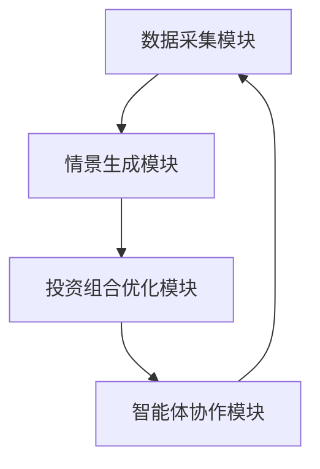
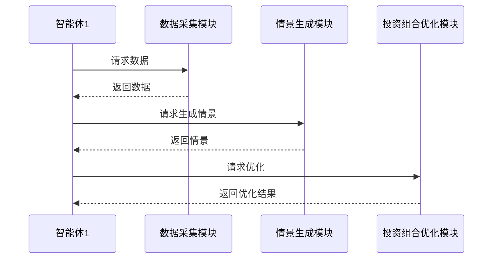

                 


---

# 利用多智能体AI增强价值投资的情景分析能力

## 关键词：多智能体AI，价值投资，情景分析，算法原理，数学模型

## 摘要：本文探讨了如何利用多智能体AI技术增强价值投资中的情景分析能力。通过分析多智能体系统的核心原理、价值投资的基本概念以及它们的结合方式，本文详细阐述了多智能体AI在情景分析中的算法实现、数学模型以及系统架构设计。通过实际案例分析，展示了多智能体AI在价值投资中的应用前景和优势。

---

# 第1章 多智能体AI与价值投资的背景介绍

## 1.1 多智能体AI的定义与特点

### 1.1.1 多智能体AI的定义  
多智能体AI是指由多个独立或协作的智能体组成的系统，这些智能体能够通过通信和协作完成复杂的任务。与传统AI不同，多智能体AI强调分布式计算和协作。

### 1.1.2 多智能体AI的核心特点  
1. **分布式计算**：任务分布在多个智能体中，每个智能体负责一部分。
2. **协作与协调**：智能体之间通过通信和协商完成任务。
3. **动态适应**：能够实时调整策略以应对环境变化。

### 1.1.3 多智能体AI与传统AI的区别  
- **计算方式**：多智能体AI是分布式计算，传统AI是集中式计算。
- **协作性**：多智能体AI强调协作，传统AI通常单点处理。
- **灵活性**：多智能体AI更具动态适应能力。

## 1.2 价值投资的基本原理

### 1.2.1 价值投资的定义  
价值投资是一种投资策略，通过分析公司的基本面，寻找被市场低估的投资标的。

### 1.2.2 价值投资的核心原则  
1. **安全边际**：买入价格低于内在价值。
2. **长期视角**：关注公司的长期盈利能力。
3. **逆向思维**：在市场恐慌时寻找机会。

### 1.2.3 价值投资的应用场景  
- 股票投资
- 资产配置
- 市场风险管理

## 1.3 多智能体AI在价值投资中的应用前景

### 1.3.1 多智能体AI在金融领域的潜力  
- 提高投资决策的准确性
- 实现实时市场监控
- 优化投资组合管理

### 1.3.2 价值投资与多智能体AI的结合优势  
- 多智能体AI能够处理复杂市场环境下的多种情景。
- 通过协作提高分析的全面性。

### 1.3.3 当前市场中的应用案例  
- 多智能体AI用于实时市场数据分析
- 协作式投资组合优化

---

# 第2章 多智能体AI与价值投资的核心概念与联系

## 2.1 多智能体系统的原理

### 2.1.1 多智能体系统的组成  
1. **智能体**：独立决策的单元。
2. **环境**：智能体所处的外部世界。
3. **通信机制**：智能体之间的信息交换方式。

### 2.1.2 多智能体系统的通信机制  
- **直接通信**：智能体之间直接交换信息。
- **间接通信**：通过中间媒介传递信息。

### 2.1.3 多智能体系统的协作与协调  
- **协作任务**：共同完成一个目标。
- **协调机制**：通过协商分配任务。

## 2.2 价值投资的情景分析模型

### 2.2.1 情景分析的基本概念  
情景分析是通过假设不同市场情况，评估投资组合在这些情况下的表现。

### 2.2.2 价值投资中的情景分析方法  
1. **基本情景分析**：基于当前市场状况的预测。
2. **极端情景分析**：考虑市场崩盘等极端情况。

### 2.2.3 情景分析与多智能体AI的结合  
- 每个智能体负责分析一个市场情景。
- 智能体协作生成综合情景分析报告。

## 2.3 多智能体系统与情景分析的关系

### 2.3.1 多智能体系统在情景分析中的作用  
- 并行处理多个情景。
- 综合不同情景下的分析结果。

### 2.3.2 多智能体系统如何增强情景分析能力  
- 提高分析的全面性和准确性。
- 实现实时情景更新和反馈。

### 2.3.3 多智能体系统与情景分析的协同效应  
- 情景分析为多智能体提供决策依据。
- 多智能体系统提高情景分析的效率和深度。

---

# 第3章 多智能体AI增强价值投资情景分析的算法原理

## 3.1 多智能体系统的核心算法

### 3.1.1 分布式计算算法  
- **任务分配**：智能体根据自身能力和当前负载分配任务。
- **负载均衡**：动态调整任务分配以确保系统高效运行。

### 3.1.2 协作与协调算法  
- **协商算法**：智能体之间通过协商决定任务分配和协作方式。
- **冲突解决**：当智能体之间出现冲突时，通过协商或仲裁机制解决。

### 3.1.3 自适应学习算法  
- **在线学习**：智能体在运行过程中不断更新知识库。
- **经验迁移**：智能体之间共享经验，提高整体学习效率。

## 3.2 价值投资情景分析的算法

### 3.2.1 数据预处理与特征提取  
- **数据清洗**：去除噪声数据。
- **特征选择**：提取影响投资决策的关键特征。

### 3.2.2 情景生成与模拟  
- **情景生成**：基于历史数据和当前市场状况生成多种可能的情景。
- **情景模拟**：模拟投资组合在不同情景下的表现。

### 3.2.3 风险评估与优化  
- **风险评估**：计算投资组合在不同情景下的风险水平。
- **优化策略**：调整投资组合以最小化风险或最大化收益。

## 3.3 多智能体与情景分析的联合算法

### 3.3.1 联合学习机制  
- **分布式学习**：每个智能体负责学习一部分知识，然后共享。
- **联合优化**：将多个智能体的学习结果结合起来，优化整体策略。

### 3.3.2 跨智能体协作算法  
- **任务分配**：根据市场变化动态分配任务。
- **实时协作**：智能体之间实时交换信息和协作完成任务。

### 3.3.3 实时反馈与调整  
- **实时反馈**：根据市场变化提供实时反馈。
- **动态调整**：根据反馈调整投资策略。

---

# 第4章 多智能体AI增强价值投资情景分析的数学模型与公式

## 4.1 多智能体系统的数学模型

### 4.1.1 状态空间模型  
- **状态空间**：表示系统可能的状态。
- **状态转移**：从一个状态转移到另一个状态的规则。

### 4.1.2 行为选择模型  
- **行为选择概率**：基于当前状态选择行为的概率。
- **行为影响模型**：分析不同行为对系统状态的影响。

### 4.1.3 通信协议模型  
- **消息格式**：定义智能体之间交换的消息格式。
- **通信频率**：智能体之间通信的频率和时机。

## 4.2 价值投资情景分析的数学模型

### 4.2.1 投资组合优化模型  
- **目标函数**：最大化收益或最小化风险。
- **约束条件**：如投资比例限制。

### 4.2.2 风险评估模型  
- **风险指标**：如VaR（在险价值）、CVaR（条件在险价值）。

### 4.2.3 情景模拟模型  
- **情景生成算法**：生成多种市场情景。
- **情景评分模型**：对每种情景进行评分，评估其可能性。

## 4.3 联合模型与公式

### 4.3.1 多智能体联合优化公式  
$$ \text{目标函数} = \sum_{i=1}^{n} f_i(x_i) $$  
其中，$f_i$ 是第 $i$ 个智能体的优化目标，$x_i$ 是其决策变量。

### 4.3.2 情景分析的综合评估公式  
$$ \text{综合评分} = \sum_{j=1}^{m} w_j \cdot s_j $$  
其中，$w_j$ 是情景 $j$ 的权重，$s_j$ 是情景评分。

### 4.3.3 实时调整公式  
$$ \Delta x = \alpha \cdot \nabla f(x) $$  
其中，$\alpha$ 是调整步长，$\nabla f(x)$ 是目标函数的梯度。

---

# 第5章 多智能体AI增强价值投资情景分析的系统分析与架构设计

## 5.1 项目场景介绍  
本项目旨在通过多智能体AI技术，构建一个能够实时分析市场情景、优化投资组合的价值投资系统。

## 5.2 系统功能设计

### 5.2.1 数据采集模块  
- 采集市场数据，如股票价格、市场指数等。
- 数据预处理和特征提取。

### 5.2.2 情景生成模块  
- 基于历史数据和当前市场状况，生成多种可能的情景。
- 情景评分和优先级排序。

### 5.2.3 投资组合优化模块  
- 根据生成的情景，优化投资组合。
- 调整策略以适应不同情景。

### 5.2.4 智能体协作模块  
- 协调多个智能体的任务分配和协作。
- 实时反馈和动态调整。

## 5.3 系统架构设计

### 5.3.1 系统架构图  


### 5.3.2 系统交互图  


## 5.4 系统接口设计  
定义智能体之间的通信接口，如REST API或消息队列。

---

# 第6章 多智能体AI增强价值投资情景分析的项目实战

## 6.1 环境安装

### 6.1.1 安装Python环境  
```bash
python --version
pip install requests numpy pandas
```

### 6.1.2 安装多智能体框架  
```bash
pip install multi-agent-systems
```

## 6.2 系统核心实现

### 6.2.1 多智能体协作代码  
```python
class Agent:
    def __init__(self, id):
        self.id = id
        self.data = None

    def receive_data(self, data):
        self.data = data
        self.process_data()

    def process_data(self):
        # 处理数据并生成结果
        result = self.analyze(self.data)
        self.send_result(result)

    def analyze(self, data):
        # 具体分析逻辑
        return analysis_result

    def send_result(self, result):
        # 发送给其他智能体
        pass
```

### 6.2.2 情景模拟代码  
```python
import numpy as np

def generate_scenario():
    # 生成随机情景
    scenario = np.random.normal(0, 1, 100)
    return scenario

def evaluate_scenario(scenario):
    # 评估情景
    score = scenario.mean()
    return score
```

## 6.3 实际案例分析  
分析一个实际市场情景，展示多智能体如何协作完成情景分析和投资组合优化。

## 6.4 项目小结  
总结项目实现过程中的关键点和经验教训。

---

# 第7章 多智能体AI增强价值投资情景分析的最佳实践

## 7.1 小结  
多智能体AI在价值投资中的应用前景广阔，能够显著提升情景分析能力。

## 7.2 注意事项  
- 确保数据质量和实时性。
- 设计高效的协作机制。

## 7.3 拓展阅读  
推荐相关书籍和论文，供读者深入研究。

---

# 结语

通过本文的详细阐述，读者可以全面了解多智能体AI在价值投资情景分析中的应用。未来，随着技术的不断发展，多智能体AI将在金融领域发挥更大的作用。

