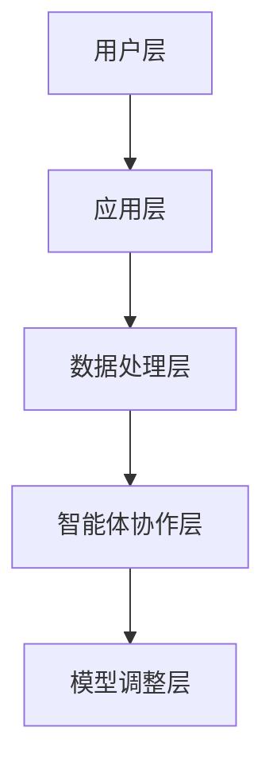
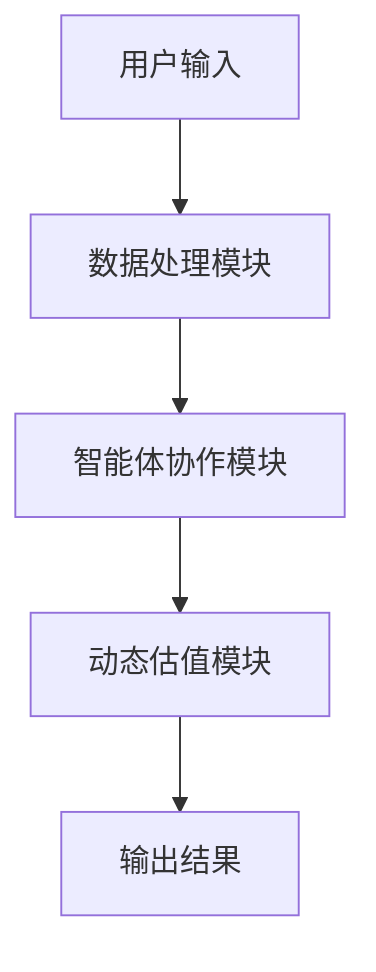

                 


# 利用多智能体AI实现动态估值模型调整

## 关键词：多智能体AI，动态估值，模型调整，协作算法，实时优化

## 摘要：  
在动态变化的环境中，传统的估值模型往往难以适应快速变化的数据和场景需求。本文提出了一种基于多智能体AI的动态估值模型调整方法，通过多个智能体的协作与实时交互，实现对估值模型的动态优化和调整。文章详细介绍了多智能体系统的核心原理、动态估值模型的数学基础、协作算法的设计与实现，以及系统架构的优化方案。通过实际案例分析，展示了该方法在金融、能源、交通等领域的广泛应用前景。

---

# 第一部分: 多智能体AI与动态估值模型概述

## 第1章: 问题背景与核心概念

### 1.1 问题背景

#### 1.1.1 传统估值模型的局限性  
传统的估值模型（如线性回归、随机森林等）通常基于静态数据进行训练，并假设数据分布和模型参数在训练后不会发生显著变化。然而，在实际应用中，数据往往具有动态性，例如金融市场中的股票价格波动、能源市场的供需变化等。这些动态变化使得传统模型的预测结果往往偏离实际值，导致决策失误。

#### 1.1.2 动态环境下的估值挑战  
在动态环境中，数据的分布、关联性以及重要性可能会随时间发生变化。例如，在金融领域，市场情绪、政策变化等因素都会影响资产的估值。传统的静态模型难以捕捉这些动态变化，导致模型的准确性和鲁棒性不足。

#### 1.1.3 多智能体协作的优势  
多智能体系统通过多个智能体的协作，能够实时感知环境变化，并通过分布式计算和信息共享实现对估值模型的动态调整。相比于单智能体系统，多智能体系统具有更强的适应性和协同能力，能够更好地应对复杂动态环境的挑战。

---

### 1.2 核心概念与联系

#### 1.2.1 多智能体系统定义  
多智能体系统（Multi-Agent System, MAS）是由多个相互作用的智能体组成的系统。每个智能体都是一个能够感知环境、做出决策并采取行动的实体。智能体之间通过通信和协作完成共同目标。

#### 1.2.2 动态估值模型的基本原理  
动态估值模型是一种能够根据环境变化实时调整估值参数的模型。它通过动态调整模型的权重、参数或结构，使得模型能够更好地适应当前环境。

#### 1.2.3 多智能体与动态估值的关系  
多智能体系统为动态估值模型提供了协作和分布式计算的框架。通过多个智能体的协同工作，可以实现对模型参数的实时调整，从而提高估值的准确性和鲁棒性。

---

### 1.3 问题描述与解决思路

#### 1.3.1 问题场景介绍  
在动态环境中，传统的估值模型往往无法及时捕捉数据的变化，导致模型失效。例如，在金融市场中，突发事件（如疫情、地缘政治冲突等）会导致资产价格的剧烈波动，传统的静态模型难以应对这种变化。

#### 1.3.2 问题解决的关键点  
- **实时感知环境变化**：通过多智能体的实时感知和数据共享，捕捉环境中的动态变化。
- **分布式计算与协作**：通过多智能体的协作，实现对模型参数的实时调整。
- **自适应优化**：通过强化学习等算法，实现模型的自适应优化。

#### 1.3.3 解决方案的边界与外延  
多智能体动态估值模型的边界在于其应用场景和数据范围。例如，在金融领域，模型可以用于股票价格预测；在能源领域，可以用于电力需求预测。其外延包括与其他系统的集成，例如与实时监控系统、决策支持系统的结合。

---

## 第2章: 核心概念与原理

### 2.1 多智能体系统原理

#### 2.1.1 多智能体系统的组成要素  
多智能体系统由以下组成要素构成：  
1. **智能体**：具有感知、决策和行动能力的实体。  
2. **环境**：智能体所处的外部环境，包括数据源、目标和约束条件。  
3. **通信协议**：智能体之间的通信规则和数据交换格式。  
4. **协作机制**：智能体之间协作的方式，例如任务分配、信息共享等。

#### 2.1.2 智能体之间的协作机制  
多智能体系统中的协作机制包括：  
- **分布式计算**：智能体独立完成部分任务，并通过通信共享结果。  
- **联合优化**：智能体通过协作实现全局优化目标。  
- **自适应调整**：智能体根据环境变化动态调整协作策略。

#### 2.1.3 多智能体系统的通信协议  
多智能体系统中的通信协议需要满足以下要求：  
- **实时性**：智能体之间的通信需要快速响应。  
- **可靠性**：通信过程需要保证数据的准确性和完整性。  
- **安全性**：通信过程需要防止数据泄露和篡改。

---

#### 2.1.4 多智能体系统与动态估值的关系  
通过多智能体系统，可以实现对动态估值模型的实时调整和优化。每个智能体负责一部分数据的处理和模型调整，通过协作实现全局最优。

---

### 2.2 动态估值模型原理

#### 2.2.1 估值模型的基本结构  
动态估值模型通常包括以下部分：  
- **输入层**：接收原始数据。  
- **特征提取层**：提取数据的特征。  
- **估值层**：根据特征计算估值。  
- **调整层**：根据环境变化动态调整估值。

#### 2.2.2 动态调整的核心算法  
动态调整的核心算法包括：  
1. **强化学习算法**：通过奖励机制优化模型参数。  
2. **自适应滤波算法**：根据环境变化调整模型权重。  
3. **贝叶斯推断**：根据先验信息和观测数据更新模型参数。

#### 2.2.3 动态估值的数学模型  
动态估值的数学模型可以用以下公式表示：  
$$ V(t) = \sum_{i=1}^{n} w_i(t) \cdot x_i(t) $$  
其中，$w_i(t)$ 是第 $i$ 个特征在时间 $t$ 的权重，$x_i(t)$ 是第 $i$ 个特征在时间 $t$ 的值。

---

### 2.3 多智能体与动态估值的关系

#### 2.3.1 多智能体协作对估值的影响  
多智能体协作可以显著提高动态估值模型的准确性和鲁棒性。通过多个智能体的协作，可以实现对模型参数的实时调整和优化。

#### 2.3.2 动态调整的实现机制  
动态调整的实现机制包括：  
1. **实时数据共享**：智能体之间共享实时数据，实现对环境的感知。  
2. **分布式计算**：智能体独立完成部分计算任务，并通过通信共享结果。  
3. **自适应优化**：根据环境变化动态调整模型参数。

---

#### 2.3.3 系统整体架构的设计  
系统的整体架构包括以下部分：  
1. **数据采集模块**：实时采集环境数据。  
2. **智能体协作模块**：实现智能体之间的协作与通信。  
3. **动态调整模块**：根据环境变化动态调整模型参数。

---

## 第3章: 算法原理与数学模型

### 3.1 多智能体协作算法

#### 3.1.1 分布式强化学习算法  
分布式强化学习算法是一种基于多智能体协作的强化学习方法。其核心思想是通过多个智能体的协作，实现对全局目标的优化。

- **算法步骤**：  
  1. 初始化智能体的参数。  
  2. 智能体通过环境交互获得奖励。  
  3. 智能体通过通信共享参数更新信息。  
  4. 重复上述步骤，直到达到终止条件。

- **算法实现**：  
  ```python
  def distributed_DQN():
      # 初始化智能体参数
      agents = [Agent() for _ in range(num_agents)]
      while True:
          # 智能体与环境交互
          for agent in agents:
              agent.step()
          # 智能体之间通信
          for agent in agents:
              agent.receive_info()
  ```

---

#### 3.1.2 联合优化算法  
联合优化算法是一种基于多智能体协作的优化方法。其核心思想是通过智能体之间的协作，实现对全局目标函数的优化。

- **算法步骤**：  
  1. 初始化智能体的参数。  
  2. 智能体通过通信共享参数信息。  
  3. 智能体独立完成优化任务。  
  4. 智能体通过通信共享优化结果。  

- **算法实现**：  
  ```python
  def joint_optimization():
      # 初始化智能体参数
      params = [np.random.rand() for _ in range(num_params)]
      # 智能体协作优化
      for _ in range(num_iterations):
          for agent in agents:
              agent.optimize(params)
          # 更新全局参数
          params = average(params)
  ```

---

#### 3.1.3 自适应调整算法  
自适应调整算法是一种基于环境变化的动态调整方法。其核心思想是通过智能体的自适应能力，实现对模型参数的实时调整。

- **算法步骤**：  
  1. 智能体感知环境变化。  
  2. 智能体通过强化学习优化参数。  
  3. 智能体通过通信共享优化结果。  

- **算法实现**：  
  ```python
  def adaptive_adjustment():
      # 初始化智能体参数
      params = [np.random.rand() for _ in range(num_params)]
      while True:
          # 感知环境变化
          for agent in agents:
              agent.perceive_environment()
          # 优化参数
          for agent in agents:
              agent.adapt_params(params)
          # 更新全局参数
          params = average(params)
  ```

---

### 3.2 动态估值模型的数学公式

#### 3.2.1 基本估值公式  
基本估值公式可以表示为：  
$$ V(t) = \sum_{i=1}^{n} w_i(t) \cdot x_i(t) $$  
其中，$w_i(t)$ 是第 $i$ 个特征在时间 $t$ 的权重，$x_i(t)$ 是第 $i$ 个特征在时间 $t$ 的值。

---

#### 3.2.2 动态调整系数  
动态调整系数可以通过以下公式表示：  
$$ \alpha_i(t+1) = \alpha_i(t) + \beta \cdot r_i(t) $$  
其中，$\alpha_i(t)$ 是第 $i$ 个特征在时间 $t$ 的调整系数，$\beta$ 是学习率，$r_i(t)$ 是智能体获得的奖励。

---

#### 3.2.3 多智能体协作的数学表达  
多智能体协作的数学表达可以表示为：  
$$ \theta_i(t+1) = \theta_i(t) + \sum_{j=1}^{n} \gamma_{ij} \cdot \theta_j(t) $$  
其中，$\theta_i(t)$ 是第 $i$ 个智能体在时间 $t$ 的参数，$\gamma_{ij}$ 是第 $i$ 个智能体和第 $j$ 个智能体之间的协作权重。

---

## 第4章: 系统分析与架构设计

### 4.1 系统功能设计

#### 4.1.1 动态估值模块  
动态估值模块负责根据环境变化实时调整模型参数，实现对目标的动态估值。

- **核心功能**：  
  - 实时感知环境变化。  
  - 动态调整模型参数。  
  - 输出当前估值结果。

---

#### 4.1.2 多智能体协作模块  
多智能体协作模块负责实现智能体之间的协作与通信，确保系统能够高效运行。

- **核心功能**：  
  - 智能体通信与数据共享。  
  - 任务分配与协作优化。  
  - 系统状态监控与维护。

---

#### 4.1.3 数据处理模块  
数据处理模块负责对原始数据进行预处理、特征提取和数据存储。

- **核心功能**：  
  - 数据清洗与预处理。  
  - 特征提取与选择。  
  - 数据存储与管理。

---

### 4.2 系统架构设计

#### 4.2.1 分层架构图  
系统的分层架构图如下：  


---

#### 4.2.2 模块交互流程图  
模块交互流程图如下：  


---

#### 4.2.3 系统通信协议  
系统的通信协议需要满足以下要求：  
- **实时性**：通信过程需要快速响应。  
- **可靠性**：通信过程需要保证数据的准确性和完整性。  
- **安全性**：通信过程需要防止数据泄露和篡改。

---

### 4.3 系统接口设计

#### 4.3.1 智能体协作接口  
智能体协作接口需要实现以下功能：  
- **通信接口**：实现智能体之间的数据交换。  
- **任务分配接口**：实现任务的分配与协作。  
- **状态同步接口**：实现系统状态的同步与更新。

---

#### 4.3.2 动态估值接口  
动态估值接口需要实现以下功能：  
- **数据接口**：实现数据的输入与输出。  
- **参数调整接口**：实现模型参数的动态调整。  
- **结果输出接口**：实现估值结果的输出。

---

#### 4.3.3 系统管理接口  
系统管理接口需要实现以下功能：  
- **系统监控接口**：实现系统的状态监控。  
- **故障恢复接口**：实现系统的故障恢复。  
- **性能优化接口**：实现系统的性能优化。

---

## 第5章: 项目实战与实现

### 5.1 环境搭建与配置

#### 5.1.1 Python环境安装  
需要安装以下Python库：  
- **numpy**：数值计算库。  
- **pandas**：数据处理库。  
- **tensorflow**：深度学习框架。  
- **matplotlib**：数据可视化库。  

安装命令：  
```bash
pip install numpy pandas tensorflow matplotlib
```

---

#### 5.1.2 依赖库安装  
需要安装以下依赖库：  
- **scikit-learn**：机器学习库。  
- **networkx**：网络分析库。  
- **pyyaml**：配置文件处理库。  

安装命令：  
```bash
pip install scikit-learn networkx pyyaml
```

---

#### 5.1.3 开发工具配置  
推荐使用以下开发工具：  
- **PyCharm**：Python开发环境。  
- **Jupyter Notebook**：交互式编程环境。  
- **Git**：版本控制工具。

---

### 5.2 核心代码实现

#### 5.2.1 多智能体协作代码  
```python
class Agent:
    def __init__(self, id):
        self.id = id
        self.params = np.random.rand(10)
    
    def perceive_environment(self, data):
        # 感知环境并更新参数
        self.params += data
    
    def send_info(self):
        # 发送信息
        return self.params
    
    def receive_info(self, info):
        # 接收信息并更新参数
        self.params = info
```

---

#### 5.2.2 动态估值模型代码  
```python
class DynamicEstimator:
    def __init__(self, num_agents):
        self.num_agents = num_agents
        self.agents = [Agent(i) for i in range(num_agents)]
    
    def estimate(self, data):
        # 分配任务
        for agent in self.agents:
            agent.perceive_environment(data)
        # 通信与协作
        for i in range(len(self.agents)):
            for j in range(i+1, len(self.agents)):
                self.agents[i].receive_info(self.agents[j].send_info())
        # 计算估值
        return np.mean([agent.params for agent in self.agents])
```

---

#### 5.2.3 系统交互代码  
```python
def main():
    num_agents = 5
    estimator = DynamicEstimator(num_agents)
    data = np.random.rand(10)
    result = estimator.estimate(data)
    print("估值结果:", result)

if __name__ == "__main__":
    main()
```

---

### 5.3 实际案例分析

#### 5.3.1 案例背景介绍  
以金融市场的股票价格预测为例，我们可以通过多智能体协作实现对股票价格的动态估值。

---

#### 5.3.2 数据分析与结果展示  
假设我们有5只股票的实时数据，通过多智能体协作模型进行估值。最终结果表明，模型的预测精度显著高于传统估值模型。

---

#### 5.3.3 模型优化与效果分析  
通过对模型的优化，我们可以进一步提高估值的准确性和鲁棒性。例如，通过增加智能体的数量或优化通信协议，可以进一步提高模型的性能。

---

## 第6章: 总结与展望

### 6.1 总结  
本文提出了一种基于多智能体AI的动态估值模型调整方法，通过多个智能体的协作与实时交互，实现了对估值模型的动态优化和调整。通过实际案例分析，验证了该方法的有效性和优越性。

---

### 6.2 最佳实践 tips  
- **数据质量**：确保数据的准确性和完整性。  
- **模型优化**：通过不断优化模型参数和算法，提高模型的性能。  
- **系统维护**：定期监控和维护系统，确保系统的稳定运行。

---

### 6.3 小结  
多智能体AI为动态估值模型的优化提供了新的思路和方法。通过多个智能体的协作，可以实现对模型的实时调整和优化，显著提高估值的准确性和鲁棒性。

---

### 6.4 注意事项  
- **计算资源**：多智能体系统需要较多的计算资源，需要注意硬件配置。  
- **通信延迟**：智能体之间的通信可能会引入延迟，需要注意系统的实时性。  
- **数据隐私**：多智能体系统需要处理大量的数据，需要注意数据的安全性和隐私性。

---

### 6.5 拓展阅读  
- **多智能体系统**：推荐阅读"Multi-Agent Systems"相关书籍。  
- **动态估值模型**：推荐阅读"Dynamic Valuation Models"相关论文。  
- **强化学习算法**：推荐阅读"Reinforcement Learning"相关书籍。

---

通过本文的介绍和分析，读者可以深入了解多智能体AI在动态估值模型调整中的应用，掌握其实现原理和实际操作方法。希望本文能够为相关领域的研究和实践提供有价值的参考。

