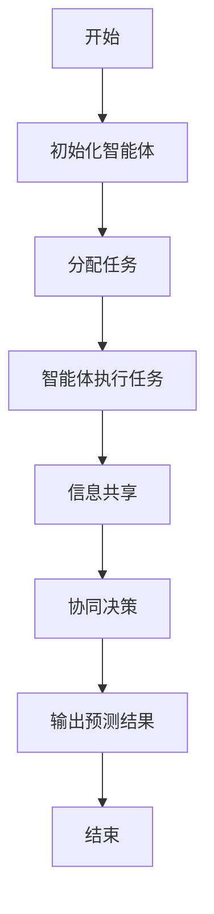
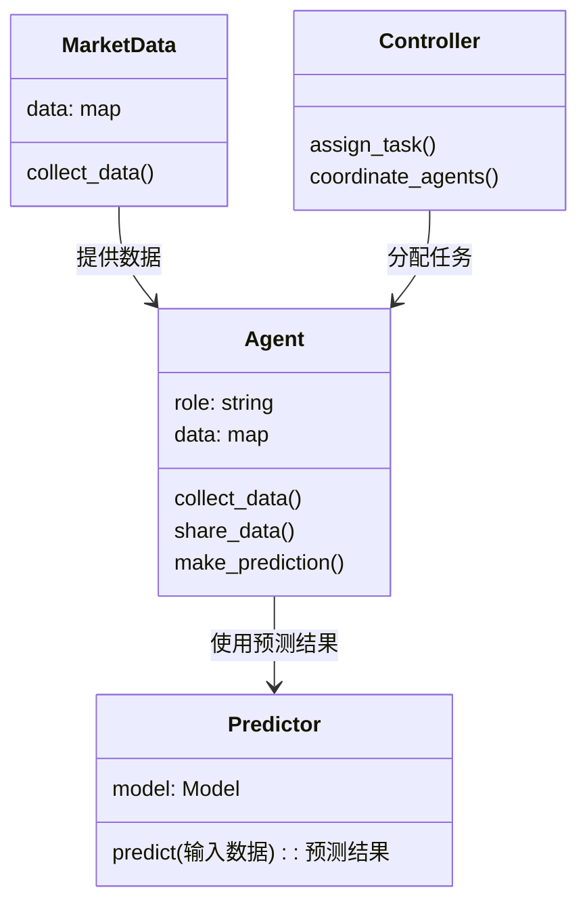
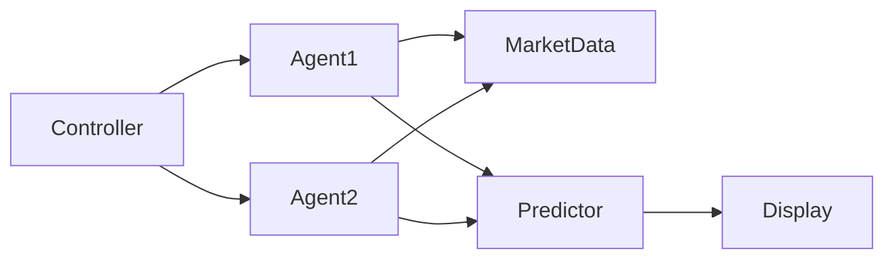
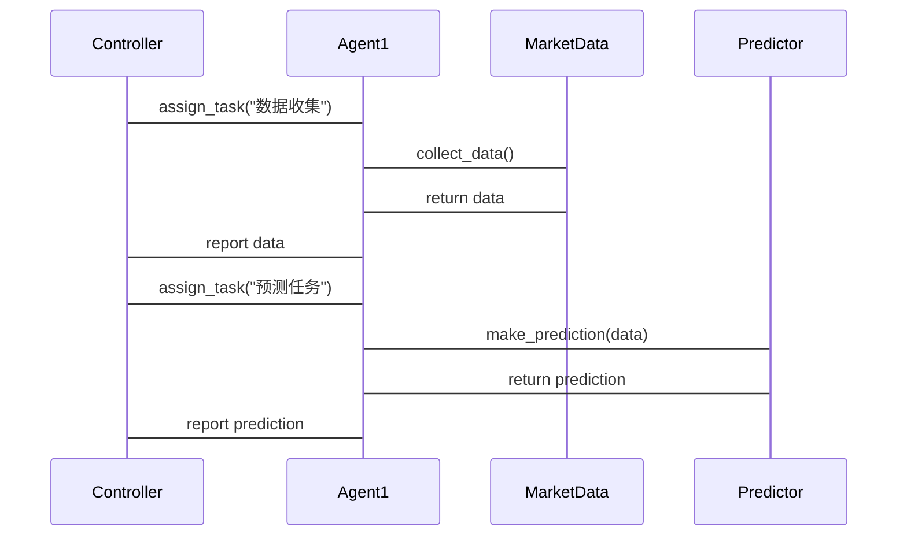

                 


# 利用多智能体AI实现动态市场份额预测

## 关键词

多智能体AI, 动态市场份额预测, 市场预测, 协作算法, 多智能体系统, 市场竞争分析

## 摘要

本文详细探讨了利用多智能体AI技术实现动态市场份额预测的方法和实现方案。首先，介绍了动态市场份额预测的背景和挑战，阐述了多智能体AI的基本概念和核心原理。然后，从算法原理、系统架构设计、项目实战等多个角度，详细分析了如何利用多智能体协作机制和数学模型实现精准的市场份额预测。最后，通过实际案例展示了系统的设计与实现过程，并提出了最佳实践建议。

## 第一部分: 多智能体AI与动态市场份额预测概述

### 第1章: 多智能体AI与动态市场份额预测的背景与概念

#### 1.1 动态市场份额预测的背景与挑战

##### 1.1.1 问题背景

在现代商业环境中，市场竞争日益激烈，企业需要实时掌握市场份额的变化情况，以便及时调整市场策略。然而，传统的方法在处理动态市场环境时存在诸多局限性，例如数据更新不及时、预测模型静态化等。

##### 1.1.2 问题描述

动态市场份额预测的目标是根据实时市场数据，预测不同企业在市场中的份额变化情况。由于市场的复杂性和动态性，传统的统计方法和单一智能体模型难以满足需求。

##### 1.1.3 问题解决

多智能体AI通过多个智能体的协作，能够实时分析市场数据，捕捉市场变化的细微动态，从而提高预测的准确性和及时性。

##### 1.1.4 边界与外延

动态市场份额预测的边界包括实时数据获取、市场环境变化的检测、预测模型的动态更新。其外延则包括基于预测结果的企业策略调整、市场趋势分析等。

#### 1.2 多智能体AI的基本概念

##### 1.2.1 多智能体系统的核心概念

多智能体系统由多个智能体组成，每个智能体都有自己的目标和决策机制，通过协作完成复杂任务。

##### 1.2.2 多智能体AI的特征与优势

多智能体AI具有分布式计算、协作性强、适应性好的特点，能够在动态环境中实现高效决策。

##### 1.2.3 多智能体AI与单智能体AI的对比分析

从决策机制、资源分配、适应性等方面对比分析，说明多智能体AI的优势。

### 第2章: 多智能体AI在市场份额预测中的核心概念与联系

#### 2.1 多智能体系统的核心原理

##### 2.1.1 多智能体系统的组成要素

包括智能体、环境、通信机制等。

##### 2.1.2 多智能体系统中的协作机制

介绍任务分配、信息共享、协同决策等协作方式。

##### 2.1.3 多智能体系统的信息共享与决策过程

详细说明信息共享的方式和决策过程的步骤。

#### 2.2 动态市场份额预测的核心要素

##### 2.2.1 市场数据的实时性与多样性

强调实时数据的重要性，分析数据的多样性对预测的影响。

##### 2.2.2 市场竞争格局的动态变化

讨论市场环境的动态性对企业市场份额的影响。

##### 2.2.3 预测模型的灵活性与适应性

说明预测模型需要具备快速响应市场变化的能力。

#### 2.3 多智能体与动态市场份额预测的关联

##### 2.3.1 多智能体系统在预测中的角色

介绍多智能体系统在数据收集、分析、预测等环节的作用。

##### 2.3.2 多智能体协作对预测精度的提升

通过案例分析说明协作机制如何提高预测准确性。

##### 2.3.3 动态环境下的多智能体协同优化

探讨多智能体系统如何适应动态环境，优化预测模型。

## 第二部分: 多智能体AI实现动态市场份额预测的算法原理

### 第3章: 多智能体协作机制

#### 3.1 多智能体协作机制的核心原理

##### 3.1.1 任务分配与角色划分

根据智能体的专长和当前任务需求，合理分配任务。

##### 3.1.2 信息共享与同步

通过通信机制，确保各个智能体之间的信息同步。

##### 3.1.3 协同决策与优化

多个智能体共同参与决策过程，优化预测结果。

#### 3.2 多智能体协作算法的流程图

使用mermaid绘制算法流程图，展示从任务分配到协同决策的全过程。



#### 3.3 基于多智能体的预测模型

##### 3.3.1 预测模型的基本结构

介绍预测模型的组成部分，包括数据输入层、特征提取层、预测输出层等。

##### 3.3.2 模型的动态更新机制

说明模型如何根据实时数据进行动态调整，保持预测的准确性。

##### 3.3.3 模型的评估与优化

通过指标评估模型性能，提出优化策略。

### 第4章: 动态市场份额预测的数学模型

#### 4.1 预测模型的数学表示

##### 4.1.1 市场份额预测的基本模型

$$ S_i(t) = \alpha \cdot S_i(t-1) + \beta \cdot D(t) $$

其中，\( S_i(t) \) 表示第i个企业的市场份额在时间t的值，\( \alpha \) 和 \( \beta \) 是权重系数，\( D(t) \) 是市场需求变化。

##### 4.1.2 基于多智能体的预测模型

$$ P(t) = \sum_{i=1}^{n} w_i \cdot S_i(t) $$

其中，\( w_i \) 是智能体i的权重，\( S_i(t) \) 是智能体i在时间t的市场份额预测值。

#### 4.2 模型的训练与优化

##### 4.2.1 模型训练的数学表示

使用梯度下降法优化模型参数：

$$ \theta = \theta - \eta \cdot \frac{\partial L}{\partial \theta} $$

其中，\( \theta \) 是模型参数，\( \eta \) 是学习率，\( L \) 是损失函数。

##### 4.2.2 模型优化策略

包括参数调整、模型结构优化、集成学习等方法。

## 第三部分: 系统分析与架构设计方案

### 第5章: 系统分析与架构设计

#### 5.1 应用场景介绍

##### 5.1.1 实时数据处理

说明系统如何实时采集市场数据，如销售额、用户行为等。

##### 5.1.2 多智能体协作

描述智能体之间如何协作完成数据处理、预测任务。

##### 5.1.3 结果展示与反馈

展示预测结果，并根据反馈调整模型参数。

#### 5.2 系统功能设计

##### 5.2.1 领域模型类图

使用mermaid绘制领域模型类图，展示系统各模块之间的关系。



#### 5.3 系统架构设计

##### 5.3.1 系统架构图

绘制系统架构图，展示各个模块的组成和交互关系。



#### 5.4 系统接口设计

##### 5.4.1 智能体接口

定义智能体之间的通信接口，如`share_data()`、`make_prediction()`等。

##### 5.4.2 数据接口

说明如何与数据源进行交互，如API接口、数据库接口等。

#### 5.5 系统交互序列图

绘制系统交互的序列图，展示从任务分配到预测输出的全过程。



## 第四部分: 项目实战

### 第6章: 项目实战

#### 6.1 环境安装

##### 6.1.1 安装Python

安装Python 3.x版本，确保环境配置正确。

##### 6.1.2 安装依赖库

安装必要的Python库，如numpy、pandas、scikit-learn、flask等。

##### 6.1.3 安装多智能体框架

选择合适的多智能体框架，如Multi-Agent Frameworks for Python (MAF), 或者自行开发。

#### 6.2 系统核心实现

##### 6.2.1 智能体类的实现

编写智能体类，包含角色分配、数据收集、预测等功能。

```python
class Agent:
    def __init__(self, role):
        self.role = role
        self.data = {}

    def collect_data(self, market_data):
        self.data = market_data.copy()

    def share_data(self):
        return self.data
```

##### 6.2.2 预测模型的实现

实现基于机器学习的预测模型，如线性回归、随机森林等。

```python
from sklearn.linear_model import LinearRegression

class Predictor:
    def __init__(self):
        self.model = LinearRegression()

    def train(self, X, y):
        self.model.fit(X, y)

    def predict(self, X):
        return self.model.predict(X)
```

##### 6.2.3 系统控制器的实现

实现控制器类，负责任务分配和智能体协调。

```python
class Controller:
    def __init__(self, agents):
        self.agents = agents

    def assign_task(self, task, agent):
        agent.collect_data(task.data)

    def coordinate_agents(self):
        for agent in self.agents:
            data = agent.share_data()
            # 处理数据并进行预测
```

#### 6.3 代码应用解读与分析

##### 6.3.1 代码结构分析

说明各个模块的功能和交互关系。

##### 6.3.2 代码实现细节

详细解释关键代码段的功能和实现方式。

##### 6.3.3 代码测试与调试

介绍如何测试系统，确保各个模块正常运行。

#### 6.4 实际案例分析

##### 6.4.1 案例背景

选择一个具体的市场环境，如电子产品市场竞争。

##### 6.4.2 数据准备

收集相关企业的市场份额数据，包括历史数据和实时数据。

##### 6.4.3 系统运行与结果展示

展示系统的运行过程和预测结果，分析预测的准确性和实用性。

#### 6.5 项目小结

总结项目实现的关键点，成功经验与不足之处，提出改进建议。

## 第五部分: 最佳实践

### 第7章: 最佳实践

#### 7.1 小结

总结全文的主要内容和核心思想。

#### 7.2 注意事项

提醒读者在实际应用中需要注意的问题，如数据隐私、模型优化等。

#### 7.3 拓展阅读

推荐相关领域的书籍和论文，供读者深入学习。

## 参考文献

列出本文参考的文献资料，确保引用的权威性和准确性。

---

以上是《利用多智能体AI实现动态市场份额预测》的技术博客文章的详细目录大纲，每一章都包含丰富的细节和具体的实现示例，确保读者能够全面理解多智能体AI在动态市场份额预测中的应用和实现方法。

