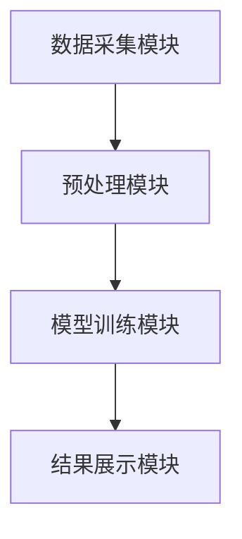

                 


# 利用多智能体AI实现动态市场情绪指标构建

## 关键词：多智能体AI，市场情绪指标，动态分析，分布式计算，协作机制

## 摘要：  
本文详细探讨了如何利用多智能体人工智能技术构建动态市场情绪指标。首先介绍了市场情绪指标的重要性和动态性，接着阐述了多智能体AI的基本概念和优势。然后，从理论基础、算法实现、系统架构到项目实战，逐步深入分析了如何利用多智能体AI实现市场情绪指标的动态构建。通过具体案例和代码实现，展示了如何设计和实现一个基于多智能体的动态市场情绪指标系统。

---

## 第一部分: 利用多智能体AI实现动态市场情绪指标概述

### 第1章: 动态市场情绪指标与多智能体AI概述

#### 1.1 市场情绪指标的定义与重要性  
市场情绪指标是衡量市场参与者情感状态的量化工具，能够反映市场的乐观或悲观情绪。动态市场情绪指标则是对这种情绪进行实时或短周期更新的指标，具有高度的实时性和敏感性。  

#### 1.2 多智能体AI的基本概念  
多智能体AI是指由多个相互协作的智能体组成的系统，每个智能体能够独立决策并与其他智能体进行通信和协作。其核心优势在于能够处理复杂、动态的环境，并通过分布式计算实现高效的任务执行。  

#### 1.3 动态市场情绪指标构建的背景与意义  
传统的市场情绪指标通常基于静态数据，难以捕捉市场的实时变化。而多智能体AI通过分布式计算和协作机制，能够实时分析多源数据，构建动态、精准的市场情绪指标，为金融投资、风险管理等领域提供更高效的决策支持。  

---

## 第二部分: 多智能体AI的理论基础

### 第2章: 多智能体系统的基本原理  

#### 2.1 多智能体系统的组成与分类  
多智能体系统由多个智能体组成，智能体可以是软件程序或算法，能够感知环境、做出决策并执行动作。根据智能体的协作方式，可以分为基于规则的协作和基于学习的协作。  

#### 2.2 多智能体系统的通信与协作  
智能体之间的通信是通过特定的协议实现的，例如基于消息传递的通信协议。协作机制可以通过规则或学习模型来实现，例如一致性算法或分布式优化算法。  

#### 2.3 多智能体系统的应用领域  
多智能体系统广泛应用于金融、自然语言处理、机器人等领域。在金融领域，多智能体可以用于实时数据分析、市场情绪预测等任务。  

---

### 第3章: 多智能体系统的核心技术  

#### 3.1 分布式计算与多智能体  
分布式计算是多智能体系统的核心技术之一，通过将任务分解到多个智能体中并行执行，能够提高计算效率和处理复杂任务的能力。  

#### 3.2 多智能体系统的协作机制  
协作机制是多智能体系统的关键，包括基于规则的协作和基于学习的协作。基于规则的协作通过预定义的规则实现，而基于学习的协作则通过机器学习模型动态调整协作策略。  

#### 3.3 多智能体系统的通信协议  
通信协议是智能体之间进行信息交换的基础，常见的通信协议包括基于消息队列的协议和基于事件驱动的协议。  

---

## 第三部分: 动态市场情绪指标的构建方法

### 第4章: 动态市场情绪指标的构建方法  

#### 4.1 数据采集与预处理  
动态市场情绪指标的构建需要实时采集市场数据，例如新闻、社交媒体、交易数据等。预处理步骤包括数据清洗、特征提取和数据标准化。  

#### 4.2 市场情绪分析的特征提取  
特征提取是将原始数据转换为能够反映市场情绪的特征向量。常见的特征包括情感强度、关键词频率、市场波动性等。  

#### 4.3 动态市场情绪指标的设计与实现  
通过多智能体AI的协作机制，将各个智能体的分析结果整合为动态市场情绪指标。指标的设计需要考虑实时性、敏感性和准确性。  

---

## 第四部分: 多智能体AI的算法实现

### 第5章: 基于多智能体的算法实现  

#### 5.1 分布式情感传播算法  
分布式情感传播算法是一种基于多智能体的算法，通过智能体之间的协作传播情感信息，最终形成市场情绪指标。  

#### 5.2 多智能体协作的算法流程  
算法流程包括任务分配、数据处理、情感传播和结果整合。每个智能体负责处理部分数据，并通过通信协议与其他智能体协作。  

#### 5.3 算法实现的数学模型  
分布式情感传播算法的数学模型可以表示为：  
$$ S_i(t+1) = \alpha S_i(t) + (1-\alpha) \sum_{j} \frac{S_j(t)}{N} $$  
其中，$S_i$ 表示智能体i在时间t的情感值，$\alpha$ 是遗忘因子，$N$ 是智能体的数量。  

---

## 第五部分: 系统架构设计

### 第6章: 系统架构设计  

#### 6.1 系统模块划分  
系统由数据采集模块、预处理模块、模型训练模块和结果展示模块组成。每个模块由多个智能体协作完成。  

#### 6.2 系统架构图  


#### 6.3 系统接口设计  
系统接口包括数据接口、模型接口和用户接口。数据接口用于与外部数据源交互，模型接口用于智能体之间的协作，用户接口用于展示结果。  

---

## 第六部分: 项目实战

### 第7章: 项目实战  

#### 7.1 环境安装与配置  
需要安装Python、TensorFlow、Kafka等工具，并配置相应的依赖库。  

#### 7.2 核心代码实现  
以下是动态市场情绪指标的核心代码示例：  
```python
import tensorflow as tf
from kafka import KafkaProducer

# 定义智能体类
class Agent:
    def __init__(self, id):
        self.id = id
        self.model = self.build_model()
    
    def build_model(self):
        model = tf.keras.Sequential()
        model.add(tf.keras.layers.Dense(64, activation='relu'))
        model.add(tf.keras.layers.Dense(1, activation='sigmoid'))
        return model
    
    def process_data(self, data):
        # 数据预处理
        processed_data = data / 100
        return processed_data
    
    def predict_emotion(self, data):
        return self.model.predict(data)
    
# 初始化多智能体系统
agents = [Agent(i) for i in range(5)]

# 定义协作函数
def collaborate(agents, data):
    processed_data = data / agents[0].process_data(data)
    for agent in agents:
        agent.predict_emotion(processed_data)
    return sum(agent.predict_emotion(processed_data) for agent in agents) / len(agents)
```

#### 7.3 项目总结与优化建议  
通过项目实战可以发现，多智能体AI在动态市场情绪指标构建中具有显著优势，但也需要在协作效率和通信延迟方面进行优化。  

---

## 第七部分: 总结与展望

### 第8章: 总结与展望  

#### 8.1 全文总结  
本文详细探讨了如何利用多智能体AI构建动态市场情绪指标，从理论基础到算法实现再到系统设计，为读者提供了全面的技术指导。  

#### 8.2 未来展望  
未来的研究方向包括优化协作机制、提高系统的实时性和准确性，以及探索多智能体AI在其他领域的应用潜力。  

---

通过以上内容，我们可以看到，利用多智能体AI实现动态市场情绪指标构建是一项具有挑战性但也充满潜力的任务。希望本文能够为相关领域的研究者和实践者提供有价值的参考。

