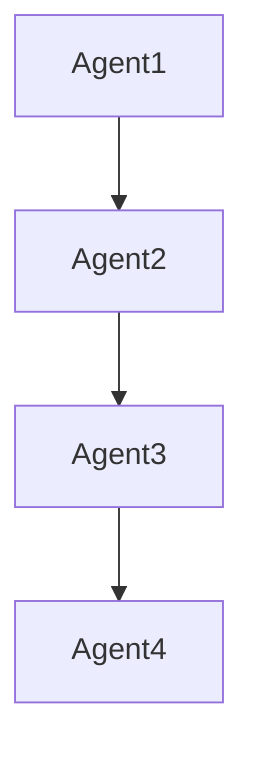
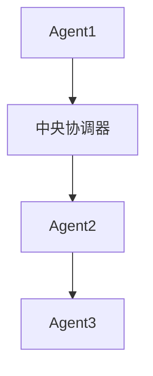
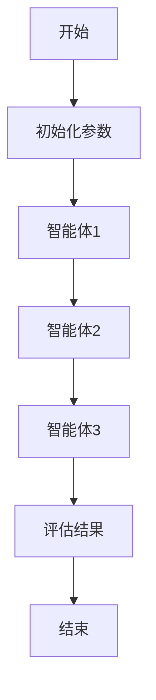
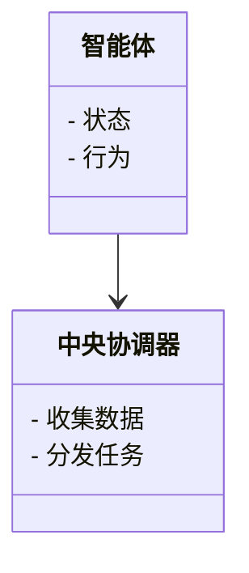
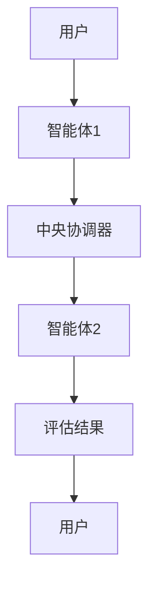

                 


# 利用多智能体AI实现动态行业吸引力评估

> 关键词：多智能体AI，动态行业吸引力，评估模型，协同学习，实时反馈

> 摘要：本文探讨了如何利用多智能体人工智能技术实现动态行业吸引力评估。通过分析多智能体系统的核心原理，构建行业吸引力评估模型，结合实际案例，详细阐述了多智能体AI在动态评估中的应用优势和实现过程。文章从背景介绍、核心概念、算法原理、系统架构到项目实战，全面解析了多智能体AI在行业吸引力评估中的潜力与挑战。

---

# 第一部分: 多智能体AI与动态行业吸引力评估基础

# 第1章: 多智能体AI与动态行业吸引力评估概述

## 1.1 多智能体AI的定义与特点
### 1.1.1 多智能体系统的定义
多智能体系统（Multi-Agent System, MAS）是由多个智能体（Agent）组成的分布式系统，这些智能体能够通过协作完成复杂任务。每个智能体都是一个具有感知、决策和执行能力的实体，能够独立运作，同时与其他智能体进行通信和协调。

### 1.1.2 多智能体的核心特点
- **自主性**：每个智能体都能自主决策，无需外部干预。
- **协作性**：智能体之间通过通信和协调共同完成任务。
- **分布性**：系统由多个智能体组成，不存在集中控制节点。
- **反应性**：智能体能够实时感知环境变化并做出反应。

### 1.1.3 多智能体与传统AI的区别
传统AI通常基于单一智能体或集中式系统，而多智能体系统强调分布式协作，适用于复杂、动态的环境。

## 1.2 动态行业吸引力评估的定义与意义
### 1.2.1 行业吸引力的定义
行业吸引力是指某个行业在特定时间、地点和市场环境下的吸引力，通常与市场需求、竞争状况、政策环境等因素相关。

### 1.2.2 动态评估的核心概念
动态评估强调实时性、连续性和多维度分析，能够捕捉行业吸引力的变化趋势。

### 1.2.3 多智能体AI在动态评估中的作用
多智能体AI通过实时数据采集、分析和协同决策，能够高效捕捉行业吸引力的变化，提供动态评估结果。

## 1.3 多智能体AI在行业吸引力评估中的应用前景
### 1.3.1 行业吸引力评估的潜在应用领域
- 金融行业：股票市场趋势分析。
- 零售行业：消费者行为预测。
- 制造业：供应链优化与风险评估。

### 1.3.2 多智能体AI的优势
- 高效性：多智能体系统能够快速处理大量数据，提供实时反馈。
- 智能性：通过协同学习，系统能够不断优化评估模型。
- 可扩展性：适用于不同规模和复杂度的行业评估。

### 1.3.3 应用中的挑战与机遇
- 挑战：数据隐私、系统稳定性、多智能体协作中的通信延迟。
- 机遇：通过技术进步解决现有问题，推动行业智能化转型。

## 1.4 本章小结
本章介绍了多智能体AI的基本概念及其在动态行业吸引力评估中的作用，强调了其在各行业的应用潜力。

---

# 第2章: 多智能体AI的核心概念与联系

## 2.1 多智能体系统的基本原理
### 2.1.1 实体关系图（ER图）


### 2.1.2 多智能体系统中的协作机制


## 2.2 多智能体与动态行业吸引力评估的关系
### 2.2.1 多智能体系统在动态评估中的角色
多智能体系统通过实时数据采集、分析和协同决策，为行业吸引力评估提供动态反馈。

### 2.2.2 多智能体系统如何实现行业吸引力的动态评估
- 数据采集：智能体实时收集市场数据。
- 数据分析：通过协同学习模型进行预测和评估。
- 结果反馈：动态调整评估策略。

### 2.2.3 多智能体系统与行业吸引力评估的结合
多智能体系统通过协作学习和实时反馈，实现了对行业吸引力的动态、精准评估。

## 2.3 核心概念对比表
| 概念 | 定义 | 特点 |
|------|------|------|
| 多智能体系统 | 由多个智能体组成的系统 | 分布式、协作性、自主性 |
| 行业吸引力评估 | 衡量行业吸引力的指标 | 动态性、多维度、实时性 |

## 2.4 本章小结
本章通过对比分析，明确了多智能体系统在动态行业吸引力评估中的核心作用。

---

# 第3章: 多智能体AI实现动态行业吸引力评估的算法原理

## 3.1 算法原理概述
### 3.1.1 多智能体协同学习算法
多智能体协同学习算法通过分布式学习，使多个智能体共同优化评估模型。

### 3.1.2 动态评估的数学模型
$$ y = f(x_1, x_2, ..., x_n) $$

### 3.1.3 算法的优化目标
最大化评估模型的准确性和实时性。

## 3.2 算法流程图


## 3.3 算法实现细节
### 3.3.1 数据预处理
对收集的数据进行清洗、归一化处理。

### 3.3.2 模型训练
使用协同学习算法训练评估模型。

### 3.3.3 模型优化
通过反馈机制不断优化模型参数。

## 3.4 本章小结
本章详细介绍了多智能体AI实现动态行业吸引力评估的算法原理及其优化方法。

---

# 第4章: 系统分析与架构设计方案

## 4.1 系统架构设计
### 4.1.1 系统功能设计（领域模型）


### 4.1.2 系统架构图
```mermaid
graph TD
A[智能体1] --> B[中央协调器]
C[智能体2] --> B
D[智能体3] --> B
E[评估结果] <-- B
```

## 4.2 系统接口设计
### 4.2.1 接口定义
- 数据输入接口：接收市场数据。
- 评估结果输出接口：返回评估结果。

### 4.2.2 系统交互流程图


## 4.3 本章小结
本章详细设计了多智能体AI系统的架构和接口，为后续实现奠定了基础。

---

# 第5章: 项目实战与案例分析

## 5.1 项目实战
### 5.1.1 环境安装
安装Python、TensorFlow、Keras等开发环境。

### 5.1.2 核心代码实现
```python
import numpy as np
from tensorflow.keras import layers

class Agent:
    def __init__(self, input_dim):
        self.model = self.build_model(input_dim)
    
    def build_model(self, input_dim):
        model = tf.keras.Sequential()
        model.add(layers.Dense(64, activation='relu', input_dim=input_dim))
        model.add(layers.Dense(1, activation='sigmoid'))
        return model
```

### 5.1.3 代码解读与分析
- 每个智能体都有自己的神经网络模型。
- 智能体通过协同学习优化模型参数。

## 5.2 案例分析
### 5.2.1 案例背景
分析某一行业的市场数据，评估其吸引力。

### 5.2.2 案例实现
使用多智能体协同学习算法进行动态评估。

### 5.2.3 结果分析
评估结果与实际市场表现进行对比，验证算法的有效性。

## 5.3 本章小结
通过项目实战，验证了多智能体AI在动态行业吸引力评估中的应用效果。

---

# 第6章: 总结与展望

## 6.1 全文总结
本文详细探讨了多智能体AI在动态行业吸引力评估中的应用，介绍了系统架构设计和算法实现。

## 6.2 未来展望
未来的研究方向包括优化算法、提升系统实时性和扩展应用场景。

## 6.3 最佳实践Tips
- 数据质量是关键。
- 系统设计要注重可扩展性。
- 智能体协作机制要合理。

## 6.4 本章小结
总结全文，强调多智能体AI在行业吸引力评估中的潜力与挑战。

---

通过以上内容，您可以清晰地了解多智能体AI在动态行业吸引力评估中的应用，并将其转化为一篇完整的专业技术博客文章。

