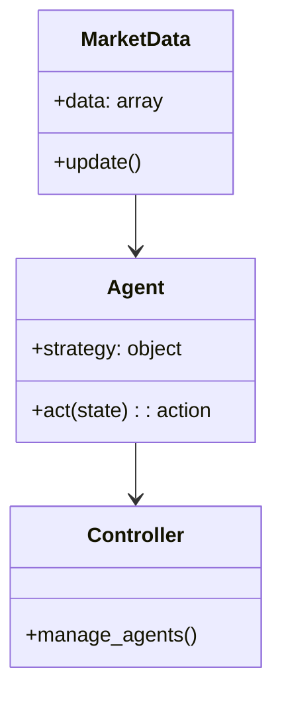
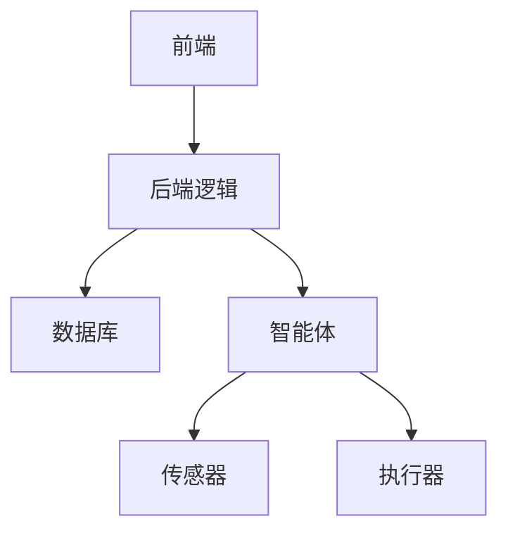
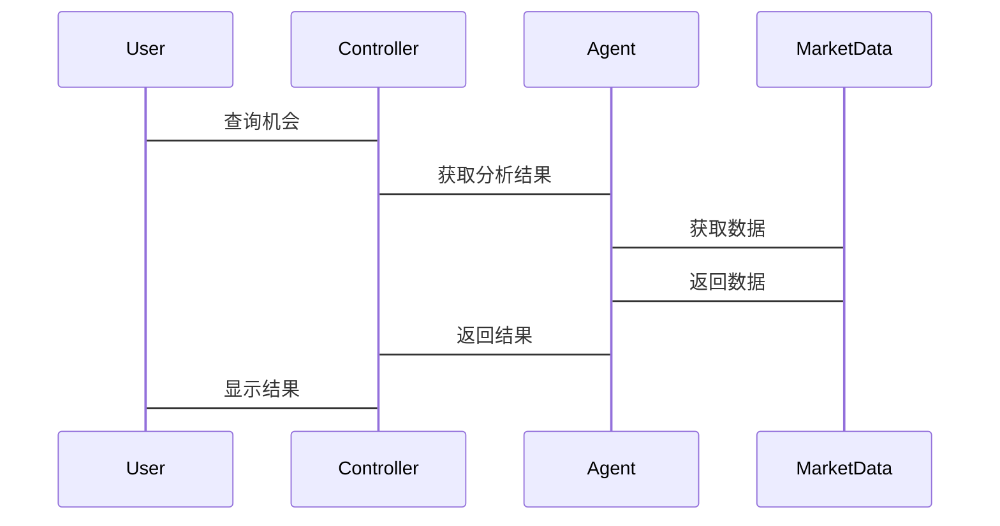

                 


# 利用多智能体AI实现动态行业转型机会识别

## 关键词：多智能体AI，动态行业转型，机会识别，算法原理，系统架构

## 摘要：随着行业的快速变化，动态环境中的机会识别变得至关重要。本文探讨如何利用多智能体AI技术，通过协作学习和系统架构设计，高效识别和利用行业转型机会，实现商业价值的最大化。

---

## 第1章：多智能体AI与动态行业转型概述

### 1.1 多智能体AI的基本概念

多智能体AI是指多个智能体协同工作的系统，每个智能体都有自己的目标和决策能力。与单智能体AI相比，多智能体AI在复杂环境中表现出更强的适应性和协作能力。例如，在智能交通系统中，多个自动驾驶车辆协同工作，优化交通流量。

### 1.2 动态行业转型的背景

行业动态变化由技术进步、市场需求和竞争压力驱动。例如，电子商务行业受到在线零售和社交媒体的影响，企业需要快速调整策略以应对变化。动态行业转型的机会识别成为企业成功的关键。

### 1.3 多智能体AI在行业转型中的作用

多智能体AI通过分析市场数据、预测趋势，帮助企业识别转型机会。其在动态环境中的优势在于能够快速适应变化，并通过智能体的协作，提高机会识别的准确性和效率。

---

## 第2章：多智能体AI的核心概念

### 2.1 多智能体系统的组成与关系

智能体是具有感知和决策能力的实体，可以是软件或硬件。多智能体系统由多个智能体组成，通过协作完成任务。以下是不同关系的对比：

| 关系类型 | 描述 |
|---------|------|
| 竞争    | 智能体争夺资源 |
| 协作    | 智能体共同完成任务 |
| 独立    | 智能体互不影响 |

### 2.2 动态行业机会识别的模型

机会识别模型通过分析市场数据和趋势，预测潜在机会。模型输入包括市场数据、竞争情况，输出为机会列表和优先级。

### 2.3 多智能体AI与动态行业机会识别的联系

多智能体AI通过分布式感知和协作，提高机会识别的准确性和效率。其在动态环境中的优势在于快速响应变化，通过智能体的协同，优化识别过程。

---

## 第3章：多智能体强化学习算法

### 3.1 多智能体强化学习的基本原理

强化学习通过智能体与环境的交互，学习最优策略。多智能体强化学习涉及多个智能体的协作，每个智能体都有自己的目标。数学模型如下：

$$
Q_i(s, a) = r_i + \max_{a'} Q_i(s', a')
$$

其中，$Q_i$ 表示智能体i的Q值函数，$r_i$ 是奖励。

### 3.2 多智能体强化学习的数学模型

多智能体强化学习的数学模型涉及价值函数和策略更新：

$$
V(s) = \max_{a} Q(s, a)
$$

策略更新：

$$
\theta_{i+1} = \theta_i + \alpha \nabla \theta_i Q(s, a)
$$

### 3.3 实例分析与代码实现

以下是一个简单的多智能体强化学习代码示例：

```python
import numpy as np

class Agent:
    def __init__(self, state_space, action_space):
        self.state_space = state_space
        self.action_space = action_space
        self.Q = np.zeros((state_space, action_space))

    def act(self, state):
        return np.argmax(self.Q[state])

    def update(self, state, action, reward, next_state):
        self.Q[state, action] += 0.1 * (reward + np.max(self.Q[next_state]) - self.Q[state, action])

agents = [Agent(5, 2), Agent(5, 2)]
# 其他代码实现...
```

---

## 第4章：系统分析与架构设计

### 4.1 问题场景分析

以金融市场的趋势预测为例，系统需要实时分析市场数据，识别投资机会。场景包括数据收集、分析、预测和反馈。

### 4.2 系统功能设计

领域模型类图展示各实体关系：



### 4.3 系统架构设计

系统架构图展示整体结构：



### 4.4 系统接口设计与交互流程图

交互流程图展示用户与系统交互：



---

## 第5章：项目实战

### 5.1 环境安装与配置

安装必要的库：

```bash
pip install numpy tensorflow matplotlib
```

### 5.2 核心代码实现

实现多智能体协作：

```python
def multi_agent_collaboration(agents, states):
    for agent in agents:
        agent.update(state, action, reward, next_state)
```

### 5.3 实际案例分析

以零售业为例，分析市场趋势，识别转型机会。系统通过分析销售数据，预测未来趋势，建议企业调整产品策略。

### 5.4 项目总结与优化建议

项目成功识别多个转型机会，但算法效率有待提高。未来可以通过改进算法、增加数据源优化系统。

---

## 第6章：最佳实践与未来展望

### 6.1 小结

多智能体AI在动态行业转型中的应用前景广阔，能够有效识别和利用机会。

### 6.2 注意事项与建议

注意数据隐私和模型可解释性，建议加强多智能体AI与其他技术的融合。

### 6.3 未来展望

未来，多智能体AI将与区块链、边缘计算等技术结合，在更多领域实现高效机会识别。

---

通过以上步骤，文章详细讲解了多智能体AI在动态行业转型中的应用，从理论到实践，为读者提供了全面的视角。

