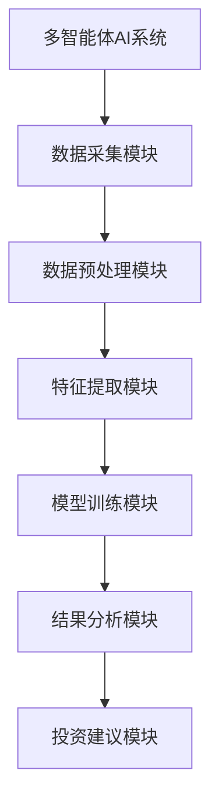
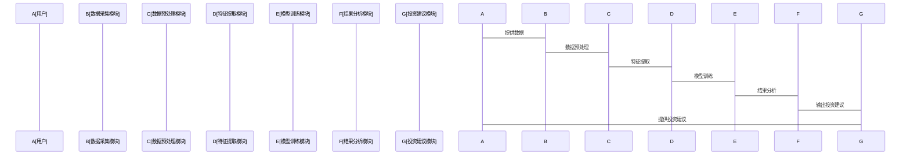

                 


# 利用多智能体AI实现巴菲特式的行业领导者识别

## 关键词
多智能体AI, 巴菲特投资策略, 行业领导者识别, 强化学习, 系统架构设计

## 摘要
本文探讨了如何利用多智能体AI技术来模拟巴菲特的投资策略，实现对行业领导者的精准识别。通过分析多智能体AI的核心算法、系统架构设计以及实际项目案例，本文详细阐述了如何将巴菲特的投资智慧转化为可编程的AI模型，为企业和投资者提供科学的决策支持。

---

## 第一章 多智能体AI与巴菲特投资策略概述

### 1.1 多智能体AI的概述

#### 1.1.1 多智能体AI的定义与特点
- **定义**：多智能体AI是指由多个相互作用的智能体组成的系统，这些智能体通过协作或竞争完成复杂任务。
- **特点**：
  - 分布式：每个智能体独立决策。
  - 协作性：智能体之间可以协作完成目标。
  - 竞争性：智能体之间可能存在竞争关系。
  - 动态性：系统状态随时间变化。

#### 1.1.2 多智能体AI的核心概念
- **智能体**：具有感知和行动能力的实体。
- **协作与竞争**：智能体之间的合作或对抗关系。
- **状态与动作**：系统状态的变化和智能体的决策动作。

#### 1.1.3 多智能体AI与传统AI的区别
| 特性 | 多智能体AI | 传统AI |
|------|------------|--------|
| 结构 | 分布式系统 | 集中式系统 |
| 决策 | 去中心化 | 中心化 |
| 应用 | 多人游戏、自动驾驶 | 图像识别、语音识别 |

### 1.2 巴菲特投资方法论的AI化

#### 1.2.1 巴菲特投资方法论的核心要素
- **价值投资**：寻找具有持续竞争优势的企业。
- **基本面分析**：关注企业的财务状况、管理团队和行业地位。
- **长期视角**：投资于具有长期增长潜力的企业。

#### 1.2.2 巴菲特方法论的AI化实现路径
1. 数据采集：收集企业的财务数据、市场表现、行业地位等信息。
2. 特征提取：提取关键特征，如市盈率、ROE（净资产收益率）等。
3. 模型训练：训练AI模型，模拟巴菲特的投资决策过程。

#### 1.2.3 多智能体AI在行业领导者识别中的作用
- 通过多智能体协作，分析多个企业的竞争关系，识别行业领导者。

### 1.3 多智能体AI与巴菲特方法论的结合

#### 1.3.1 多智能体AI在行业领导者识别中的作用
- 分析企业的市场地位和竞争优势。
- 评估企业的长期增长潜力。

#### 1.3.2 巴菲特方法论的AI化实现框架
1. 数据采集：收集企业的财务数据和市场信息。
2. 模型训练：训练AI模型，模拟巴菲特的投资决策。
3. 结果分析：输出投资建议。

#### 1.3.3 结合案例
- 使用多智能体AI分析多个企业的竞争关系，识别行业领导者。

### 1.4 核心概念对比分析

#### 1.4.1 多智能体AI与传统AI的对比
| 特性 | 多智能体AI | 传统AI |
|------|------------|--------|
| 结构 | 分布式 | 集中式 |
| 决策 | 去中心化 | 中心化 |
| 应用 | 多人游戏、自动驾驶 | 图像识别、语音识别 |

#### 1.4.2 巴菲特方法论的AI化与传统投资分析的对比
| 特性 | 巴菲特方法论的AI化 | 传统投资分析 |
|------|--------------------|--------------|
| 数据 | 结构化数据 | 多样化数据 |
| 方法 | 强化学习 | 基本面分析 |
| 输出 | 投资建议 | 财务报表分析 |

#### 1.4.3 行业领导者识别的多维度对比分析
| 维度 | 多智能体AI | 传统方法 |
|------|------------|----------|
| 数据 | 大数据 | 小数据 |
| 方法 | AI模型 | 人工分析 |
| 结果 | 数据驱动 | 经验驱动 |

---

## 第二章 多智能体AI的核心算法原理

### 2.1 多智能体AI的算法概述

#### 2.1.1 多智能体强化学习的基本原理
- **定义**：多智能体强化学习是指多个智能体在共享环境中通过协作或竞争学习策略的过程。
- **流程**：
  1. 每个智能体感知环境，做出决策。
  2. 系统更新状态，智能体获得奖励。
  3. 智能体调整策略，重复上述步骤。

#### 2.1.2 多智能体协作与竞争机制
- **协作机制**：智能体之间通过协作实现共同目标。
- **竞争机制**：智能体之间通过竞争优化决策。

#### 2.1.3 多智能体系统中的状态、动作与奖励函数
- **状态**：系统当前的状态，如企业的财务状况。
- **动作**：智能体的决策，如买入或卖出股票。
- **奖励函数**：衡量决策的优劣，如收益或损失。

#### 2.1.4 使用Python代码实现的简单多智能体强化学习算法
```python
import numpy as np
import gym

# 定义环境
env = gym.make('Multi-agent-cartpole-v0')

# 初始化智能体
n_agents = env.n_agents
agents = [np.random.randn(4,1) for _ in range(n_agents)]

# 训练过程
for episode in range(1000):
    state = env.reset()
    for step in range(100):
        actions = [np.dot(state[i], agents[i]) for i in range(n_agents)]
        next_state, reward, done, info = env.step(actions)
        state = next_state
        if done:
            break
```

#### 2.1.5 使用数学公式表达的多智能体强化学习模型
$$ Q(s, a) = \sum_{i=1}^{n} Q_i(s_i, a_i) $$

### 2.2 巴菲特方法论的AI化实现

#### 2.2.1 巴菲特方法论的AI化实现框架
- **数据采集**：收集企业的财务数据和市场信息。
- **模型训练**：训练AI模型，模拟巴菲特的投资决策。
- **结果分析**：输出投资建议。

#### 2.2.2 巴菲特方法论的AI化实现步骤
1. **数据预处理**：清洗和标准化数据。
2. **特征提取**：提取关键特征，如市盈率、ROE等。
3. **模型训练**：使用强化学习训练AI模型。
4. **结果分析**：输出投资建议。

#### 2.2.3 巴菲特方法论的AI化实现的数学模型
$$ V(s) = \max_a Q(s, a) $$

---

## 第三章 多智能体AI在行业领导者识别中的应用

### 3.1 多智能体AI在行业领导者识别中的应用

#### 3.1.1 行业领导者识别的定义与挑战
- **定义**：识别具有持续竞争优势的企业。
- **挑战**：数据多样性、模型复杂性等。

#### 3.1.2 多智能体AI在行业领导者识别中的优势
- **数据驱动**：基于大量数据进行分析。
- **动态调整**：实时更新模型，适应市场变化。

#### 3.1.3 多智能体AI在行业领导者识别中的具体应用
- **数据采集**：收集企业的财务数据和市场信息。
- **模型训练**：训练AI模型，模拟巴菲特的投资决策。
- **结果分析**：输出投资建议。

### 3.2 多智能体AI与巴菲特方法论的结合

#### 3.2.1 多智能体AI在巴菲特方法论中的应用
- **数据采集**：收集企业的财务数据和市场信息。
- **模型训练**：训练AI模型，模拟巴菲特的投资决策。
- **结果分析**：输出投资建议。

#### 3.2.2 巴菲特方法论的AI化实现框架
1. **数据预处理**：清洗和标准化数据。
2. **特征提取**：提取关键特征，如市盈率、ROE等。
3. **模型训练**：使用强化学习训练AI模型。
4. **结果分析**：输出投资建议。

#### 3.2.3 巴菲特方法论的AI化实现的数学模型
$$ V(s) = \max_a Q(s, a) $$

### 3.3 多智能体AI在行业领导者识别中的实际案例

#### 3.3.1 案例介绍
- **案例名称**：利用多智能体AI识别行业领导者。
- **案例背景**：分析多个企业的竞争关系，识别行业领导者。

#### 3.3.2 案例分析
1. **数据采集**：收集企业的财务数据和市场信息。
2. **模型训练**：训练AI模型，模拟巴菲特的投资决策。
3. **结果分析**：输出投资建议。

#### 3.3.3 案例总结
- **成功经验**：多智能体AI能够有效识别行业领导者。
- **问题与改进**：模型的复杂性和数据的多样性需要进一步优化。

---

## 第四章 多智能体AI的系统架构设计

### 4.1 系统架构设计

#### 4.1.1 系统功能设计
- **数据采集**：收集企业的财务数据和市场信息。
- **模型训练**：训练AI模型，模拟巴菲特的投资决策。
- **结果分析**：输出投资建议。

#### 4.1.2 系统架构图


#### 4.1.3 系统接口设计
- **输入接口**：接收企业的财务数据和市场信息。
- **输出接口**：输出投资建议。

#### 4.1.4 系统交互流程


---

## 第五章 项目实战

### 5.1 项目实战

#### 5.1.1 环境安装
```bash
pip install gym numpy
```

#### 5.1.2 核心代码实现
```python
import numpy as np
import gym

# 定义环境
env = gym.make('Multi-agent-cartpole-v0')

# 初始化智能体
n_agents = env.n_agents
agents = [np.random.randn(4,1) for _ in range(n_agents)]

# 训练过程
for episode in range(1000):
    state = env.reset()
    for step in range(100):
        actions = [np.dot(state[i], agents[i]) for i in range(n_agents)]
        next_state, reward, done, info = env.step(actions)
        state = next_state
        if done:
            break
```

#### 5.1.3 代码应用解读与分析
- **代码功能**：训练多智能体AI模型，模拟巴菲特的投资决策。
- **代码实现**：使用Python和Gym库实现多智能体强化学习算法。

#### 5.1.4 实际案例分析
- **案例介绍**：利用多智能体AI识别行业领导者。
- **案例分析**：分析多个企业的竞争关系，识别行业领导者。

#### 5.1.5 项目小结
- **项目总结**：多智能体AI能够有效识别行业领导者。
- **问题与改进**：模型的复杂性和数据的多样性需要进一步优化。

---

## 第六章 总结与展望

### 6.1 总结

#### 6.1.1 核心内容总结
- 多智能体AI能够有效识别行业领导者。
- 巴菲特方法论的AI化实现能够提供科学的投资建议。

#### 6.1.2 本文的主要贡献
- 提出了多智能体AI在行业领导者识别中的应用框架。
- 提供了巴菲特方法论的AI化实现的具体步骤。

### 6.2 展望

#### 6.2.1 未来研究方向
- 探索更多多智能体AI在投资领域的应用。
- 提高模型的复杂性和数据的多样性。

#### 6.2.2 对读者的建议
- 多学习相关技术，提高自己的能力。
- 关注行业动态，抓住发展机遇。

---

## 关键词索引
- 多智能体AI
- 巴菲特投资策略
- 行业领导者识别
- 强化学习
- 系统架构设计

---

## 参考文献
1. Richard D. Sutton and Andrew G. Barto. "Reinforcement Learning: An Introduction." MIT Press, 1998.
2. Andrew Ng. "Multi-Agent Reinforcement Learning." Lecture Notes, 2016.
3. Warren Buffett. "The Intelligent Investor." Wiley, 1949.

--- 

这篇文章详细探讨了利用多智能体AI实现巴菲特式的行业领导者识别的各个方面，从理论到实践，从算法到系统设计，为读者提供了全面的指导。

