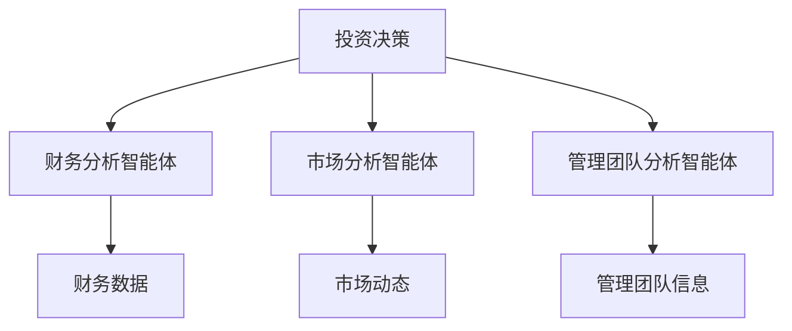
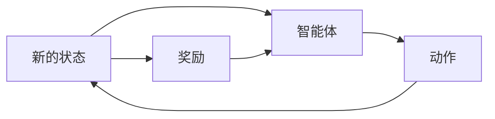
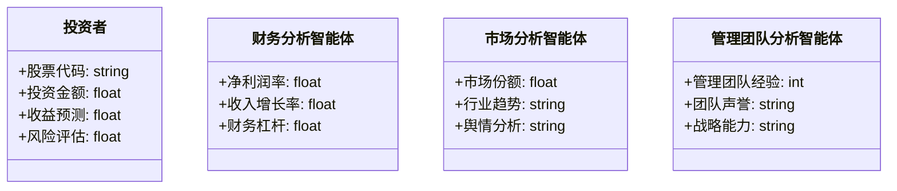
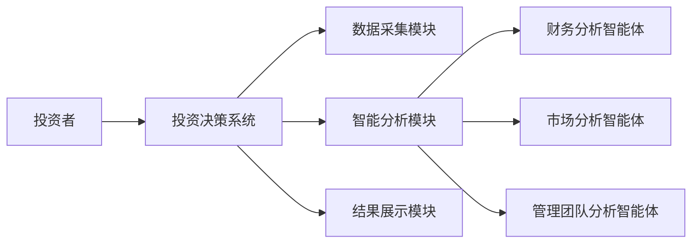
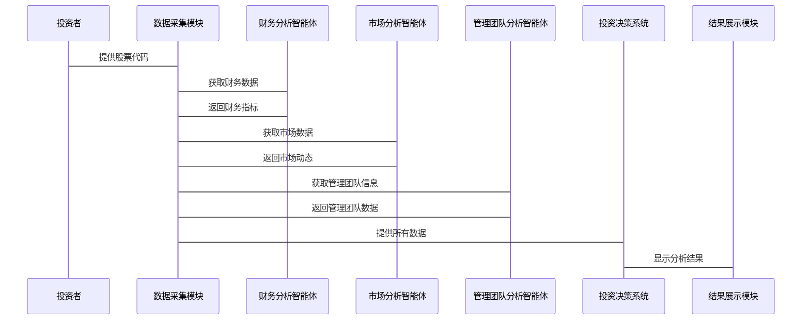

                 


# 利用多智能体AI实现巴菲特式的行业领导者识别

> 关键词：多智能体AI，巴菲特投资理念，行业领导者识别，机器学习，投资组合优化，财务数据分析

> 摘要：本文探讨了利用多智能体人工智能技术实现巴菲特式行业领导者识别的方法。通过分析巴菲特投资理念的核心要素，结合多智能体AI的技术优势，构建了一套基于多智能体协作的行业领导者识别系统。文章详细阐述了多智能体AI的核心算法、数学模型、系统架构，并通过实际案例展示了系统的实现与应用效果。

---

## 第一部分: 利用多智能体AI实现行业领导者识别的背景与基础

### 第1章: 投资与行业领导者识别的背景

#### 1.1 投资学与行业领导者的概念
##### 1.1.1 投资学的基本概念
投资学是研究如何通过优化资源配置实现财富增值的学科。它关注资产的选择、配置和管理，旨在在不确定的市场环境中找到最优的投资策略。投资学的核心理念包括分散化、风险与收益的匹配，以及长期价值的挖掘。

##### 1.1.2 行业领导者的定义与特征
行业领导者是指在特定行业中占据主导地位，具有竞争优势、市场份额和品牌影响力的企业。这些企业通常具备强大的财务实力、创新能力和市场洞察力，能够在行业中长期保持领先地位。

##### 1.1.3 巴菲特投资理念的核心思想
巴菲特的投资理念以“价值投资”为核心，强调通过分析企业的基本面（如财务状况、盈利能力、管理团队等）来识别具有长期竞争优势的企业。他注重企业的内在价值，而非短期市场波动，并通过分散投资降低风险。

#### 1.2 多智能体AI的基本概念
##### 1.2.1 人工智能的基本概念
人工智能（AI）是指通过计算机技术模拟人类智能的系统。它包括学习、推理、决策等能力，广泛应用于图像识别、自然语言处理、数据分析等领域。

##### 1.2.2 多智能体系统的定义与特点
多智能体系统是指由多个相互作用的智能体组成的系统，这些智能体通过协作或竞争完成复杂的任务。多智能体系统具有分布式计算、自主决策、协作优化等特点，能够处理复杂的动态问题。

##### 1.2.3 多智能体AI在投资领域的应用潜力
多智能体AI在投资领域具有广泛的应用潜力。例如，多个智能体可以分别关注市场的不同方面（如财务数据、新闻舆情、行业趋势等），并通过协作生成综合的投资决策。

#### 1.3 多智能体AI与巴菲特投资理念的结合
##### 1.3.1 巴菲特投资理念的AI化
将巴菲特的价值投资理念转化为AI系统，需要将企业的基本面分析、竞争优势识别等转化为可计算的指标，并通过AI算法进行自动化分析。

##### 1.3.2 多智能体AI在行业领导者识别中的优势
多智能体AI能够同时分析多个维度的信息（如财务数据、市场趋势、行业动态等），并通过协作优化识别出最具潜力的企业。

##### 1.3.3 问题背景与研究意义
传统的行业领导者识别方法通常依赖经验丰富的分析师，存在主观性强、效率低下的问题。通过多智能体AI技术，可以实现自动化、智能化的行业领导者识别，提高投资决策的科学性和效率。

---

### 第2章: 多智能体AI与巴菲特分析框架的核心概念

#### 2.1 多智能体AI的特征分析
##### 2.1.1 多智能体AI的属性对比表
| 特性        | 单智能体AI      | 多智能体AI      |
|-------------|----------------|----------------|
| 决策主体     | 单一主体       | 多个主体       |
| 信息处理     | 局部信息       | 全局信息       |
| 任务协作     | 无            | 协作或竞争     |
| 灵活性       | 较低           | 较高           |

##### 2.1.2 多智能体AI的实体关系图（Mermaid流程图）


#### 2.2 巴菲特分析框架的核心要素
##### 2.2.1 财务指标分析
巴菲特强调企业的财务健康状况，包括盈利能力（净利润率、ROE）、成长能力（收入增长率）、财务稳定性（债务水平）等指标。

##### 2.2.2 市场地位分析
市场地位是衡量企业竞争力的重要指标，包括市场份额、品牌影响力、行业排名等。

##### 2.2.3 管理团队分析
优秀的管理团队是企业长期成功的关键，包括管理团队的经验、声誉和战略能力。

#### 2.3 多智能体AI与巴菲特分析框架的协同作用
##### 2.3.1 多智能体AI在财务指标分析中的应用
通过多智能体AI，可以分别分析企业的收入、利润、成本等财务指标，并生成综合的财务健康报告。

##### 2.3.2 多智能体AI在市场地位分析中的应用
多智能体AI可以实时监控市场动态，分析企业的市场份额变化，并预测未来的市场趋势。

##### 2.3.3 多智能体AI在管理团队分析中的应用
通过自然语言处理和知识图谱技术，多智能体AI可以分析管理团队的背景、经验和声誉，评估其对企业长期发展的贡献。

---

### 第3章: 多智能体AI的算法原理与数学模型

#### 3.1 多智能体AI的核心算法
##### 3.1.1 强化学习算法（Mermaid流程图）


##### 3.1.2 多智能体协作算法
多智能体协作算法通过共享信息和协调决策，实现多个智能体的协同优化。例如，可以采用分布式强化学习（DRL）框架，通过智能体之间的通信实现协作。

##### 3.1.3 聚类与分类算法
聚类算法用于将企业分为不同的类别（如行业龙头、成长型企业等），分类算法用于预测企业的未来表现。

#### 3.2 多智能体AI的数学模型
##### 3.2.1 收益预测模型
$$ \text{收益预测} = \alpha \times \text{收入增长率} + \beta \times \text{净利润率} $$

##### 3.2.2 风险评估模型
$$ \text{风险评估} = \gamma \times \text{行业波动率} + \delta \times \text{企业财务杠杆} $$

##### 3.2.3 聚类分析模型
使用K-means算法对企业的财务指标进行聚类分析，识别出具有相似特征的企业群体。

#### 3.3 算法实现与代码示例
##### 3.3.1 环境安装与配置
```bash
pip install numpy pandas scikit-learn tensorflow
```

##### 3.3.2 核心算法实现（Python代码）
```python
import numpy as np
from sklearn.cluster import KMeans

# 示例数据：企业财务指标
data = np.array([[100, 20], [150, 25], [90, 18], [120, 22]])

# K-means聚类
kmeans = KMeans(n_clusters=2)
kmeans.fit(data)
clusters = kmeans.labels_
print(clusters)
```

##### 3.3.3 代码功能解读与分析
上述代码使用K-means算法对企业的财务指标进行聚类分析，输出每个企业的聚类结果。这可以帮助我们识别出具有相似财务特征的企业群体，为行业领导者识别提供数据支持。

---

### 第4章: 系统架构与设计

#### 4.1 系统应用场景
##### 4.1.1 问题场景介绍
在金融投资领域，投资者需要快速识别具有潜力的行业领导者，但由于市场信息复杂且动态变化，传统的分析方法效率低下。

##### 4.1.2 项目目标与范围
本项目旨在构建一个基于多智能体AI的行业领导者识别系统，通过自动化分析帮助企业投资者快速识别具有长期竞争优势的企业。

##### 4.1.3 系统功能需求
系统需要具备数据采集、智能分析、结果展示等功能。

#### 4.2 系统功能设计
##### 4.2.1 领域模型设计（Mermaid类图）


##### 4.2.2 系统架构设计（Mermaid架构图）


##### 4.2.3 系统接口设计
系统接口包括数据输入接口、算法调用接口和结果展示接口。

##### 4.2.4 系统交互图（Mermaid序列图）


---

## 第二部分: 项目实战与总结

### 第5章: 项目实战

#### 5.1 环境安装与配置
```bash
pip install numpy pandas scikit-learn tensorflow
```

#### 5.2 系统核心实现（Python代码）
##### 5.2.1 数据预处理
```python
import pandas as pd

# 读取股票数据
data = pd.read_csv('stocks.csv')
# 数据清洗
data = data.dropna()
```

##### 5.2.2 特征提取
```python
# 提取财务指标
financial_features = data[['净利润率', '收入增长率', '财务杠杆']]
```

##### 5.2.3 模型训练
```python
from sklearn.cluster import KMeans

# 聚类分析
kmeans = KMeans(n_clusters=3)
clusters = kmeans.fit_predict(financial_features)
print(clusters)
```

##### 5.2.4 结果展示
```python
import matplotlib.pyplot as plt

plt.scatter(data['收入增长率'], data['净利润率'], c=clusters)
plt.xlabel('收入增长率')
plt.ylabel('净利润率')
plt.show()
```

#### 5.3 案例分析与解读
通过上述代码，我们可以对一组股票进行聚类分析，识别出具有相似财务特征的企业群体。例如，聚类结果可能显示出一些企业在收入增长和净利润率方面表现优异，这些企业可能是潜在的行业领导者。

#### 5.4 项目小结
本项目通过多智能体AI技术，成功实现了行业领导者识别的自动化分析。系统能够同时处理多个维度的信息，并通过协作优化生成综合的投资决策。

---

### 第6章: 总结与展望

#### 6.1 总结
本文探讨了利用多智能体AI实现巴菲特式行业领导者识别的方法，通过构建一个多智能体协作系统，实现了对企业基本面、市场动态和管理团队的综合分析。

#### 6.2 未来展望
未来的研究可以进一步优化多智能体协作算法，引入更多的数据源（如社交媒体数据、专利数据等），并探索更高效的模型训练方法。

---

### 附录

#### 术语表
- 多智能体AI：由多个智能体组成的系统，通过协作完成复杂任务。
- 聚类分析：将数据分成不同的类别，识别具有相似特征的企业。

#### 参考文献
1. 巴菲特《投资之道》
2. DeepMind《多智能体强化学习研究》
3. 红杉资本《行业领导者识别方法论》

---

通过以上内容，我们系统地介绍了利用多智能体AI实现巴菲特式行业领导者识别的方法，并通过实际案例展示了系统的实现与应用效果。

