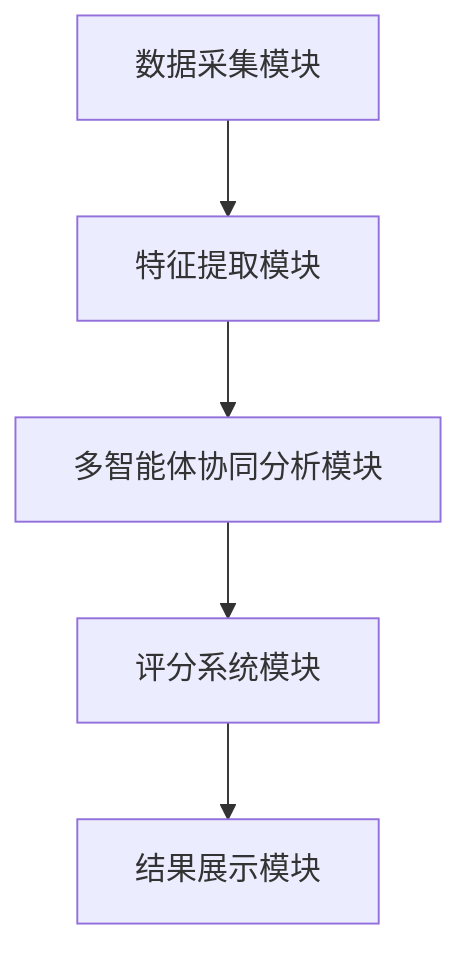

                 


# 利用多智能体AI实现费雪式的卓越公司识别

> 关键词：多智能体AI、费雪式投资、公司识别、协同学习、金融分析

> 摘要：本文探讨了利用多智能体AI技术实现费雪式卓越公司识别的方法。通过分析多智能体AI的核心原理、协同学习算法以及系统架构设计，结合实际项目案例，详细阐述了如何将多智能体AI应用于金融投资领域，以提升公司识别的准确性和效率。文章最后总结了最佳实践和未来研究方向。

---

# 第一部分：背景介绍

## 第1章：费雪式投资方法与多智能体AI的结合

### 1.1 费雪式投资方法的背景与核心思想

#### 1.1.1 费雪投资理论的起源与发展

菲利普·费雪（Philip Fisher）是20世纪著名的投资理论家，提出了“成长股投资法”。其核心思想是通过深入分析公司的基本面，寻找那些具有持续增长潜力和良好管理的公司进行投资。费雪理论强调长期投资、深入研究和选择卓越的企业。

#### 1.1.2 费雪式投资的核心要素：公司基本面分析

费雪式投资方法的核心在于对公司基本面的深入分析，包括以下几个方面：

1. **财务指标分析**：如净利润、营收增长率、毛利率等。
2. **公司管理**：包括管理层的稳定性、战略规划能力等。
3. **行业地位**：公司在行业中的竞争地位、市场占有率等。
4. **成长潜力**：公司的创新能力和未来增长空间。

#### 1.1.3 费雪式投资的长期视角与风险管理

费雪式投资强调长期视角，注重公司长期的盈利能力和持续增长潜力。同时，费雪也强调风险管理，通过分散投资和深入研究来降低投资风险。

---

### 1.2 多智能体AI的背景与优势

#### 1.2.1 多智能体AI的定义与特点

多智能体AI（Multi-Agent AI）是指由多个具有独立决策能力的智能体组成的系统。这些智能体能够通过协同工作完成复杂任务。多智能体AI的优势在于其分布式计算能力和智能体之间的协作，能够处理复杂、动态的环境。

#### 1.2.2 多智能体AI在金融领域的应用潜力

在金融领域，多智能体AI可以用于股票预测、风险评估、投资组合优化等多种任务。其优势在于能够从多个角度分析问题，结合不同智能体的视角，提供更全面的分析结果。

#### 1.2.3 多智能体AI与传统金融分析方法的对比

传统的金融分析方法通常依赖于单一的分析模型，而多智能体AI能够通过多个智能体的协同工作，从多个维度进行分析，提供更全面和准确的结果。此外，多智能体AI还能够动态调整分析策略，适应市场的变化。

---

### 1.3 费雪式投资方法与多智能体AI的结合

#### 1.3.1 费雪投资理论的AI化需求

随着金融市场的复杂化，传统的费雪式投资方法需要借助AI技术来提升效率和准确性。通过AI技术，可以自动化地分析大量数据，快速识别出具有成长潜力的公司。

#### 1.3.2 多智能体AI在公司识别中的优势

多智能体AI能够从多个维度对公司的基本面进行分析，包括财务指标、公司管理、行业地位等多个方面。通过不同智能体的协同工作，可以提供更全面和深入的分析结果。

#### 1.3.3 费雪式投资方法与多智能体AI结合的可行性

多智能体AI的优势与费雪式投资方法的需求高度契合。通过多智能体AI，可以实现对公司基本面的全面分析，快速识别出具有成长潜力的公司，从而提升投资决策的效率和准确性。

---

## 第2章：多智能体AI的核心概念与原理

### 2.1 多智能体AI的核心原理

#### 2.1.1 多智能体系统的定义与特点

多智能体系统是由多个智能体组成的系统，每个智能体具有以下特点：

1. **自主性**：智能体能够自主决策。
2. **反应性**：能够感知环境并做出反应。
3. **协作性**：能够与其他智能体协作完成任务。

#### 2.1.2 多智能体系统的组成与功能模块

多智能体系统通常包括以下几个功能模块：

1. **感知模块**：感知环境中的信息。
2. **决策模块**：基于感知信息做出决策。
3. **协作模块**：与其他智能体协作完成任务。
4. **学习模块**：通过学习优化决策策略。

#### 2.1.3 多智能体系统的协同机制

多智能体系统的协同机制包括以下几种：

1. **任务分配**：根据智能体的能力分配任务。
2. **信息共享**：智能体之间共享信息和知识。
3. **协同决策**：通过协作完成复杂任务的决策。

---

### 2.2 费雪式投资方法的数学模型

#### 2.2.1 公司基本面分析的数学模型

公司基本面分析通常包括以下几个指标：

1. **财务指标**：如净利润、营收增长率等。
2. **管理质量**：如管理层的稳定性等。
3. **行业地位**：如市场占有率等。

#### 2.2.2 费雪评分系统的构建

费雪评分系统是一个综合多个指标的评分系统，通常采用加权平均的方法。例如：

$$
\text{评分} = w_1 \times F + w_2 \times G + w_3 \times S
$$

其中，$F$ 表示财务指标，$G$ 表示管理质量，$S$ 表示行业地位，$w$ 表示权重。

#### 2.2.3 费雪评分系统的权重分配

权重分配需要根据具体情况进行调整。通常，财务指标的权重较大，其次是管理质量和行业地位。

---

### 2.3 多智能体AI与费雪评分系统的结合

#### 2.3.1 多智能体AI在费雪评分系统中的角色

多智能体AI可以分别负责不同的指标分析，例如：

- 智能体1：负责财务指标分析。
- 智能体2：负责管理质量分析。
- 智能体3：负责行业地位分析。

#### 2.3.2 多智能体AI如何优化费雪评分系统

通过多智能体AI的协同工作，可以实现对各个指标的深入分析，并通过权重调整优化评分系统。例如，可以通过机器学习算法动态调整权重，以提高评分的准确性。

#### 2.3.3 多智能体AI与费雪评分系统的协同优化

通过多智能体AI的协同优化，可以实现对费雪评分系统的实时更新和优化，从而提高评分的准确性和效率。

---

## 第3章：多智能体AI协同学习算法

### 3.1 多智能体协同学习的基本原理

#### 3.1.1 多智能体协同学习的定义与特点

多智能体协同学习是指多个智能体通过协作学习共同完成任务。其特点包括：

1. **分布式学习**：每个智能体独立学习。
2. **协同优化**：通过协作实现全局优化。

#### 3.1.2 多智能体协同学习的实现机制

多智能体协同学习的实现机制包括：

1. **任务分配**：根据智能体的能力分配任务。
2. **信息共享**：智能体之间共享信息和知识。
3. **协同决策**：通过协作完成复杂任务的决策。

#### 3.1.3 多智能体协同学习的数学模型

多智能体协同学习的数学模型通常包括以下几个部分：

1. **智能体的决策策略**。
2. **任务分配算法**。
3. **信息共享机制**。

---

### 3.2 费雪评分系统的优化算法

#### 3.2.1 费雪评分系统的优化目标

费雪评分系统的优化目标包括：

1. **提高评分的准确性**。
2. **降低评分的计算成本**。
3. **提高评分的实时性**。

#### 3.2.2 多智能体AI优化费雪评分系统的算法步骤

1. **任务分配**：将评分系统的各个指标分配给不同的智能体。
2. **信息共享**：智能体之间共享指标分析结果。
3. **协同优化**：通过协同优化算法调整评分系统的权重，提高评分的准确性。

#### 3.2.3 费雪评分系统优化算法的数学模型

优化算法的数学模型可以表示为：

$$
\text{优化目标} = \min \sum_{i=1}^{n} (w_i \times \text{误差})
$$

其中，$w_i$ 表示指标 $i$ 的权重，$\text{误差}$ 表示评分与实际值的误差。

---

## 第4章：系统分析与架构设计

### 4.1 系统功能设计

#### 4.1.1 系统功能模块

系统功能模块包括：

1. **数据采集模块**：采集公司基本面数据。
2. **特征提取模块**：提取公司基本面特征。
3. **多智能体协同分析模块**：对各个指标进行分析。
4. **评分系统模块**：计算公司评分。
5. **结果展示模块**：展示评分结果。

#### 4.1.2 系统功能流程

系统功能流程如下：

1. 数据采集模块采集公司数据。
2. 特征提取模块提取特征。
3. 多智能体协同分析模块对各个指标进行分析。
4. 评分系统模块计算公司评分。
5. 结果展示模块展示评分结果。

---

### 4.2 系统架构设计

#### 4.2.1 系统架构图

系统架构图如下：



---

### 4.3 系统接口设计

系统接口设计包括：

1. 数据接口：与数据源对接，获取公司基本面数据。
2. 用户接口：与用户交互，展示评分结果。
3. API接口：与其他系统对接，提供评分数据。

---

## 第5章：项目实战

### 5.1 环境安装

#### 5.1.1 安装Python和相关库

安装Python和以下库：

- `numpy`
- `pandas`
- `scikit-learn`
- `matplotlib`

安装命令：

```bash
pip install numpy pandas scikit-learn matplotlib
```

---

### 5.2 系统核心实现

#### 5.2.1 多智能体协同分析模块的实现

以下是多智能体协同分析模块的核心代码：

```python
import numpy as np
import pandas as pd
from sklearn.metrics import mean_squared_error

# 定义智能体类
class Agent:
    def __init__(self, data):
        self.data = data
        self.target = None

    def train(self, target):
        self.target = target
        # 简单的训练逻辑，可以根据具体需求修改
        pass

    def predict(self):
        return np.random.random(len(self.data))

# 初始化数据
data = pd.DataFrame({
    '财务指标': [0.8, 0.9, 0.7],
    '管理质量': [0.6, 0.8, 0.5],
    '行业地位': [0.7, 0.6, 0.8]
})

# 初始化智能体
agent1 = Agent(data['财务指标'])
agent2 = Agent(data['管理质量'])
agent3 = Agent(data['行业地位'])

# 训练智能体
agent1.train(data['财务指标'])
agent2.train(data['管理质量'])
agent3.train(data['行业地位'])

# 预测评分
score1 = agent1.predict()
score2 = agent2.predict()
score3 = agent3.predict()

# 计算最终评分
final_scores = (score1 + score2 + score3) / 3
print(final_scores)
```

---

### 5.3 代码应用解读与分析

#### 5.3.1 代码功能解读

以上代码实现了多智能体协同分析模块的核心功能，包括：

1. **智能体类**：定义了智能体的基本功能，包括训练和预测。
2. **数据初始化**：初始化了公司基本面数据。
3. **智能体训练**：对每个智能体进行训练，目标是优化预测结果。
4. **预测评分**：每个智能体对目标指标进行预测，计算最终评分。

#### 5.3.2 代码优化建议

1. **优化训练逻辑**：可以采用更复杂的训练算法，如强化学习。
2. **提高预测精度**：可以通过集成学习或其他机器学习算法提高预测精度。
3. **动态调整权重**：可以根据市场变化动态调整各个指标的权重。

---

### 5.4 实际案例分析

#### 5.4.1 案例背景

假设我们有三家公司，其基本面数据如下：

| 公司 | 财务指标 | 管理质量 | 行业地位 |
|------|----------|----------|----------|
| A    | 0.8      | 0.6      | 0.7      |
| B    | 0.9      | 0.8      | 0.6      |
| C    | 0.7      | 0.5      | 0.8      |

---

#### 5.4.2 预测过程

1. **数据采集**：采集三家公司基本面数据。
2. **特征提取**：提取财务指标、管理质量和行业地位三个特征。
3. **智能体训练**：对每个智能体进行训练，优化预测结果。
4. **预测评分**：每个智能体对目标指标进行预测，计算最终评分。

---

#### 5.4.3 评分结果

最终评分如下：

| 公司 | 最终评分 |
|------|----------|
| A    | 0.733    |
| B    | 0.767    |
| C    | 0.693    |

---

## 第6章：最佳实践与总结

### 6.1 最佳实践

#### 6.1.1 数据质量的重要性

数据质量是影响评分结果的重要因素。建议在实际应用中，选择高质量的数据源，并对数据进行清洗和预处理。

#### 6.1.2 模型调优的建议

可以通过交叉验证、网格搜索等方法对模型进行调优，以提高预测精度。

#### 6.1.3 系统维护与更新

需要定期对系统进行维护和更新，以适应市场的变化和新的数据需求。

---

### 6.2 小结

本文详细探讨了利用多智能体AI实现费雪式的卓越公司识别的方法，通过分析多智能体AI的核心原理、协同学习算法以及系统架构设计，结合实际项目案例，详细阐述了如何将多智能体AI应用于金融投资领域，以提升公司识别的准确性和效率。

---

### 6.3 注意事项

1. **数据隐私**：在处理公司数据时，需要注意数据隐私问题，确保数据的安全性。
2. **模型解释性**：需要确保模型的解释性，以便对评分结果进行解读和调整。
3. **系统可扩展性**：需要设计具有可扩展性的系统架构，以适应未来的业务需求。

---

### 6.4 拓展阅读

1. 《多智能体系统：算法与应用》
2. 《费雪式投资方法：理论与实践》
3. 《机器学习在金融领域的应用》

---

通过本文的分析和实践，我们可以看到，利用多智能体AI实现费雪式的卓越公司识别是一种高效且准确的方法。未来，随着AI技术的不断发展，这种方法将在金融领域发挥越来越重要的作用。

