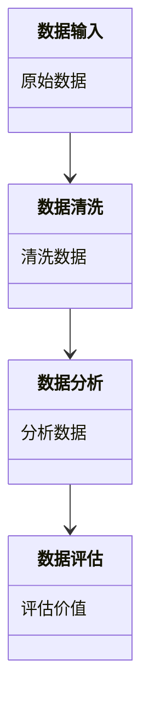
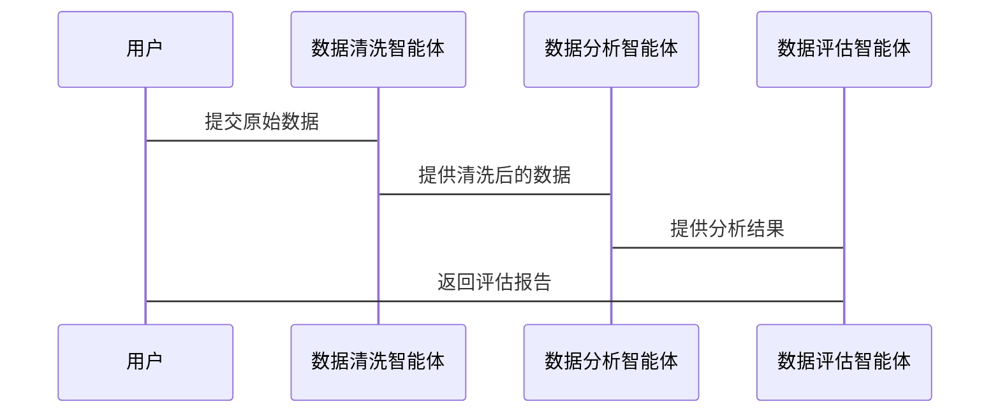

                 


# 利用多智能体AI评估公司的数据资产价值

## 关键词
- 数据资产价值评估
- 多智能体AI
- 分布式计算
- 数据资产评估
- AI协作学习

## 摘要
在数字化转型的今天，数据已成为企业最重要的资产之一。然而，如何准确评估数据资产的价值，仍是一个复杂而具有挑战性的任务。传统的单体AI系统难以应对数据资产的多样性和动态性。多智能体AI作为一种新兴的技术，通过多个智能体的协作与竞争，能够更高效、更准确地评估数据资产的价值。本文将深入探讨多智能体AI在数据资产价值评估中的应用，分析其核心原理、算法流程、系统架构，并通过实际案例展示其优势与应用前景。

---

# 第一部分: 数据资产价值评估的背景与挑战

## 第1章: 数据资产价值评估的背景与问题

### 1.1 数据资产的定义与重要性

#### 1.1.1 数据资产的定义
数据资产是指企业拥有或控制的，能够为企业创造价值的数据资源。这些数据可以是结构化的（如数据库中的表格）或非结构化的（如文本、图像），并且具有可衡量的价值。

#### 1.1.2 数据资产在企业中的重要性
- **战略资源**：数据资产是企业决策的重要依据。
- **竞争优势**：高质量的数据资产能够为企业提供竞争优势。
- **创新驱动力**：数据资产是推动企业创新的核心驱动力。

#### 1.1.3 数据资产价值评估的必要性
- **优化资源配置**：通过评估数据资产的价值，企业可以更好地分配资源。
- **风险控制**：评估数据资产的价值有助于识别潜在风险。
- **合规性要求**：许多行业对数据资产评估有合规性要求。

### 1.2 多智能体AI的定义与特点

#### 1.2.1 多智能体系统的定义
多智能体系统是由多个相互作用的智能体组成的系统，每个智能体都有自己的目标和决策机制，并通过协作与竞争完成复杂的任务。

#### 1.2.2 多智能体AI的核心特点
- **分布式计算**：智能体之间通过分布式计算完成任务。
- **协作与竞争**：智能体之间既协作又竞争，以达到最优结果。
- **自适应性**：智能体能够根据环境变化调整自己的行为。

#### 1.2.3 多智能体AI与传统AI的区别
| 特性                | 多智能体AI                          | 传统AI                          |
|---------------------|------------------------------------|----------------------------------|
| 决策方式            | 分布式决策，协作与竞争             | 中央化决策                      |
| 数据处理能力        | 处理复杂、多源数据                 | 处理单一或简单数据              |
| 应用场景            | 复杂任务，如数据资产评估            | 简单任务，如分类、回归          |

### 1.3 数据资产价值评估的核心问题

#### 1.3.1 数据资产价值评估的难点
- **数据多样性**：数据来源多样，难以统一处理。
- **数据动态性**：数据价值会随时间变化。
- **数据隐私性**：数据资产评估需要保护隐私。

#### 1.3.2 多智能体AI在数据资产价值评估中的作用
- 提供分布式计算能力。
- 处理多维度数据。
- 实现自适应学习。

#### 1.3.3 问题解决的目标与边界
- **目标**：准确评估数据资产的价值。
- **边界**：不涉及数据的实际应用，仅评估价值。

## 第2章: 多智能体AI与数据资产价值评估的关系

### 2.1 数据资产价值评估的核心概念

#### 2.1.1 数据资产的价值构成
数据资产价值由数据的完整性、准确性、相关性和可用性决定。

#### 2.1.2 数据资产的生命周期
数据从生成、存储、处理到销毁的全过程。

#### 2.1.3 数据资产的分类与分级
根据数据的重要性进行分类和分级，以便进行差异化评估。

### 2.2 多智能体AI的核心原理

#### 2.2.1 多智能体系统的协作机制
智能体之间通过通信模块进行协作，完成共同目标。

#### 2.2.2 多智能体AI的决策过程
智能体根据自身状态和环境信息做出决策，并通过协作实现全局最优。

#### 2.2.3 多智能体AI的通信与协调
智能体之间通过消息传递进行通信，协调各自的行动。

### 2.3 数据资产价值评估的系统架构

#### 2.3.1 数据资产价值评估的系统模型
一个由多个智能体组成的系统，每个智能体负责不同的评估任务。

#### 2.3.2 多智能体AI在系统中的角色
- 数据清洗智能体
- 数据分析智能体
- 价值评估智能体

#### 2.3.3 系统的核心要素与关系
- 数据输入：原始数据
- 数据处理：清洗、分析、评估
- 输出结果：数据资产价值报告

---

## 第3章: 多智能体AI在数据资产价值评估中的优势

### 3.1 多智能体AI的核心优势

#### 3.1.1 分布式计算能力
多智能体AI能够处理大规模、分布式的任务。

#### 3.1.2 多维度数据处理能力
多智能体AI可以同时处理多种类型的数据。

#### 3.1.3 自适应学习能力
多智能体AI能够根据环境变化自适应调整评估策略。

### 3.2 数据资产价值评估的复杂性

#### 3.2.1 数据的多样性
数据来源多样，格式各异，难以统一处理。

#### 3.2.2 数据的动态性
数据价值随时间变化，需要动态评估。

#### 3.2.3 数据的隐私性
数据资产评估需要保护隐私，避免数据泄露。

### 3.3 多智能体AI在数据资产价值评估中的应用前景

#### 3.3.1 提高评估效率
多智能体AI能够并行处理任务，显著提高评估效率。

#### 3.3.2 提升评估准确性
通过智能体协作，能够更准确地评估数据资产的价值。

#### 3.3.3 降低评估成本
多智能体AI可以减少对人工干预的依赖，降低成本。

---

# 第二部分: 多智能体AI的数据资产价值评估算法原理

## 第4章: 多智能体AI的核心算法原理

### 4.1 多智能体协作学习的原理

#### 4.1.1 分布式学习机制
多个智能体分别学习，然后将结果汇总。

#### 4.1.2 智能体之间的通信与协调
智能体通过通信模块交换信息，协调学习过程。

#### 4.1.3 联合优化算法
智能体共同优化目标函数，实现全局最优。

### 4.2 数据资产价值评估的数学模型

#### 4.2.1 数据资产价值的评估公式
$$ V = \sum_{i=1}^{n} w_i x_i $$
其中，\( V \) 是数据资产价值，\( w_i \) 是权重，\( x_i \) 是数据属性。

#### 4.2.2 数据资产的分类模型
使用逻辑回归或决策树等算法对数据进行分类。

#### 4.2.3 数据资产的权重分配
根据数据的重要性分配权重，权重之和为1。

### 4.3 多智能体AI的算法流程

#### 4.3.1 数据预处理
对数据进行清洗、转换和标准化。

#### 4.3.2 智能体协作
智能体之间协作，共同完成数据评估任务。

#### 4.3.3 价值评估与优化
通过优化算法，得到最终的数据资产价值评估结果。

---

# 第三部分: 系统分析与架构设计

## 第5章: 系统分析与架构设计方案

### 5.1 问题场景介绍

#### 5.1.1 项目背景
某企业需要评估其数据资产的价值，采用多智能体AI技术。

#### 5.1.2 项目目标
开发一个多智能体AI系统，准确评估数据资产的价值。

#### 5.1.3 项目范围
涵盖数据清洗、分析、评估和报告生成。

### 5.2 系统功能设计

#### 5.2.1 领域模型（类图）


#### 5.2.2 系统架构设计


#### 5.2.3 系统接口设计
- 数据输入接口：接收原始数据
- 数据清洗接口：处理数据
- 数据分析接口：分析数据
- 数据评估接口：评估价值

#### 5.2.4 系统交互设计



---

## 第6章: 项目实战

### 6.1 环境安装

#### 6.1.1 安装Python
```bash
# 安装Python
apt-get install python3
```

#### 6.1.2 安装依赖库
```bash
# 安装numpy、pandas、scikit-learn
pip install numpy pandas scikit-learn
```

### 6.2 系统核心实现源代码

#### 6.2.1 数据清洗模块
```python
import pandas as pd

def clean_data(data):
    # 处理缺失值
    data = data.dropna()
    # 标准化处理
    from sklearn.preprocessing import StandardScaler
    scaler = StandardScaler()
    data = scaler.fit_transform(data)
    return data
```

#### 6.2.2 数据分析模块
```python
from sklearn.tree import DecisionTreeClassifier

def analyze_data(data):
    # 训练决策树模型
    model = DecisionTreeClassifier()
    model.fit(data)
    return model
```

#### 6.2.3 数据评估模块
```python
def evaluate_value(data):
    # 计算数据价值
    weights = [0.4, 0.3, 0.2, 0.1]
    value = sum(w * v for w, v in zip(weights, data))
    return value
```

### 6.3 案例分析与代码应用

#### 6.3.1 案例分析
某企业有客户数据，包括年龄、收入、职业、购买记录等。使用多智能体AI进行数据资产评估。

#### 6.3.2 代码应用
```python
# 加载数据
data = pd.read_csv('customer_data.csv')
# 数据清洗
cleaned_data = clean_data(data)
# 数据分析
model = analyze_data(cleaned_data)
# 数据评估
value = evaluate_value(cleaned_data)
print("数据资产价值:", value)
```

#### 6.3.3 实际结果分析
输出数据资产价值，并分析其准确性。

---

## 第四部分: 最佳实践与总结

### 第7章: 最佳实践与总结

#### 7.1 最佳实践
- **数据隐私保护**：确保数据在处理过程中不会泄露。
- **系统优化**：定期优化算法，提高评估效率。
- **人员培训**：培训相关人员，提高数据资产管理能力。

#### 7.2 小结
多智能体AI在数据资产价值评估中的应用具有显著优势，能够提高评估效率和准确性。

#### 7.3 注意事项
- 确保智能体之间的通信安全。
- 定期更新算法，适应数据变化。

#### 7.4 拓展阅读
推荐阅读相关书籍和论文，深入了解多智能体AI和数据资产评估的技术细节。

---

# 结语

随着数据成为企业的重要资产，准确评估数据价值变得越来越重要。多智能体AI通过协作与竞争，能够更高效、更准确地评估数据资产的价值。希望本文能够为读者提供清晰的思路和实践指导，帮助企业更好地利用数据资产创造价值。

