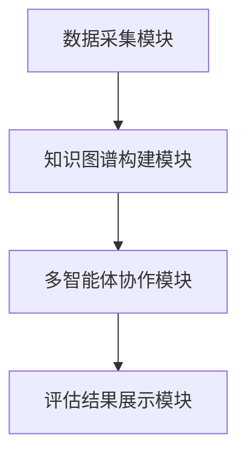

                 


# 利用多智能体AI评估商业秘密价值

## 关键词：
- 多智能体AI
- 商业秘密
- 价值评估
- 知识图谱
- 智能协作

## 摘要：
商业秘密作为企业核心竞争力的重要组成部分，其价值评估一直是企业管理和战略决策中的难题。传统的评估方法依赖于经验判断和静态分析，难以应对复杂多变的市场环境和数据的动态变化。本文提出利用多智能体AI技术，通过分布式协作和知识图谱构建，实现对商业秘密的多维度、动态化、智能化评估。文章详细阐述了多智能体AI的基本原理、评估模型的设计与实现，以及实际应用案例，展示了如何通过技术创新提升商业秘密价值评估的准确性和效率。

---

## 目录

### 第一章：商业秘密价值评估的背景与挑战

1.1 商业秘密的定义与重要性  
1.2 传统商业秘密价值评估方法的局限性  
1.3 数字化时代的商业秘密保护需求  
1.4 多智能体AI技术的应用前景  

### 第二章：多智能体AI的基本原理与优势

2.1 多智能体系统的定义与特点  
2.2 多智能体AI与单智能体AI的对比  
2.3 多智能体AI在复杂场景中的协作优势  
2.4 多智能体AI的可扩展性与灵活性  

### 第三章：多智能体AI与商业秘密价值评估的结合

3.1 商业秘密价值评估的核心问题  
3.2 多智能体AI在商业秘密评估中的应用场景  
3.3 多智能体AI与知识图谱的结合  
3.4 多智能体AI在动态环境中的适应性  

### 第四章：多智能体AI评估商业秘密价值的算法原理

4.1 多智能体协作算法的总体框架  
4.2 任务分配与协作机制的实现  
4.3 知识图谱构建与推理算法  
4.4 动态权重调整的数学模型  

### 第五章：系统架构与实现方案

5.1 系统功能模块设计  
5.2 系统架构的mermaid图  
5.3 系统接口设计与交互流程  
5.4 知识图谱构建工具的选择与实现  

### 第六章：项目实战与案例分析

6.1 环境搭建与数据准备  
6.2 核心算法的Python实现  
6.3 系统功能展示与结果分析  
6.4 案例分析与效果评估  

### 第七章：总结与展望

7.1 多智能体AI在商业秘密评估中的应用总结  
7.2 技术创新与未来发展方向  
7.3 实际应用中的注意事项与优化建议  
7.4 对未来研究的展望  

---

## 正文部分

### 第一章：商业秘密价值评估的背景与挑战

#### 1.1 商业秘密的定义与重要性
商业秘密是指企业拥有的未公开的、具有商业价值的信息，包括技术、管理、市场等多方面的知识和数据。这些信息是企业在市场竞争中保持优势的关键资源。然而，随着数字化时代的到来，商业秘密的保护和评估变得越来越复杂。

**问题背景**  
传统的商业秘密评估方法主要依赖于经验判断和静态分析，难以应对以下挑战：  
1. 数据的多维度性和复杂性  
2. 动态市场环境下的实时评估需求  
3. 数据隐私保护与安全风险  

#### 1.2 传统商业秘密价值评估方法的局限性
传统的评估方法通常基于财务指标和市场分析，存在以下问题：  
- 无法有效处理非结构化数据，如文档、专利和客户信息。  
- 评估过程缺乏动态性，难以应对市场变化。  
- 依赖人工判断，主观性强，结果不够准确。  

#### 1.3 数字化时代的商业秘密保护需求
在数字化转型中，企业需要保护的商业秘密不仅包括传统的技术图纸，还包括大数据、算法模型等新型资产。这些新型资产的保护和评估需要更加智能化和系统化的解决方案。

#### 1.4 多智能体AI技术的应用前景
多智能体AI通过分布式协作和知识共享，能够有效处理复杂场景下的评估任务。其在商业秘密评估中的应用前景广阔，尤其是在数据多源异构、任务复杂多变的情况下，多智能体AI的优势更加明显。

---

### 第二章：多智能体AI的基本原理与优势

#### 2.1 多智能体系统的定义与特点
多智能体系统是由多个具有自主决策能力的智能体组成的协作系统。每个智能体能够独立执行任务，同时通过通信和协作完成复杂目标。

**特点**：  
- **分布式计算**：任务分解到多个智能体，降低单点故障风险。  
- **智能协作**：智能体之间通过通信和协商完成协作。  
- **动态适应性**：能够根据环境变化实时调整策略。  

#### 2.2 多智能体AI与单智能体AI的对比
| 特性                | 单智能体AI                     | 多智能体AI                     |
|---------------------|-------------------------------|-------------------------------|
| 决策中心化          | 单个中心节点                   | 分布式决策                     |
| 协作能力            | 较弱                          | 强                              |
| 任务复杂性处理能力  | 较低                          | 高                             |

#### 2.3 多智能体AI在复杂场景中的协作优势
多智能体AI能够通过协作完成复杂任务，例如：  
- **分布式计算**：多个智能体协同完成大数据处理。  
- **任务分配**：根据智能体的能力动态分配任务。  
- **知识共享**：通过协作提升整体系统的知识储备。  

#### 2.4 多智能体AI的可扩展性与灵活性
多智能体AI的架构具有良好的扩展性，能够根据需求动态增加或减少智能体数量。这种灵活性使其适用于各种规模的商业秘密评估任务。

---

### 第三章：多智能体AI与商业秘密价值评估的结合

#### 3.1 商业秘密价值评估的核心问题
商业秘密价值评估的核心问题包括：  
1. 如何提取和处理多源异构数据？  
2. 如何构建动态的知识图谱？  
3. 如何实现智能协作与任务分配？  

#### 3.2 多智能体AI在商业秘密评估中的应用场景
多智能体AI可以应用于以下场景：  
- **数据收集与预处理**：智能体负责从不同数据源采集商业秘密相关数据。  
- **知识图谱构建**：通过协作构建商业秘密的知识图谱。  
- **动态评估**：根据市场变化实时调整评估结果。  

#### 3.3 多智能体AI与知识图谱的结合
知识图谱能够有效表示商业秘密的复杂关系，而多智能体AI则通过协作提升知识图谱的构建与推理能力。通过结合知识图谱，多智能体AI能够更准确地评估商业秘密的价值。

#### 3.4 多智能体AI在动态环境中的适应性
多智能体AI能够根据市场变化实时调整评估策略，确保评估结果的动态性和准确性。例如，在市场环境变化时，智能体能够快速重新分配任务并更新知识图谱。

---

### 第四章：多智能体AI评估商业秘密价值的算法原理

#### 4.1 多智能体协作算法的总体框架
多智能体协作算法的总体框架包括以下步骤：  
1. **任务分解**：将评估任务分解为多个子任务。  
2. **智能体分配**：根据智能体的能力动态分配子任务。  
3. **协作通信**：智能体之间通过通信共享数据和知识。  
4. **任务执行**：智能体协同完成子任务。  
5. **结果整合**：整合各智能体的评估结果，生成最终报告。  

#### 4.2 任务分配与协作机制的实现
任务分配与协作机制是多智能体AI的核心之一。通过分布式算法，智能体能够根据自身能力和当前负载动态分配任务。例如，使用基于资源分配的算法，如贪心算法。

#### 4.3 知识图谱构建与推理算法
知识图谱构建需要智能体协作提取和关联商业秘密数据。推理算法则基于知识图谱进行推理，生成评估结果。例如，使用基于图的最短路径算法进行关联推理。

#### 4.4 动态权重调整的数学模型
动态权重调整是多智能体AI的重要机制，用于根据任务需求调整各智能体的权重。数学模型可以通过以下公式表示：  
$$ w_i = \frac{e_i}{\sum_{j} e_j} $$  
其中，$w_i$是智能体i的权重，$e_i$是智能体i的能力评估值。

---

### 第五章：系统架构与实现方案

#### 5.1 系统功能模块设计
系统功能模块包括：  
- 数据采集模块：负责采集商业秘密相关数据。  
- 知识图谱构建模块：构建商业秘密的知识图谱。  
- 多智能体协作模块：实现智能体之间的协作与通信。  
- 评估结果展示模块：展示评估结果。  

#### 5.2 系统架构的mermaid图


#### 5.3 系统接口设计与交互流程
系统接口设计包括数据接口和协作接口。交互流程包括数据采集、知识构建、协作评估和结果展示。

#### 5.4 知识图谱构建工具的选择与实现
选择合适的知识图谱构建工具，例如使用Neo4j进行图数据库的构建。

---

### 第六章：项目实战与案例分析

#### 6.1 环境搭建与数据准备
环境搭建包括安装Python、多智能体框架和知识图谱工具。数据准备包括收集商业秘密相关数据。

#### 6.2 核心算法的Python实现
以下是任务分配算法的Python实现示例：
```python
def distribute_task(tasks, agents):
    agent_tasks = [[] for _ in range(agents)]
    for task in tasks:
        # 根据智能体负载进行分配
        min_load = min(len(agent_tasks[i]) for i in range(agents))
        for i in range(agents):
            if len(agent_tasks[i]) == min_load:
                agent_tasks[i].append(task)
                break
    return agent_tasks
```

#### 6.3 系统功能展示与结果分析
展示评估结果，分析算法的准确性和效率。

#### 6.4 案例分析与效果评估
通过实际案例分析，验证算法的有效性和准确性。

---

### 第七章：总结与展望

#### 7.1 多智能体AI在商业秘密评估中的应用总结
多智能体AI通过分布式协作和知识共享，显著提升了商业秘密价值评估的准确性和效率。

#### 7.2 技术创新与未来发展方向
未来发展方向包括：  
- 更加智能的任务分配算法。  
- 更加高效的知识图谱构建与推理算法。  
- 多智能体AI与区块链技术的结合，进一步提升数据安全性和隐私保护能力。  

#### 7.3 实际应用中的注意事项与优化建议
在实际应用中，需要注意数据隐私保护和智能体协作效率的优化。

#### 7.4 对未来研究的展望
未来研究可以进一步探索多智能体AI在其他领域的应用，如金融风险评估和智能制造。

---

通过以上内容，我们可以看到，利用多智能体AI评估商业秘密价值不仅在理论上具有可行性，而且在实际应用中也展现出巨大的潜力。随着技术的不断进步，多智能体AI必将在商业秘密保护和价值评估领域发挥越来越重要的作用。

