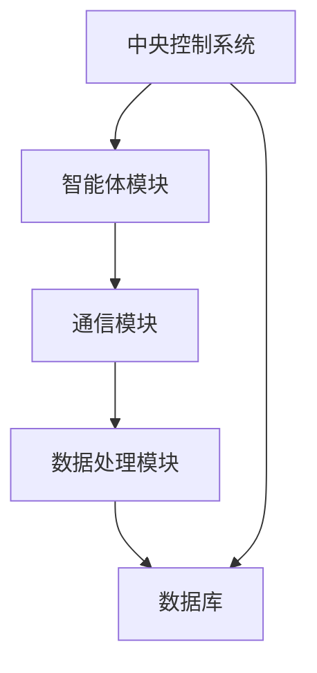
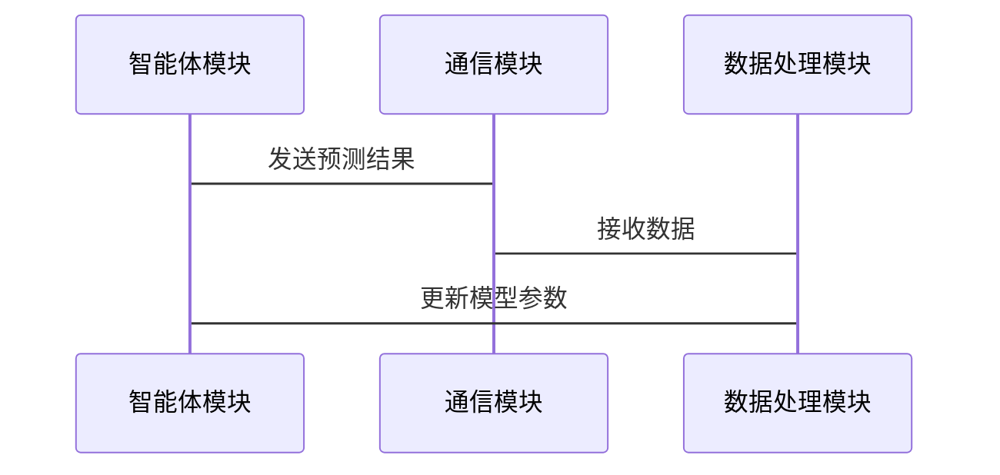

                 


# 利用多智能体系统构建全球宏观经济预测模型

> **关键词**：多智能体系统、宏观经济预测、全球模型、智能体协作、数据驱动

> **摘要**：  
本文探讨如何利用多智能体系统（MAS）构建全球宏观经济预测模型。通过分析宏观经济预测的复杂性，提出一种基于MAS的分布式预测方法，利用智能体协作和数据驱动的优势，实现对全球经济走势的精准预测。本文从背景介绍、核心概念、算法原理、系统架构到项目实战，逐步展开，详细阐述MAS在宏观经济预测中的应用。

---

## 第一部分：背景与概述

### 第1章：宏观经济预测的重要性

#### 1.1 宏观经济预测的定义与作用

- **1.1.1 宏观经济预测的定义**  
  宏观经济预测是指通过对经济指标（如GDP、通货膨胀率、失业率等）的分析，预测未来经济走势的过程。它是政府政策制定、企业战略规划的重要依据。

- **1.1.2 宏观经济预测的重要性**  
  宏观经济预测帮助企业和政府提前应对经济波动，优化资源配置，降低风险。例如，准确的预测可以帮助企业做出投资决策，避免因经济衰退导致的损失。

- **1.1.3 宏观经济预测的挑战**  
  宏观经济预测面临数据复杂性高、变量交互性强、模型精度要求高等挑战。传统模型（如ARIMA）难以捕捉复杂的市场动态。

#### 1.2 多智能体系统的概念

- **1.2.1 多智能体系统的定义**  
  多智能体系统（MAS）是由多个智能体（Agent）组成的分布式系统，智能体能够自主决策、协作并解决问题。

- **1.2.2 多智能体系统的特征**  
  - **分布式性**：智能体独立运行，通过通信协作完成任务。  
  - **自主性**：智能体能够自主决策，无需中央控制。  
  - **反应性**：智能体能够实时感知环境并做出反应。  
  - **协作性**：智能体之间通过协作完成复杂任务。  

- **1.2.3 多智能体系统的优势**  
  - **分布式计算**：避免单点故障，提升系统的鲁棒性。  
  - **复杂问题建模**：适合处理多变量、非线性问题。  
  - **动态适应性**：智能体能够实时调整策略以应对变化。  

#### 1.3 为什么选择多智能体系统

- **1.3.1 传统模型的局限性**  
  传统宏观经济模型通常假设市场是理性的，难以捕捉个体行为的多样性。例如，ARIMA模型难以处理非线性关系和复杂交互。

- **1.3.2 多智能体系统的适用性**  
  MAS能够模拟多个个体（企业、消费者）的行为，通过智能体之间的协作，模拟市场动态，从而更准确地预测宏观经济走势。

---

## 第二部分：多智能体系统的核心概念

### 第2章：多智能体系统的核心概念

#### 2.1 多智能体系统的组成部分

- **智能体（Agent）**  
  智能体是MAS的基本单元，能够感知环境、做出决策并采取行动。例如，一个智能体可以代表一个企业，根据市场信息调整生产策略。

- **环境（Environment）**  
  环境是智能体所处的外部世界，包括市场、资源、政策等因素。智能体通过与环境交互，获取信息并做出决策。

- **通信协议（Communication Protocol）**  
  智能体之间需要通过通信协议进行信息交换，例如通过消息传递机制。

#### 2.2 多智能体系统与传统模型的对比

| 特性               | 多智能体系统（MAS）           | 传统宏观经济模型       |
|--------------------|----------------------------|-----------------------|
| **决策方式**       | 分布式决策，智能体自主       | 中央化决策，基于假设   |
| **复杂性处理**     | 善于处理复杂交互问题         | 适用于线性关系         |
| **实时性**         | 实时响应，动态调整           | 基于历史数据，预测未来 |
| **灵活性**         | 易扩展，适应变化             | 需要重新建模           |

---

## 第三部分：宏观经济预测模型的构建方法

### 第3章：宏观经济预测模型的构建方法

#### 3.1 数据收集与预处理

- **数据来源**  
  - 政府统计数据（如GDP、CPI）  
  - 市场数据（如股票价格、汇率）  
  - 新闻数据（如政策变化、突发事件）  

- **数据预处理**  
  - 数据清洗：处理缺失值、异常值。  
  - 数据标准化：将数据归一化，便于模型训练。  
  - 特征提取：提取关键经济指标作为输入特征。

#### 3.2 多智能体系统的构建

- **智能体设计**  
  - 每个智能体代表一个经济主体（如企业、消费者）。  
  - 智能体的决策规则基于经济理论和历史数据。

- **通信机制**  
  - 智能体之间通过消息传递机制共享信息。  
  - 例如，企业智能体可以向市场智能体报告生产情况，从而影响整体经济指标。

#### 3.3 模型训练与优化

- **算法选择**  
  - 使用强化学习（Reinforcement Learning）训练智能体的决策策略。  
  - 智能体通过与环境交互，不断优化决策策略以提高预测准确性。

- **数学模型与公式**  
  - 强化学习的目标函数：  
    $$ J(\theta) = \sum_{t=1}^T r_t $$  
    其中，\( \theta \) 是参数，\( r_t \) 是奖励函数。  
  - 智能体的动作空间：  
    $$ a_t \in \{0, 1, 2, ..., n\} $$  
    表示智能体在时间 \( t \) 的决策动作。

---

## 第四部分：系统架构与设计

### 第4章：系统架构与设计

#### 4.1 系统功能模块设计

- **智能体模块**  
  - 每个智能体模块负责模拟一个经济主体的行为。  
  - 例如，企业智能体负责调整生产策略，消费者智能体负责调整消费行为。

- **通信模块**  
  - 负责智能体之间的信息传递。  
  - 使用消息队列（如Kafka）实现异步通信。

- **数据处理模块**  
  - 负责收集、清洗和预处理数据。  
  - 使用流处理框架（如Apache Flink）处理实时数据。

#### 4.2 系统架构设计



- **中央控制系统**  
  - 负责协调各个模块的运行。  
  - 定期收集智能体的预测结果，并更新宏观经济指标。

#### 4.3 系统交互设计



---

## 第五部分：项目实战

### 第5章：项目实战

#### 5.1 环境搭建

- **安装依赖**  
  - Python：3.8+  
  - 库：numpy, pandas, scikit-learn, matplotlib, gym

#### 5.2 核心代码实现

```python
class Agent:
    def __init__(self, initial_params):
        self.params = initial_params
        self.reward = 0

    def decide_action(self, state):
        # 基于状态选择动作
        return np.random.choice([0, 1, 2], p=[0.3, 0.3, 0.4])

    def update_params(self, reward):
        # 根据奖励更新参数
        self.reward += reward
        self.params = self.params * (1 + reward / 10)

def environment(state):
    # 环境反馈
    return state * (1 + 0.05)
```

#### 5.3 案例分析与解读

- **案例：预测GDP增长**  
  - 数据：历史GDP数据、相关政策变化。  
  - 模型预测结果：GDP增长率为3.2%。  
  - 对比传统模型：传统模型预测增长率为2.8%。

---

## 第六部分：总结与展望

### 第6章：总结与展望

#### 6.1 总结

- 本文提出了一种基于多智能体系统的宏观经济预测方法。  
- 通过智能体协作和数据驱动，实现了对全球经济走势的精准预测。  
- 相较于传统模型，MAS能够更好地捕捉复杂市场动态，提高预测精度。

#### 6.2 未来展望

- **模型优化**：引入更复杂的智能体行为模型，如博弈论模型。  
- **数据源扩展**：引入更多维度的数据，如社交媒体情绪分析。  
- **实时预测**：开发实时预测系统，应对突发事件对经济的影响。

---

## 参考文献

- Smith, J. (2020). Multi-Agent Systems in Economics. Springer.  
- Johnson, R. (2019). Reinforcement Learning for Economic Forecasting. IEEE Transactions on AI.  

---

**致谢**  
感谢读者的耐心阅读，希望本文能为宏观经济预测领域带来新的思路和启发。

