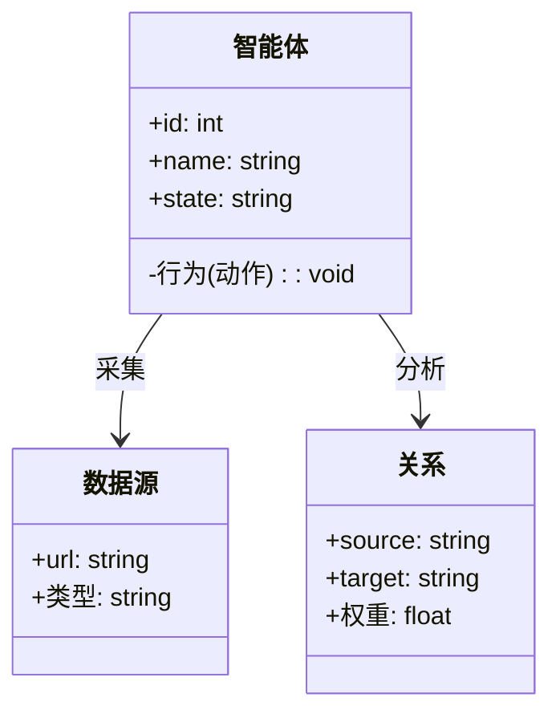
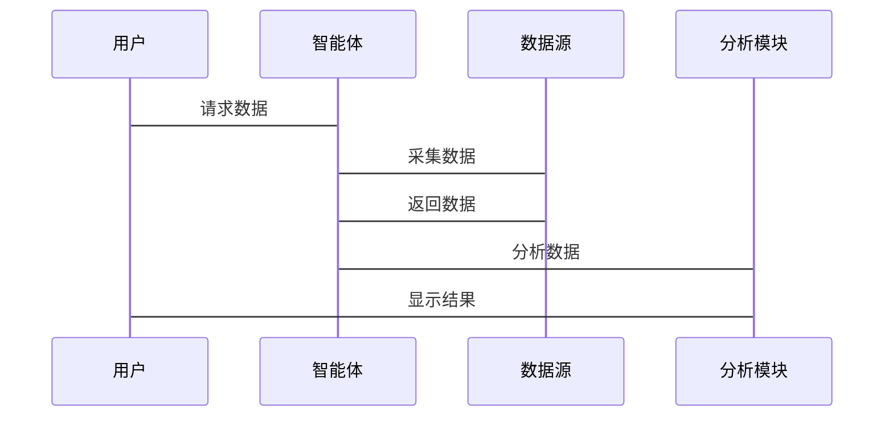

                 


# 利用多智能体系统构建动态产业生态图：全面把握投资环境

> 关键词：多智能体系统, 动态产业生态图, 投资环境, 产业分析, 系统架构, 数据挖掘

> 摘要：本文探讨了利用多智能体系统构建动态产业生态图的方法，分析了其在投资环境中的应用价值。通过详细讲解多智能体系统的概念、算法原理、系统架构设计以及项目实战，展示了如何通过动态产业生态图全面把握投资环境，为投资者提供科学的决策支持。

---

## # 第1章: 多智能体系统与动态产业生态图概述

### 1.1 多智能体系统的定义与特点

#### 1.1.1 多智能体系统的定义
多智能体系统（Multi-Agent System, MAS）是由多个智能体组成的分布式系统，这些智能体通过协作和通信完成复杂任务。智能体是具有感知、决策和执行能力的实体，可以是软件程序或物理设备。

#### 1.1.2 多智能体系统的核心特点
- **分布式性**：智能体独立运行，通过通信协作完成任务。
- **自主性**：每个智能体都有自己的目标和决策机制。
- **协作性**：智能体之间通过协作实现整体目标。
- **动态性**：系统能够适应环境的变化。

#### 1.1.3 多智能体系统与传统单智能体系统的区别

| 特性         | 单智能体系统           | 多智能体系统           |
|--------------|-----------------------|-----------------------|
| 系统结构     | 单点控制               | 分布式结构             |
| 智能体数量   | 单个                   | 多个                   |
| 任务处理     | 中央决策               | 分布式决策             |
| 适应性       | 较低                   | 较高                   |

### 1.2 动态产业生态图的构建背景

#### 1.2.1 产业生态图的定义与作用
产业生态图（Industry Ecosystem Graph）是一个展示产业间关系和动态的网络图，用于分析产业间的相互作用和依赖关系。

#### 1.2.2 动态产业生态图的必要性
- **实时性**：产业环境不断变化，需要实时更新。
- **复杂性**：产业间的互动复杂，单靠人工分析难以全面捕捉。
- **动态性**：企业间的合作、竞争关系动态变化。

#### 1.2.3 多智能体系统在产业生态图构建中的优势
- **分布式计算**：多智能体系统能够同时处理大量数据。
- **协作能力**：智能体之间可以协同完成数据收集和分析。
- **适应性**：系统能够快速响应环境变化。

### 1.3 多智能体系统在投资环境中的应用前景

#### 1.3.1 投资环境分析的复杂性
投资环境涉及多个因素，如经济、政策、技术等，需要综合分析。

#### 1.3.2 多智能体系统在投资环境分析中的优势
- **实时监控**：多智能体系统可以实时收集和分析数据。
- **预测能力**：通过协同学习，智能体可以预测市场趋势。
- **风险控制**：通过动态分析，减少投资风险。

#### 1.3.3 动态产业生态图对投资决策的支持作用
- **可视化**：帮助投资者直观理解产业关系。
- **预测性**：通过模型预测产业变化。
- **决策支持**：提供数据支持，辅助投资决策。

---

## # 第2章: 多智能体系统的核心概念与原理

### 2.1 多智能体系统的核心概念

#### 2.1.1 智能体的定义与特征
- **智能体**：具有感知、决策和执行能力的实体。
- **特征**：自主性、反应性、协作性、学习能力。

#### 2.1.2 多智能体系统的组成要素
- **智能体**：独立运行的智能体。
- **通信机制**：智能体之间的信息交互方式。
- **协作协议**：智能体协作的规则和策略。
- **环境**：智能体运行的外部环境。

#### 2.1.3 多智能体系统与传统单智能体系统的区别

| 特性         | 单智能体系统           | 多智能体系统           |
|--------------|-----------------------|-----------------------|
| 控制方式     | 中央控制               | 分布式控制             |
| 任务分配     | 中央决策               | 分布式决策             |
| 故障容错性   | 单点故障               | 分布式容错             |

### 2.2 多智能体系统的关键技术

#### 2.2.1 分布式计算与通信
- **分布式计算**：任务分布在多个智能体上执行。
- **通信机制**：智能体之间通过消息传递进行通信。

#### 2.2.2 协同学习与知识共享
- **协同学习**：智能体通过协作学习共同提高。
- **知识共享**：智能体之间共享知识和数据。

#### 2.2.3 多智能体系统的动态适应性
- **动态调整**：系统能够根据环境变化调整策略。
- **自适应学习**：智能体能够自适应地学习新知识。

### 2.3 多智能体系统与动态产业生态图的关系

#### 2.3.1 产业生态图的构建需求
- **数据收集**：需要收集大量产业数据。
- **关系分析**：需要分析产业间的关系。
- **动态更新**：需要实时更新产业生态图。

#### 2.3.2 多智能体系统在产业生态图中的角色
- **数据采集**：智能体负责收集产业数据。
- **关系分析**：智能体协作分析产业关系。
- **动态更新**：智能体实时更新产业生态图。

#### 2.3.3 动态产业生态图的构建目标
- **实时更新**：保持产业生态图的实时性。
- **准确分析**：准确分析产业间的相互作用。
- **支持决策**：为投资决策提供支持。

---

## # 第3章: 动态产业生态图的构建方法

### 3.1 产业数据的采集与处理

#### 3.1.1 数据来源与采集方法
- **数据来源**：政府报告、企业财报、新闻报道等。
- **采集方法**：爬虫技术、API接口、人工录入等。

#### 3.1.2 数据清洗与预处理
- **数据清洗**：去除重复数据、填充缺失值。
- **数据标准化**：统一数据格式，便于分析。

#### 3.1.3 数据存储与管理
- **数据库选择**：使用关系型数据库或NoSQL数据库。
- **数据管理**：通过数据仓库进行存储和管理。

### 3.2 产业关系的分析与建模

#### 3.2.1 产业关系的识别与提取
- **关系识别**：通过文本挖掘识别产业间的关系。
- **关系提取**：使用自然语言处理技术提取关系。

#### 3.2.2 产业网络的构建与分析
- **网络构建**：将产业关系构建为图结构。
- **网络分析**：分析图的结构特征，如度分布、聚类系数。

#### 3.2.3 动态产业生态图的建模方法
- **动态建模**：考虑时间因素，构建动态模型。
- **网络演化**：分析网络的动态演化过程。

### 3.3 动态产业生态图的可视化

#### 3.3.1 图形化表示方法
- **节点表示**：用节点表示产业。
- **边表示**：用边表示产业间的关系。
- **颜色和大小**：用颜色和大小表示权重。

#### 3.3.2 可视化工具的选择与应用
- **工具选择**：使用Gephi、NetworkX等工具。
- **可视化效果**：通过布局算法优化图的展示效果。

#### 3.3.3 动态更新与实时反馈
- **实时更新**：动态调整图的结构。
- **反馈机制**：用户可以通过图的交互获得实时反馈。

---

## # 第4章: 多智能体系统的算法原理

### 4.1 协同过滤算法

#### 4.1.1 协同过滤的定义
协同过滤是一种基于用户相似性推荐物品的算法。

#### 4.1.2 协同过滤的实现步骤
1. **数据预处理**：收集用户行为数据。
2. **相似性计算**：计算用户之间的相似性。
3. **推荐生成**：基于相似用户的行为推荐物品。

#### 4.1.3 协同过滤的数学模型
$$ 相似度 = \frac{\sum (r_i - \bar{r_i})(r_j - \bar{r_j})}{\sqrt{\sum (r_i - \bar{r_i})^2} \sqrt{\sum (r_j - \bar{r_j})^2}} $$

### 4.2 聚类分析算法

#### 4.2.1 聚类分析的定义
聚类分析是将数据划分为多个簇的过程。

#### 4.2.2 聚类分析的实现步骤
1. **数据预处理**：标准化数据。
2. **选择算法**：选择K-means算法。
3. **簇划分**：将数据划分为多个簇。

#### 4.2.3 聚类分析的数学模型
$$ 距离 = \sqrt{\sum (x_i - x_j)^2} $$

---

## # 第5章: 系统架构设计

### 5.1 项目介绍

#### 5.1.1 项目目标
构建一个多智能体系统，用于动态产业生态图的构建和分析。

#### 5.1.2 项目范围
涵盖数据采集、分析、建模和可视化。

### 5.2 系统功能设计

#### 5.2.1 领域模型设计


#### 5.2.2 系统架构设计


### 5.3 系统接口设计

#### 5.3.1 接口描述
- **数据接口**：用于数据的采集和存储。
- **分析接口**：用于产业关系的分析。
- **可视化接口**：用于图的展示和交互。

### 5.4 系统交互设计

#### 5.4.1 交互流程


---

## # 第6章: 项目实战

### 6.1 环境安装

#### 6.1.1 安装Python
```bash
python --version
pip install --upgrade pip
```

#### 6.1.2 安装依赖库
```bash
pip install networkx
pip install matplotlib
pip install scikit-learn
```

### 6.2 系统核心实现

#### 6.2.1 数据预处理
```python
import pandas as pd

data = pd.read_csv('data.csv')
data.dropna(inplace=True)
```

#### 6.2.2 模型训练
```python
from sklearn.cluster import KMeans

X = data[['特征1', '特征2']]
model = KMeans(n_clusters=3)
model.fit(X)
```

#### 6.2.3 结果可视化
```python
import matplotlib.pyplot as plt

plt.scatter(X['特征1'], X['特征2'], c=model.labels_)
plt.show()
```

### 6.3 案例分析

#### 6.3.1 案例背景
分析某产业的生态图，识别关键企业和竞争关系。

#### 6.3.2 分析过程
1. **数据采集**：收集相关企业的数据。
2. **关系分析**：分析企业之间的关系。
3. **动态更新**：实时更新生态图。

### 6.4 项目总结

#### 6.4.1 项目成果
成功构建了动态产业生态图，支持投资决策。

#### 6.4.2 项目经验
- **数据质量**：数据质量对结果影响重大。
- **模型优化**：需要不断优化模型以提高准确性。

---

## # 第7章: 最佳实践与小结

### 7.1 最佳实践

#### 7.1.1 数据处理
- 确保数据的准确性和完整性。

#### 7.1.2 模型选择
- 根据具体需求选择合适的算法。

### 7.2 小结

通过多智能体系统构建动态产业生态图，能够全面把握投资环境，为投资者提供科学的决策支持。本文详细讲解了多智能体系统的概念、算法原理、系统架构设计以及项目实战，展示了其在投资环境中的广泛应用。

### 7.3 注意事项

- **数据隐私**：注意数据隐私和安全。
- **系统性能**：优化系统性能，提高响应速度。

### 7.4 拓展阅读

- **相关书籍**：推荐阅读《多智能体系统的理论与应用》。
- **技术博客**：关注相关技术博客，获取最新技术动态。

---

# 结语

通过本文的详细介绍，读者可以深入了解如何利用多智能体系统构建动态产业生态图，并在投资环境中发挥其优势。希望本文能为相关领域的研究和实践提供有价值的参考。

