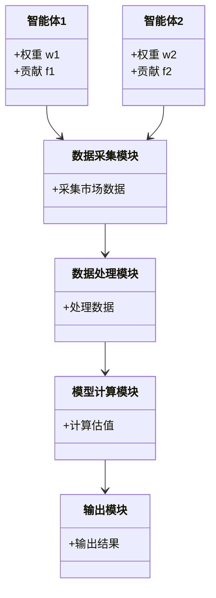
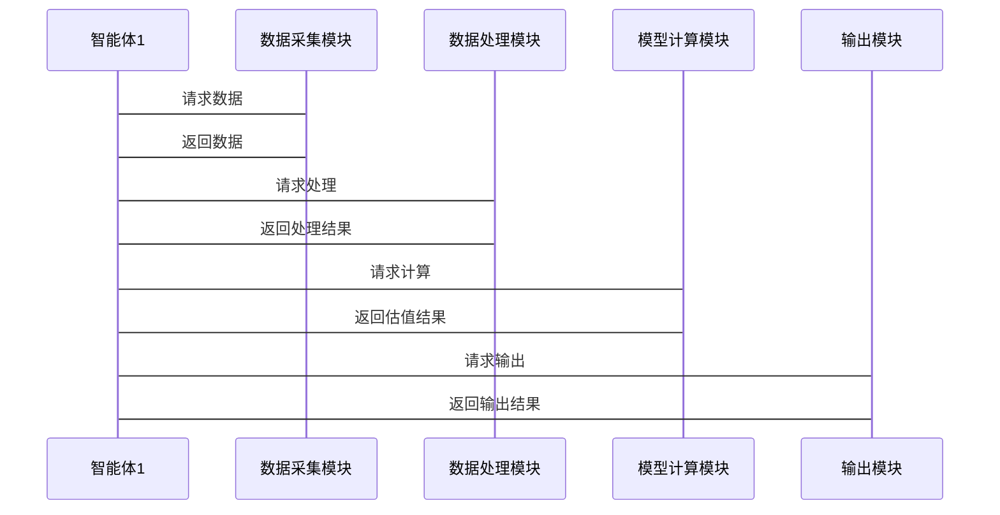

                 


# 利用多智能体系统构建动态估值模型：适应市场变化

> 关键词：多智能体系统，动态估值模型，市场变化，系统架构，算法原理，项目实战

> 摘要：本文详细探讨了如何利用多智能体系统构建动态估值模型，以适应市场变化。文章从背景介绍、核心概念、算法原理、系统架构设计、项目实战到最佳实践，全面阐述了利用多智能体系统构建动态估值模型的各个方面。通过实际案例分析和详细的技术解读，帮助读者理解和掌握如何在复杂多变的市场环境中，利用多智能体系统动态调整估值模型，实现更精准的估值和决策支持。

---

# 第一部分: 多智能体系统与动态估值模型概述

## 第1章: 多智能体系统与动态估值模型的背景介绍

### 1.1 多智能体系统的概念与特点
#### 1.1.1 多智能体系统的定义
多智能体系统（Multi-Agent System, MAS）是由多个智能体（Agent）组成的分布式系统，这些智能体能够通过协作完成复杂的任务。每个智能体都有一定的自主性、目标导向性和反应性。

#### 1.1.2 多智能体系统的核心特点
1. **自主性**：智能体能够独立决策和行动。
2. **反应性**：智能体能够根据环境变化调整行为。
3. **协作性**：多个智能体通过协作完成复杂任务。
4. **分布性**：智能体之间通过分布式通信和协调完成任务。

#### 1.1.3 多智能体系统的应用场景
- 智能交通管理
- 智能电网
- 金融市场中的动态估值
- 多人在线游戏中的智能NPC

### 1.2 动态估值模型的定义与必要性
#### 1.2.1 动态估值模型的定义
动态估值模型是一种能够根据市场环境的变化，实时调整估值方法和参数的模型。其核心在于能够快速适应市场波动，提供准确的估值结果。

#### 1.2.2 动态估值模型的必要性
1. **市场环境的复杂性**：金融市场中的价格、需求、供给等变量不断变化，传统的静态估值模型难以适应。
2. **数据的实时性要求**：动态估值模型需要实时处理大量的动态数据，以提供及时的估值结果。
3. **决策的实时性要求**：在金融交易中，决策需要基于最新的估值结果，延迟会导致决策失误。

#### 1.2.3 动态估值模型的实现挑战
1. **数据的实时更新**：如何高效处理和更新动态数据。
2. **模型的实时调整**：如何根据数据变化快速调整模型参数。
3. **系统的可扩展性**：如何在数据量和计算复杂度增加时保持系统的高效运行。

### 1.3 市场变化对估值模型的影响
#### 1.3.1 市场变化的复杂性
市场变化可能是由多种因素引起的，例如政策变化、经济波动、突发事件等。这些变化往往具有不确定性，对估值模型提出了更高的要求。

#### 1.3.2 传统估值模型的局限性
传统的静态估值模型难以应对市场的快速变化，可能导致估值结果滞后或不准确，进而影响决策的准确性。

#### 1.3.3 动态估值模型的适应性优势
动态估值模型能够实时感知市场变化，快速调整估值方法和参数，从而提供更准确的估值结果，支持更及时的决策。

---

## 第2章: 多智能体系统的核心概念与联系

### 2.1 多智能体系统的原理
#### 2.1.1 多智能体系统的组成要素
1. **智能体**：具有自主性、目标导向性和反应性的实体。
2. **环境**：智能体所处的外部环境，包括物理环境和信息环境。
3. **通信机制**：智能体之间进行信息交换的方式。
4. **协作机制**：智能体之间通过协作完成复杂任务的方式。

#### 2.1.2 多智能体系统的通信机制
- **直接通信**：智能体之间通过消息传递进行通信。
- **间接通信**：通过共享信息或中间件进行通信。

#### 2.1.3 多智能体系统的协作机制
- **任务分配**：智能体根据自身能力和目标分配任务。
- **协调与同步**：智能体之间通过协调和同步确保任务的顺利执行。
- **冲突解决**：智能体在协作过程中可能出现冲突，需要通过协商或仲裁机制解决。

### 2.2 动态估值模型的构建原理
#### 2.2.1 动态估值模型的输入与输出
- **输入**：动态数据流，包括价格、需求、供给、市场情绪等。
- **输出**：实时估值结果，包括价格预测、资产价值评估等。

#### 2.2.2 动态估值模型的数学表达
动态估值模型可以通过以下公式表示：
$$ V(t) = \sum_{i=1}^{n} w_i \cdot f_i(t) $$
其中，$V(t)$ 表示时间 $t$ 的估值，$w_i$ 表示第 $i$ 个智能体的权重，$f_i(t)$ 表示第 $i$ 个智能体在时间 $t$ 的贡献。

#### 2.2.3 动态估值模型的更新机制
动态估值模型的更新机制可以通过以下步骤实现：
1. 数据采集：实时采集市场数据。
2. 数据处理：对数据进行清洗和预处理。
3. 模型更新：根据最新数据调整模型参数。
4. 估值输出：计算并输出实时估值结果。

### 2.3 多智能体系统与动态估值模型的关联
#### 2.3.1 多智能体系统在动态估值中的作用
- **数据采集**：智能体实时采集市场数据。
- **数据处理**：智能体对数据进行分析和处理。
- **模型更新**：智能体协同更新动态估值模型。

#### 2.3.2 动态估值模型对多智能体系统的反馈影响
- **估值结果的反馈**：动态估值结果可以作为智能体的决策依据。
- **模型优化的反馈**：动态估值模型的优化可以提升智能体的协作效率。

#### 2.3.3 多智能体系统与动态估值模型的协同优化
- **协同优化的目标**：通过多智能体系统的协作，实现动态估值模型的实时更新和优化。
- **协同优化的实现**：智能体之间通过通信和协作，共同优化动态估值模型的参数和结构。

---

## 第3章: 动态估值模型的算法原理

### 3.1 动态估值模型的数学模型
#### 3.1.1 基于多智能体的动态估值公式
动态估值模型的数学公式可以表示为：
$$ V(t) = \sum_{i=1}^{n} w_i \cdot f_i(t) $$
其中，$w_i$ 是第 $i$ 个智能体的权重，$f_i(t)$ 是第 $i$ 个智能体在时间 $t$ 的贡献。

#### 3.1.2 动态权重的计算方法
权重的计算可以通过以下公式实现：
$$ w_i(t) = \frac{e^{a \cdot f_i(t)}}{\sum_{j=1}^{n} e^{a \cdot f_j(t)}} $$
其中，$a$ 是一个调节参数，用于控制权重的分布。

### 3.2 动态估值模型的实现算法
#### 3.2.1 算法流程图
```mermaid
graph TD
    A[开始] -> B[初始化权重]
    B -> C[采集市场数据]
    C -> D[计算智能体贡献]
    D -> E[更新权重]
    E -> F[计算估值]
    F -> G[输出估值结果]
    G -> H[结束]
```

#### 3.2.2 算法实现步骤
1. 初始化权重：为每个智能体分配初始权重。
2. 采集市场数据：实时采集市场数据。
3. 计算智能体贡献：根据市场数据计算每个智能体的贡献值。
4. 更新权重：根据贡献值调整智能体的权重。
5. 计算估值：根据权重和贡献值计算动态估值。
6. 输出估值结果：将估值结果输出到系统或用户。

### 3.3 动态估值模型的优化方法
#### 3.3.1 基于多智能体的优化策略
- **分布式优化**：智能体之间通过分布式计算优化动态估值模型。
- **协作优化**：智能体之间通过协作优化模型参数。

#### 3.3.2 基于反馈的优化方法
- **反馈机制**：根据估值结果的反馈调整模型参数。
- **自适应优化**：模型能够根据反馈自动调整参数。

---

## 第4章: 系统架构设计

### 4.1 系统功能设计
#### 4.1.1 功能模块划分
1. 数据采集模块：负责采集市场数据。
2. 数据处理模块：负责处理和预处理数据。
3. 模型计算模块：负责计算动态估值。
4. 输出模块：负责输出估值结果。

#### 4.1.2 功能流程图
```mermaid
graph TD
    A[数据采集] -> B[数据处理]
    B -> C[模型计算]
    C -> D[输出结果]
```

### 4.2 系统架构设计
#### 4.2.1 系统架构图


#### 4.2.2 系统接口设计
- **数据接口**：智能体与数据采集模块之间的接口。
- **计算接口**：智能体与模型计算模块之间的接口。
- **输出接口**：模型计算模块与输出模块之间的接口。

### 4.3 系统交互设计
#### 4.3.1 系统交互流程图


---

## 第5章: 项目实战

### 5.1 项目环境安装
#### 5.1.1 系统需求
- 操作系统：Windows 10 或更高版本，或 Linux 系统。
- Python 版本：Python 3.8 或更高版本。
- 依赖库：numpy、pandas、scikit-learn、matplotlib。

#### 5.1.2 安装步骤
```bash
pip install numpy pandas scikit-learn matplotlib
```

### 5.2 系统核心实现
#### 5.2.1 智能体类的实现
```python
class Agent:
    def __init__(self, weight):
        self.weight = weight
        self.contribution = 0

    def calculate_contribution(self, data):
        # 根据数据计算贡献值
        pass
```

#### 5.2.2 动态估值模型的实现
```python
class DynamicValuationModel:
    def __init__(self, agents):
        self.agents = agents

    def update_weights(self, data):
        # 根据数据更新权重
        pass

    def calculate_valuation(self):
        # 计算估值
        pass
```

### 5.3 代码应用解读与分析
#### 5.3.1 数据采集与处理
```python
import pandas as pd

def collect_data():
    # 采集市场数据
    data = pd.read_csv('market_data.csv')
    return data

def process_data(data):
    # 数据处理
    data_processed = data.dropna()
    return data_processed
```

#### 5.3.2 动态估值计算
```python
def calculate_valuation(data_processed, agents):
    # 计算每个智能体的贡献值
    contributions = [agent.calculate_contribution(data_processed) for agent in agents]
    # 更新权重
    total = sum(contributions)
    for i in range(len(agents)):
        agents[i].weight = contributions[i] / total
    # 计算估值
    valuation = sum([agent.weight * agent.contribution for agent in agents])
    return valuation
```

### 5.4 实际案例分析
#### 5.4.1 案例背景
假设我们有一个由两个智能体组成的多智能体系统，分别负责采集和处理市场数据。

#### 5.4.2 案例实现
```python
# 初始化智能体
agent1 = Agent(0.5)
agent2 = Agent(0.5)
agents = [agent1, agent2]

# 采集数据
data = collect_data()

# 处理数据
data_processed = process_data(data)

# 计算估值
valuation = calculate_valuation(data_processed, agents)

# 输出结果
print(valuation)
```

#### 5.4.3 案例分析
通过上述案例，我们可以看到动态估值模型是如何通过多智能体系统的协作，实现实时估值的。

---

## 第6章: 最佳实践

### 6.1 小结
- 多智能体系统能够有效支持动态估值模型的构建和优化。
- 动态估值模型需要根据市场变化实时调整参数和结构。

### 6.2 注意事项
- 确保数据采集的实时性和准确性。
- 定期优化模型参数，以适应市场变化。
- 处理多智能体系统中的冲突和协作问题。

### 6.3 拓展阅读
- 推荐阅读《Multi-Agent Systems: Algorithmic, Complexity Theoretic, and Game Theoretic Foundations》。
- 推荐学习动态时间窗下的多智能体协作优化方法。

---

通过以上内容，我们详细探讨了利用多智能体系统构建动态估值模型的各个方面，包括背景介绍、核心概念、算法原理、系统架构设计、项目实战和最佳实践。希望本文能够为读者提供有价值的技术见解和实践指导。

