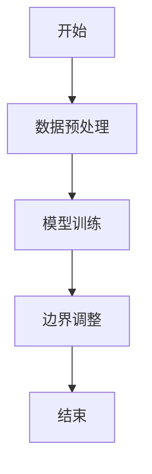
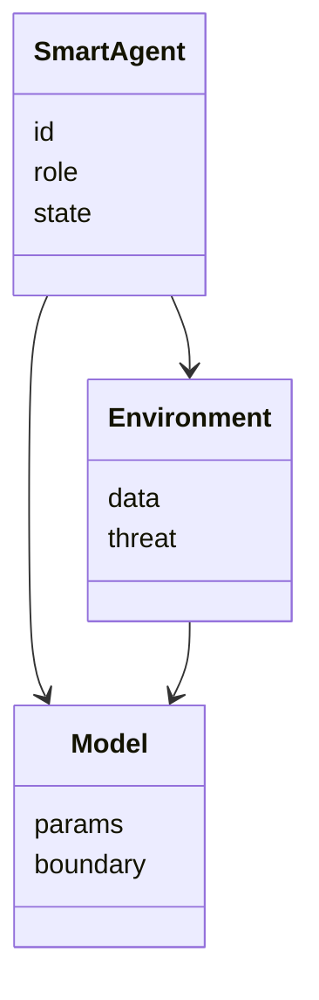
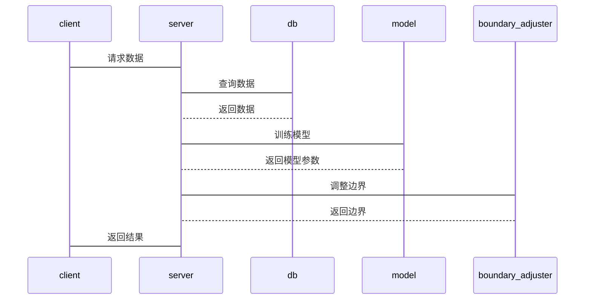

                 


# 利用多智能体系统构建动态安全边际模型

## 关键词：多智能体系统、动态安全边际模型、网络安全、自动驾驶、协同优化、系统架构

## 摘要：
本文详细探讨了如何利用多智能体系统构建动态安全边际模型。首先介绍了多智能体系统的基本概念和动态安全边际模型的定义，分析了两者的联系与区别。接着，深入讲解了动态安全边际模型的构建原理、算法流程和数学模型，结合实际案例展示了其在网络安全和自动驾驶等领域的应用。最后，通过系统架构设计和项目实战，详细阐述了如何实现动态安全边际模型，并给出了优化建议和未来研究方向。

---

# 第1章: 多智能体系统与动态安全边际模型概述

## 1.1 多智能体系统的概念与特点

### 1.1.1 多智能体系统的定义
多智能体系统（Multi-Agent System, MAS）是由多个智能体（Agent）组成的分布式系统，这些智能体能够通过通信和协作完成复杂任务。

### 1.1.2 多智能体系统的特征
| 特性 | 描述 |
|------|------|
| 分布性 | 智能体独立运行，无中心节点 |
| 协作性 | 智能体通过通信协作完成任务 |
| 动态性 | 系统环境和智能体状态动态变化 |
| 社会性 | 智能体具有社会性，能够相互影响 |

### 1.1.3 多智能体系统的应用场景
- **网络安全**：检测和防御攻击行为
- **自动驾驶**：车辆间的协同决策
- **智能交通**：优化交通流量

## 1.2 动态安全边际模型的定义与特点

### 1.2.1 动态安全边际模型的定义
动态安全边际模型（Dynamic Security Boundary Model, DSBM）是一种能够根据环境变化动态调整安全边界的数学模型。

### 1.2.2 动态安全边际模型的动态性
动态安全边际模型能够根据实时数据调整边界范围，具有自适应能力。

### 1.2.3 动态安全边际模型的核心要素
- **安全边界**：系统的保护范围
- **动态调整机制**：根据威胁变化调整边界
- **评估指标**：量化边界的合理性

## 1.3 多智能体系统与动态安全边际模型的关系

### 1.3.1 多智能体系统在安全边际模型中的作用
- **数据采集**：智能体收集环境数据
- **协同决策**：智能体共同调整边界

### 1.3.2 动态安全边际模型的构建过程
1. 数据采集与预处理
2. 模型训练与优化
3. 边界调整与反馈

### 1.3.3 多智能体系统与动态安全边际模型的结合
- **协同优化**：多智能体协同调整安全边界
- **实时反馈**：动态调整模型参数

## 1.4 本章小结
本章介绍了多智能体系统和动态安全边际模型的基本概念、特点及应用场景，为后续内容奠定了基础。

---

# 第2章: 多智能体系统与动态安全边际模型的核心概念

## 2.1 多智能体系统的原理

### 2.1.1 多智能体系统的通信机制
- **异步通信**：智能体之间异步交换信息
- **同步通信**：智能体同时交换信息

### 2.1.2 多智能体系统的协同机制
- **任务分配**：智能体根据能力分配任务
- **协作规划**：智能体共同制定协作计划

### 2.1.3 多智能体系统的决策机制
- **分布式决策**：每个智能体独立决策
- **集中式决策**：由中心节点统一决策

## 2.2 动态安全边际模型的原理

### 2.2.1 动态安全边际模型的构建方法
1. 数据采集与预处理
2. 模型训练与优化
3. 边界调整与反馈

### 2.2.2 动态安全边际模型的更新机制
- **实时更新**：根据最新数据调整边界
- **周期性更新**：定期更新模型参数

### 2.2.3 动态安全边际模型的评估方法
- **准确率评估**：模型对边界的预测准确性
- **鲁棒性评估**：模型在异常情况下的表现

## 2.3 多智能体系统与动态安全边际模型的联系

### 2.3.1 多智能体系统在动态安全边际模型中的作用
- **数据采集**：智能体收集环境数据
- **协同决策**：智能体共同调整边界

### 2.3.2 动态安全边际模型对多智能体系统的优化
- **自适应调整**：模型动态优化智能体行为
- **协同优化**：模型帮助智能体协同工作

## 2.4 本章小结
本章深入分析了多智能体系统和动态安全边际模型的核心概念及其相互关系，为后续算法实现提供了理论基础。

---

# 第3章: 动态安全边际模型的算法原理

## 3.1 算法原理概述

### 3.1.1 算法的基本思想
动态安全边际模型通过多智能体协同优化，动态调整安全边界。

### 3.1.2 算法的输入输出
- **输入**：环境数据、威胁信息
- **输出**：动态调整的安全边界

## 3.2 算法实现步骤

### 3.2.1 数据预处理
```python
def preprocess(data):
    # 数据清洗和特征提取
    return processed_data
```

### 3.2.2 模型训练
```python
import numpy as np

def train_model(data):
    # 训练模型，返回模型参数
    return model_params
```

### 3.2.3 边界调整
```python
def adjust_boundary(model_params, data):
    # 根据模型参数和实时数据调整边界
    return boundary
```

## 3.3 算法的数学模型

### 3.3.1 模型优化目标
$$ \min_{x} \frac{1}{2}x^TQx + c^Tx + d $$

### 3.3.2 约束条件
$$ Ax \leq b $$

## 3.4 算法流程图（Mermaid）



## 3.5 本章小结
本章详细讲解了动态安全边际模型的算法原理及实现步骤，为后续系统设计和项目实战奠定了基础。

---

# 第4章: 系统分析与架构设计

## 4.1 系统分析

### 4.1.1 项目背景
动态安全边际模型的应用场景包括网络安全、智能交通等。

### 4.1.2 系统功能需求
- **数据采集**：实时采集环境数据
- **模型训练**：训练动态安全边际模型
- **边界调整**：动态调整安全边界

## 4.2 系统架构设计

### 4.2.1 领域模型（Mermaid类图）


### 4.2.2 系统架构图（Mermaid架构图）


## 4.3 接口设计

### 4.3.1 API接口
- **数据接口**：提供环境数据接口
- **模型接口**：提供模型训练和调整接口

## 4.4 交互流程图（Mermaid序列图）


## 4.5 本章小结
本章通过系统分析和架构设计，明确了动态安全边际模型的实现框架和交互流程。

---

# 第5章: 项目实战

## 5.1 环境安装

### 5.1.1 安装Python环境
```bash
python -m pip install --upgrade pip
pip install numpy matplotlib scikit-learn
```

## 5.2 系统核心实现

### 5.2.1 数据预处理
```python
import numpy as np
from sklearn.preprocessing import StandardScaler

def preprocess(data):
    scaler = StandardScaler()
    processed_data = scaler.fit_transform(data)
    return processed_data
```

### 5.2.2 模型训练
```python
from sklearn.linear_model import LinearRegression

def train_model(data):
    model = LinearRegression()
    model.fit(data[['feature1', 'feature2']], data['target'])
    return model
```

### 5.2.3 边界调整
```python
def adjust_boundary(model, new_data):
    prediction = model.predict(new_data)
    return prediction
```

## 5.3 案例分析

### 5.3.1 实际案例
- **网络安全案例**：检测网络攻击
- **自动驾驶案例**：车辆协同决策

## 5.4 本章小结
本章通过项目实战，详细讲解了动态安全边际模型的实现过程和实际应用。

---

# 第6章: 总结与展望

## 6.1 总结
本文详细探讨了利用多智能体系统构建动态安全边际模型的理论与实践，分析了其在网络安全和自动驾驶等领域的应用。

## 6.2 展望
未来研究可以进一步优化模型算法，探索其在更多领域的应用，如智能城市和工业自动化。

---

通过以上章节的详细讲解，本文为读者提供了从理论到实践的全面指导，帮助读者理解如何利用多智能体系统构建动态安全边际模型，并将其应用于实际场景中。

