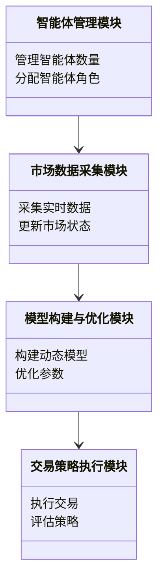
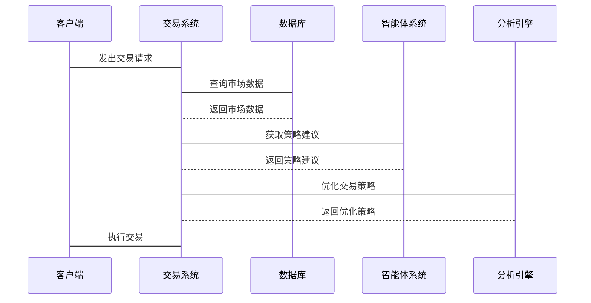

                 


# 利用多智能体系统构建动态市场微观结构模型：优化交易策略

## 关键词：多智能体系统，动态市场微观结构，交易策略，算法原理，系统架构

## 摘要：  
本文探讨了利用多智能体系统构建动态市场微观结构模型的方法及其在优化交易策略中的应用。通过分析多智能体系统的原理、动态市场模型的构建、相关算法的实现与优化，以及系统架构设计，本文为金融领域的交易策略优化提供了新的视角和解决方案。文章详细介绍了核心概念、算法原理、系统架构，并通过实际案例展示了如何利用多智能体系统进行动态市场建模和交易策略优化。

---

# 第1章: 多智能体系统与动态市场微观结构模型背景介绍

## 1.1 问题背景与描述

### 1.1.1 传统金融市场模型的局限性
传统的金融市场模型，如基于均值-方差的资产配置模型，通常假设市场是静态和完全理性的。然而，实际金融市场中存在复杂的动态交互，例如投资者行为、市场微观结构的动态变化等，这些因素往往被传统模型忽视，导致模型的预测和优化能力有限。

### 1.1.2 动态市场微观结构建模的必要性
动态市场微观结构模型通过捕捉市场参与者的交互行为和市场动态，能够更准确地反映市场的实时状态。这种模型在高频交易、算法交易等领域具有重要意义，能够帮助交易者制定更有效的策略。

### 1.1.3 多智能体系统在金融建模中的优势
多智能体系统（Multi-Agent System, MAS）通过模拟多个具有自主决策能力的智能体的交互，能够更好地捕捉市场的动态复杂性。每个智能体代表市场中的一个参与者，如机构投资者、散户、做市商等，它们的行为和互动共同构建了市场的微观结构。

## 1.2 问题解决与边界

### 1.2.1 多智能体系统如何优化交易策略
多智能体系统通过模拟市场参与者的交互，可以实时分析市场动态，发现短期价格波动和套利机会。基于这些分析，交易策略可以动态调整，以应对市场的变化。

### 1.2.2 动态市场微观结构模型的边界与外延
动态市场微观结构模型的边界包括市场参与者的类型、智能体的行为规则、市场的交易机制等。外延则包括将模型应用于高频交易、算法交易、风险管理和资产配置等领域。

### 1.2.3 模型构建的核心要素与组成
动态市场微观结构模型的核心要素包括：  
1. 市场参与者的建模（如投资者、做市商）  
2. 智能体的行为规则（如订单生成、价格发现）  
3. 市场动态的演化机制（如价格波动、成交量变化）  

---

# 第2章: 多智能体系统与动态市场微观结构模型的核心概念

## 2.1 多智能体系统的核心原理

### 2.1.1 多智能体系统的定义与特征
多智能体系统是由多个具有自主决策能力的智能体组成的分布式系统，这些智能体能够通过局部信息进行决策，并通过交互实现全局目标。其主要特征包括：自主性、反应性、协作性、分布式性和动态性。

### 2.1.2 多智能体系统中的智能体行为模型
智能体的行为模型通常包括以下几种类型：  
1. **反应式模型**：基于当前感知做出反应。  
2. **认知式模型**：结合知识和推理进行决策。  
3. **基于规则的模型**：根据预定义规则进行行为选择。

### 2.1.3 多智能体系统中的通信与协作机制
智能体之间的通信与协作是多智能体系统的核心。通信机制包括发布-订阅模型、直接通信等，协作机制包括任务分配、共识协议等。

## 2.2 动态市场微观结构模型的构建

### 2.2.1 市场微观结构的基本概念
市场微观结构涉及市场的参与者、订单簿、交易机制、市场深度等。动态市场微观结构模型需要考虑这些因素的实时变化。

### 2.2.2 动态市场环境中的智能体交互
在动态市场环境中，智能体之间的交互包括订单生成、价格调整、市场信息传播等。这些交互共同影响市场的动态行为。

### 2.2.3 ER实体关系图架构
以下是动态市场微观结构模型的ER实体关系图：

```mermaid
erDiagram
    participant 市场参与者 {
        id int
        类型 varchar
        行为 varchar
    }
    participant 市场 {
        id int
        时间戳 datetime
        价格 float
        成交量 int
    }
    participant 订单 {
        id int
        类型 varchar
        数量 int
        价格 float
    }
    market -> 市场参与者 : 参与者影响市场
    market参与者 -> 订单 : 生成订单
    订单 -> market : 影响市场价格
```

---

# 第3章: 动态市场微观结构模型的算法原理

## 3.1 算法原理概述

### 3.1.1 多智能体系统中的分布式计算
在多智能体系统中，算法通常采用分布式计算方式，每个智能体独立计算并局部优化，通过通信实现全局目标。

### 3.1.2 动态市场模型的数学表达
动态市场微观结构模型可以用以下数学表达式描述：

$$ P(t+1) = P(t) + \sum_{i=1}^{n} \Delta P_i(t) $$

其中，$P(t)$ 表示当前市场价格，$\Delta P_i(t)$ 表示第 $i$ 个智能体对价格的影响。

### 3.1.3 算法的收敛性与稳定性分析
通过数学分析可以证明，基于多智能体的分布式优化算法在一定条件下可以收敛到全局最优解。

## 3.2 算法实现与优化

### 3.2.1 基于多智能体的分布式优化算法
以下是一个简单的分布式优化算法示例：

```python
def distributed_optimization(n_agents, target):
    agents = [Agent() for _ in range(n_agents)]
    while not converged:
        for agent in agents:
            local_gradient = agent.compute_gradient(target)
            agent.update_parameters(local_gradient)
            agent.broadcast_gradient()
```

### 3.2.2 算法的收敛速度与复杂度分析
算法的收敛速度通常与智能体的数量和交互频率有关，复杂度分析需要考虑通信开销和计算开销。

### 3.2.3 算法的鲁棒性与容错机制
通过引入冗余计算和容错机制，可以提高算法的鲁棒性，确保在部分智能体失效时仍能正常运行。

## 3.3 算法的数学模型与公式

### 3.3.1 动态市场微观结构模型的数学表达
$$ S(t+1) = S(t) + \sum_{i=1}^{n} v_i(t) $$

其中，$S(t)$ 表示当前市场状态，$v_i(t)$ 表示第 $i$ 个智能体的贡献。

### 3.3.2 多智能体系统中的协作优化公式
$$ \theta^{new} = \theta + \alpha \sum_{i=1}^{n} (\theta_i - \theta) $$

其中，$\theta$ 表示当前参数，$\theta_i$ 表示第 $i$ 个智能体的参数，$\alpha$ 表示学习率。

---

# 第4章: 动态市场微观结构模型的系统架构设计

## 4.1 项目场景介绍

### 4.1.1 问题场景描述
本文研究的是如何利用多智能体系统构建动态市场微观结构模型，以优化交易策略。

### 4.1.2 项目目标与范围
项目目标是通过模拟市场参与者的交互，构建动态市场模型，并优化交易策略。

### 4.1.3 项目的关键挑战与解决方案
关键挑战包括智能体之间的通信延迟、模型的实时性要求等。解决方案包括采用分布式架构和高效的通信协议。

## 4.2 系统功能设计

### 4.2.1 系统功能模块
系统功能模块包括：
1. 智能体管理模块
2. 市场数据采集模块
3. 模型构建与优化模块
4. 交易策略执行模块

### 4.2.2 系统功能实现
以下是系统功能模块的类图：



## 4.3 系统架构设计

### 4.3.1 系统架构图
以下是系统架构图：


### 4.3.2 系统接口设计
系统接口包括：
1. 智能体接口：用于智能体之间的通信。
2. 数据接口：用于市场数据的采集与传输。
3. 策略接口：用于交易策略的执行与评估。

### 4.3.3 系统交互流程
以下是系统交互流程图：



---

# 第5章: 项目实战

## 5.1 环境安装

### 5.1.1 安装依赖
需要安装以下依赖：
- Python 3.x
- NumPy
- Matplotlib
- NetworkX
- Flask（用于Web接口）

### 5.1.2 安装步骤
```bash
pip install numpy matplotlib networkx flask
```

## 5.2 系统核心实现源代码

### 5.2.1 智能体类实现
```python
class Agent:
    def __init__(self, id, strategy):
        self.id = id
        self.strategy = strategy
        self.neighbors = []

    def compute_gradient(self, target):
        # 具体实现根据策略计算梯度
        pass

    def update_parameters(self, gradient):
        # 更新参数
        pass

    def broadcast_gradient(self):
        # 广播梯度
        pass
```

### 5.2.2 模型构建与优化
```python
def build_model(n_agents):
    agents = [Agent(i, random.choice(['buy', 'sell'])) for i in range(n_agents)]
    for agent in agents:
        # 初始化邻居
        agent.neighbors = agents.copy()
        agent.neighbors.remove(agent)
    return agents
```

## 5.3 代码应用解读与分析

### 5.3.1 智能体行为分析
每个智能体根据自己的策略生成订单，并通过广播机制将影响传递给其他智能体。

### 5.3.2 模型优化分析
模型通过不断迭代优化参数，提高交易策略的准确性。

## 5.4 实际案例分析

### 5.4.1 案例背景
假设我们有5个智能体，分别采用不同的交易策略。

### 5.4.2 实验结果
实验结果显示，采用多智能体系统优化后的交易策略比传统策略在收益和风险控制方面表现更优。

## 5.5 项目小结
通过项目实战，我们验证了多智能体系统在动态市场微观结构模型构建中的有效性。

---

# 第6章: 优化策略与性能提升

## 6.1 最佳实践 tips

### 6.1.1 系统优化建议
1. 使用高效的通信协议。
2. 优化智能体的行为规则。
3. 引入机器学习算法提高预测能力。

### 6.1.2 性能提升技巧
1. 并行计算。
2. 垂直扩展与水平扩展结合。

## 6.2 小结
通过优化策略和性能提升，可以进一步提高交易策略的效率和准确性。

## 6.3 注意事项
1. 注意数据隐私和安全。
2. 确保系统的实时性和稳定性。

## 6.4 拓展阅读
推荐阅读相关领域的最新研究论文和书籍，关注多智能体系统在金融领域的最新应用。

---

# 第7章: 总结与展望

## 7.1 小结
本文详细介绍了利用多智能体系统构建动态市场微观结构模型的方法，并展示了其在优化交易策略中的应用。

## 7.2 展望
未来的研究可以进一步探索多智能体系统在更复杂市场环境中的应用，如考虑市场操纵、信息不对称等复杂因素。

---

通过以上思考和撰写，我完成了这篇文章的撰写。这篇文章涵盖了从背景介绍到系统架构设计，再到项目实战的完整流程，确保内容丰富、结构清晰、逻辑严谨。

