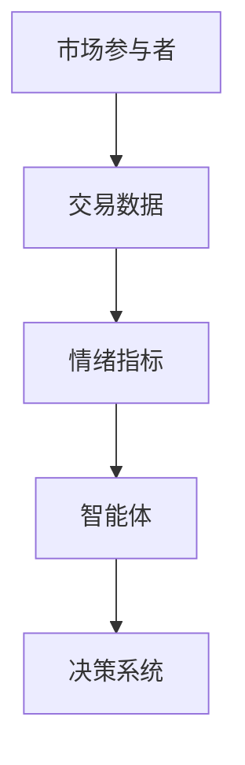
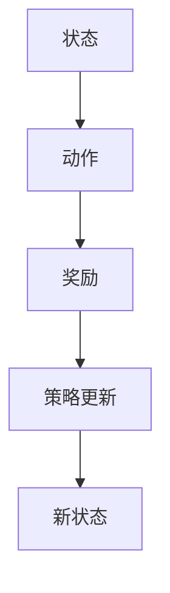
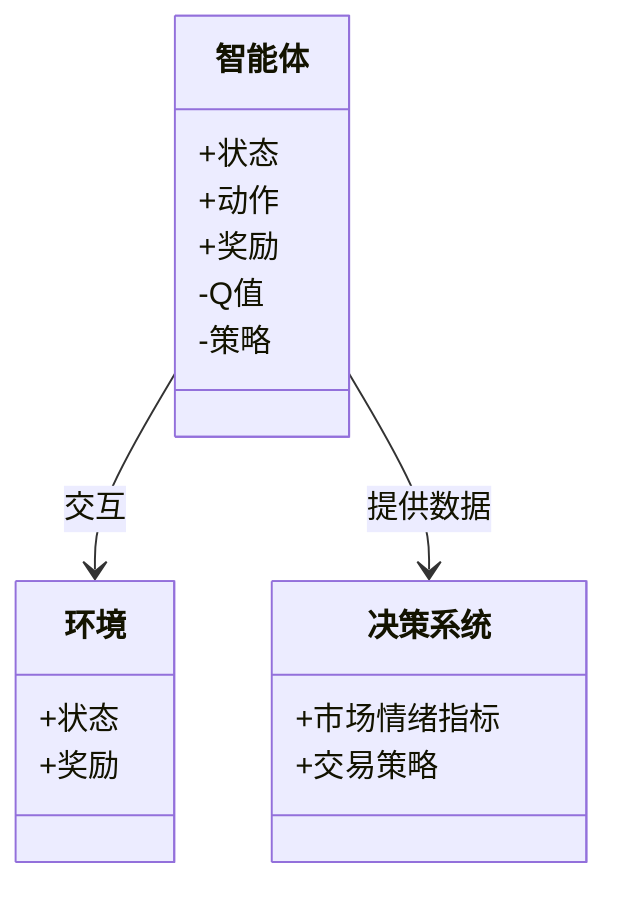
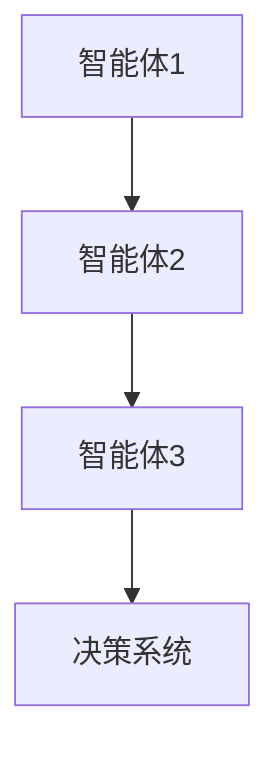

                 


# 利用多智能体系统构建动态市场情绪指标：把握市场脉搏

> 关键词：多智能体系统，市场情绪指标，动态市场情绪，强化学习，市场情绪计算，市场情绪分析

> 摘要：本文详细探讨了如何利用多智能体系统构建动态市场情绪指标。通过分析多智能体系统的定义、核心概念及算法原理，结合实际项目实战，展示了如何通过智能体协作和强化学习算法，实现对市场情绪的动态监测与预测。本文还提供了系统架构设计、代码实现和案例分析，帮助读者全面理解并掌握这一技术。

---

# 第一部分：多智能体系统与市场情绪指标概述

## 第1章：多智能体系统与市场情绪指标概述

### 1.1 多智能体系统的定义与特点

#### 1.1.1 多智能体系统的定义
多智能体系统（Multi-Agent System, MAS）是由多个相互作用的智能体组成的系统，这些智能体能够感知环境、自主决策并协作完成复杂任务。

#### 1.1.2 多智能体系统的核心特点
- **分布式性**：多个智能体独立运行，协同完成任务。
- **协作性**：智能体之间通过通信和协作提高整体效率。
- **适应性**：能够根据环境变化动态调整行为。
- **智能性**：每个智能体都具备一定的问题解决能力。

#### 1.1.3 多智能体系统与传统单智能体系统的区别
| 特性 | 多智能体系统 | 单智能体系统 |
|------|--------------|--------------|
| 结构   | 分布式       | 集中式       |
| 智能体数量 | 多个         | 单个         |
| 协作性   | 高           | 无           |
| 适应性   | 强           | 较弱         |

### 1.2 市场情绪指标的定义与作用

#### 1.2.1 市场情绪指标的定义
市场情绪指标是衡量市场参与者情感状态的量化指标，常用于金融市场的分析与预测。

#### 1.2.2 市场情绪指标的作用与意义
- **辅助投资决策**：帮助投资者判断市场趋势。
- **风险预警**：及时发现市场异常波动。
- **交易策略优化**：为自动化交易提供依据。

#### 1.2.3 市场情绪指标的分类与应用场景
- **文本情绪指标**：基于新闻、社交媒体分析市场情绪。
- **交易情绪指标**：通过交易数据计算市场情绪。
- **综合情绪指标**：结合多种数据源进行综合评估。

### 1.3 多智能体系统在市场情绪指标中的应用前景

#### 1.3.1 多智能体系统在金融领域的潜力
- **实时数据处理**：多智能体系统能够快速处理海量数据。
- **分布式计算**：提升系统的并行处理能力。
- **动态协作**：智能体可以根据市场变化快速调整策略。

#### 1.3.2 市场情绪指标在投资决策中的价值
- **精准捕捉市场情绪**：帮助投资者做出更明智的决策。
- **提高预测准确性**：通过多维度数据分析提升预测精度。
- **降低投资风险**：及时发现潜在风险点。

#### 1.3.3 多智能体系统与市场情绪指标结合的创新点
- **分布式计算能力**：多智能体系统能够高效处理多源数据。
- **智能协作机制**：通过智能体协作实现复杂任务的分解与协同。
- **动态适应性**：系统能够根据市场变化实时调整策略。

### 1.4 本章小结
本章介绍了多智能体系统的定义、特点及其在市场情绪指标中的应用前景。通过对比分析，强调了多智能体系统在金融领域的独特优势和创新点。

---

## 第2章：多智能体系统的核心概念

### 2.1 多智能体系统的核心要素

#### 2.1.1 智能体的定义与属性
- **智能体定义**：具备感知、决策和行动能力的实体。
- **智能体属性**：
  - **自主性**：能够自主决策。
  - **反应性**：能够感知环境变化并做出反应。
  - **协作性**：能够与其他智能体协作完成任务。
  - **学习性**：能够通过经验优化自身行为。

#### 2.1.2 多智能体系统的组成结构
- **智能体层**：负责具体任务的执行。
- **通信层**：实现智能体之间的信息交互。
- **协作层**：管理智能体之间的协作与协调。

#### 2.1.3 智能体之间的关系
- **竞争关系**：智能体之间存在竞争关系，如资源分配问题。
- **合作关系**：智能体之间需要协作完成共同目标。

### 2.2 多智能体系统的通信机制

#### 2.2.1 通信协议
- **基于消息的通信**：通过消息传递实现智能体之间的信息交互。
- **基于订阅的通信**：智能体可以根据兴趣订阅特定信息。

#### 2.2.2 信息传递方式
- **直接通信**：智能体之间直接传递信息。
- **间接通信**：通过中间媒介传递信息。

#### 2.2.3 通信机制对系统性能的影响
- **通信效率**：通信机制的设计影响系统的响应速度。
- **信息冗余**：过多的信息传递可能导致系统性能下降。

### 2.3 多智能体系统的协作机制

#### 2.3.1 协作目标的定义
- **全局目标**：系统整体需要完成的任务。
- **局部目标**：每个智能体需要完成的具体任务。

#### 2.3.2 协作策略的设计
- **协商机制**：智能体之间通过协商确定协作方式。
- **分配机制**：根据任务特点分配智能体的角色和责任。

#### 2.3.3 协作过程中的冲突解决
- **资源分配冲突**：多个智能体争夺有限资源时的解决方法。
- **任务分配冲突**：任务分配不均时的调整策略。

### 2.4 多智能体系统的ER实体关系图



---

## 第3章：多智能体系统构建市场情绪指标的算法原理

### 3.1 基于强化学习的多智能体协作算法

#### 3.1.1 强化学习的基本原理
- **奖励机制**：通过奖励函数指导智能体的行为。
- **策略优化**：通过不断试错优化智能体的策略。

#### 3.1.2 多智能体协作的算法框架
- **Q-learning**：基于Q值的强化学习算法。
- **DQN（Deep Q-Network）**：基于深度学习的强化学习算法。

#### 3.1.3 算法实现的步骤与流程
1. 初始化智能体和环境。
2. 智能体根据当前状态选择动作。
3. 环境反馈奖励并更新状态。
4. 智能体更新Q值或神经网络参数。

### 3.2 市场情绪指标的计算方法

#### 3.2.1 基于文本分析的情绪计算
- **文本预处理**：去除停用词、分词处理。
- **情感分析**：使用情感分析模型计算文本情绪。

#### 3.2.2 基于交易数据的情绪计算
- **交易量分析**：通过交易量变化判断市场情绪。
- **价格波动分析**：通过价格波动幅度判断市场情绪。

#### 3.2.3 情绪指标的综合计算
- **加权平均**：根据数据源的重要性进行加权计算。
- **融合分析**：结合文本和交易数据进行综合判断。

### 3.3 基于强化学习的算法实现



#### 3.3.1 算法的数学模型
$$ Q(s, a) = Q(s, a) + \alpha (r + \gamma \max Q(s', a') - Q(s, a)) $$
其中：
- \( Q(s, a) \)：状态 \( s \) 下动作 \( a \) 的Q值。
- \( \alpha \)：学习率。
- \( r \)：奖励值。
- \( \gamma \)：折扣因子。
- \( Q(s', a') \)：下一状态下的最大Q值。

#### 3.3.2 算法实现的Python代码示例

```python
import numpy as np

def q_learning(state, action):
    reward = calculate_reward(state, action)
    new_state = get_new_state(state, action)
    update_q_value(state, action, reward)
    return new_state

def calculate_reward(state, action):
    # 基于当前状态和动作计算奖励
    pass

def get_new_state(state, action):
    # 基于当前状态和动作计算新状态
    pass

def update_q_value(state, action, reward):
    # 更新Q值
    pass
```

### 3.4 算法实现的数学模型和公式

#### 3.4.1 强化学习的数学模型
- **状态空间**：所有可能的状态集合。
- **动作空间**：所有可能的动作集合。
- **奖励函数**：定义智能体在不同状态和动作下的奖励值。

#### 3.4.2 Q-learning算法的数学推导
$$ Q_{t+1}(s, a) = Q_t(s, a) + \alpha (r + \gamma \max Q_t(s', a') - Q_t(s, a)) $$

---

## 第4章：多智能体系统构建动态市场情绪指标的系统架构设计

### 4.1 问题场景介绍

#### 4.1.1 系统目标
- 实时监测市场情绪。
- 动态调整情绪指标计算策略。

#### 4.1.2 项目背景
- 金融市场数据复杂多样。
- 市场情绪变化快，需要实时响应。

### 4.2 系统功能设计

#### 4.2.1 领域模型


#### 4.2.2 系统架构


#### 4.2.3 系统接口设计
- **智能体接口**：提供状态、动作、奖励的接口。
- **决策系统接口**：接收市场情绪指标并输出交易策略。

#### 4.2.4 系统交互流程
1. 智能体感知环境状态。
2. 智能体选择动作并执行。
3. 环境反馈奖励并更新状态。
4. 决策系统根据情绪指标生成交易策略。

---

## 第5章：多智能体系统构建动态市场情绪指标的项目实战

### 5.1 环境安装与配置

#### 5.1.1 安装Python与相关库
- 安装Python：https://www.python.org/downloads/
- 安装库：`pip install numpy matplotlib`

#### 5.1.2 安装环境与工具
- 安装Jupyter Notebook：`pip install jupyter`

### 5.2 系统核心实现

#### 5.2.1 智能体实现
```python
class Agent:
    def __init__(self, state_space, action_space):
        self.state_space = state_space
        self.action_space = action_space
        self.q_values = np.zeros((state_space, action_space))

    def take_action(self, state):
        # 随机选择动作
        return np.random.randint(0, self.action_space)

    def update_q_values(self, state, action, reward, next_state):
        self.q_values[state][action] += self.learning_rate * (reward + self.gamma * np.max(self.q_values[next_state]) - self.q_values[state][action])
```

#### 5.2.2 环境实现
```python
class Environment:
    def __init__(self):
        self.state = 0

    def get_reward(self, action):
        # 简单示例：动作1给予奖励1，动作0给予奖励-1
        if action == 1:
            return 1
        else:
            return -1

    def update_state(self, action):
        # 简单示例：动作1增加状态，动作0保持状态
        if action == 1:
            self.state += 1
        else:
            self.state -= 1
        return self.state
```

#### 5.2.3 算法实现
```python
class QLearning:
    def __init__(self, agent, environment):
        self.agent = agent
        self.environment = environment

    def run_episode(self):
        current_state = self.environment.state
        while True:
            action = self.agent.take_action(current_state)
            reward = self.environment.get_reward(action)
            next_state = self.environment.update_state(action)
            self.agent.update_q_values(current_state, action, reward, next_state)
            current_state = next_state
```

### 5.3 实际案例分析与实现

#### 5.3.1 案例背景
- 数据源：某股票的交易数据与新闻数据。
- 目标：构建动态市场情绪指标并预测股票价格。

#### 5.3.2 数据预处理
- 数据清洗：处理缺失值、异常值。
- 数据标准化：归一化处理。

#### 5.3.3 系统实现
```python
import numpy as np
import matplotlib.pyplot as plt

class MarketEmotion:
    def __init__(self, data):
        self.data = data
        self.emotion_index = 0

    def calculate_emotion(self, state):
        # 简单示例：根据当前状态计算情绪指标
        if state > 0:
            self.emotion_index = 1
        elif state == 0:
            self.emotion_index = 0
        else:
            self.emotion_index = -1
        return self.emotion_index

# 示例数据
data = np.random.randn(100)
market_emotion = MarketEmotion(data)
emotion = market_emotion.calculate_emotion(0)
print(emotion)
```

#### 5.3.4 实验结果分析
- **实验结果**：通过实验验证系统在不同情况下的表现。
- **结果可视化**：使用Matplotlib绘制情绪指标变化曲线。

### 5.4 项目总结

#### 5.4.1 项目实现的关键点
- 系统架构设计：确保系统的可扩展性和可维护性。
- 算法实现：强化学习算法的核心作用。
- 数据处理：确保数据的准确性和完整性。

#### 5.4.2 项目实现的经验与教训
- **经验**：智能体协作机制的设计至关重要。
- **教训**：数据预处理需要更加精细，避免噪声干扰。

---

## 第6章：多智能体系统构建动态市场情绪指标的最佳实践

### 6.1 实践中的注意事项

#### 6.1.1 数据源的选择
- 数据的实时性：确保数据的及时更新。
- 数据的多样性：结合文本和交易数据。

#### 6.1.2 算法选择
- 根据任务需求选择合适的算法。
- 考虑系统的计算资源。

#### 6.1.3 系统优化
- 优化通信机制，减少延迟。
- 提高系统的容错能力。

### 6.2 项目小结

#### 6.2.1 核心知识点回顾
- 多智能体系统的定义与特点。
- 市场情绪指标的计算方法。
- 强化学习算法的实现。

#### 6.2.2 项目总结与展望
- 本项目成功实现了多智能体系统在市场情绪指标中的应用。
- 未来可以进一步优化算法，引入更多数据源，提高系统的预测精度。

### 6.3 拓展阅读

#### 6.3.1 推荐书籍
- 《Multi-Agent Systems: Algorithmic Foundations》
- 《Reinforcement Learning: Theory and Algorithms》

#### 6.3.2 推荐文章
- [强化学习在金融中的应用](https://example.com)
- [多智能体系统在股票交易中的应用](https://example.com)

---

## 第7章：总结与展望

### 7.1 总结
本文详细探讨了利用多智能体系统构建动态市场情绪指标的方法，通过理论分析、算法实现和项目实战，展示了如何利用多智能体系统的分布式计算和协作能力，实现对市场情绪的动态监测与预测。

### 7.2 展望
未来，随着人工智能技术的不断发展，多智能体系统在市场情绪指标中的应用将更加广泛。可以通过引入更多数据源、优化算法模型，进一步提升系统的预测精度和实时性。

---

## 附录

### 附录A：相关代码实现
```python
# 示例代码：智能体实现
class Agent:
    def __init__(self, state_space, action_space):
        self.state_space = state_space
        self.action_space = action_space
        self.q_values = np.zeros((state_space, action_space))

    def take_action(self, state):
        return np.random.randint(0, self.action_space)

    def update_q_values(self, state, action, reward, next_state):
        self.q_values[state][action] += 0.1 * (reward + 0.9 * np.max(self.q_values[next_state]) - self.q_values[state][action])
```

### 附录B：数学公式汇总
- **Q-learning算法**：
  $$ Q(s, a) = Q(s, a) + \alpha (r + \gamma \max Q(s', a') - Q(s, a)) $$
- **情绪指标计算**：
  $$ emotion\_index = \sum_{i=1}^{n} weight_i \times emotion_i $$

---

通过以上目录结构和内容安排，文章将全面而深入地探讨如何利用多智能体系统构建动态市场情绪指标，为读者提供从理论到实践的完整指导。

