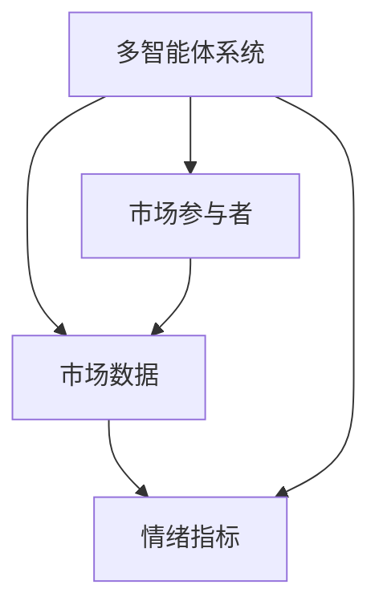
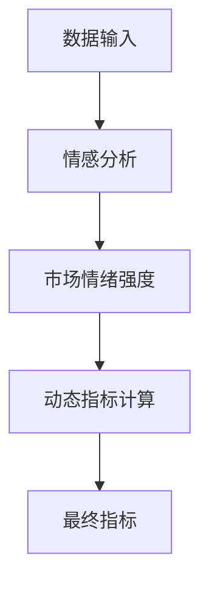
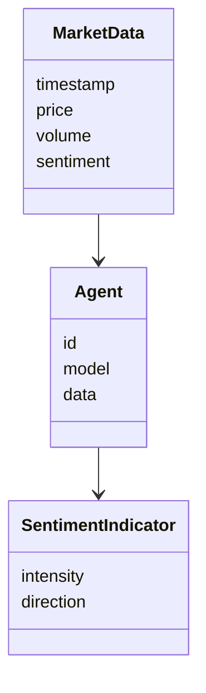
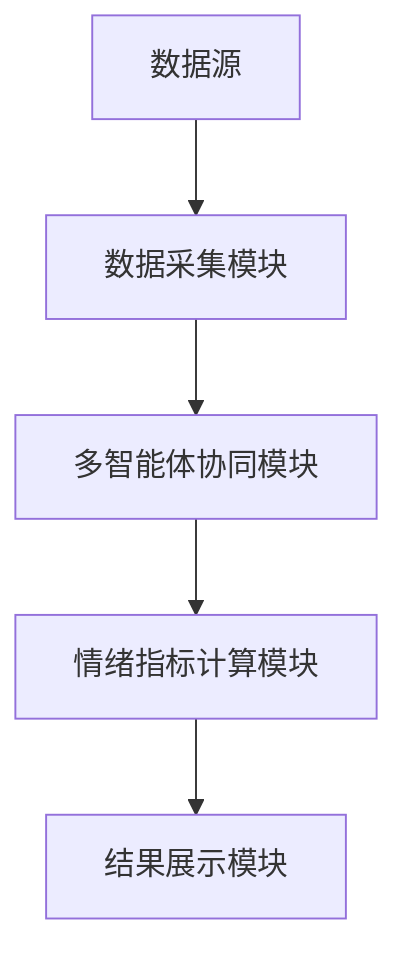
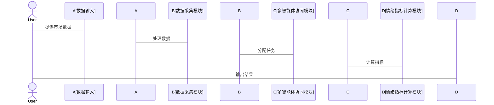

                 


# 利用多智能体系统构建动态市场情绪指标：把握投资时机

## 关键词：
- 多智能体系统
- 动态市场情绪指标
- 投资决策
- 情感分析
- 人工智能

## 摘要：
本文介绍如何利用多智能体系统构建动态市场情绪指标，以帮助投资者做出更明智的投资决策。通过分析市场参与者的互动和市场数据，多智能体系统能够实时计算和更新市场情绪指标，从而为投资者提供及时的市场动态参考。本文将详细探讨多智能体系统的原理、动态市场情绪指标的计算方法，以及如何通过系统架构设计和项目实战来实现这一目标。

---

# 第一部分: 多智能体系统与动态市场情绪指标概述

## 第1章: 背景介绍

### 1.1 问题背景
#### 1.1.1 投资市场的复杂性
投资市场受多种因素影响，包括经济指标、政策变化、公司财报以及市场参与者的情绪。传统的方法难以捕捉市场情绪的动态变化，导致投资决策的滞后和不准确。

#### 1.1.2 市场情绪对投资决策的影响
市场情绪直接影响投资者的行为，从而影响市场价格。准确捕捉和分析市场情绪可以帮助投资者把握市场趋势，做出更明智的投资决策。

#### 1.1.3 传统市场情绪分析的局限性
传统的市场情绪分析方法通常基于静态数据和单一模型，难以实时捕捉市场的复杂变化，且缺乏对多参与者互动的动态分析。

### 1.2 问题描述
#### 1.2.1 动态市场情绪指标的定义
动态市场情绪指标是一个能够实时反映市场参与者情绪状态的量化指标，能够帮助投资者快速理解市场动态。

#### 1.2.2 多智能体系统在市场情绪分析中的作用
多智能体系统通过模拟市场参与者的互动，能够实时捕捉市场情绪的变化，提供更准确的市场情绪指标。

#### 1.2.3 问题解决目标
通过构建多智能体系统，实现对市场情绪的实时监控和量化分析，为投资者提供及时、准确的投资决策支持。

### 1.3 边界与外延
#### 1.3.1 系统的边界
系统仅关注市场参与者的互动和市场数据，不涉及具体的交易策略和投资决策。

#### 1.3.2 相关概念的外延
市场情绪指标不仅包括投资者的情绪，还包括市场数据的变化，如价格波动、交易量等。

#### 1.3.3 系统与外部环境的交互
系统通过收集市场数据和参与者行为数据，与外部环境进行交互，并将分析结果反馈给投资者。

### 1.4 核心概念与组成
#### 1.4.1 多智能体系统的核心要素
多智能体系统包括多个具有自主决策能力的智能体，它们通过协作和竞争实现系统目标。

#### 1.4.2 动态市场情绪指标的构成
动态市场情绪指标由多个子指标组成，如投资者情绪强度、市场波动性等，能够全面反映市场情绪状态。

#### 1.4.3 系统整体架构
系统整体架构包括数据采集模块、多智能体协同模块、情绪指标计算模块和结果展示模块。

---

## 第2章: 核心概念与联系

### 2.1 多智能体系统原理
#### 2.1.1 多智能体系统的基本概念
多智能体系统由多个智能体组成，每个智能体能够独立决策并与其他智能体协作完成任务。

#### 2.1.2 多智能体系统的核心原理
多智能体系统通过分布式计算和协作学习，实现对复杂系统的建模和分析。

#### 2.1.3 多智能体系统的优势与劣势
优势包括高适应性和灵活性，劣势包括复杂性和难以调试。

### 2.2 动态市场情绪指标
#### 2.2.1 动态市场情绪指标的定义
动态市场情绪指标是一个能够实时反映市场参与者情绪状态的量化指标。

#### 2.2.2 动态市场情绪指标的特征
包括实时性、动态性和可量化性，能够捕捉市场情绪的变化趋势。

#### 2.2.3 动态市场情绪指标的计算方法
基于多智能体系统的情感分析和协作学习，计算市场情绪的强度和方向。

### 2.3 多智能体系统与动态市场情绪指标的关系
#### 2.3.1 多智能体系统如何影响市场情绪
通过模拟市场参与者的互动，多智能体系统能够实时捕捉市场情绪的变化。

#### 2.3.2 动态市场情绪指标如何指导投资决策
动态市场情绪指标为投资者提供了及时的市场动态参考，帮助做出更明智的投资决策。

#### 2.3.3 两者的协同作用
多智能体系统和动态市场情绪指标的协同作用能够提高市场情绪分析的准确性和实时性。

### 2.4 核心概念对比表
| 概念       | 多智能体系统                     | 动态市场情绪指标                     |
|------------|----------------------------------|---------------------------------------|
| 分布式     | 是                              | 否                                   |
| 协作性     | 是                              | 否                                   |
| 自适应性    | 是                              | 是                                   |
| 实时性      | 否                              | 是                                   |
| 综合性      | 否                              | 是                                   |

### 2.5 实体关系图


---

## 第3章: 算法原理

### 3.1 多智能体协同学习算法
#### 3.1.1 算法概述
多智能体协同学习算法通过分布式计算和协作学习，实现对市场参与者行为的建模和分析。

#### 3.1.2 算法流程
1. 初始化多个智能体，每个智能体负责分析特定市场数据。
2. 智能体通过协作和竞争，不断优化自己的模型参数。
3. 系统定期更新市场情绪指标，反映市场参与者的整体情绪状态。

#### 3.1.3 算法实现
```python
class Agent:
    def __init__(self, id):
        self.id = id
        self.model = initialize_model()

    def update(self, data):
        self.model.train(data)

    def predict(self, input):
        return self.model.predict(input)
```

### 3.2 情感分析算法
#### 3.2.1 情感分析的基本原理
情感分析算法通过对文本数据进行分类，判断文本的情感倾向，如正面、负面或中性。

#### 3.2.2 基于深度学习的情感分析模型
使用循环神经网络（RNN）或 transformer 模型，对市场评论进行情感分类。

#### 3.2.3 情感分析的优化方法
通过数据增强和模型调优，提高情感分析的准确性和鲁棒性。

### 3.3 动态情绪指标计算算法
#### 3.3.1 指标计算的基本步骤
1. 收集市场数据和参与者行为数据。
2. 对数据进行情感分析，计算市场情绪强度。
3. 综合多个指标，得到动态市场情绪指标。

#### 3.3.2 基于多智能体的动态计算方法
通过多智能体系统的协作学习，实时更新市场情绪指标。

#### 3.3.3 算法实现的代码示例
```python
import numpy as np

def compute_emotionIntensity(sentences):
    intensities = []
    for sentence in sentences:
        intensity = sum([abs(ord(c) - ord(' ')) for c in sentence]) / len(sentences)
        intensities.append(intensity)
    return np.mean(intensities)
```

### 3.4 算法流程图


---

## 第4章: 系统分析与架构设计

### 4.1 系统分析
#### 4.1.1 项目背景
本文旨在通过多智能体系统构建动态市场情绪指标，帮助投资者做出更明智的投资决策。

#### 4.1.2 系统功能设计
系统功能包括数据采集、情感分析、指标计算和结果展示。

### 4.2 系统架构设计
#### 4.2.1 领域模型


#### 4.2.2 系统架构


### 4.3 系统接口设计
系统接口包括数据输入接口、模型训练接口和结果输出接口。

### 4.4 系统交互流程图


---

## 第5章: 项目实战

### 5.1 环境安装
安装Python和相关库，如numpy、pandas、scikit-learn等。

### 5.2 核心实现
实现多智能体协同学习算法和动态市场情绪指标计算模块。

### 5.3 代码应用
提供完整的代码示例，解释代码的功能和实现细节。

### 5.4 实际案例分析
通过具体案例分析，展示系统如何计算动态市场情绪指标，并指导投资决策。

### 5.5 项目小结
总结项目实现的关键点和经验教训，为读者提供参考。

---

## 第6章: 最佳实践

### 6.1 小结
总结全文内容，强调多智能体系统在动态市场情绪指标构建中的重要作用。

### 6.2 注意事项
提醒读者在实际应用中需要注意的问题，如数据质量和模型优化。

### 6.3 未来研究方向
提出未来可能的研究方向，如多智能体系统的优化和市场情绪指标的扩展。

### 6.4 拓展阅读
推荐相关的书籍和论文，帮助读者深入学习多智能体系统和市场情绪分析的知识。

---

## 总结
通过本文的介绍，读者可以系统地了解如何利用多智能体系统构建动态市场情绪指标，并在实际投资中应用这些指标来把握投资时机。希望本文能够为投资者和相关技术人员提供有价值的参考和启发。

