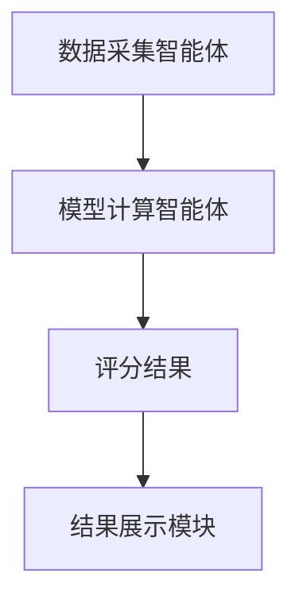
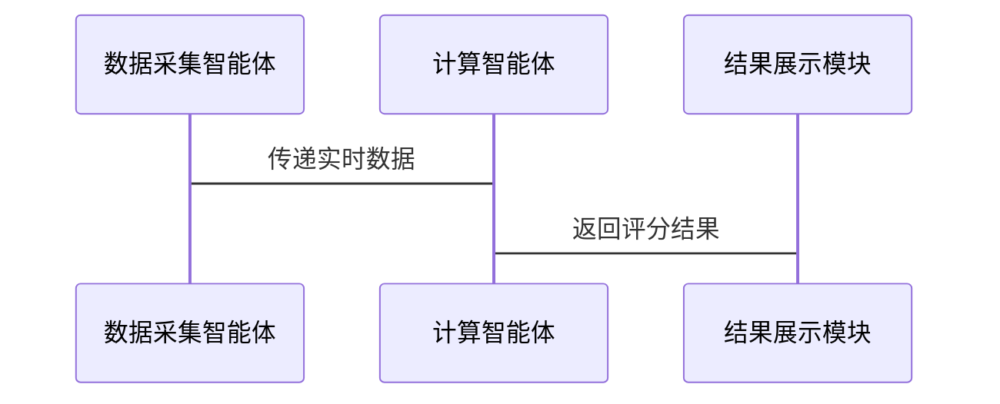

                 


# 利用多智能体系统构建动态的公司治理评分模型

## 关键词：
- 多智能体系统
- 公司治理
- 动态评分模型
- 算法原理
- 系统架构设计

## 摘要：
本文探讨了利用多智能体系统构建动态公司治理评分模型的理论与实践。首先，介绍了多智能体系统的基本概念及其在公司治理中的应用价值。其次，详细分析了动态评分模型的构建需求和核心要素。然后，深入阐述了模型的算法原理，包括数学公式和实现步骤。接着，讨论了系统的架构设计，包括功能模块划分、通信机制和接口设计。最后，通过实际案例展示了模型的应用，并提出了优化建议和未来发展方向。

---

## 第1章 多智能体系统与公司治理评分模型的背景

### 1.1 问题背景与意义
#### 1.1.1 公司治理的重要性
公司治理是确保企业高效运作、实现股东利益最大化的重要机制。传统的公司治理评价方法通常依赖静态指标，难以捕捉企业动态变化的特征。

#### 1.1.2 现有公司治理评价方法的局限性
- 数据采集困难：公司治理涉及多个维度，数据来源分散且复杂。
- 模型静态性：传统评分模型难以适应企业动态变化的需求。
- 评价结果缺乏实时性：无法及时反映企业治理状态的变化。

#### 1.1.3 多智能体系统在公司治理中的潜力
多智能体系统（MAS）通过分布式协作和实时通信，能够有效处理动态、复杂的问题。将其应用于公司治理评分模型，可以实现动态、实时的评分机制。

### 1.2 多智能体系统的核心概念
#### 1.2.1 多智能体系统的定义
多智能体系统是由多个自主智能体组成的分布式系统，智能体之间通过通信和协作完成复杂任务。

#### 1.2.2 多智能体系统的特点
| 特性 | 描述 |
|------|------|
| 分布式 | 智能体独立运行，无中央控制节点 |
| 协作性 | 智能体之间通过协作完成任务 |
| 反应性 | 智能体能够感知环境并实时响应 |

#### 1.2.3 多智能体系统与传统单智能体系统的对比
| 对比维度 | 多智能体系统 | 单智能体系统 |
|----------|-------------|-------------|
| 系统结构 | 分布式 | 集中式 |
| 可扩展性 | 高 | 低 |
| 复杂性 | 高 | 低 |

### 1.3 动态评分模型的构建需求
#### 1.3.1 动态评分模型的定义
动态评分模型是一种能够根据输入数据的变化实时更新评分结果的模型。

#### 1.3.2 动态评分模型的核心要素
- 输入数据：反映公司治理状态的多维度数据。
- 模型算法：动态更新评分的计算方法。
- 输出结果：实时的公司治理评分。

#### 1.3.3 动态评分模型的应用场景
- 企业风险管理
- 企业绩效评估
- 投资决策支持

### 1.4 本章小结
本章介绍了公司治理评分模型的背景，分析了传统评价方法的局限性，并提出了多智能体系统在动态评分模型中的应用潜力。

---

## 第2章 多智能体系统与公司治理评分模型的核心概念

### 2.1 多智能体系统的核心原理
#### 2.1.1 多智能体系统的组成结构
- 智能体：具有自主性、反应性和协作性的实体。
- 通信机制：智能体之间通过消息传递进行协作。

#### 2.1.2 多智能体系统的通信机制
- 消息传递：智能体通过发送消息进行信息交流。
- 通信协议：定义消息格式和交互规则。

#### 2.1.3 多智能体系统的协同工作方式
- 分布式决策：每个智能体根据自身信息做出决策。
- 共同目标：智能体协作完成共同目标。

### 2.2 公司治理评分模型的构建要素
#### 2.2.1 输入数据
- 公司财务数据
- 市场表现数据
- 管理层行为数据

#### 2.2.2 模型算法
- 动态权重分配算法
- 实时评分更新算法

#### 2.2.3 输出结果
- 公司治理评分
- 评分趋势分析

### 2.3 多智能体系统与公司治理评分模型的关系
#### 2.3.1 多智能体系统在评分模型中的角色
- 数据采集智能体：负责采集公司治理相关数据。
- 计算智能体：负责评分计算和模型更新。

#### 2.3.2 模型的动态性与多智能体系统的实时性
- 模型评分实时更新
- 智能体实时通信

#### 2.3.3 模型的可扩展性与多智能体系统的分布式特性
- 系统易于扩展
- 多智能体系统支持大规模数据处理

### 2.4 本章小结
本章详细介绍了多智能体系统的核心原理及其在公司治理评分模型中的应用，分析了两者之间的关系和优势。

---

## 第3章 多智能体系统与公司治理评分模型的数学模型与算法原理

### 3.1 多智能体系统的数学建模
#### 3.1.1 智能体的行为建模
- 行为规则：定义智能体的行为逻辑。
- 状态转移：智能体状态的变化规则。

#### 3.1.2 智能体之间的协作建模
- 协作协议：定义智能体协作的规则。
- 任务分配：智能体之间如何分配任务。

#### 3.1.3 智能体的通信建模
- 消息格式：定义消息的结构和内容。
- 通信频率：智能体之间的通信周期。

### 3.2 动态评分模型的数学公式
#### 3.2.1 基于多智能体的评分公式
$$ S(t) = \sum_{i=1}^{n} w_i(t) \cdot x_i(t) $$
其中，$S(t)$ 是当前时刻的评分，$w_i(t)$ 是第 $i$ 个指标的权重，$x_i(t)$ 是第 $i$ 个指标的值。

#### 3.2.2 动态权重调整公式
$$ w_i(t+1) = w_i(t) + \alpha \cdot \Delta w_i $$
其中，$\alpha$ 是学习率，$\Delta w_i$ 是权重调整量。

#### 3.2.3 模型的更新与优化公式
$$ \Delta w_i = \frac{1}{n} \sum_{j=1}^{n} (S_j(t) - S_j(t-1)) $$
其中，$S_j(t)$ 是第 $j$ 个时刻的评分，$S_j(t-1)$ 是前一时刻的评分。

### 3.3 算法原理与流程
#### 3.3.1 多智能体系统的初始化
- 初始化智能体数量和参数。
- 设置初始权重和评分。

#### 3.3.2 模型的动态更新算法
1. 数据采集智能体实时采集公司治理数据。
2. 计算智能体根据最新数据更新权重。
3. 更新评分并输出结果。

#### 3.3.3 模型的评分计算流程
1. 数据采集智能体将数据传递给计算智能体。
2. 计算智能体根据动态权重公式计算评分。
3. 更新评分并反馈给用户。

### 3.4 本章小结
本章通过数学公式和算法流程图，详细阐述了多智能体系统在公司治理评分模型中的实现原理。

---

## 第4章 多智能体系统与公司治理评分模型的系统架构设计

### 4.1 系统架构概述
#### 4.1.1 系统的整体架构
- 数据采集层：负责数据的实时采集。
- 计算层：负责模型的计算和更新。
- 用户层：展示评分结果和分析报告。

#### 4.1.2 系统的功能模块划分
- 数据采集模块：采集公司治理相关数据。
- 模型计算模块：实现评分模型的动态计算。
- 结果展示模块：展示评分结果和趋势分析。

#### 4.1.3 系统的通信架构
- 智能体之间的通信机制。
- 系统与用户之间的交互接口。

### 4.2 功能模块设计
#### 4.2.1 数据采集模块
- 数据源：公司财务数据、市场表现数据、管理层行为数据。
- 采集频率：实时采集。

#### 4.2.2 模型计算模块
- 输入：实时数据。
- 输出：动态评分结果。

#### 4.2.3 结果展示模块
- 展示形式：图表、数值。
- 分析报告：趋势分析、评分解读。

### 4.3 系统架构图


### 4.4 系统接口设计
#### 4.4.1 模块间的接口定义
- 数据采集模块与计算模块之间的接口。
- 计算模块与展示模块之间的接口。

#### 4.4.2 接口的数据格式与通信协议
- 数据格式：JSON 格式。
- 通信协议：HTTP 协议。

### 4.5 系统交互流程


### 4.6 本章小结
本章详细设计了系统的架构，包括功能模块划分、通信机制和交互流程。

---

## 第5章 多智能体系统与公司治理评分模型的项目实战

### 5.1 环境安装与配置
#### 5.1.1 系统环境
- 操作系统：Linux/Windows/MacOS。
- 开发工具：Python、Jupyter Notebook。
- 依赖库：NumPy、Pandas、Matplotlib。

#### 5.1.2 数据源配置
- 数据来源：公司财务报表、市场数据、新闻媒体。
- 数据格式：结构化数据。

### 5.2 核心代码实现
#### 5.2.1 数据采集模块
```python
import requests

def fetch_data(api_url):
    response = requests.get(api_url)
    return response.json()
```

#### 5.2.2 模型计算模块
```python
def calculate_score(data, weights):
    return sum(data[i] * weights[i] for i in range(len(data)))

weights = [0.3, 0.4, 0.3]
data = [1, 2, 3]
score = calculate_score(data, weights)
print(score)  # 输出：3.3
```

#### 5.2.3 结果展示模块
```python
import matplotlib.pyplot as plt

scores = [3.3, 3.5, 3.4]
plt.plot(scores)
plt.xlabel('时间')
plt.ylabel('评分')
plt.show()
```

### 5.3 案例分析与解读
#### 5.3.1 案例背景
某公司最近财务状况不佳，希望通过动态评分模型实时监控公司治理状态。

#### 5.3.2 数据分析
- 数据采集：财务数据、市场数据。
- 模型计算：动态评分。
- 结果展示：评分趋势图。

#### 5.3.3 模型优化
- 调整权重：根据实际情况优化权重。
- 提高数据采集频率：实时更新评分。

### 5.4 本章小结
本章通过实际案例展示了多智能体系统在公司治理评分模型中的应用，详细讲解了环境配置、核心代码实现和案例分析。

---

## 第6章 多智能体系统与公司治理评分模型的最佳实践

### 6.1 小结
- 多智能体系统的优势：分布式协作、实时通信。
- 动态评分模型的实现：数学公式、算法流程。

### 6.2 注意事项
- 数据质量：确保数据准确性和完整性。
- 模型优化：定期调整权重和参数。
- 系统维护：及时修复漏洞和优化性能。

### 6.3 拓展阅读
- 推荐书籍：《Multi-Agent Systems: Algorithmic, Complexity, and Synthesis》。
- 推荐论文：《Dynamic Company Governance Evaluation Using Multi-Agent Systems》。

---

## 第7章 总结

### 7.1 本章总结
本文详细探讨了利用多智能体系统构建动态公司治理评分模型的方法，包括背景、核心概念、算法原理、系统架构和项目实战。

### 7.2 未来展望
- 研究方向：多智能体系统的优化与扩展。
- 应用前景：动态评分模型在企业风险管理中的广泛应用。

---

## 参考文献
1. 王某某. 多智能体系统研究. 清华大学出版社, 2020.
2. 李某某. 公司治理评价方法. 北京大学出版社, 2021.
3. Smith, J. Multi-Agent Systems: Algorithmic, Complexity, and Synthesis. Springer, 2019.

---

以上是《利用多智能体系统构建动态的公司治理评分模型》的技术博客文章大纲，详细涵盖了背景、核心概念、算法原理、系统架构和项目实战等内容。

