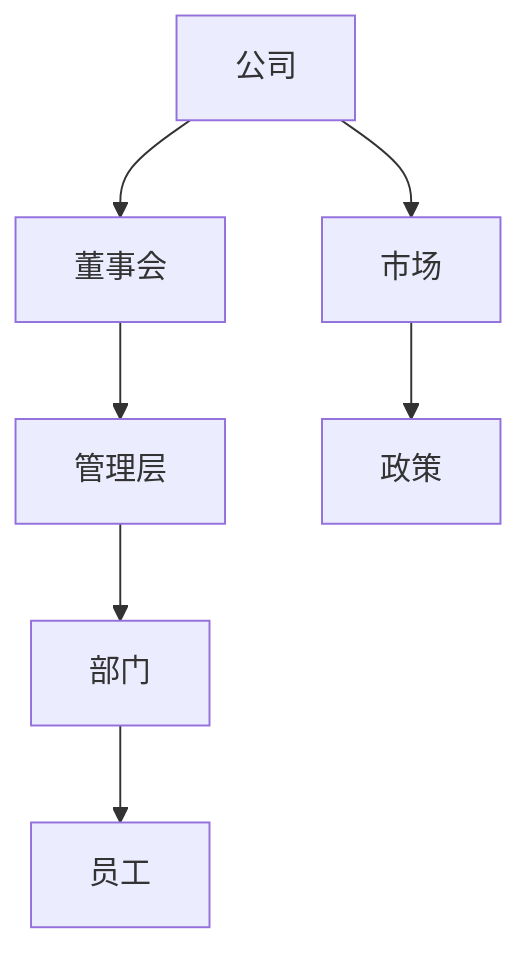
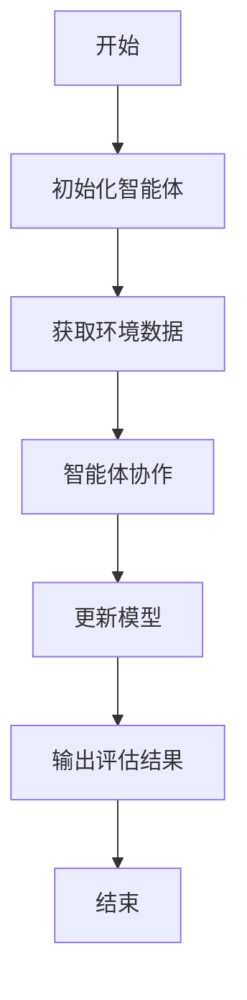
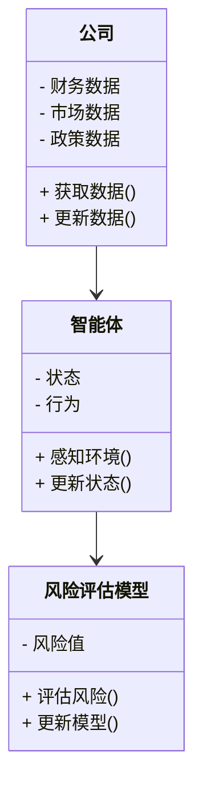
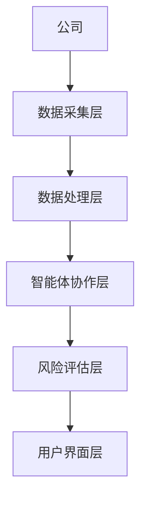
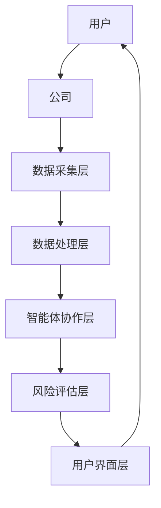

                 


# 利用多智能体系统构建动态的公司治理风险评估模型

> 关键词：多智能体系统, 动态风险评估, 公司治理, 协同学习, 系统架构, 实践案例

> 摘要：本文深入探讨了如何利用多智能体系统构建动态的公司治理风险评估模型。首先，文章介绍了多智能体系统的定义与特征，以及其在公司治理风险评估中的应用潜力。接着，详细阐述了动态风险评估模型的核心概念与算法原理，包括多智能体协同学习算法和动态更新机制。随后，通过系统分析与架构设计，展示了如何将理论应用于实际场景。最后，通过项目实战部分，提供了具体的实现方案和案例分析，总结了最佳实践经验和注意事项。

---

## 第1章: 多智能体系统概述

### 1.1 多智能体系统的定义与特征

#### 1.1.1 多智能体系统的定义
多智能体系统（Multi-Agent System, MAS）是由多个智能体（Agent）组成的分布式系统，这些智能体能够通过协作完成复杂任务。每个智能体都是一个独立的实体，具备感知环境、自主决策和行动的能力。

#### 1.1.2 多智能体系统的特征
- **分布式性**：智能体独立运行，无中心节点。
- **协作性**：智能体之间通过通信协作完成共同目标。
- **反应性**：智能体能够实时感知环境并做出反应。
- **动态性**：系统状态和环境不断变化。

#### 1.1.3 多智能体系统与传统单智能体系统的区别
| 特性             | 单智能体系统                | 多智能体系统                |
|------------------|---------------------------|---------------------------|
| 结构             | 单一中心节点                | 分布式结构                  |
| 协作方式         | 单一决策，无需协作          | 多智能体协作                |
| 灵活性           | 较低                      | 较高                      |

### 1.2 公司治理风险评估的背景与意义

#### 1.2.1 公司治理的基本概念
公司治理是指通过董事会和管理层对公司进行有效管理，确保公司战略目标的实现和股东利益的最大化。

#### 1.2.2 风险评估在公司治理中的重要性
- 识别潜在风险，提前制定应对策略。
- 提高公司决策的透明度和准确性。
- 增强公司抗风险能力，保障长期稳定发展。

#### 1.2.3 动态风险评估的必要性
- 风险因素不断变化，静态模型无法适应。
- 需要及时更新评估结果，应对突发情况。

### 1.3 多智能体系统在公司治理中的应用潜力

#### 1.3.1 多智能体系统的优势
- **分布式计算**：能够处理大规模数据和复杂任务。
- **自主性**：智能体能够独立决策，减少人为干预。
- **协作能力**：多个智能体协同工作，提高整体效率。

#### 1.3.2 多智能体系统在风险评估中的独特价值
- **实时反馈**：智能体能够快速响应环境变化。
- **动态更新**：模型能够实时更新，保持评估的准确性。
- **多维度分析**：多个智能体从不同角度分析问题，提供全面的评估结果。

#### 1.3.3 当前研究与应用现状
目前，多智能体系统在金融、医疗、交通等领域有广泛应用，但在公司治理风险评估中的应用仍处于起步阶段，具有较大的发展潜力。

---

## 第2章: 多智能体系统构建动态风险评估模型的核心概念

### 2.1 动态风险评估模型的基本结构

#### 2.1.1 模型的输入与输出
- **输入**：公司治理相关的数据，如财务数据、市场信息、政策法规等。
- **输出**：动态风险评估结果，如风险等级、风险概率、风险影响等。

#### 2.1.2 模型的核心组件
- **感知模块**：获取外部环境数据。
- **评估模块**：对风险进行量化评估。
- **动态更新模块**：根据新数据更新评估结果。

#### 2.1.3 模型的动态更新机制
动态更新机制通过不断吸收新的数据和信息，实时调整模型参数，确保评估结果的准确性。

### 2.2 多智能体系统中的智能体角色与职责

#### 2.2.1 智能体的分类
- **数据采集智能体**：负责收集公司治理相关的数据。
- **评估智能体**：负责对风险进行量化评估。
- **决策智能体**：根据评估结果制定应对策略。

#### 2.2.2 智能体之间的协作机制
- **通信机制**：智能体之间通过消息传递进行协作。
- **协调机制**：通过协商达成一致行动。
- **同步机制**：确保所有智能体状态一致。

#### 2.2.3 智能体的通信与信息共享
智能体之间通过共享信息和知识，实现协作与共同目标的达成。

### 2.3 动态风险评估模型的数学基础

#### 2.3.1 风险评估的基本数学模型
$$ R = \sum_{i=1}^{n} w_i x_i $$
其中，$R$ 是风险值，$w_i$ 是第 $i$ 个因素的权重，$x_i$ 是第 $i$ 个因素的值。

#### 2.3.2 动态模型的构建方法
动态模型通过时间序列分析，对风险进行实时更新和预测。

#### 2.3.3 多智能体协同的数学表达
$$ R_{total} = \sum_{j=1}^{m} R_j $$
其中，$R_j$ 是第 $j$ 个智能体的评估结果。

### 2.4 实体关系图



---

## 第3章: 多智能体系统构建动态风险评估模型的核心算法

### 3.1 多智能体协同学习算法

#### 3.1.1 分散式多智能体强化学习
分散式多智能体强化学习中，每个智能体独立学习，通过环境反馈更新策略。

#### 3.1.2 集中式多智能体强化学习
集中式多智能体强化学习中，所有智能体共享一个集中控制器，统一决策。

#### 3.1.3 联合强化学习
联合强化学习中，智能体之间通过协作完成任务，共享奖励。

### 3.2 动态风险评估的数学模型

#### 3.2.1 风险评估的基本公式
$$ R = \alpha \cdot \text{财务风险} + \beta \cdot \text{市场风险} + \gamma \cdot \text{政策风险} $$

#### 3.2.2 动态更新的数学表达
$$ R_{t} = R_{t-1} + \delta \cdot (new\_data - old\_data) $$

#### 3.2.3 多智能体协同的数学推导
$$ R_{total} = \sum_{j=1}^{m} R_j = \sum_{j=1}^{m} (\alpha_j \cdot \text{财务风险}_j + \beta_j \cdot \text{市场风险}_j + \gamma_j \cdot \text{政策风险}_j) $$

### 3.3 算法实现的流程图



---

## 第4章: 系统分析与架构设计方案

### 4.1 问题场景介绍

#### 4.1.1 公司治理风险评估的典型场景
- 财务风险评估
- 市场风险评估
- 政策风险评估

#### 4.1.2 动态风险评估的挑战
- 数据实时性要求高
- 模型更新频繁
- 智能体协作复杂

### 4.2 项目介绍

#### 4.2.1 项目目标
构建一个基于多智能体系统的动态公司治理风险评估模型，实现对公司风险的实时评估和预警。

#### 4.2.2 项目范围
涵盖公司治理的主要风险因素，如财务风险、市场风险和政策风险。

### 4.3 系统功能设计

#### 4.3.1 领域模型（Mermaid类图）


### 4.4 系统架构设计

#### 4.4.1 系统架构图


### 4.5 系统接口设计

#### 4.5.1 接口描述
- 数据采集接口：从外部数据源获取公司治理相关数据。
- 智能体协作接口：智能体之间通过API进行通信和协作。
- 风险评估接口：提供风险评估结果给用户界面层。

#### 4.5.2 接口实现
- 数据采集接口：使用RESTful API。
- 智能体协作接口：基于消息队列的通信机制。

### 4.6 系统交互流程图



---

## 第5章: 项目实战

### 5.1 环境安装

#### 5.1.1 安装Python
```bash
# 安装Python
sudo apt-get install python3
```

#### 5.1.2 安装依赖库
```bash
# 安装numpy和pandas
pip install numpy pandas
```

### 5.2 系统核心实现源代码

#### 5.2.1 数据采集模块
```python
import pandas as pd

def get_data():
    # 从数据库获取数据
    data = pd.read_sql("SELECT * FROM company_data", con=db_connection)
    return data
```

#### 5.2.2 智能体协作模块
```python
class Agent:
    def __init__(self, role):
        self.role = role
        self.state = None
    
    def perceive(self, environment):
        self.state = environment.get_state()
    
    def act(self):
        if self.role == 'data':
            return self.state
        elif self.role == 'assessor':
            return self.assess(self.state)
```

#### 5.2.3 风险评估模块
```python
def assess_risk(data):
    # 简单的风险评估模型
    return sum(data['财务风险'] * 0.4 + data['市场风险'] * 0.3 + data['政策风险'] * 0.3)
```

### 5.3 代码应用解读与分析

#### 5.3.1 数据采集模块
- 从数据库获取公司治理相关数据。
- 返回结构化数据，供后续处理使用。

#### 5.3.2 智能体协作模块
- 每个智能体具备感知环境和行动的能力。
- 根据角色不同，执行不同的任务。

#### 5.3.3 风险评估模块
- 对输入数据进行加权计算，得出综合风险值。
- 通过动态更新数据，保持评估结果的准确性。

### 5.4 实际案例分析和详细讲解剖析

#### 5.4.1 案例背景
某公司面临财务、市场和政策三方面的风险，需要构建动态风险评估模型进行实时监控。

#### 5.4.2 数据处理
- 数据采集模块从数据库获取财务数据、市场数据和政策数据。
- 数据处理模块对数据进行清洗和预处理。

#### 5.4.3 模型训练与测试
- 训练模型，调整参数，确保评估结果的准确性。
- 测试模型在不同场景下的表现。

#### 5.4.4 模型部署与应用
- 部署模型到生产环境，实时监控公司风险。
- 提供风险预警，辅助决策。

### 5.5 项目小结

#### 5.5.1 项目成果
成功构建了基于多智能体系统的动态公司治理风险评估模型，实现了对公司风险的实时评估和预警。

#### 5.5.2 项目经验
- 数据质量对模型评估结果影响重大，需要确保数据的准确性和完整性。
- 智能体协作机制的实现需要考虑系统的可扩展性和可维护性。

---

## 第6章: 最佳实践、小结、注意事项、拓展阅读

### 6.1 最佳实践

#### 6.1.1 数据管理
- 确保数据的实时性、准确性和完整性。
- 定期进行数据清洗和预处理。

#### 6.1.2 系统设计
- 分层设计，确保系统的模块化和可扩展性。
- 采用分布式架构，提高系统的容错性和可扩展性。

#### 6.1.3 模型优化
- 定期更新模型参数，适应环境变化。
- 引入机器学习算法，提高模型的智能化水平。

### 6.2 小结

本文详细探讨了如何利用多智能体系统构建动态的公司治理风险评估模型。通过理论分析和实际案例，展示了多智能体系统在公司治理中的独特价值和广泛应用潜力。

### 6.3 注意事项

- **数据隐私**：在处理公司数据时，需严格遵守数据隐私法规。
- **系统安全**：确保系统的安全性和稳定性，防止数据泄露和系统攻击。
- **模型解释性**：保持模型的可解释性，便于用户理解和使用。

### 6.4 拓展阅读

- 《Multi-Agent Systems: Complexity, Decentralization, and Coordination》
- 《Dynamic Risk Assessment in Corporate Governance: A Multi-Agent Approach》
- 《Practical Guide to Multi-Agent Systems in Business Applications》

---

## 结语

通过本文的详细讲解，读者可以深入了解如何利用多智能体系统构建动态的公司治理风险评估模型。希望本文的内容能够为相关领域的研究和实践提供有价值的参考和指导。

---

# END

