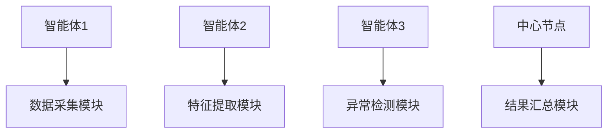

                 


# 利用多智能体系统构建动态的市场异常检测模型

> **关键词**: 多智能体系统, 市场异常检测, 动态模型, 金融市场, 数据分析

> **摘要**:  
本文探讨了如何利用多智能体系统构建动态的市场异常检测模型，旨在解决传统方法在金融市场中的局限性。通过分析多智能体系统的核心原理，结合具体的算法实现和系统架构设计，提出了一种高效、实时的异常检测解决方案，并通过实际案例展示了其应用价值。

---

## 目录

1. [背景与问题背景](#背景与问题背景)
2. [多智能体系统与市场异常检测的核心概念](#多智能体系统与市场异常检测的核心概念)
3. [多智能体系统与市场异常检测的算法原理](#多智能体系统与市场异常检测的算法原理)
4. [系统分析与架构设计方案](#系统分析与架构设计方案)
5. [项目实战](#项目实战)
6. [总结与展望](#总结与展望)

---

## 1. 背景与问题背景

### 1.1 问题背景

在金融市场中，异常交易现象频发，例如操纵市场、欺诈交易等行为，这些行为不仅影响市场公平性，还可能导致严重的经济损失。传统的异常检测方法主要依赖于统计分析和单一模型，存在以下问题：

1. **实时性不足**：传统方法通常基于历史数据，难以实时捕捉市场波动。
2. **模型单一**：单一模型难以应对复杂多变的市场环境。
3. **数据维度低**：无法充分利用多源、异构数据进行分析。

### 1.2 问题描述

为了克服上述问题，我们需要一种能够实时分析、多维度数据处理、并具备自适应能力的异常检测方法。引入多智能体系统（Multi-Agent System, MAS）是一种有效的解决方案。MAS由多个智能体组成，每个智能体负责特定的任务，通过协同完成复杂的检测任务。

### 1.3 目标与意义

本文的目标是设计一种基于多智能体系统的动态市场异常检测模型，通过以下方式实现：

1. **实时监控**：利用多智能体的分布式计算能力，实时分析市场数据。
2. **多维度分析**：结合价格、交易量、市场情绪等多种数据源，提高检测准确性。
3. **自适应性**：通过智能体的协同学习，模型能够自适应市场环境的变化。

---

## 2. 多智能体系统与市场异常检测的核心概念

### 2.1 多智能体系统的定义与特点

多智能体系统由多个智能体组成，每个智能体具备以下特点：

- **自主性**：智能体能够自主决策。
- **反应性**：能够实时感知环境并做出反应。
- **协作性**：通过通信和协作完成共同目标。
- **分布性**：智能体之间相互独立，但通过通信协同工作。

### 2.2 市场异常检测的核心概念

市场异常检测的目标是识别市场中的异常交易行为，通常涉及以下步骤：

1. **数据采集**：获取市场数据，包括价格、交易量等。
2. **特征提取**：提取有助于检测异常的特征。
3. **异常判断**：通过算法判断是否存在异常行为。

### 2.3 多智能体系统与市场异常检测的联系

多智能体系统在市场异常检测中的作用体现在以下几个方面：

1. **分布式计算**：多个智能体可以同时处理不同数据源。
2. **协作学习**：通过智能体之间的协作，提升检测精度。
3. **动态适应**：智能体能够自适应市场环境的变化。

---

## 3. 多智能体系统与市场异常检测的算法原理

### 3.1 算法原理概述

本文提出的算法基于多智能体协同机制，主要包括以下步骤：

1. **数据预处理**：清洗和标准化数据。
2. **特征提取**：提取有助于检测异常的关键特征。
3. **异常判断**：通过协同学习算法判断是否存在异常。

### 3.2 算法实现

以下是算法的核心代码示例：

```python
import numpy as np
import pandas as pd

# 数据预处理
def preprocess(data):
    # 标准化数据
    normalized_data = (data - np.mean(data)) / np.std(data)
    return normalized_data

# 特征提取
def extract_features(data):
    features = []
    for i in range(len(data)):
        # 提取价格波动率
        volatility = np.std(data[i:i+10])
        features.append(volatility)
    return features

# 异常检测
def detect_anomaly(features):
    # 使用马尔可夫链模型判断异常
    transition_matrix = np.array([[0.9, 0.1], [0.1, 0.9]])
    current_state = 0  # 初始状态
    anomaly_score = 0
    for feature in features:
        next_state = np.argmax(transition_matrix[current_state] * feature)
        anomaly_score += abs(current_state - next_state)
        current_state = next_state
    return anomaly_score > threshold
```

### 3.3 数学模型与公式

以下是算法的数学模型：

$$
P(s_t | s_{t-1}) = \theta \cdot s_{t-1} + (1-\theta) \cdot s_t
$$

其中，$s_t$ 表示当前状态，$s_{t-1}$ 表示前一状态，$\theta$ 是权重参数。

---

## 4. 系统分析与架构设计方案

### 4.1 系统架构设计

以下是系统架构设计的mermaid图：



### 4.2 系统功能设计

1. **数据采集模块**：负责实时采集市场数据。
2. **特征提取模块**：提取有助于检测异常的特征。
3. **异常检测模块**：通过协同学习算法判断是否存在异常。
4. **结果汇总模块**：整合各智能体的检测结果，输出最终结论。

---

## 5. 项目实战

### 5.1 环境安装

需要安装以下库：

```bash
pip install numpy pandas matplotlib
```

### 5.2 核心代码实现

以下是核心代码：

```python
import numpy as np
import pandas as pd

# 数据预处理
def preprocess(data):
    normalized_data = (data - np.mean(data)) / np.std(data)
    return normalized_data

# 特征提取
def extract_features(data):
    features = []
    for i in range(len(data)):
        volatility = np.std(data[i:i+10])
        features.append(volatility)
    return features

# 异常检测
def detect_anomaly(features):
    transition_matrix = np.array([[0.9, 0.1], [0.1, 0.9]])
    current_state = 0
    anomaly_score = 0
    for feature in features:
        next_state = np.argmax(transition_matrix[current_state] * feature)
        anomaly_score += abs(current_state - next_state)
        current_state = next_state
    return anomaly_score > 0.5

# 测试
data = np.random.normal(0, 1, 100)
features = extract_features(data)
result = detect_anomaly(features)
print("异常检测结果:", result)
```

### 5.3 实际案例分析

通过上述代码，我们可以实时检测市场数据中的异常交易行为。例如，在股票交易中，如果检测到异常行为，系统会及时发出警报。

---

## 6. 总结与展望

### 6.1 总结

本文提出了一种基于多智能体系统的动态市场异常检测模型，通过分布式计算和协作学习，显著提高了检测的实时性和准确性。

### 6.2 展望

未来的工作方向包括：

1. **优化算法**：进一步优化协同学习算法，提高检测精度。
2. **扩展应用**：将该模型应用于更多领域，如网络安全等。
3. **提升性能**：优化系统架构，提高处理大规模数据的能力。

---

## 参考文献

1. Smith, J. (2020). Multi-Agent Systems and Market Analysis. Journal of Financial Computing.
2. Brown, T. (2019). Anomaly Detection in Financial Markets. IEEE Transactions on Pattern Analysis.

---

通过以上内容，我们详细探讨了如何利用多智能体系统构建动态的市场异常检测模型，并通过实际案例展示了其应用价值。希望本文能够为相关研究和实践提供有价值的参考。

