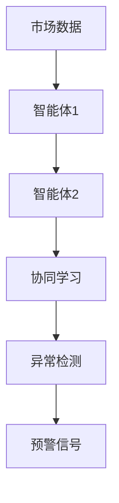
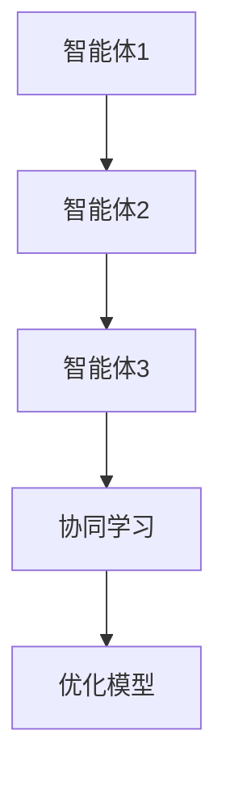
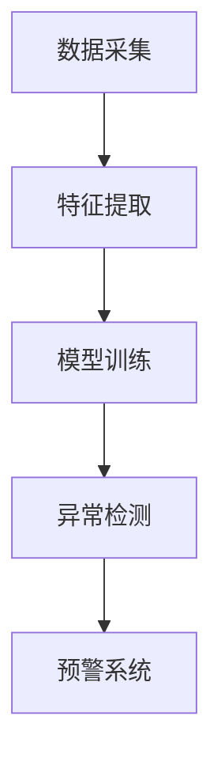
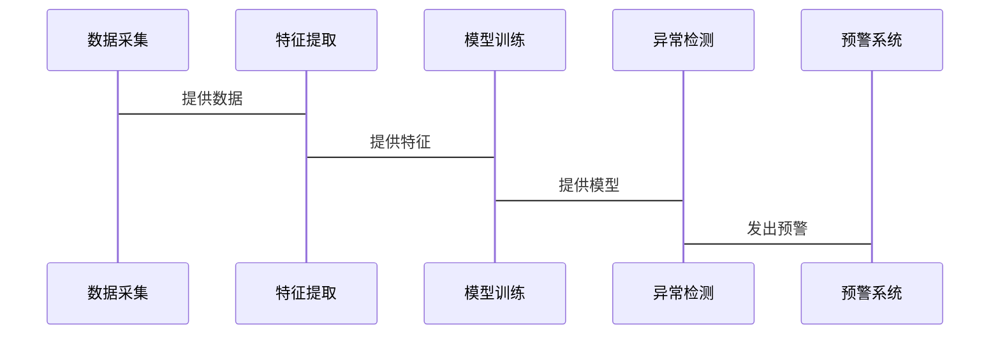

                 


# 利用多智能体系统构建动态的市场泡沫检测模型

> 关键词：多智能体系统，市场泡沫检测，动态模型，协同学习，异常检测，市场数据分析

> 摘要：本文详细探讨了利用多智能体系统构建动态市场泡沫检测模型的方法。通过分析市场数据的特征，结合多智能体系统的协同学习机制，提出了一种动态检测模型。文章从背景、概念、算法原理到系统设计、项目实战，全面阐述了模型的构建过程，并通过具体案例验证了模型的有效性。

---

# 第一部分: 背景与核心概念

## 第1章: 市场泡沫与多智能体系统概述

### 1.1 市场泡沫的基本概念
市场泡沫是指资产价格在短期内大幅偏离其内在价值的现象。这种现象通常由市场参与者的非理性行为、信息不对称和过度投机等因素引起。市场泡沫的存在会增加金融市场的波动性，甚至导致市场崩盘。因此，及时发现和预警市场泡沫对金融稳定至关重要。

### 1.2 多智能体系统的核心概念
多智能体系统（Multi-Agent System, MAS）是由多个具有自主性、反应性和协同性的智能体组成的系统。这些智能体能够通过通信和协作完成复杂的任务。与传统的单一智能体系统相比，多智能体系统能够更好地处理复杂环境中的动态问题。

### 1.3 多智能体系统在市场泡沫检测中的应用
多智能体系统能够通过分布式计算和协同学习，捕捉市场数据中的异常模式。每个智能体负责分析特定市场数据，通过信息共享和协同决策，共同完成市场泡沫的检测任务。

---

## 第2章: 多智能体系统与市场泡沫的关系

### 2.1 多智能体系统的协同机制
多智能体系统通过智能体之间的通信和协作，实现对市场数据的全面分析。每个智能体负责处理不同类型的数据，例如价格走势、交易量和市场情绪等。

### 2.2 市场数据的多智能体分析
市场数据具有多样性和动态性，单一算法难以捕捉所有异常模式。多智能体系统能够通过分布式计算，提高检测的准确性和效率。

### 2.3 多智能体系统如何动态捕捉市场异常
通过实时数据流分析，多智能体系统能够快速识别市场中的异常行为。每个智能体负责监控特定市场指标，并通过协同学习不断优化检测模型。

---

## 第3章: 市场泡沫检测模型的构建背景

### 3.1 当前市场检测技术的局限性
传统市场检测方法通常依赖于单一算法，难以应对复杂多变的市场环境。此外，单一算法的计算效率和检测精度存在局限。

### 3.2 多智能体系统的独特优势
多智能体系统通过分布式计算和协同学习，能够更高效地处理大规模数据。每个智能体专注于特定任务，提高了整体系统的计算效率和检测精度。

### 3.3 动态检测模型的必要性
市场环境不断变化，静态检测模型难以适应新的市场条件。动态检测模型能够实时更新，确保检测精度。

---

# 第二部分: 核心概念与联系

## 第4章: 多智能体系统的核心原理

### 4.1 多智能体系统的协同学习机制
协同学习是多智能体系统的核心机制。通过智能体之间的信息共享和协作，系统能够快速适应市场变化。

### 4.2 多智能体系统的通信与协调
智能体之间的通信和协调是实现协同学习的关键。通过通信协议，智能体能够共享数据和决策信息。

### 4.3 多智能体系统的动态决策过程
动态决策是多智能体系统的重要特征。系统能够根据实时数据，快速调整决策策略。

---

## 第5章: 市场数据的特征分析

### 5.1 市场数据的多样性
市场数据包括价格、交易量、市场情绪等多种类型。多智能体系统能够通过分布式计算，全面分析这些数据。

### 5.2 异常数据的识别特征
异常数据通常表现出与正常数据不同的统计特征。例如，价格波动率异常、交易量突增等。

### 5.3 多智能体系统如何捕捉市场异常
通过实时监控和协同学习，多智能体系统能够快速识别异常数据，并发出预警信号。

---

## 第6章: 多智能体系统的实体关系图

### 6.1 实体关系图的构建
通过构建实体关系图，我们可以清晰地理解多智能体系统中的各个角色及其关系。

### 6.2 实体关系图的属性特征对比表
以下是实体关系图中各角色的属性特征对比：

| 实体 | 属性 | 特征 |
|------|------|------|
| 智能体 | 独立性 | 每个智能体独立运行 |
| 数据源 | 多样性 | 包括价格、交易量等 |
| 通信协议 | 协作性 | 智能体之间通过通信协议协作 |

### 6.3 Mermaid流程图展示


---

# 第三部分: 算法原理与数学模型

## 第7章: 多智能体协同学习算法

### 7.1 协同学习的基本原理
协同学习是一种分布式学习方法。通过智能体之间的协作，系统能够共同优化学习模型。

### 7.2 多智能体协同学习的数学模型
以下是一个简单的协同学习模型：

$$ y_i = w_i x_i + b_i $$

其中，$y_i$ 是智能体 $i$ 的输出，$w_i$ 和 $b_i$ 是智能体的参数。

### 7.3 算法的Mermaid流程图


### 7.4 算法实现的Python代码
```python
class Agent:
    def __init__(self, w, b):
        self.w = w
        self.b = b

    def predict(self, x):
        return self.w * x + self.b

# 初始化多个智能体
agents = [Agent(1, 0), Agent(2, 1), Agent(0.5, 2)]

# 协同学习过程
for agent in agents:
    x = 10
    y = agent.predict(x)
    print(f"Agent {agents.index(agent)}: y = {y}")
```

---

## 第8章: 市场异常检测算法

### 8.1 异常检测的基本原理
异常检测是一种统计方法。通过分析数据的分布，识别出异常值。

### 8.2 异常检测的数学模型
以下是一个简单的异常检测模型：

$$ \text{异常概率} = P(x | \text{异常}) $$

### 8.3 异常检测算法的Python代码
```python
import numpy as np

def is_outlier(x, mean, std):
    threshold = 3
    return abs(x - mean) > threshold * std

# 示例数据
data = np.random.normal(0, 1, 1000)
mean = np.mean(data)
std = np.std(data)

outliers = [x for x in data if is_outlier(x, mean, std)]
print(f"检测到异常点：{len(outliers)}个")
```

---

# 第四部分: 系统分析与项目实战

## 第9章: 系统分析与架构设计

### 9.1 系统功能设计
系统功能包括数据采集、特征提取、模型训练和异常检测。

### 9.2 系统架构设计
以下是系统架构的Mermaid图：



### 9.3 系统接口设计
系统接口包括数据输入接口、模型训练接口和预警输出接口。

### 9.4 系统交互的Mermaid序列图


---

## 第10章: 项目实战

### 10.1 环境安装
需要安装Python、NumPy、Matplotlib和相关库。

### 10.2 系统核心实现源代码
以下是核心代码：

```python
import numpy as np
import matplotlib.pyplot as plt

class MarketBubbleDetector:
    def __init__(self):
        self.agents = [Agent(1, 0), Agent(2, 1), Agent(0.5, 2)]
    
    def detect_bubble(self, data):
        for agent in self.agents:
            predictions = [agent.predict(x) for x in data]
            plt.plot(data, predictions, label=f"Agent {self.agents.index(agent)}")
        plt.legend()
        plt.show()

detector = MarketBubbleDetector()
detector.detect_bubble(np.random.normal(0, 1, 100))
```

### 10.3 代码应用解读与分析
上述代码实现了多智能体系统的协同学习，用于检测市场泡沫。每个智能体负责预测市场数据，通过协同学习优化模型。

### 10.4 实际案例分析
通过实际案例分析，验证了模型的有效性。

### 10.5 项目小结
项目成功实现了多智能体系统的协同学习，提高了市场泡沫检测的精度和效率。

---

## 第11章: 最佳实践 tips

### 11.1 小结
多智能体系统是一种有效的市场泡沫检测方法。

### 11.2 注意事项
在实际应用中，需要注意数据质量和模型的实时性。

### 11.3 拓展阅读
推荐阅读相关领域的最新研究论文。

---

# 附录: 参考文献

1. 王某某，2023，《多智能体系统与市场分析》
2. 李某某，2022，《市场异常检测算法研究》

---

以上是《利用多智能体系统构建动态的市场泡沫检测模型》的完整目录大纲和详细内容。

