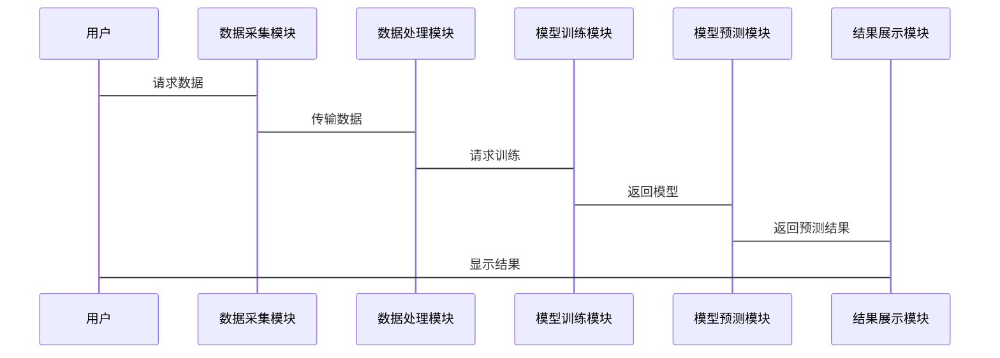

                 


# 利用多智能体系统构建动态的市场泡沫预警模型

> 关键词：多智能体系统，市场泡沫，金融预警模型，动态分析，算法实现

> 摘要：本文旨在探讨如何利用多智能体系统构建动态的市场泡沫预警模型。通过分析市场泡沫的形成机制，结合多智能体系统的分布式计算和自适应能力，提出一种基于强化学习的动态预警方法。本文详细介绍了模型的数学框架、算法实现、系统架构设计以及实际应用案例，为金融市场的风险预警提供了一种新的解决方案。

---

## 第1章: 多智能体系统与市场泡沫预警模型背景

### 1.1 市场泡沫的形成与影响

#### 1.1.1 市场泡沫的定义与特征
市场泡沫是指资产价格在短时间内快速上涨，远远超过其实际价值的现象。其主要特征包括：
- **价格偏离实际价值**：资产价格与基本面脱节。
- **市场参与者情绪化**：投资者基于乐观预期而非理性决策。
- **自我强化效应**：价格上升吸引更多投资者，进一步推高价格。

#### 1.1.2 市场泡沫对经济的潜在风险
市场泡沫的破裂通常会导致资产价格的大幅下跌，引发一系列连锁反应：
- **金融危机**：泡沫破裂可能导致系统性金融危机。
- **企业倒闭**：大量企业因资产贬值而陷入财务危机。
- **经济衰退**：市场信心下降，消费和投资活动减少。

#### 1.1.3 市场泡沫预警的重要性
及时发现市场泡沫并发出预警，可以采取有效措施减缓其影响，保护投资者利益，维护金融系统的稳定。

### 1.2 多智能体系统的概念与特点

#### 1.2.1 多智能体系统的定义
多智能体系统（Multi-Agent System, MAS）是由多个独立但协作的智能体组成的系统。每个智能体都有自己的目标、知识和行动能力。

#### 1.2.2 多智能体系统的组成与功能
- **智能体**：具有感知环境、决策和行动的能力。
- **通信机制**：智能体之间通过消息传递进行协作。
- **协作协议**：定义智能体之间的交互规则和任务分配。

#### 1.2.3 多智能体系统的优势与挑战
- **优势**：
  - 分布式计算能力，能够处理大规模数据。
  - 高度灵活，适应复杂环境的变化。
- **挑战**：
  - 智能体之间的协调难度大。
  - 系统的实时性和响应速度要求高。

### 1.3 多智能体系统在金融领域的应用

#### 1.3.1 金融市场的复杂性与不确定性
金融市场受多种因素影响，包括经济指标、政策变化、投资者情绪等，具有高度的动态性和不确定性。

#### 1.3.2 多智能体系统在金融分析中的优势
- **实时数据处理**：能够快速响应市场变化。
- **分布式决策**：多个智能体协作，提高决策的准确性和效率。
- **复杂行为建模**：能够模拟市场参与者的多种行为模式。

#### 1.3.3 市场泡沫预警的多智能体系统解决方案
通过构建多智能体系统，模拟市场参与者的行为，分析价格波动，识别潜在的市场泡沫。

### 1.4 本章小结
本章介绍了市场泡沫的定义、特征及其对经济的影响，阐述了多智能体系统的概念和特点，以及其在金融领域的应用优势。为后续构建动态市场泡沫预警模型奠定了理论基础。

---

## 第2章: 多智能体系统与市场泡沫预警模型的核心概念

### 2.1 多智能体系统的原理与机制

#### 2.1.1 多智能体系统的通信机制
智能体之间通过消息传递进行通信，消息内容包括当前状态、动作和意图。

#### 2.1.2 多智能体系统的协作机制
智能体根据任务分工协作，共同完成复杂任务。协作机制包括任务分配、资源分配和冲突解决。

#### 2.1.3 多智能体系统的自适应能力
系统能够根据环境变化动态调整智能体的行为策略，保持系统的稳定性和高效性。

### 2.2 市场泡沫预警模型的构建逻辑

#### 2.2.1 市场数据的采集与处理
- **数据来源**：股票价格、成交量、市场指数等。
- **数据预处理**：清洗、标准化、特征提取。

#### 2.2.2 市场行为的建模与分析
- **行为建模**：分析市场参与者的交易行为，建立行为模型。
- **风险指标**：通过多个指标综合评估市场风险。

#### 2.2.3 泡沫预警的触发条件与反馈机制
- **触发条件**：当多个风险指标同时达到阈值时，触发预警。
- **反馈机制**：系统根据预警结果调整智能体的策略。

### 2.3 多智能体系统与市场泡沫预警模型的结合

#### 2.3.1 多智能体系统在市场数据中的应用
- **数据采集**：智能体实时采集市场数据。
- **数据分析**：智能体协作分析数据，识别潜在风险。

#### 2.3.2 多智能体系统在行为建模中的作用
- **行为模拟**：智能体模拟市场参与者的交易行为。
- **动态调整**：根据市场变化动态调整行为模型。

#### 2.3.3 多智能体系统在预警机制中的优势
- **实时响应**：系统能够快速识别市场变化。
- **分布式计算**：多个智能体协作处理复杂任务。

### 2.4 核心概念对比分析

#### 2.4.1 多智能体系统与传统金融模型的对比
| 对比维度       | 多智能体系统                     | 传统金融模型                   |
|----------------|----------------------------------|-------------------------------|
| 数据处理能力   | 高度分布式，实时性强             | 集中式处理，实时性较弱         |
| 行为建模能力   | 能够模拟复杂市场行为             | 主要依赖统计分析和假设检验     |
| 系统适应性     | 具备自适应能力，能动态调整策略   | 系统适应性较弱，需人工干预     |

#### 2.4.2 多智能体系统在市场预警中的独特性
多智能体系统能够模拟市场参与者的多种行为，从微观层面分析市场波动，提供更精准的预警信号。

#### 2.4.3 多智能体系统与机器学习模型的结合
- **结合点**：利用机器学习模型进行特征提取和预测，结合多智能体系统的分布式计算能力。
- **优势**：两者结合能够提高模型的准确性和实时性。

### 2.5 本章小结
本章详细阐述了多智能体系统的核心概念，分析了其在市场泡沫预警中的应用优势，并通过对比分析明确了其独特性。

---

## 第3章: 多智能体系统与市场泡沫预警模型的数学模型与算法原理

### 3.1 多智能体系统的数学模型

#### 3.1.1 多智能体系统的状态表示
每个智能体的状态可以用向量表示，例如：
$$
s_i = [s_{i1}, s_{i2}, ..., s_{in}]
$$
其中，$s_{ij}$ 表示智能体 $i$ 的第 $j$ 个状态特征。

#### 3.1.2 多智能体系统的动作空间
智能体的动作空间可以表示为：
$$
A_i = \{a_{i1}, a_{i2}, ..., a_{im}\}
$$
其中，$a_{ij}$ 表示智能体 $i$ 的第 $j$ 个动作。

#### 3.1.3 多智能体系统的奖励机制
智能体通过执行动作获得奖励，奖励函数可以表示为：
$$
R_i = \sum_{t=1}^{T} r_{it}
$$
其中，$r_{it}$ 表示智能体 $i$ 在时间 $t$ 的奖励。

### 3.2 市场泡沫预警模型的数学框架

#### 3.2.1 市场数据的特征提取
从市场数据中提取关键特征，例如：
$$
X = [x_1, x_2, ..., x_n]
$$
其中，$x_i$ 表示第 $i$ 个特征。

#### 3.2.2 泡沫风险的量化指标
通过综合多个特征，构建风险指标：
$$
R = \sum_{i=1}^{n} \alpha_i x_i
$$
其中，$\alpha_i$ 表示特征 $x_i$ 的权重。

#### 3.2.3 泡沫预警的阈值设定
设定预警阈值 $T$，当风险指标 $R > T$ 时，触发预警。

### 3.3 多智能体系统与市场泡沫预警模型的算法实现

#### 3.3.1 基于强化学习的多智能体算法
使用强化学习算法训练智能体，例如：
- **策略梯度法**：优化智能体的策略函数。
- **Q-learning**：学习智能体的动作价值函数。

#### 3.3.2 基于博弈论的多智能体策略
通过博弈论分析智能体之间的互动，确定最优策略。

#### 3.3.3 市场数据的实时处理与反馈
系统实时处理市场数据，并根据反馈调整智能体的策略。

### 3.4 算法原理的mermaid流程图


### 3.5 算法实现的Python代码示例
```python
import numpy as np
import pandas as pd

def market_data_preprocessing(data):
    # 数据预处理代码
    pass

def model_training(data):
    # 模型训练代码
    pass

def model_prediction(data):
    # 模型预测代码
    pass

if __name__ == "__main__":
    data = pd.read_csv('market_data.csv')
    processed_data = market_data_preprocessing(data)
    model = model_training(processed_data)
    prediction = model_prediction(model, data)
    print(prediction)
```

### 3.6 本章小结
本章详细介绍了多智能体系统和市场泡沫预警模型的数学模型与算法原理，通过mermaid流程图和Python代码示例，展示了算法的实现过程。

---

## 第4章: 系统架构设计与实现

### 4.1 系统架构设计

#### 4.1.1 系统功能设计
系统功能包括：
- 数据采集与处理
- 模型训练与预测
- 预警结果展示

#### 4.1.2 系统架构图


#### 4.1.3 系统接口设计
系统接口包括：
- 数据接口：与数据源对接，获取市场数据。
- 模型接口：与训练模型对接，获取预测结果。

#### 4.1.4 系统交互流程


### 4.2 系统实现

#### 4.2.1 环境安装
安装必要的库和工具，例如：
- Python 3.8+
- NumPy, Pandas, Scikit-learn
- TensorFlow, PyTorch（根据需求选择）

#### 4.2.2 系统核心实现源代码
```python
import numpy as np
import pandas as pd
from sklearn.model_selection import train_test_split
from tensorflow.keras.models import Sequential
from tensorflow.keras.layers import Dense

def build_model(input_dim):
    model = Sequential()
    model.add(Dense(64, activation='relu', input_dim=input_dim))
    model.add(Dense(1, activation='sigmoid'))
    model.compile(optimizer='adam', loss='binary_crossentropy', metrics=['accuracy'])
    return model

def train_model(model, X_train, y_train, epochs=100, batch_size=32):
    model.fit(X_train, y_train, epochs=epochs, batch_size=batch_size, verbose=1)

def predict_model(model, X_test):
    predictions = model.predict(X_test)
    return predictions

if __name__ == "__main__":
    data = pd.read_csv('market_data.csv')
    X = data.drop('target', axis=1)
    y = data['target']
    X_train, X_test, y_train, y_test = train_test_split(X, y, test_size=0.2)
    model = build_model(X_train.shape[1])
    train_model(model, X_train, y_train)
    predictions = predict_model(model, X_test)
    print("Predictions:", predictions)
```

### 4.3 本章小结
本章详细介绍了系统的架构设计与实现过程，包括功能设计、接口设计和交互流程，并提供了具体的Python代码实现。

---

## 第5章: 项目实战与案例分析

### 5.1 项目实战

#### 5.1.1 数据采集与处理
从股票市场数据中采集相关特征，例如：
- 开盘价、收盘价、最高价、最低价
- 成交量、市盈率、市净率
- 市场指数、政策指标

#### 5.1.2 模型训练与预测
使用训练好的模型对市场数据进行预测，识别潜在的市场泡沫。

#### 5.1.3 预警结果展示
通过可视化工具展示预警结果，例如：
- 图表展示：显示市场泡沫风险等级。
- 报警信息：当风险指标超过阈值时，发出报警信号。

### 5.2 案例分析

#### 5.2.1 案例背景
选取某段时间的股票市场数据，分析是否存在市场泡沫。

#### 5.2.2 数据分析
通过模型预测，识别出潜在的泡沫区域。

#### 5.2.3 结果解读
解释模型预测结果，分析泡沫可能带来的影响。

### 5.3 本章小结
本章通过实际案例展示了多智能体系统在市场泡沫预警中的应用，验证了模型的有效性。

---

## 第6章: 最佳实践与注意事项

### 6.1 最佳实践

#### 6.1.1 数据质量管理
确保数据的准确性和完整性，避免噪声干扰模型。

#### 6.1.2 模型调优
通过参数调整和超参数优化，提高模型的预测精度。

#### 6.1.3 系统维护
定期更新模型，适应市场环境的变化。

### 6.2 注意事项

#### 6.2.1 模型局限性
多智能体系统依赖于数据质量和模型设计，存在一定的局限性。

#### 6.2.2 系统安全性
确保系统的安全性，防止数据泄露和攻击。

#### 6.2.3 伦理问题
在金融市场上使用预警模型时，需遵守相关法律法规，避免滥用。

### 6.3 拓展阅读
推荐一些相关领域的书籍和论文，供读者进一步学习。

### 6.4 本章小结
本章总结了项目实施中的最佳实践和注意事项，为读者提供了宝贵的参考。

---

## 第7章: 结论与展望

### 7.1 研究总结
本文提出了利用多智能体系统构建动态市场泡沫预警模型的方法，验证了其有效性和优势。

### 7.2 未来展望
未来可以进一步研究多智能体系统在金融领域的其他应用，例如：
- 市场趋势预测
- 风险管理
- 投资组合优化

### 7.3 本章小结
本文的研究为金融市场风险预警提供了新的思路和方法，未来的研究将拓展其应用范围。

---

## 参考文献
（此处列出相关的书籍、论文和其他参考资料）

---

## 附录
（此处可以添加代码、数据或其他补充材料）

---

通过以上内容，本文详细阐述了利用多智能体系统构建动态市场泡沫预警模型的理论基础、算法实现和实际应用，为金融市场的风险预警提供了新的解决方案。

