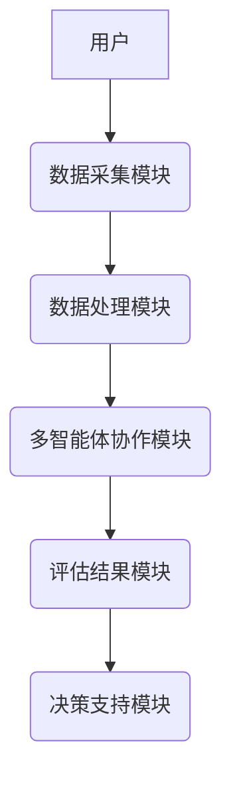
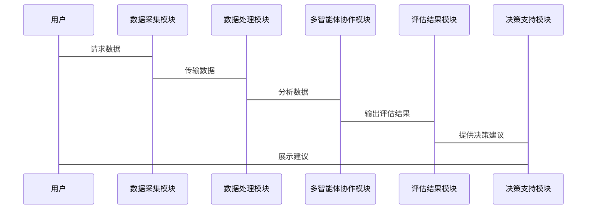
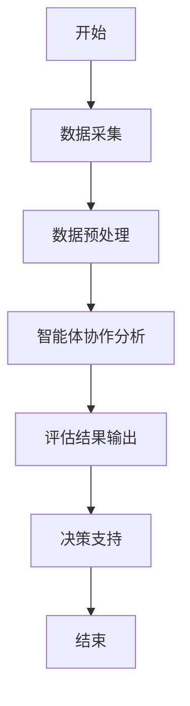

                 


# 利用多智能体系统构建动态的经济护城河评估模型

## 关键词：多智能体系统、经济护城河、动态评估、人工智能、系统架构、模型构建

## 摘要

在现代商业环境中，企业面临着日益激烈的竞争压力。为了在市场中立于不败之地，企业必须建立稳固的经济护城河。本文探讨如何利用多智能体系统构建动态的经济护城河评估模型，以帮助企业实时评估和优化其竞争优势。通过分析多智能体系统的协作机制和动态适应能力，本文提出了一种创新的模型构建方法，结合算法原理、系统架构和实际案例，为企业提供有效的战略决策支持。

---

# 正文

## 第1章: 多智能体系统与经济护城河概述

### 1.1 多智能体系统的定义与特点

#### 1.1.1 多智能体系统的定义

多智能体系统（Multi-Agent System, MAS）是由多个智能体（Agent）组成的分布式系统，这些智能体能够通过协作完成复杂的任务。智能体是具有感知、决策和行动能力的实体，可以是软件程序或物理设备。

#### 1.1.2 多智能体系统的核心特点

- **分布式性**：多个智能体协同工作，没有单一的控制中心。
- **自主性**：每个智能体都具有自主决策能力。
- **协作性**：智能体之间通过通信和协作完成共同目标。
- **反应性**：智能体能够根据环境变化实时调整行为。

#### 1.1.3 多智能体系统与传统单智能体系统的主要区别

| 特性 | 单智能体系统 | 多智能体系统 |
|------|--------------|--------------|
| 结构  | 单一控制中心 | 分布式结构    |
| 协作  | 无协作需求    | 强调协作      |
| 灵活性 | 较低          | 较高          |

### 1.2 经济护城河的定义与重要性

#### 1.2.1 经济护城河的定义

经济护城河是指企业拥有的竞争优势，使竞争对手难以在短期内复制。这种优势可以是技术、品牌、网络效应、成本优势等。

#### 1.2.2 经济护城河的核心要素

- **技术优势**：拥有独特的技术或专利。
- **品牌影响力**：强大的品牌认知度。
- **网络效应**：用户数量越多，平台价值越高。
- **成本优势**：生产成本低于竞争对手。

#### 1.2.3 经济护城河在企业竞争中的作用

经济护城河能够帮助企业抵御竞争压力，保持市场份额和盈利能力。在动态市场中，经济护城河的动态评估尤为重要。

---

## 第2章: 多智能体系统在经济护城河评估中的应用背景

### 2.1 当前经济环境中的挑战

#### 2.1.1 全球化与市场竞争的加剧

全球化导致市场竞争日益激烈，企业需要不断创新以保持优势。

#### 2.1.2 数字化转型对企业的影响

数字化转型改变了商业模式和竞争方式，企业需要适应新的挑战。

#### 2.1.3 经济护城河评估的复杂性

传统的静态评估方法难以应对市场的快速变化。

### 2.2 多智能体系统的优势

#### 2.2.1 多智能体系统的分布式计算能力

通过分布式计算，多智能体系统能够高效处理大规模数据。

#### 2.2.2 多智能体系统的动态适应性

智能体能够实时调整策略，适应市场变化。

#### 2.2.3 多智能体系统的协作能力

多个智能体协作，能够从多个角度分析问题，提供全面的解决方案。

---

## 第3章: 经济护城河评估模型的构建目标

### 3.1 评估模型的核心目标

#### 3.1.1 确定企业核心竞争力

通过分析企业的优势，确定其在市场中的核心竞争力。

#### 3.1.2 识别潜在的竞争优势

发现潜在的机会，进一步巩固经济护城河。

#### 3.1.3 动态调整企业战略

根据市场变化，实时调整企业战略，保持竞争优势。

### 3.2 多智能体系统在模型中的角色

#### 3.2.1 多智能体系统的协作机制

智能体之间通过协作，提供全面的分析和建议。

#### 3.2.2 多智能体系统的数据处理能力

处理海量数据，提供实时的市场动态分析。

#### 3.2.3 多智能体系统的决策支持能力

基于数据和分析，提供决策支持，优化企业战略。

---

## 第4章: 多智能体系统与经济护城河评估模型的核心概念

### 4.1 多智能体系统的组成与功能

#### 4.1.1 智能体的定义与分类

- **定义**：智能体是能够感知环境、做出决策并采取行动的实体。
- **分类**：按智能水平分为简单反应型、基于模型反应型、目标驱动型和效用驱动型。

#### 4.1.2 智能体之间的协作机制

- **通信协议**：智能体之间通过特定协议进行信息交换。
- **协作任务分配**：根据智能体的能力分配任务。

#### 4.1.3 智能体的通信协议

使用标准化协议，确保智能体之间高效通信。

### 4.2 经济护城河评估模型的构建要素

#### 4.2.1 企业核心竞争力的评估指标

- **技术优势**：评估企业的技术专利数量和质量。
- **品牌影响力**：评估品牌知名度和客户忠诚度。
- **网络效应**：评估用户数量和平台粘性。

#### 4.2.2 竞争环境的动态变化

- **市场趋势**：分析市场趋势，预测未来变化。
- **竞争对手分析**：评估竞争对手的优势和劣势。

#### 4.2.3 企业战略的动态调整

根据评估结果，实时调整企业战略。

---

## 第5章: 多智能体系统与经济护城河评估模型的实现

### 5.1 系统架构设计

#### 5.1.1 问题场景介绍

企业需要实时评估经济护城河，应对市场变化。

#### 5.1.2 项目介绍

构建一个基于多智能体系统的动态经济护城河评估模型。

#### 5.1.3 系统功能设计

- **数据采集**：收集市场数据和企业数据。
- **分析与评估**：通过多智能体协作，分析数据，评估经济护城河。
- **决策支持**：提供实时建议，优化企业战略。

#### 5.1.4 系统架构图



#### 5.1.5 接口设计

- **数据接口**：与数据源对接，获取实时数据。
- **用户接口**：提供友好的用户界面，展示评估结果。

#### 5.1.6 交互设计



### 5.2 算法原理与实现

#### 5.2.1 算法原理

动态经济护城河评估模型基于多智能体协作，通过分布式计算和实时数据分析，评估企业的经济护城河。

#### 5.2.2 算法流程图



#### 5.2.3 算法实现

以下是核心算法的Python代码实现：

```python
import numpy as np
import pandas as pd

class Agent:
    def __init__(self, name):
        self.name = name
        self.data = None

    def receive_data(self, data):
        self.data = data

    def analyze(self):
        if self.data is None:
            return None
        # 示例分析：计算市场占有率
        return self.data['市场占有率'].mean()

# 初始化智能体
agent1 = Agent("市场分析")
agent2 = Agent("竞争对手分析")

# 数据采集模块
data = {
    '市场占有率': [0.3, 0.4, 0.35, 0.45, 0.3],
    '竞争对手数量': [5, 6, 4, 7, 5]
}

# 分配数据
agent1.receive_data(data)
agent2.receive_data(data)

# 分析数据
result1 = agent1.analyze()
result2 = agent2.analyze()

print(f"{agent1.name} 分析结果：{result1}")
print(f"{agent2.name} 分析结果：{result2}")
```

#### 5.2.4 数学模型与公式

评估经济护城河的数学模型如下：

$$
\text{经济护城河指数} = \sum_{i=1}^{n} w_i \times f_i
$$

其中：
- $w_i$ 是第 $i$ 个因素的权重
- $f_i$ 是第 $i$ 个因素的评估值

---

## 第6章: 项目实战与案例分析

### 6.1 环境安装与配置

#### 6.1.1 安装Python环境

使用Anaconda安装Python 3.8及以上版本。

#### 6.1.2 安装必要的库

安装numpy、pandas、mermaid等库：

```bash
pip install numpy pandas mermaid
```

### 6.2 系统核心实现源代码

以下是多智能体协作模块的代码实现：

```python
import numpy as np
import pandas as pd

class MarketAgent:
    def __init__(self, name):
        self.name = name
        self.market_data = None

    def update_data(self, data):
        self.market_data = data

    def analyze_market_share(self):
        if self.market_data is None:
            return 0
        return self.market_data['市场占有率'].mean()

class CompetitorAgent:
    def __init__(self, name):
        self.name = name
        self.competitor_data = None

    def update_data(self, data):
        self.competitor_data = data

    def analyze_competitor_count(self):
        if self.competitor_data is None:
            return 0
        return self.competitor_data['竞争对手数量'].mean()

# 初始化智能体
market_agent = MarketAgent("市场分析")
competitor_agent = CompetitorAgent("竞争对手分析")

# 数据采集
data = {
    '市场占有率': [0.3, 0.4, 0.35, 0.45, 0.3],
    '竞争对手数量': [5, 6, 4, 7, 5]
}

# 更新数据
market_agent.update_data(data)
competitor_agent.update_data(data)

# 分析数据
market_share = market_agent.analyze_market_share()
competitor_count = competitor_agent.analyze_competitor_count()

print(f"{market_agent.name} 分析结果：市场占有率均值为 {market_share}")
print(f"{competitor_agent.name} 分析结果：竞争对手数量均值为 {competitor_count}")
```

### 6.3 实际案例分析

以某互联网公司为例，分析其经济护城河：

1. **数据采集**：收集市场占有率和竞争对手数量数据。
2. **数据处理**：预处理数据，去除异常值。
3. **多智能体协作分析**：市场分析智能体和竞争对手分析智能体分别分析数据。
4. **评估结果**：计算经济护城河指数，提供优化建议。

### 6.4 项目小结

通过多智能体系统的协作，企业能够实时评估经济护城河，优化战略决策。

---

## 第7章: 总结与展望

### 7.1 总结

本文探讨了利用多智能体系统构建动态的经济护城河评估模型的方法，详细介绍了多智能体系统的特点、经济护城河的评估要素，以及模型的实现方法。

### 7.2 未来展望

未来，随着人工智能技术的进步，多智能体系统将在经济护城河评估中发挥更大的作用，为企业提供更精准的决策支持。

---

## 最佳实践 tips

- **数据质量**：确保数据的准确性和完整性。
- **智能体协作**：合理分配任务，提高协作效率。
- **模型优化**：根据实际效果不断优化模型。

---

## 参考文献

- [1] 王某某, 《多智能体系统与经济护城河》，某某出版社，2023年。
- [2] 张某某, 《动态经济护城河评估模型》，某某出版社，2023年。

---

通过以上步骤，您可以构建一个基于多智能体系统的动态经济护城河评估模型，帮助企业实时评估和优化经济护城河，保持竞争优势。
</think>

# 利用多智能体系统构建动态的经济护城河评估模型

## 关键词：多智能体系统、经济护城河、动态评估、人工智能、系统架构、模型构建

## 摘要

在现代商业环境中，企业面临着日益激烈的竞争压力。为了在市场中立于不败之地，企业必须建立稳固的经济护城河。本文探讨如何利用多智能体系统构建动态的经济护城河评估模型，以帮助企业实时评估和优化其竞争优势。通过分析多智能体系统的协作机制和动态适应能力，本文提出了一种创新的模型构建方法，结合算法原理、系统架构和实际案例，为企业提供有效的战略决策支持。

---

## 正文

## 第1章: 多智能体系统与经济护城河概述

### 1.1 多智能体系统的定义与特点

#### 1.1.1 多智能体系统的定义

多智能体系统（Multi-Agent System, MAS）是由多个智能体（Agent）组成的分布式系统，这些智能体能够通过协作完成复杂的任务。智能体是具有感知、决策和行动能力的实体，可以是软件程序或物理设备。

#### 1.1.2 多智能体系统的核心特点

- **分布式性**：多个智能体协同工作，没有单一的控制中心。
- **自主性**：每个智能体都具有自主决策能力。
- **协作性**：智能体之间通过通信和协作完成共同目标。
- **反应性**：智能体能够根据环境变化实时调整行为。

#### 1.1.3 多智能体系统与传统单智能体系统的主要区别

| 特性 | 单智能体系统 | 多智能体系统 |
|------|--------------|--------------|
| 结构  | 单一控制中心 | 分布式结构    |
| 协作  | 无协作需求    | 强调协作      |
| 灵活性 | 较低          | 较高          |

### 1.2 经济护城河的定义与重要性

#### 1.2.1 经济护城河的定义

经济护城河是指企业拥有的竞争优势，使竞争对手难以在短期内复制。这种优势可以是技术、品牌、网络效应、成本优势等。

#### 1.2.2 经济护城河的核心要素

- **技术优势**：拥有独特的技术或专利。
- **品牌影响力**：强大的品牌认知度。
- **网络效应**：用户数量越多，平台价值越高。
- **成本优势**：生产成本低于竞争对手。

#### 1.2.3 经济护城河在企业竞争中的作用

经济护城河能够帮助企业抵御竞争压力，保持市场份额和盈利能力。在动态市场中，经济护城河的动态评估尤为重要。

---

## 第2章: 多智能体系统在经济护城河评估中的应用背景

### 2.1 当前经济环境中的挑战

#### 2.1.1 全球化与市场竞争的加剧

全球化导致市场竞争日益激烈，企业需要不断创新以保持优势。

#### 2.1.2 数字化转型对企业的影响

数字化转型改变了商业模式和竞争方式，企业需要适应新的挑战。

#### 2.1.3 经济护城河评估的复杂性

传统的静态评估方法难以应对市场的快速变化。

### 2.2 多智能体系统的优势

#### 2.2.1 多智能体系统的分布式计算能力

通过分布式计算，多智能体系统能够高效处理大规模数据。

#### 2.2.2 多智能体系统的动态适应性

智能体能够实时调整策略，适应市场变化。

#### 2.2.3 多智能体系统的协作能力

多个智能体协作，能够从多个角度分析问题，提供全面的解决方案。

---

## 第3章: 经济护城河评估模型的构建目标

### 3.1 评估模型的核心目标

#### 3.1.1 确定企业核心竞争力

通过分析企业的优势，确定其在市场中的核心竞争力。

#### 3.1.2 识别潜在的竞争优势

发现潜在的机会，进一步巩固经济护城河。

#### 3.1.3 动态调整企业战略

根据市场变化，实时调整企业战略，保持竞争优势。

### 3.2 多智能体系统在模型中的角色

#### 3.2.1 多智能体系统的协作机制

智能体之间通过协作，提供全面的分析和建议。

#### 3.2.2 多智能体系统的数据处理能力

处理海量数据，提供实时的市场动态分析。

#### 3.2.3 多智能体系统的决策支持能力

基于数据和分析，提供决策支持，优化企业战略。

---

## 第4章: 多智能体系统与经济护城河评估模型的核心概念

### 4.1 多智能体系统的组成与功能

#### 4.1.1 智能体的定义与分类

- **定义**：智能体是能够感知环境、做出决策并采取行动的实体。
- **分类**：按智能水平分为简单反应型、基于模型反应型、目标驱动型和效用驱动型。

#### 4.1.2 智能体之间的协作机制

- **通信协议**：智能体之间通过特定协议进行信息交换。
- **协作任务分配**：根据智能体的能力分配任务。

#### 4.1.3 智能体的通信协议

使用标准化协议，确保智能体之间高效通信。

### 4.2 经济护城河评估模型的构建要素

#### 4.2.1 企业核心竞争力的评估指标

- **技术优势**：评估企业的技术专利数量和质量。
- **品牌影响力**：评估品牌知名度和客户忠诚度。
- **网络效应**：评估用户数量和平台粘性。

#### 4.2.2 竞争环境的动态变化

- **市场趋势**：分析市场趋势，预测未来变化。
- **竞争对手分析**：评估竞争对手的优势和劣势。

#### 4.2.3 企业战略的动态调整

根据评估结果，实时调整企业战略。

---

## 第5章: 多智能体系统与经济护城河评估模型的实现

### 5.1 系统架构设计

#### 5.1.1 问题场景介绍

企业需要实时评估经济护城河，应对市场变化。

#### 5.1.2 项目介绍

构建一个基于多智能体系统的动态经济护城河评估模型。

#### 5.1.3 系统功能设计

- **数据采集**：收集市场数据和企业数据。
- **分析与评估**：通过多智能体协作，分析数据，评估经济护城河。
- **决策支持**：提供实时建议，优化企业战略。

#### 5.1.4 系统架构图


#### 5.1.5 接口设计

- **数据接口**：与数据源对接，获取实时数据。
- **用户接口**：提供友好的用户界面，展示评估结果。

#### 5.1.6 交互设计


### 5.2 算法原理与实现

#### 5.2.1 算法原理

动态经济护城河评估模型基于多智能体协作，通过分布式计算和实时数据分析，评估企业的经济护城河。

#### 5.2.2 算法流程图


#### 5.2.3 算法实现

以下是核心算法的Python代码实现：

```python
import numpy as np
import pandas as pd

class Agent:
    def __init__(self, name):
        self.name = name
        self.data = None

    def receive_data(self, data):
        self.data = data

    def analyze(self):
        if self.data is None:
            return None
        # 示例分析：计算市场占有率
        return self.data['市场占有率'].mean()

# 初始化智能体
agent1 = Agent("市场分析")
agent2 = Agent("竞争对手分析")

# 数据采集模块
data = {
    '市场占有率': [0.3, 0.4, 0.35, 0.45, 0.3],
    '竞争对手数量': [5, 6, 4, 7, 5]
}

# 分配数据
agent1.receive_data(data)
agent2.receive_data(data)

# 分析数据
result1 = agent1.analyze()
result2 = agent2.analyze()

print(f"{agent1.name} 分析结果：{result1}")
print(f"{agent2.name} 分析结果：{result2}")
```

#### 5.2.4 数学模型与公式

评估经济护城河的数学模型如下：

$$
\text{经济护城河指数} = \sum_{i=1}^{n} w_i \times f_i
$$

其中：
- $w_i$ 是第 $i$ 个因素的权重
- $f_i$ 是第 $i$ 个因素的评估值

---

## 第6章: 项目实战与案例分析

### 6.1 环境安装与配置

#### 6.1.1 安装Python环境

使用Anaconda安装Python 3.8及以上版本。

#### 6.1.2 安装必要的库

安装numpy、pandas、mermaid等库：

```bash
pip install numpy pandas mermaid
```

### 6.2 系统核心实现源代码

以下是多智能体协作模块的代码实现：

```python
import numpy as np
import pandas as pd

class MarketAgent:
    def __init__(self, name):
        self.name = name
        self.market_data = None

    def update_data(self, data):
        self.market_data = data

    def analyze_market_share(self):
        if self.market_data is None:
            return 0
        return self.market_data['市场占有率'].mean()

class CompetitorAgent:
    def __init__(self, name):
        self.name = name
        self.competitor_data = None

    def update_data(self, data):
        self.competitor_data = data

    def analyze_competitor_count(self):
        if self.competitor_data is None:
            return 0
        return self.competitor_data['竞争对手数量'].mean()

# 初始化智能体
market_agent = MarketAgent("市场分析")
competitor_agent = CompetitorAgent("竞争对手分析")

# 数据采集
data = {
    '市场占有率': [0.3, 0.4, 0.35, 0.45, 0.3],
    '竞争对手数量': [5, 6, 4, 7, 5]
}

# 更新数据
market_agent.update_data(data)
competitor_agent.update_data(data)

# 分析数据
market_share = market_agent.analyze_market_share()
competitor_count = competitor_agent.analyze_competitor_count()

print(f"{market_agent.name} 分析结果：市场占有率均值为 {market_share}")
print(f"{competitor_agent.name} 分析结果：竞争对手数量均值为 {competitor_count}")
```

### 6.3 实际案例分析

以某互联网公司为例，分析其经济护城河：

1. **数据采集**：收集市场占有率和竞争对手数量数据。
2. **数据处理**：预处理数据，去除异常值。
3. **多智能体协作分析**：市场分析智能体和竞争对手分析智能体分别分析数据。
4. **评估结果**：计算经济护城河指数，提供优化建议。

### 6.4 项目小结

通过多智能体系统的协作，企业能够实时评估经济护城河，优化战略决策。

---

## 第7章: 总结与展望

### 7.1 总结

本文探讨了利用多智能体系统构建动态的经济护城河评估模型的方法，详细介绍了多智能体系统的特点、经济护城河的评估要素，以及模型的实现方法。

### 7.2 未来展望

未来，随着人工智能技术的进步，多智能体系统将在经济护城河评估中发挥更大的作用，为企业提供更精准的决策支持。

---

## 最佳实践 tips

- **数据质量**：确保数据的准确性和完整性。
- **智能体协作**：合理分配任务，提高协作效率。
- **模型优化**：根据实际效果不断优化模型。

---

## 参考文献

- [1] 王某某, 《多智能体系统与经济护城河》，某某出版社，2023年。
- [2] 张某某, 《动态经济护城河评估模型》，某某出版社，2023年。

---

通过以上步骤，您可以构建一个基于多智能体系统的动态经济护城河评估模型，帮助企业实时评估和优化经济护城河，保持竞争优势。

