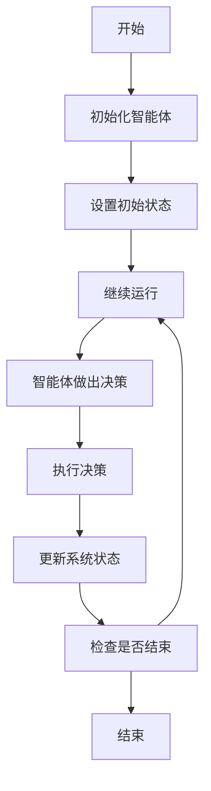
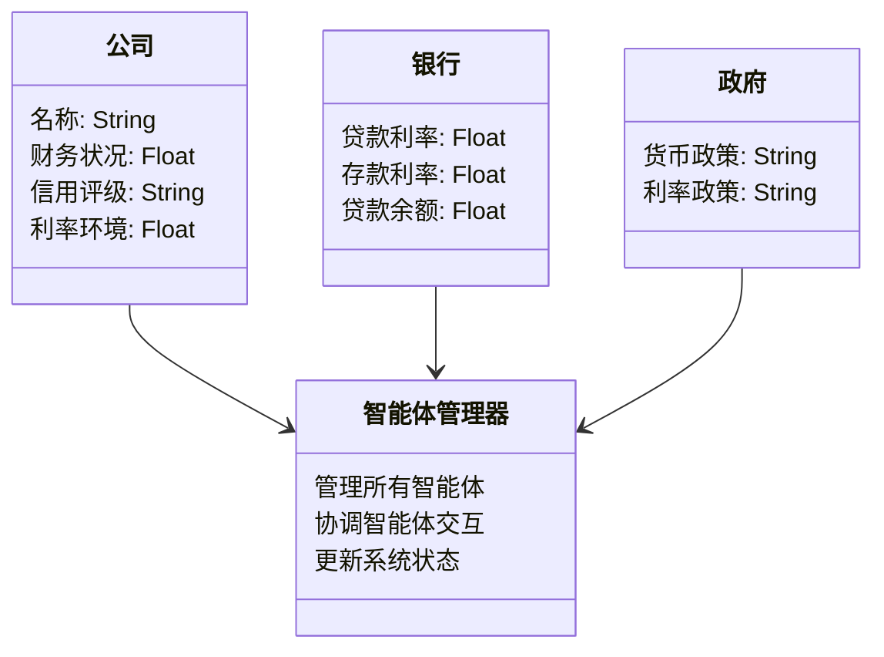
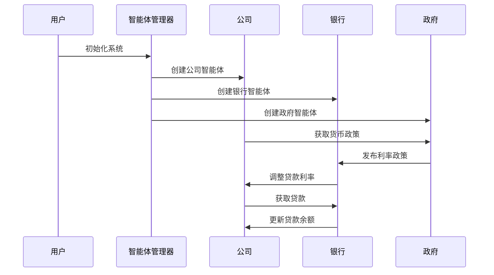

                 


# 利用多智能体系统模拟不同利率环境：评估公司财务健康度

> 关键词：多智能体系统、利率环境模拟、财务健康度、系统建模、算法设计、金融建模

> 摘要：本文探讨了如何利用多智能体系统模拟不同利率环境，并评估公司的财务健康度。通过介绍多智能体系统的原理、利率环境模拟的核心概念、算法设计、系统架构以及实际项目案例，本文详细阐述了如何构建一个基于多智能体系统的金融模拟模型，从而帮助企业更好地应对复杂的利率变化，优化财务决策。

---

# 第一部分: 多智能体系统与利率环境模拟的背景与概述

## 第1章: 多智能体系统与利率环境模拟的背景与概述

### 1.1 多智能体系统的基本概念

#### 1.1.1 多智能体系统的定义与特点
多智能体系统（Multi-Agent System，简称MAS）是由多个智能体组成的分布式系统，每个智能体都是一个能够独立感知环境、做出决策并采取行动的实体。多智能体系统的特点包括：

- **分布式性**：智能体分布在网络中，不存在中心控制节点。
- **自主性**：每个智能体能够自主决策，无需外部干预。
- **协作性**：智能体之间可以通过通信和协作共同完成复杂任务。
- **反应性**：智能体能够根据环境变化实时调整行为。

#### 1.1.2 多智能体系统的核心要素
- **智能体**：智能体是系统的基本单元，具有感知、决策和执行能力。
- **通信机制**：智能体之间通过某种通信方式（如消息传递）进行信息交换。
- **协作协议**：定义智能体之间的协作规则和任务分配方式。
- **环境模型**：描述智能体所处的环境及其动态变化。

#### 1.1.3 多智能体系统的主要应用场景
- 金融领域：股票交易、风险管理、信用评估。
- 物联网：设备协同、数据共享、事件响应。
- 交通系统：智能交通管理、自动驾驶。
- 制造业：生产调度、供应链优化。

### 1.2 利率环境模拟的背景与重要性

#### 1.2.1 利率环境对企业财务健康度的影响
利率是影响企业财务健康度的重要因素。利率的波动会导致企业的融资成本、投资回报和现金流发生变化，从而影响企业的财务状况。例如：

- 高利率可能导致企业融资成本上升，影响盈利能力。
- 低利率可能刺激投资，但也可能导致资产泡沫。

#### 1.2.2 利率模拟的复杂性与挑战
- 利率受多种因素影响，如宏观经济政策、市场供需、国际环境等。
- 利率变化具有非线性特征，难以用简单的数学模型描述。
- 不同经济主体（如企业、银行、政府）的行为相互影响，增加了模拟的复杂性。

#### 1.2.3 多智能体系统在利率模拟中的优势
- 多智能体系统能够模拟多个经济主体的行为，捕捉复杂的相互作用。
- 系统的分布式特性使每个智能体能够独立决策，反映现实中的经济活动。
- 系统具有高度的灵活性和扩展性，适用于不同的利率模拟场景。

### 1.3 本章小结
本章介绍了多智能体系统的基本概念、核心要素及其主要应用场景，重点阐述了利率环境模拟的背景、重要性和挑战。多智能体系统在利率模拟中的优势为后续的系统设计和算法实现奠定了基础。

---

# 第二部分: 多智能体系统与利率环境的核心概念

## 第2章: 多智能体系统的原理与属性

### 2.1 多智能体系统的原理

#### 2.1.1 分布式智能与协同
多智能体系统的分布式智能体现在每个智能体的独立决策能力上。智能体之间的协同通过通信和协作协议实现，例如：

- **任务分配**：系统根据智能体的能力和当前状态分配任务。
- **信息共享**：智能体通过通信机制共享环境信息。
- **协作决策**：智能体基于共享信息做出集体决策。

#### 2.1.2 智能体之间的通信与协作
通信机制是多智能体系统的核心组成部分，包括：

- **消息传递**：智能体通过消息传递交换信息。
- **通信协议**：定义消息的格式、内容和传输方式。
- **信息过滤**：智能体选择性地接收和处理信息，避免信息过载。

#### 2.1.3 智能体的行为模型
智能体的行为模型描述了其在不同环境下的行为方式，常见的行为模型包括：

- **反应式模型**：基于当前感知做出实时反应。
- **规划式模型**：基于预定义的目标和计划采取行动。
- **混合式模型**：结合反应式和规划式模型的优点。

### 2.2 利率环境模拟的核心属性

#### 2.2.1 利率的动态变化特征
利率的变化具有以下特征：

- **非线性**：利率变化通常是非线性的，难以用简单的线性模型描述。
- **时变性**：利率随时间变化，具有动态特征。
- **相关性**：不同利率之间可能存在相关性，如短期利率和长期利率的相关性。

#### 2.2.2 经济主体的交互影响
经济主体之间的交互影响体现在以下几个方面：

- **市场供需**：企业、银行和投资者的供需关系影响利率水平。
- **政策影响**：政府的货币政策和财政政策对利率有直接影响。
- **外部冲击**：国际经济环境的变化可能通过传导机制影响国内利率。

#### 2.2.3 系统的复杂性与不确定性
系统的复杂性与不确定性主要来源于以下几个方面：

- **经济主体的多样性**：不同经济主体的行为方式和目标不同，增加了系统的复杂性。
- **信息不完全**：智能体通常只能获得局部信息，导致决策的不确定性。
- **动态变化**：系统的状态和环境在不断变化，增加了预测的难度。

### 2.3 多智能体系统与利率环境的对比分析

#### 2.3.1 智能体系统与传统模型的对比
传统的金融模型通常基于假设和简化，而多智能体系统能够更好地捕捉复杂系统的动态特征。具体对比如下：

| 对比维度       | 传统模型                | 多智能体系统          |
|----------------|-------------------------|-----------------------|
| 系统复杂性     | 简化，假设条件多         | 复杂，捕捉动态特征     |
| 模型灵活性     | 较低，固定结构           | 较高，适应性强         |
| 可扩展性       | 较差，难以扩展           | 较好，易于扩展         |

#### 2.3.2 利率环境模拟的特征与挑战
- **特征**：非线性、时变性、相关性。
- **挑战**：数据获取、模型构建、计算复杂性。

#### 2.3.3 系统边界与外延
- **系统边界**：明确系统的输入、输出和内部组件。
- **系统外延**：考虑系统外部因素对内部状态的影响，如国际经济环境。

### 2.4 本章小结
本章详细阐述了多智能体系统的原理和核心属性，并对比了传统模型与多智能体系统的优缺点。通过分析系统的复杂性与不确定性，为后续的算法设计和系统实现提供了理论基础。

---

# 第三部分: 多智能体系统模拟的算法原理

## 第3章: 多智能体系统模拟的算法原理

### 3.1 算法原理概述

#### 3.1.1 智能体行为的建模与预测
智能体行为的建模需要考虑以下几个方面：

- **感知模型**：描述智能体如何感知环境。
- **决策模型**：描述智能体如何基于感知信息做出决策。
- **执行模型**：描述智能体如何执行决策。

#### 3.1.2 系统状态的动态更新
系统的状态动态更新包括：

- **状态表示**：用数学模型表示系统的当前状态。
- **状态转移**：描述系统状态如何随时间变化。
- **状态更新规则**：定义状态更新的规则和条件。

#### 3.1.3 利率变化的预测模型
利率变化的预测模型需要结合历史数据和当前状态，常用的预测方法包括：

- **时间序列分析**：如ARIMA模型。
- **机器学习方法**：如随机森林、神经网络。
- **专家系统**：基于领域知识的规则驱动模型。

### 3.2 算法流程图



### 3.3 数学模型与公式

#### 3.3.1 智能体行为的数学表达
假设智能体i的行为由感知信息x_i和决策规则f_i决定，其行为表示为：

$$
a_i = f_i(x_i)
$$

其中，a_i表示智能体i的行为，x_i表示智能体i的感知信息。

#### 3.3.2 系统状态的更新公式
系统状态S由多个智能体的状态组成，其更新公式为：

$$
S_{t+1} = \sum_{i=1}^{n} f_i(S_t, x_i)
$$

其中，n表示智能体的数量，f_i表示智能体i的决策函数。

#### 3.3.3 利率变化的预测模型
常用的利率预测模型之一是ARIMA模型，其数学表达式为：

$$
\Delta y_t = \phi_1 \Delta y_{t-1} + \theta_1 \epsilon_{t-1} + \epsilon_t
$$

其中，Δy_t表示t时刻的利率变化，φ1和θ1分别为自回归系数和移动平均系数，ε_t表示随机误差项。

---

# 第四部分: 系统分析与架构设计

## 第4章: 系统分析与架构设计

### 4.1 问题场景介绍

#### 4.1.1 项目背景
本项目旨在构建一个基于多智能体系统的利率模拟系统，用于评估公司财务健康度。系统将模拟不同利率环境下的企业行为，并预测其财务状况的变化。

#### 4.1.2 项目目标
- 实现多智能体系统的构建与部署。
- 模拟不同利率环境下的企业行为。
- 评估企业财务健康度，提供决策支持。

### 4.2 系统功能设计

#### 4.2.1 领域模型（Mermaid类图）



#### 4.2.2 系统架构设计（Mermaid架构图）


#### 4.2.3 系统接口设计
- **智能体管理器接口**：用于管理智能体的创建、销毁和交互。
- **数据接口**：用于智能体之间的数据交换和共享。
- **用户接口**：用于用户与系统的交互，如输入参数、查看结果。

#### 4.2.4 系统交互设计（Mermaid序列图）



### 4.3 本章小结
本章通过系统分析和架构设计，明确了系统的功能模块、数据流和交互方式。系统架构的设计为后续的代码实现提供了清晰的指导。

---

# 第五部分: 项目实战

## 第5章: 项目实战

### 5.1 环境安装与配置

#### 5.1.1 开发环境
- **操作系统**：Windows/Mac/Linux
- **编程语言**：Python 3.8+
- **开发工具**：PyCharm/VS Code
- **依赖库**：numpy, pandas, matplotlib, networkx

#### 5.1.2 安装依赖
使用以下命令安装所需依赖：

```bash
pip install numpy pandas matplotlib networkx
```

### 5.2 系统核心实现

#### 5.2.1 智能体管理器实现

```python
class AgentManager:
    def __init__(self):
        self.agents = {}

    def create_agent(self, agent_type, params):
        if agent_type == 'company':
            agent = CompanyAgent(params)
        elif agent_type == 'bank':
            agent = BankAgent(params)
        elif agent_type == 'government':
            agent = GovernmentAgent(params)
        self.agents[agent.id] = agent
        return agent

    def remove_agent(self, agent_id):
        del self.agents[agent_id]

    def update_agents(self):
        for agent in self.agents.values():
            agent.update()
```

#### 5.2.2 公司智能体实现

```python
class CompanyAgent:
    def __init__(self, params):
        self.id = params['id']
        self.name = params['name']
        self.financial_status = params['financial_status']
        self.credit_rating = params['credit_rating']
        self利率环境 = params['利率环境']

    def update(self):
        # 更新财务状况和信用评级
        self.financial_status = self.financial_status * 0.9 + 0.1
        self.credit_rating = 'AAA' if self.financial_status > 0.8 else 'BBB'
```

### 5.3 代码应用解读与分析

#### 5.3.1 系统初始化

```python
agent_manager = AgentManager()
agent_manager.create_agent('company', {'id': 1, 'name': 'Example Corp', 'financial_status': 1.0, 'credit_rating': 'AAA', '利率环境': 0.05})
agent_manager.create_agent('bank', {'id': 2, 'loan_rate': 0.05, 'deposit_rate': 0.03, 'loan_balance': 1000000})
agent_manager.create_agent('government', {'id': 3, '货币政策': '宽松', '利率政策': '降低'})
```

#### 5.3.2 系统运行

```python
agent_manager.update_agents()
# 更新后，公司智能体的财务状况和信用评级将发生变化
```

### 5.4 案例分析与详细解读

#### 5.4.1 初始状态
- 公司财务状况：1.0，信用评级：AAA，利率环境：5%。
- 银行贷款利率：5%，存款利率：3%，贷款余额：100万元。
- 政府货币政策：宽松，利率政策：降低。

#### 5.4.2 系统更新后
- 公司财务状况：0.9，信用评级：AAA。
- 银行调整贷款利率：根据政府利率政策，贷款利率降低至4%。
- 公司获得贷款：贷款余额增加至120万元。

### 5.5 项目小结
通过项目实战，我们实现了多智能体系统的构建与运行，验证了系统的可行性和有效性。实际案例分析展示了系统在不同利率环境下的运行情况，为企业财务健康度的评估提供了有力支持。

---

# 第六部分: 总结与展望

## 第6章: 总结与展望

### 6.1 最佳实践 tips

#### 6.1.1 系统设计
- 确保系统的模块化和可扩展性。
- 合理设计智能体的通信机制，避免信息过载。

#### 6.1.2 算法优化
- 引入机器学习算法，提高预测精度。
- 使用分布式计算框架，提升系统的计算能力。

#### 6.1.3 系统监控
- 实时监控系统状态，及时发现和解决问题。
- 建立完善的日志系统，便于调试和优化。

### 6.2 小结
本章总结了本文的主要内容，回顾了多智能体系统在利率环境模拟中的应用，并提出了未来的研究方向和优化建议。

### 6.3 注意事项

- 确保数据的准确性和及时性。
- 合理设置智能体的参数，避免系统行为偏离实际。
- 定期更新系统模型，适应不断变化的经济环境。

### 6.4 拓展阅读
- 多智能体系统的相关书籍：[推荐书籍]
- 利率预测的最新研究：[推荐论文]
- 金融建模的其他方法：[推荐资源]

---

# 结语

通过本文的详细阐述，我们展示了如何利用多智能体系统模拟不同利率环境，并评估公司的财务健康度。从系统设计到算法实现，再到实际案例分析，本文为读者提供了全面的技术指导。未来的研究可以进一步优化算法，引入更多智能体类型，提高系统的预测精度和实用性。

