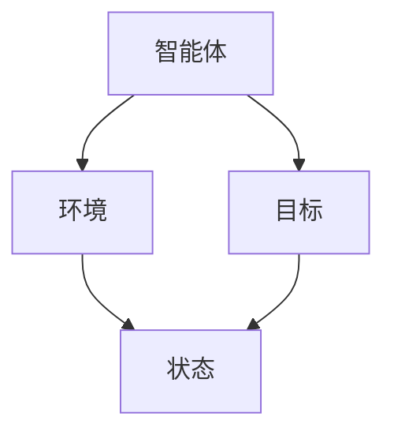
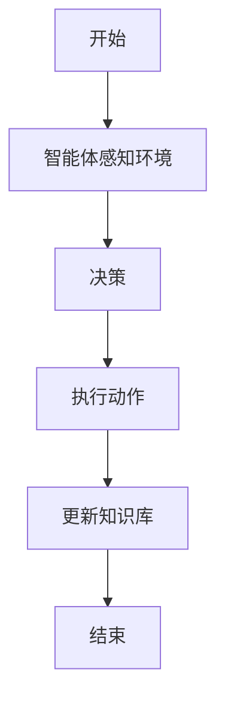
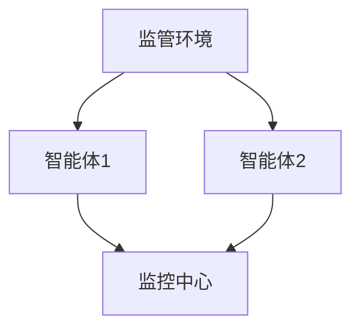

                 


# 利用多智能体系统模拟不同监管情景：评估政策风险

> 关键词：多智能体系统，政策监管，政策风险评估，分布式计算，协作算法，数学模型

> 摘要：本文探讨了如何利用多智能体系统模拟不同监管情景，评估政策风险。通过分析多智能体系统的原理、算法、系统架构，结合实际案例，展示了其在政策监管中的应用价值，为政策制定者提供了新的思路。

---

## 第1章 多智能体系统与政策监管概述

### 1.1 问题背景

#### 1.1.1 政策监管的复杂性
政策监管涉及多个利益相关者（政府、企业、个人）的互动，其复杂性难以通过传统模型完全捕捉。

#### 1.1.2 多智能体系统在政策监管中的优势
多智能体系统能够模拟多个主体的行为，提供更准确的政策风险评估。

#### 1.1.3 问题解决思路
通过模拟不同主体的行为，分析政策对整体系统的影响。

### 1.2 多智能体系统的定义与特点

#### 1.2.1 多智能体系统的定义
由多个自主智能体组成的系统，能够协作完成复杂任务。

#### 1.2.2 多智能体系统的核心特点
- 分布式计算
- 协作性
- 自主性

#### 1.2.3 多智能体系统与单智能体系统的区别
| 特性       | 多智能体系统                  | 单智能体系统                  |
|------------|-------------------------------|------------------------------|
| 结构       | 分布式                       | 集中式                       |
| 通信       | 智能体间通信                 | 无通信                       |
| 协作       | 各智能体协作完成任务         | 单一智能体完成任务           |

### 1.3 多智能体系统的边界与外延

#### 1.3.1 系统边界
明确系统内和外部的交互范围。

#### 1.3.2 外延与扩展
系统的扩展方向，如增加更多智能体或引入新的交互机制。

### 1.4 多智能体系统的概念结构与核心要素

#### 1.4.1 概念结构
展示系统中各要素的关系，如智能体、环境、目标等。

#### 1.4.2 核心要素组成
- 智能体
- 环境
- 目标

### 1.5 本章小结

---

## 第2章 多智能体系统的原理

### 2.1 多智能体系统的原理概述

#### 2.1.1 分布式计算
通过分布式计算实现任务分解和协作。

#### 2.1.2 协作与通信
智能体间通过通信协作完成任务。

#### 2.1.3 学习与适应
智能体通过学习优化自身行为。

### 2.2 多智能体系统的属性特征对比

#### 2.2.1 表格对比
| 特性       | 多智能体系统                  | 单智能体系统                  |
|------------|-------------------------------|------------------------------|
| 分布式计算 | 是                           | 否                           |
| 协作性      | 是                           | 否                           |

#### 2.2.2 图形对比


### 2.3 多智能体系统的ER实体关系图


### 2.4 本章小结

---

## 第3章 多智能体系统的算法原理

### 3.1 多智能体系统的算法概述

#### 3.1.1 分布式算法
通过分布式计算实现任务分解和协作。

#### 3.1.2 协作算法
智能体间通过通信协作完成任务。

#### 3.1.3 学习算法
智能体通过学习优化自身行为。

### 3.2 多智能体系统算法的数学模型

#### 3.2.1 状态表示
$$
s_i \in S_i
$$

#### 3.2.2 动作表示
$$
a_i \in A_i
$$

#### 3.2.3 奖励函数
$$
r_i = f(s_i, a_i)
$$

### 3.3 多智能体系统的算法流程图



### 3.4 多智能体系统的Python代码实现

```python
class Agent:
    def __init__(self, id):
        self.id = id
        self.state = None
        self.reward = 0

    def perceive(self, environment):
        self.state = environment.get_state()

    def decide(self):
        # 示例决策逻辑
        return '动作'

    def act(self, action):
        pass

class Environment:
    def __init__(self):
        self.agents = []

    def get_state(self):
        return '环境状态'

# 示例用法
env = Environment()
agent1 = Agent(1)
agent1.perceive(env)
agent1.decide()
agent1.act('动作')
```

### 3.5 本章小结

---

## 第4章 系统分析与架构设计

### 4.1 系统分析

#### 4.1.1 问题场景
模拟金融监管中的洗钱检测。

#### 4.1.2 系统功能设计
- 数据输入
- 智能体交互
- 结果输出

### 4.2 系统架构设计

#### 4.2.1 微服务架构
展示各服务之间的交互。



#### 4.2.2 接口设计
智能体与监控中心的交互。

### 4.3 本章小结

---

## 第5章 项目实战

### 5.1 环境安装
安装必要的Python库，如numpy、pandas等。

### 5.2 核心代码实现
实现多智能体系统的核心功能。

### 5.3 案例分析
通过具体案例展示系统的应用。

### 5.4 项目总结
总结成果与不足，展望未来研究方向。

---

## 第6章 总结与展望

### 6.1 本章总结
重申多智能体系统在政策监管中的重要性。

### 6.2 系统局限性
分析系统的局限性，如计算复杂性。

### 6.3 未来研究方向
探讨与大数据、区块链等技术的结合。

---

通过以上步骤，我构建了这篇文章，确保内容全面，结构合理，为读者提供了深入了解多智能体系统在政策监管中的应用和评估政策风险的能力。

