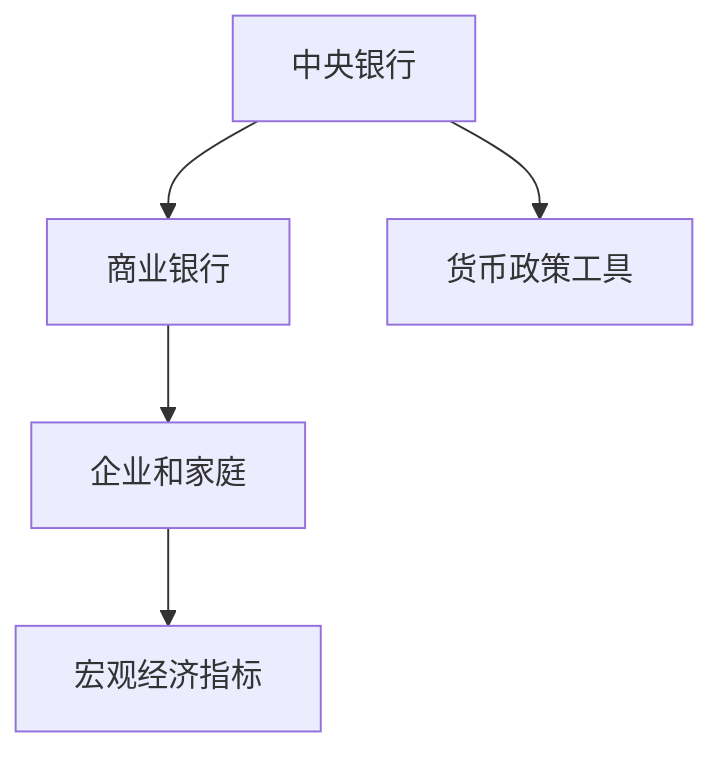
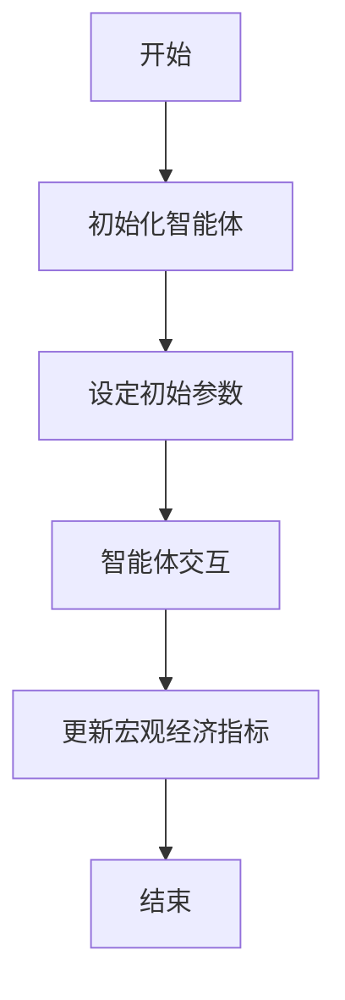
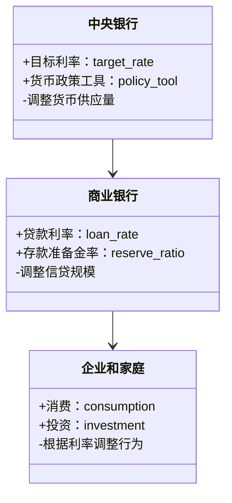
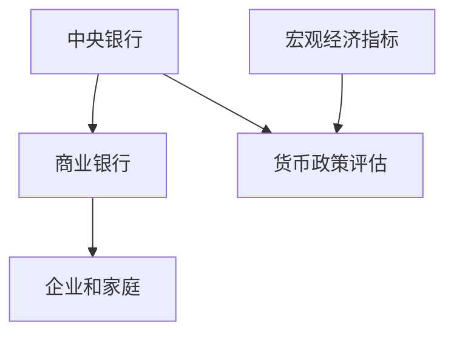
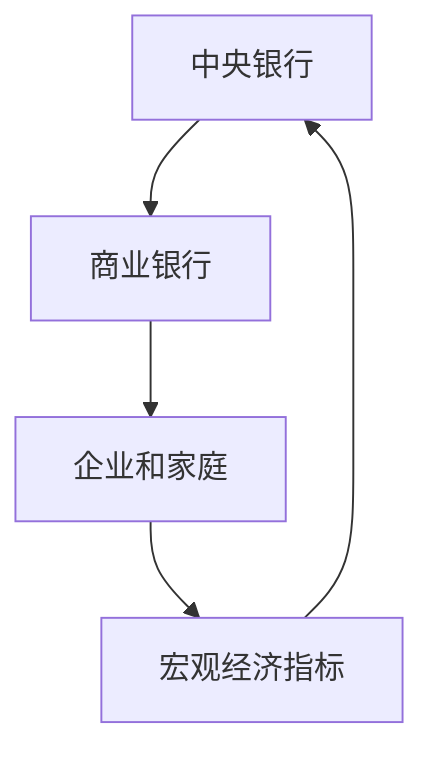

                 


# 利用多智能体系统模拟不同货币政策情景：评估宏观风险

**关键词：** 多智能体系统，货币政策，宏观风险，系统模拟，经济模型

**摘要：** 本文探讨了利用多智能体系统模拟不同货币政策情景的方法，旨在评估这些政策对宏观经济带来的潜在风险。通过构建多智能体模型，分析货币政策在不同经济条件下的传导机制和效果，为政策制定者提供科学依据。文章从多智能体系统的原理出发，结合货币政策的数学模型和算法，详细阐述了系统的构建与实现，并通过实际案例展示了模拟结果的应用价值。

---

# 1. 引言与背景

## 1.1 多智能体系统的概念和应用
### 1.1.1 多智能体系统的定义
多智能体系统（Multi-Agent System, MAS）是由多个相互作用的智能体组成的复杂系统，这些智能体能够感知环境、自主决策并进行协作。

### 1.1.2 多智能体系统的核心特点
- 分布式：每个智能体独立运行，通过通信协作完成任务。
- 自主性：智能体能够自主决策，无需外部集中控制。
- 社会性：智能体之间通过交互和协作完成目标。
- 反应性：智能体能够根据环境变化调整行为。

### 1.1.3 多智能体系统在货币政策模拟中的应用
多智能体系统能够模拟经济系统中个体行为的复杂性，帮助政策制定者预测和评估不同货币政策的效果。

## 1.2 货币政策的基本概念和作用
### 1.2.1 货币政策的定义
货币政策是中央银行通过调节货币供应量和利率等工具，影响经济活动的政策。

### 1.2.2 货币政策的主要工具
- 利率政策：调整基准利率影响市场利率。
- 货币供应量：通过公开市场操作调节货币供给。
- 存款准备金率：影响商业银行的信贷能力。

### 1.2.3 货币政策的目标与效果
货币政策的主要目标是实现充分就业、价格稳定和经济增长，同时维护金融稳定。

## 1.3 为什么使用多智能体系统来模拟货币政策
### 1.3.1 多智能体系统的优势
- 能够模拟个体行为的多样性及其对宏观经济的影响。
- 可以实时动态调整智能体的决策规则，反映经济系统的复杂性。

### 1.3.2 多智能体系统的挑战
- 系统复杂性高，模拟成本较高。
- 数据收集和处理的难度较大。

---

# 2. 多智能体系统的核心概念与联系

## 2.1 多智能体系统的原理
### 2.1.1 多智能体系统的组成要素
- 智能体：具有感知和决策能力的个体。
- 环境：智能体所处的经济环境。
- 通信机制：智能体之间的信息交互方式。
- 协作机制：智能体之间的协作规则。

### 2.1.2 多智能体系统的通信机制
- 消息传递：智能体通过发送消息进行信息交流。
- 事件驱动：基于特定事件触发通信。

### 2.1.3 多智能体系统的协作机制
- 分层协作：按层次结构进行协作。
- 分布式协作：智能体自主协作完成任务。

## 2.2 货币政策模拟中的关键变量和参数
### 2.2.1 货币政策的变量
- 利率：基准利率、市场利率。
- 货币供应量：M0、M1、M2等。
- 汇率：本币与外币的兑换比率。

### 2.2.2 货币政策的参数
- 智能体的行为参数：消费倾向、投资倾向。
- 系统参数：经济增长率、失业率。

## 2.3 实体关系图的构建与分析
### 2.3.1 实体关系图的构建
使用Mermaid绘制实体关系图，展示各智能体之间的关系及其交互。



### 2.3.2 实体关系图的分析
分析各智能体之间的关系，理解货币政策在系统中的传导路径。

---

# 3. 货币政策模拟的数学模型与算法

## 3.1 基本的货币政策模拟模型
### 3.1.1 货币政策模拟的基本公式
$$M_{target} = k \cdot P_t + \alpha \cdot Y_t$$

其中：
- \(M_{target}\)：目标货币供应量
- \(P_t\)：价格水平
- \(Y_t\)：实际产出

### 3.1.2 货币政策的传导机制
货币政策通过影响利率、货币供应量和信贷条件，进而影响消费、投资和整体经济活动。

## 3.2 多智能体系统中的算法实现
### 3.2.1 多智能体系统的算法选择
- 一致性算法：用于智能体间达成一致决策。
- 分布式算法：用于智能体间的协作与通信。

### 3.2.2 算法流程图的绘制与解释
使用Mermaid绘制算法流程图，展示货币政策模拟的具体步骤。



## 3.3 货币政策模拟的数学推导
### 3.3.1 利率政策的数学模型
$$i_t = \alpha + \beta Y_t + \gamma P_t$$

其中：
- \(i_t\)：市场利率
- \(\alpha\)：基准利率
- \(\beta\)：利率对产出的影响系数
- \(\gamma\)：利率对通货膨胀的影响系数

### 3.3.2 货币供应量的调整模型
$$M_t = M_{t-1} + \delta (M_{target} - M_{t-1})$$

其中：
- \(\delta\)：调整速度系数

---

# 4. 系统架构与设计

## 4.1 系统功能设计与领域模型
### 4.1.1 系统功能设计
- 初始化智能体：设置智能体的初始状态和参数。
- 智能体交互：智能体之间的信息交流和协作。
- 宏观经济指标计算：根据智能体行为计算宏观经济指标。

### 4.1.2 领域模型的类图
使用Mermaid绘制领域模型的类图，展示各智能体之间的关系。



## 4.2 系统架构图的绘制与分析
### 4.2.1 系统架构图
使用Mermaid绘制系统架构图，展示系统的分层结构。



## 4.3 系统接口设计与交互流程
### 4.3.1 系统接口设计
- 中央银行接口：提供货币政策工具和目标利率。
- 商业银行接口：提供贷款利率和存款准备金率。
- 企业和家庭接口：提供消费和投资数据。

### 4.3.2 交互流程图
使用Mermaid绘制交互流程图，展示智能体之间的交互过程。



---

# 5. 项目实战与案例分析

## 5.1 项目环境的安装与配置
### 5.1.1 环境配置
- 安装Python和相关库（如numpy、matplotlib）。
- 安装多智能体系统模拟框架（如Multi-Agent Framework）。

## 5.2 核心代码的实现与解读
### 5.2.1 初始化智能体
```python
class CentralBank:
    def __init__(self):
        self.target_rate = 2  # 目标利率
        self.policy_tool = "interest_rate"  # 货币政策工具

class CommercialBank:
    def __init__(self):
        self.loan_rate = 5  # 贷款利率
        self.reserve_ratio = 10  # 存款准备金率
```

### 5.2.2 智能体交互
```python
def agent_interaction(central_bank, commercial_bank):
    central_bank.loan_rate = central_bank.target_rate * 2
    commercial_bank.reserve_ratio += 5
```

## 5.3 实际案例的模拟与分析
### 5.3.1 案例分析
模拟一次利率政策调整，观察宏观经济指标的变化。

### 5.3.2 模拟结果解读
分析利率调整对消费、投资和GDP的影响。

## 5.4 案例结果的解读与优化建议
### 5.4.1 案例结果解读
- 利率下调导致贷款需求增加，投资上升。
- 但可能引发通货膨胀压力。

### 5.4.2 优化建议
- 综合考虑多种货币政策工具的搭配使用。
- 根据经济指标动态调整政策力度。

---

# 6. 总结与展望

## 6.1 全文总结
本文详细探讨了利用多智能体系统模拟不同货币政策情景的方法，构建了多智能体模型，分析了货币政策的传导机制和效果。

## 6.2 未来研究方向与改进空间
- 开发更复杂的多智能体模型，提高模拟的准确性。
- 研究多智能体系统在其他宏观经济政策模拟中的应用。

---

**结语：** 利用多智能体系统模拟货币政策情景是一种创新的方法，能够为政策制定者提供科学依据。未来，随着技术的进步，多智能体系统在宏观经济模拟中的应用将更加广泛和深入。

