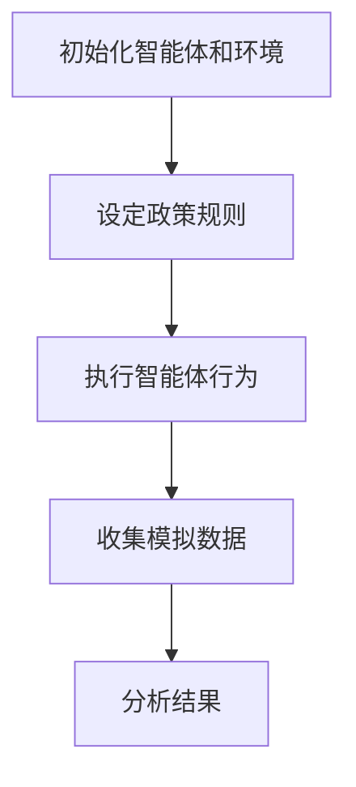
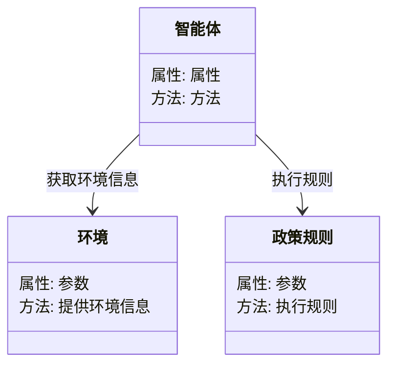
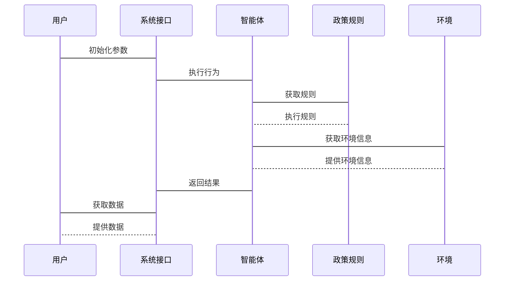

                 


# 利用多智能体系统模拟不同贸易政策：评估全球化风险

> 关键词：多智能体系统，贸易政策，全球化风险，经济模拟，系统建模

> 摘要：本文探讨了利用多智能体系统模拟不同贸易政策的方法，旨在评估全球化过程中的潜在风险。通过系统建模和算法实现，分析贸易政策对经济系统的影响，揭示多智能体系统在经济模拟中的应用价值。

---

## 第一部分：背景介绍

### 第1章：多智能体系统概述

#### 1.1 多智能体系统的基本概念
- **多智能体系统的定义**：多智能体系统（Multi-Agent System, MAS）是由多个独立智能体组成的分布式系统，各智能体通过交互协作完成特定任务。
- **多智能体系统的特征**：
  - 分布式计算
  - 智能体主动性与反应性
  - 动态性和适应性
- **多智能体系统的应用场景**：经济模拟、社会网络分析、交通控制等。

#### 1.2 全球化与贸易政策的背景
- **全球化的定义与特征**：全球化指商品、服务、资本和技术在国际间的自由流动，带来经济一体化。
- **贸易政策的基本类型**：关税、非关税壁垒、贸易协定等。
- **全球化风险的定义与表现**：全球化带来的不确定性和潜在负面影响，如贸易不平衡、产业衰退等。

### 第2章：多智能体系统与贸易政策的结合
- **多智能体系统在经济模拟中的作用**：模拟复杂经济行为，分析政策影响。
- **贸易政策对经济系统的影响**：影响生产、消费、投资等多个方面。
- **多智能体系统模拟贸易政策的必要性**：通过模拟预测政策效果，辅助决策。

---

## 第二部分：核心概念与联系

### 第3章：多智能体系统的核心原理
- **多智能体系统的组成要素**：
  - 智能体：具有感知和行动能力的主体。
  - 环境：智能体所处的外部世界。
  - 通信机制：智能体间信息交换的方式。
- **多智能体系统的通信机制**：基于消息传递、分布式数据库等。
- **多智能体系统的协调与协作**：通过协商和协议实现合作。

### 第4章：贸易政策的影响分析
- **贸易政策的分类与特征**：关税、配额、补贴等。
- **贸易政策对经济系统的多维度影响**：对生产成本、就业、企业竞争力的影响。
- **贸易政策的动态变化与反馈机制**：政策调整对经济系统的反馈作用。

### 第5章：多智能体系统与贸易政策的联系
- **多智能体系统模拟贸易政策的核心思想**：将经济主体建模为智能体，模拟政策影响。
- **多智能体系统与贸易政策的相互作用**：政策变化影响智能体行为，智能体行为影响政策效果。
- **多智能体系统模拟贸易政策的实现框架**：
  - 智能体建模
  - 政策规则编码
  - 模拟实验与结果分析

---

## 第三部分：算法原理讲解

### 第6章：多智能体系统模拟算法
- **多智能体系统模拟的基本算法**：
  - 确定智能体的行为规则。
  - 设定初始条件和模拟环境。
  - 智能体与环境及其它智能体的交互。
  - 数据收集与结果分析。
- **贸易政策模拟的具体算法**：
  - 初始化智能体和环境参数。
  - 执行智能体行为，根据政策规则调整行为。
  - 收集模拟数据，分析结果。
- **算法实现的步骤与流程**：
  - 初始化：设定智能体属性、环境参数。
  - 执行：智能体根据策略行动，环境变化。
  - 收集数据：记录关键指标。
  - 分析结果：评估政策效果。



### 第7章：贸易政策模拟的数学模型
- **贸易政策模拟的基本数学模型**：
  $$ C_i = \alpha P_i + \beta T_i $$
  其中，\( C_i \) 为成本，\( P_i \) 为价格，\( T_i \) 为贸易政策影响因子，\(\alpha\) 和 \(\beta\) 为系数。
- **贸易政策模拟的高级数学模型**：
  $$ G = \sum_{i=1}^n w_i x_i $$
  其中，\( G \) 为整体风险指数，\( w_i \) 为权重，\( x_i \) 为影响因素。
- **数学模型的实现与优化**：动态调整权重，引入反馈机制，提高模型精度。

---

## 第四部分：系统分析与架构设计方案

### 第8章：问题场景与系统功能设计
- **贸易政策模拟的典型问题场景**：预测关税调整对制造业的影响。
- **系统功能需求分析**：
  - 智能体行为建模
  - 政策规则配置
  - 模拟实验管理
  - 数据分析与可视化
- **系统功能设计的领域模型**：



### 第9章：系统架构设计
- **系统架构的整体设计**：模块化架构，便于扩展和维护。
- **系统架构的详细设计**：
  - 智能体层：实现具体行为。
  - 环境层：提供模拟环境。
  - 政策层：定义政策规则。
- **系统架构的实现与优化**：采用微服务架构，提高可扩展性。

### 第10章：系统接口与交互设计
- **系统接口的设计原则**：RESTful API，便于调用。
- **系统交互的实现流程**：
  1. 初始化接口：设定初始参数。
  2. 执行接口：启动模拟过程。
  3. 数据接口：获取模拟结果。
- **系统交互的序列图**：



---

## 第五部分：项目实战

### 第11章：项目实战
- **环境安装**：安装Python、NumPy、Matplotlib等库。
- **系统核心实现源代码**：

```python
import numpy as np

class Agent:
    def __init__(self, id, policy):
        self.id = id
        self.policy = policy

    def act(self, environment):
        # 根据政策规则行动
        return self.policy(environment)

def main():
    # 初始化环境和政策
    environment = {'GDP': 1000, 'unemployment': 5}
    policy = {'tariff': 10}
    agent = Agent(1, policy)
    
    # 执行模拟
    action = agent.act(environment)
    print(f"Agent {agent.id}的行动：{action}")

if __name__ == "__main__":
    main()
```

- **代码应用解读与分析**：展示如何实现智能体行为和政策模拟。
- **实际案例分析**：分析关税政策对制造业的影响。
- **项目小结**：总结项目实现的关键点和经验教训。

---

## 第六部分：最佳实践与总结

### 第12章：最佳实践
- **经验总结**：模块化设计、持续优化模型。
- **注意事项**：确保数据准确性，避免模型过拟合。
- **拓展阅读**：推荐相关书籍和论文，深入学习多智能体系统。

### 第13章：小结
- 多智能体系统模拟贸易政策的优势和局限性。
- 未来研究方向：复杂政策组合的影响、动态调整机制。

---

通过以上步骤和内容，本文详细讲解了多智能体系统在模拟贸易政策中的应用，帮助读者理解如何利用该技术评估全球化风险。

