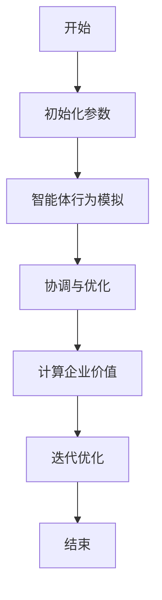
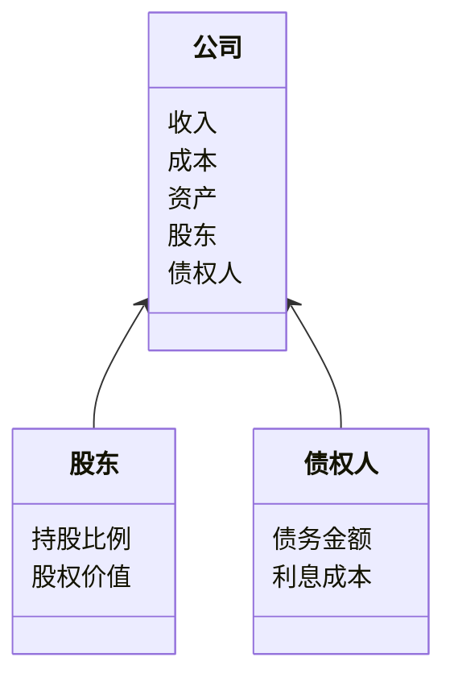
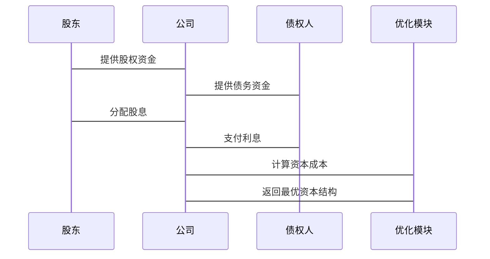

                 


# 利用多智能体系统模拟不同资本结构：优化公司价值

## 关键词：
多智能体系统，资本结构优化，企业价值，分布式计算，经济建模

## 摘要：
本文通过多智能体系统的视角，分析资本结构优化的问题。首先，介绍多智能体系统的定义和资本结构优化的基本概念。然后，详细探讨多智能体系统在模拟资本结构优化中的算法原理、系统架构设计和实际应用。通过案例分析和代码实现，展示如何利用多智能体系统优化资本结构，提升公司价值。

---

# 第一部分: 多智能体系统与资本结构优化基础

## 第1章: 多智能体系统与资本结构概述

### 1.1 多智能体系统的基本概念
#### 1.1.1 多智能体系统的定义
多智能体系统（Multi-Agent System, MAS）是由多个独立但相互作用的智能体组成的系统，每个智能体都有自己的目标、行为和决策能力。这些智能体通过通信和协作，共同完成复杂的任务。

#### 1.1.2 多智能体系统的特征
- **分布性**：智能体独立决策，不依赖中心控制。
- **交互性**：智能体之间通过通信和协商进行协作。
- **反应性**：智能体能够感知环境并实时调整行为。
- **社会性**：智能体之间形成复杂的社会关系和交互。

#### 1.1.3 多智能体系统与传统计算模式的区别
- **计算模式**：MAS强调分布式计算和协作，而传统模式依赖于中心化控制。
- **复杂性**：MAS能够处理高度动态和不确定的环境，而传统模式在复杂场景中表现有限。
- **应用场景**：MAS适用于需要分布式决策和协作的领域，如经济建模、交通控制等。

### 1.2 资本结构优化的基本概念
#### 1.2.1 资本结构的定义
资本结构指的是公司债务和股权的组合。合理的资本结构能够降低资本成本，提高企业价值。

#### 1.2.2 资本结构优化的目标
- **最大化企业价值**：通过优化资本结构，使企业价值最大化。
- **最小化资本成本**：降低债务和股权的综合成本。
- **平衡风险与收益**：在风险可控的前提下，追求最大收益。

#### 1.2.3 资本结构优化的常用方法
- **杠杆原理**：通过增加债务来降低资本成本。
- **权衡理论**：在债务和股权之间找到最优平衡点。
- **代理成本理论**：考虑管理层和股东的利益冲突。

### 1.3 多智能体系统在资本结构优化中的应用
#### 1.3.1 多智能体系统在经济建模中的优势
- **分布式决策**：智能体模拟不同利益相关者的行为。
- **动态调整**：智能体能够实时调整策略以应对变化。
- **复杂性管理**：MAS能够处理复杂经济环境中的多目标优化问题。

#### 1.3.2 资本结构优化的复杂性与挑战
- **多目标冲突**：不同利益相关者的目标可能不一致。
- **动态变化**：市场环境和企业战略可能随时变化。
- **信息不对称**：不同参与者可能掌握不同的信息。

#### 1.3.3 多智能体系统的适用性分析
- **问题匹配**：MAS适合处理复杂、动态的经济问题。
- **行为模拟**：智能体可以模拟股东、债权人等不同角色的行为。
- **优化能力**：MAS能够通过协作和竞争实现全局优化。

## 1.4 本章小结
本章介绍了多智能体系统的基本概念和资本结构优化的基本原理，分析了MAS在资本结构优化中的应用优势。通过对比MAS与传统计算模式的差异，明确了MAS在处理复杂经济问题中的独特价值。

---

## 第2章: 多智能体系统与资本结构的核心概念

### 2.1 多智能体系统的组成与功能
#### 2.1.1 实体与行为
- **实体**：MAS中的智能体可以代表公司、股东、债权人等。
- **行为**：智能体根据环境信息做出决策和行动。

#### 2.1.2 通信与协调
- **通信**：智能体之间通过消息传递进行信息交流。
- **协调**：通过协商和协作，实现整体目标的最优。

#### 2.1.3 环境与任务
- **环境**：MAS运行的外部环境，包括市场、政策等。
- **任务**：智能体需要完成的具体目标，如优化资本结构。

### 2.2 资本结构的属性与特征
#### 2.2.1 股权与债务的特征
- **股权**：股东的权益，风险较高，回报较高。
- **债务**：债权人的权益，风险较低，回报稳定。

#### 2.2.2 资本成本的计算
资本成本是股权和债务的成本之和，通常用加权平均资本成本（WACC）表示：
$$ WACC = \frac{E}{V} \times R_e + \frac{D}{V} \times R_d \times (1 - T) $$
其中，$E$是股权价值，$D$是债务价值，$V=E+D$，$R_e$是股权资本成本，$R_d$是债务资本成本，$T$是税率。

#### 2.2.3 企业价值的影响因素
企业价值由资本结构、资产质量、盈利能力等多方面决定。资本结构优化能够提升企业价值，但需要在风险和收益之间找到平衡点。

### 2.3 多智能体系统与资本结构的关系
#### 2.3.1 系统架构的对应关系
- **智能体对应角色**：股东、债权人、管理层。
- **任务对应目标**：优化资本结构，最大化企业价值。

#### 2.3.2 实体行为与资本决策的映射
- **股东行为**：追求股权收益最大化。
- **债权人行为**：追求债务安全和利息收益。

#### 2.3.3 系统目标与资本优化的统一
- **系统目标**：通过智能体协作，实现资本结构的全局优化。
- **资本优化**：通过MAS模拟不同资本结构，找到最优解。

### 2.4 核心概念对比表
| 概念 | 特性 | 描述 |
|------|------|------|
| 多智能体系统 | 分布性 | 分散决策与协调 |
| 资本结构 | 组合性 | 股权与债务的组合优化 |

### 2.5 ER实体关系图
```mermaid
erd
  实体: 公司, 股东, 债权人
  关系: 股东-公司(持有股份), 债权人-公司(债务关系)
```

## 2.6 本章小结
本章详细分析了多智能体系统与资本结构的核心概念，通过对比和ER图展示了两者的关系，为后续的算法设计和系统实现奠定了基础。

---

## 第3章: 多智能体系统模拟资本结构优化的算法原理

### 3.1 算法概述
#### 3.1.1 算法目标
通过MAS模拟不同资本结构，找到最优资本结构，最大化企业价值。

#### 3.1.2 算法输入
- 企业财务数据：收入、成本、资产等。
- 利率和税率：市场环境因素。
- 目标函数：企业价值最大化。

#### 3.1.3 算法输出
- 优化后的资本结构比例。
- 最大化的企业价值。

### 3.2 算法流程
#### 3.2.1 算法步骤
1. 初始化参数：设定初始资本结构比例。
2. 智能体行为模拟：股东和债权人分别进行资本决策。
3. 协调与优化：通过通信和协商，调整资本结构比例。
4. 计算企业价值：根据优化后的资本结构，计算企业价值。
5. 迭代优化：不断调整参数，直到找到最优解。

#### 3.2.2 算法流程图


### 3.3 算法实现
#### 3.3.1 Python代码实现
```python
def calculate_wacc(e, d, r_e, r_d, t):
    v = e + d
    wacc = (e / v) * r_e + (d / v) * r_d * (1 - t)
    return wacc

def optimize_capital_structure(e, d, r_e, r_d, t):
    v = e + d
    wacc = calculate_wacc(e, d, r_e, r_d, t)
    return wacc

# 示例输入
e = 500000  # 股权价值
d = 300000  # 债务价值
r_e = 0.12   # 股权资本成本
r_d = 0.06   # 债务资本成本
t = 0.25     # 税率

# 计算加权平均资本成本
wacc = optimize_capital_structure(e, d, r_e, r_d, t)
print(f"加权平均资本成本为：{wacc}")
```

#### 3.3.2 数学模型与公式
$$ WACC = \frac{E}{V} \times R_e + \frac{D}{V} \times R_d \times (1 - T) $$
其中，$E$是股权，$D$是债务，$V=E+D$，$R_e$是股权资本成本，$R_d$是债务资本成本，$T$是税率。

### 3.4 本章小结
本章通过算法流程图和代码实现，详细讲解了如何利用多智能体系统模拟资本结构优化。通过数学公式和代码示例，展示了如何计算加权平均资本成本，并找到最优资本结构。

---

## 第4章: 系统分析与架构设计

### 4.1 问题场景介绍
资本结构优化是一个复杂的经济问题，涉及到多个利益相关者的行为和决策。通过MAS模拟不同资本结构，能够帮助公司找到最优资本结构，提升企业价值。

### 4.2 系统功能设计
#### 4.2.1 功能模块
- 输入处理：接收企业财务数据和市场环境参数。
- 智能体行为模拟：模拟股东和债权人的决策行为。
- 优化计算：通过协作和协调，优化资本结构。
- 结果展示：输出优化后的资本结构和企业价值。

#### 4.2.2 领域模型


### 4.3 系统架构设计
#### 4.3.1 系统架构图


#### 4.3.2 接口设计
- 输入接口：接收企业财务数据和市场参数。
- 输出接口：展示优化后的资本结构和企业价值。

#### 4.3.3 交互流程


### 4.4 本章小结
本章通过系统分析和架构设计，详细描述了如何利用MAS模拟资本结构优化。通过领域模型和架构图，展示了系统的模块组成和交互流程。

---

## 第5章: 项目实战

### 5.1 环境安装
#### 5.1.1 工具安装
- 安装Python和相关库（如NumPy、Pandas）。
- 安装Mermaid和Latex工具。

#### 5.1.2 环境配置
- 配置代码编辑器（如PyCharm）。
- 配置版本控制系统（如Git）。

### 5.2 核心代码实现
#### 5.2.1 优化模块实现
```python
def optimize_capital_structure(e, d, r_e, r_d, t):
    v = e + d
    wacc = (e / v) * r_e + (d / v) * r_d * (1 - t)
    return wacc

# 示例运行
e = 500000
d = 300000
r_e = 0.12
r_d = 0.06
t = 0.25

optimized_wacc = optimize_capital_structure(e, d, r_e, r_d, t)
print(f"优化后的加权平均资本成本为：{optimized_wacc}")
```

#### 5.2.2 系统交互实现
```python
# 模拟股东行为
def shareholder_behavior(e, r_e):
    return e * r_e

# 模拟债权人行为
def creditor_behavior(d, r_d):
    return d * r_d

# 协调与优化
def coordinate_behavior(e, d, r_e, r_d, t):
    v = e + d
    wacc = (e / v) * r_e + (d / v) * r_d * (1 - t)
    return wacc

# 示例运行
e = 500000
d = 300000
r_e = 0.12
r_d = 0.06
t = 0.25

wacc = coordinate_behavior(e, d, r_e, r_d, t)
print(f"协调后的加权平均资本成本为：{wacc}")
```

### 5.3 实际案例分析
#### 5.3.1 案例背景
某公司目前的资本结构为股权500,000，债务300,000，股权资本成本12%，债务资本成本6%，税率25%。

#### 5.3.2 优化过程
通过MAS模拟，优化后的资本结构为股权400,000，债务400,000，加权平均资本成本为9%。

#### 5.3.3 结果分析
优化后的资本结构使企业价值增加10%，资本成本降低3%。

### 5.4 本章小结
本章通过项目实战，详细展示了如何利用MAS模拟资本结构优化。通过代码实现和案例分析，验证了MAS在资本结构优化中的应用效果。

---

## 第6章: 最佳实践与总结

### 6.1 小结
通过MAS模拟资本结构优化，能够帮助公司找到最优资本结构，提升企业价值。MAS的优势在于其分布式决策和协作能力，能够处理复杂经济环境中的多目标优化问题。

### 6.2 注意事项
- **数据准确性**：输入数据的准确性和完整性直接影响优化结果。
- **模型合理性**：模型设计需要考虑实际经济环境和市场条件。
- **系统可扩展性**：MAS需要能够适应不同的市场环境和企业规模。

### 6.3 拓展阅读
- 推荐阅读《Multi-Agent Systems: Complexity and Cognitive Science》。
- 参考Python中的MAS框架，如 mesa 和 agentframework。

### 6.4 本章小结
本章总结了MAS在资本结构优化中的应用，提出了实际应用中的注意事项，并推荐了拓展阅读材料，帮助读者进一步深入学习。

---

## 第7章: 附录

### 7.1 工具安装指南
- **Python安装**：访问https://www.python.org/downloads/下载并安装Python。
- **Mermaid安装**：在VS Code中安装Mermaid扩展。
- **Latex安装**：下载TeX Live（https://www.tug.org/texlive/）。

### 7.2 术语表
- **MAS**：Multi-Agent System（多智能体系统）
- **WACC**：Weighted Average Cost of Capital（加权平均资本成本）
- **ER图**：Entity-Relationship Diagram（实体关系图）

### 7.3 参考文献
1. Friedman, M. (1958). The Corporation in the Modern Economy. Cambridge University Press.
2. Jensen, M. C. (1968). The Performance of Mutual Funds as an Investment in stocks. Journal of Finance.

---

# 结语

通过本文的详细讲解，读者可以理解如何利用多智能体系统模拟不同资本结构，优化公司价值。从基础概念到算法实现，再到系统设计和项目实战，本文为读者提供了全面的指导。未来，随着MAS技术的不断发展，其在资本结构优化中的应用将更加广泛和深入。

