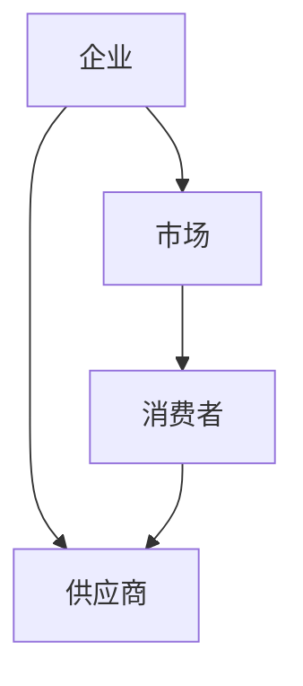

                 


# 利用多智能体系统模拟不同通胀情景：评估公司抗通胀能力

## 关键词：
- 多智能体系统，通胀情景，公司抗通胀能力，系统模拟，经济建模

## 摘要：
本文探讨了利用多智能体系统模拟不同通胀情景的方法，以评估公司的抗通胀能力。通过构建多智能体模型，分析经济波动对公司的影响，为企业制定应对策略提供支持。文章详细介绍了系统的构建、算法应用、案例分析等，展示了多智能体系统在经济模拟中的优势。

---

# 第一部分: 多智能体系统与通胀情景模拟的背景

## 第1章: 多智能体系统的定义与特点

### 1.1 多智能体系统的定义
多智能体系统（Multi-Agent System, MAS）由多个智能体组成，每个智能体能够自主决策并与其他智能体协作，共同完成复杂任务。智能体具有主动性、反应性、社会性等特征。

### 1.2 多智能体系统的组成部分
- **智能体**：独立决策的实体，如企业、消费者。
- **环境**：智能体互动的场景，如市场。
- **通信机制**：智能体间信息交换的方式，如消息传递。
- **协调机制**：解决冲突，确保系统目标一致。

### 1.3 多智能体系统的核心特征
- **分布式智能**：多个智能体协同工作。
- **自主性**：智能体独立决策。
- **反应性**：实时感知环境变化。
- **社会性**：智能体间通过交互协作。

## 第2章: 通胀情景模拟的背景与意义

### 2.1 通胀的定义与影响
通胀是指物价水平持续上涨，影响企业成本、消费者购买力和市场信心。企业需要应对成本上升、需求变化等挑战。

### 2.2 通胀情景模拟的必要性
通过模拟不同通胀水平，企业可以预测市场反应，优化经营策略。多智能体系统能模拟复杂经济互动，提供科学依据。

### 2.3 多智能体系统在通胀模拟中的优势
- **复杂性处理**：多智能体系统能处理经济系统中多个变量的互动。
- **实时反馈**：模型可以实时更新，反映最新市场变化。
- **情景分析**：支持多种通胀情景的模拟，帮助企业制定灵活策略。

---

# 第二部分: 多智能体系统的核心概念与联系

## 第3章: 多智能体系统的原理

### 3.1 分布式智能的实现
多智能体系统通过分布计算实现智能体间的协作。每个智能体运行在不同的节点上，通过通信机制交换信息。

### 3.2 智能体之间的交互机制
- **通信**：通过消息传递共享信息。
- **协调**：智能体间达成共识，确保系统目标一致。
- **协作**：共同完成任务，如供应链协调。

### 3.3 系统的动态性与复杂性
多智能体系统的动态性使其能够适应变化，但复杂性也增加了模型设计的难度。

## 第4章: 多智能体系统与通胀情景模拟的关系

### 4.1 多智能体系统的应用场景
- **经济模拟**：模拟市场行为，预测经济趋势。
- **供应链管理**：优化供应链流程，提高效率。
- **风险管理**：评估经济波动对企业的潜在影响。

### 4.2 通胀情景模拟的复杂性
通胀涉及多个因素，如成本、需求、政策等，多智能体系统能全面模拟这些变量。

### 4.3 多智能体系统在模拟中的作用
通过模拟不同通胀情景，企业可以评估应对策略的有效性，优化运营。

---

# 第三部分: 通胀情景模拟的理论基础

## 第5章: 通胀情景的定义与分类

### 5.1 通胀的类型与特征
- **温和通胀**：低通胀率，对企业影响较小。
- **恶性通胀**：高通胀率，可能导致经济崩溃。

### 5.2 不同通胀情景的分类
- **情景1**：低通胀，企业成本小幅上升。
- **情景2**：高通胀，企业面临较大压力。

## 第6章: 经济模型与通胀预测

### 6.1 经济模型的基本原理
经济模型通过数学公式描述经济变量之间的关系，如需求与价格的关系。

### 6.2 通胀预测的方法与工具
- **时间序列分析**：基于历史数据预测未来趋势。
- **计量经济学模型**：考虑多种因素进行预测。

## 第7章: 多智能体系统在经济模拟中的应用

### 7.1 经济模拟的复杂性
经济系统涉及多个变量和参与者，需要复杂的模型来模拟。

### 7.2 多智能体系统的适应性
多智能体系统能够适应复杂经济环境，模拟不同情景下的企业行为。

---

# 第四部分: 公司抗通胀能力评估的方法

## 第8章: 抗通胀能力的定义与指标

### 8.1 抗通胀能力的定义
抗通胀能力指企业在通胀环境下维持或提升盈利能力的能力。

### 8.2 评估指标的选择
- **利润率**：衡量企业盈利能力。
- **成本控制能力**：评估企业在通胀中的成本管理能力。

## 第9章: 多智能体系统在评估中的应用

### 9.1 系统模型的构建
构建多智能体模型，模拟企业在不同通胀情景下的表现。

### 9.2 智能体行为的模拟
模拟企业如何调整价格、成本和生产量，以应对通胀变化。

## 第10章: 评估结果的可视化与解释

### 10.1 数据可视化的方法
使用图表展示模型结果，如折线图显示企业利润变化。

### 10.2 结果的解释与应用
根据模型结果，制定应对策略，优化企业运营。

---

# 第五部分: 多智能体系统的建模与实现

## 第11章: 多智能体系统的建模方法

### 11.1 系统建模的基本原则
- 简单性：模型应尽可能简单。
- 可验证性：模型结果应可验证。

## 第12章: 算法原理讲解

### 12.1 遗传算法
用于优化模型参数，如适应度函数定义企业利润最大化。

### 12.2 强化学习
通过奖励机制，训练智能体做出最优决策。

## 第13章: 数学模型的建立

### 13.1 需求函数
$$ D = a - bp $$
其中，D为需求，p为价格，a和b为常数。

### 13.2 利润函数
$$ \pi = (p - c) \times q - f $$
其中，π为利润，c为单位成本，q为销量，f为固定成本。

---

# 第六部分: 系统分析与架构设计

## 第14章: 系统架构设计

### 14.1 问题场景介绍
模拟企业面临不同通胀情景，评估其抗通胀能力。

### 14.2 系统功能设计
- **数据输入**：输入通胀情景参数。
- **模型运行**：模拟企业行为。
- **结果输出**：展示评估结果。

### 14.3 系统架构图


---

# 第七部分: 项目实战

## 第15章: 项目环境与安装

### 15.1 环境要求
- 操作系统：Windows 10或更高版本。
- 开发工具：Python 3.8以上，安装库如NumPy、Matplotlib。

## 第16章: 核心代码实现

### 16.1 多智能体模型代码
```python
class Agent:
    def __init__(self, id, strategy):
        self.id = id
        self.strategy = strategy
        self.inventory = 0

    def decide(self, price, demand):
        if self.strategy == 'price':
            new_price = max(price * 1.05, 100)
            return new_price
        else:
            return price

def run_simulation(agents, steps):
    for step in range(steps):
        for agent in agents:
            if agent.strategy == 'inventory':
                agent.inventory += 10
```

### 16.2 模型运行与结果分析
```python
agents = [Agent(1, 'price'), Agent(2, 'inventory')]
run_simulation(agents, 10)
```

---

# 第八部分: 总结与展望

## 第17章: 总结

### 17.1 本文的主要工作
构建了多智能体模型，模拟通胀情景，评估企业抗通胀能力。

### 17.2 创新点
结合多智能体系统与经济模型，提供科学的决策支持。

## 第18章: 展望

### 18.1 未来研究方向
- 结合机器学习提高模型预测能力。
- 扩展模型应用到更多经济领域。

## 第19章: 最佳实践与小结

### 19.1 小结
多智能体系统为经济模拟提供了强大的工具，帮助企业应对通胀挑战。

### 19.2 注意事项
模型设计需考虑实际经济环境，数据准确性影响结果。

### 19.3 拓展阅读
建议阅读相关经济建模和多智能体系统书籍，深入理解模型应用。

---

通过以上步骤，我们详细介绍了利用多智能体系统模拟不同通胀情景的方法，帮助企业评估和提升抗通胀能力。希望本文能为相关领域的研究和实践提供有价值的参考。

