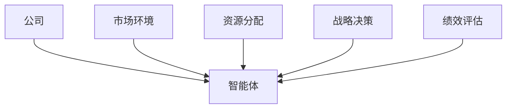
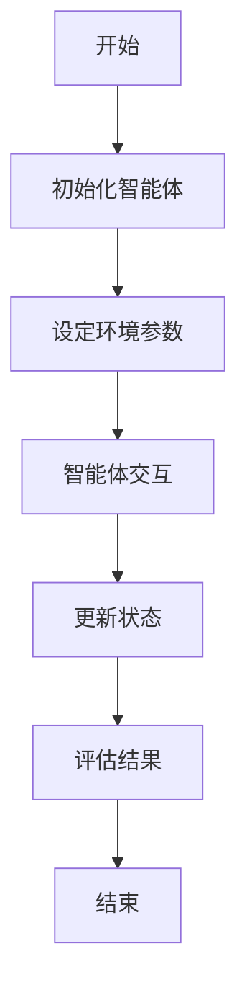
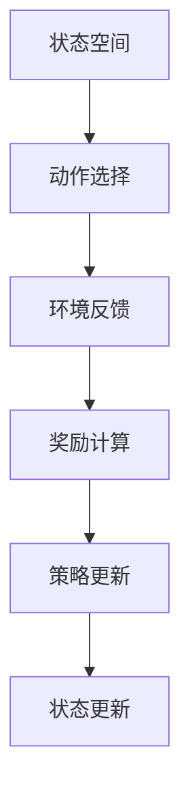
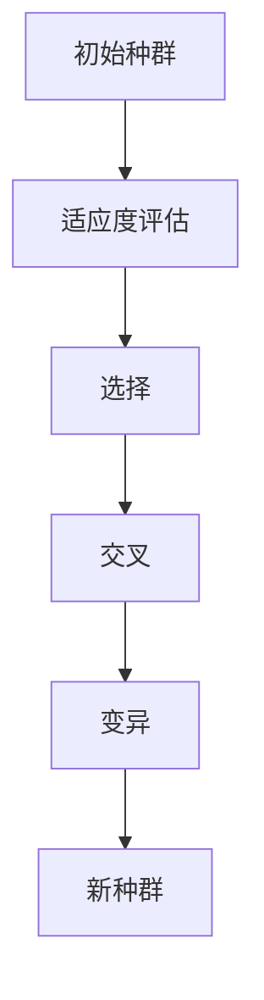
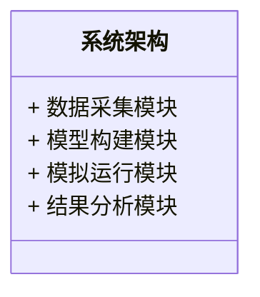
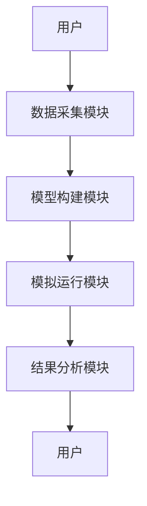

                 


# 利用多智能体系统模拟公司成长轨迹：长期价值预测

## 关键词：多智能体系统，公司成长轨迹，长期价值预测，系统动力学，人工智能

## 摘要：  
本文将介绍如何利用多智能体系统（Multi-Agent System, MAS）模拟公司成长轨迹，并基于此进行长期价值预测。通过分析公司成长的关键要素，构建多智能体模型，模拟公司与外部环境及内部各个要素之间的交互关系，从而预测公司长期价值的变化趋势。本文将从问题背景、核心概念、算法原理、系统架构到项目实战，全面阐述这一技术的应用过程。

---

## 第一部分: 背景介绍

### 第1章: 多智能体系统与公司成长轨迹模拟概述

#### 1.1 问题背景
- **公司成长轨迹的复杂性**：公司成长受到内部战略决策、资源分配、组织结构等多方面因素的影响，同时也受到外部市场环境、竞争态势、政策法规等复杂因素的制约。
- **传统公司成长模型的局限性**：传统的公司成长模型往往基于简单的线性假设，难以捕捉公司成长过程中的非线性动态变化。
- **多智能体系统的优势**：多智能体系统能够模拟多个智能体之间的复杂交互，适合用于建模公司内部不同部门、外部市场参与者等多方主体之间的动态关系。

#### 1.2 问题描述
- **公司成长轨迹的核心要素**：包括公司规模、市场份额、利润、研发投入、组织结构等。
- **多智能体系统模拟的必要性**：通过模拟公司内部不同部门和外部市场的交互，可以更准确地预测公司成长的路径。
- **长期价值预测的目标与意义**：通过模拟公司成长轨迹，预测公司长期价值的变化趋势，为投资决策、战略规划提供参考。

#### 1.3 问题解决
- **多智能体系统的建模方法**：通过构建多个智能体，分别代表公司内部的不同部门、外部的市场参与者等，模拟它们之间的交互。
- **系统动力学与公司成长的关系**：系统动力学可以帮助理解公司成长过程中的动态变化，而多智能体系统则提供了模拟这些变化的工具。
- **长期价值预测的实现路径**：通过模拟公司成长轨迹，结合外部环境的变化，预测公司长期价值的变化趋势。

#### 1.4 边界与外延
- **多智能体系统的边界条件**：包括时间范围、空间范围、数据来源等。
- **公司成长轨迹的可预测范围**：基于模型的假设和数据的准确性，确定公司成长轨迹预测的范围和精度。
- **长期价值预测的适用场景**：适用于对公司成长有较大影响的外部环境和内部战略的模拟。

#### 1.5 核心要素与概念结构
- **多智能体系统的组成要素**：包括智能体、环境、交互规则等。
- **公司成长轨迹的核心变量**：包括公司规模、市场份额、利润、研发投入等。
- **长期价值预测的指标体系**：包括公司市值、净利润增长率、市场份额等。

---

## 第二部分: 核心概念与联系

### 第2章: 多智能体系统的原理与特点

#### 2.1 多智能体系统的基本原理
- **多智能体系统的定义**：多智能体系统是由多个智能体组成的系统，每个智能体能够感知环境、做出决策并采取行动。
- **多智能体系统的组成部分**：包括智能体、环境、交互规则、通信机制等。
- **多智能体系统的运行机制**：通过智能体之间的交互，实现系统的动态演化。

#### 2.2 多智能体系统的属性特征对比
- **单智能体与多智能体的对比**：
  | 特性       | 单智能体             | 多智能体             |
  |------------|----------------------|----------------------|
  | 决策主体     | 单一主体             | 多个主体             |
  | 交互方式     | 无交互               | 多交互               |
  | 系统复杂度   | 简单                 | 复杂                 |
- **分散式与集中式系统的对比**：
  | 特性       | 分散式系统           | 集中式系统           |
  |------------|----------------------|----------------------|
  | 控制方式     | 分散控制             | 集中控制             |
  | 效率         | 较低                 | 较高                 |
  | 灵活性       | 高                  | 中                  |
- **同步与异步系统的对比**：
  | 特性       | 同步系统             | 异步系统             |
  |------------|----------------------|----------------------|
  | 时间处理     | 同一时间步处理       | 不同时间步处理       |
  | 并行性       | 低                  | 高                  |

#### 2.3 多智能体系统的ER实体关系图


#### 2.4 多智能体系统的流程图


---

## 第三部分: 算法原理

### 第3章: 多智能体系统的算法与实现

#### 3.1 多智能体系统的算法原理
- **基于规则的多智能体算法**：通过预定义的规则，指导智能体的行为。
- **强化学习算法**：通过智能体与环境的交互，学习最优策略。
- **遗传算法**：通过模拟自然进化，优化智能体的行为。

#### 3.2 基于强化学习的多智能体算法实现


#### 3.3 遗传算法的实现


#### 3.4 算法实现的数学模型
- **强化学习的数学模型**：
  - 状态空间：$S$
  - 动作空间：$A$
  - 策略函数：$\pi(a|s)$
  - 奖励函数：$r(s,a)$
  - 价值函数：$V(s)$
- **遗传算法的数学模型**：
  - 种群：$P = \{x_1, x_2, ..., x_n\}$
  - 适应度函数：$f(x)$
  - 选择概率：$p_i = \frac{f(x_i)}{\sum_{j=1}^n f(x_j)}$

---

## 第四部分: 系统分析与架构设计

### 第4章: 系统分析与架构设计

#### 4.1 系统分析
- **问题场景介绍**：公司成长轨迹模拟需要考虑公司内部不同部门和外部市场的交互。
- **系统功能需求**：
  - 数据采集与预处理
  - 模型构建与训练
  - 模拟运行与结果分析

#### 4.2 系统架构设计


#### 4.3 系统接口设计
- **数据输入接口**：接收公司历史数据和外部环境数据。
- **模型训练接口**：对多智能体系统进行训练。
- **模拟运行接口**：启动公司成长轨迹模拟。
- **结果输出接口**：输出模拟结果和长期价值预测。

#### 4.4 系统交互流程图


---

## 第五部分: 项目实战

### 第5章: 项目实战与实现

#### 5.1 环境安装与配置
- **安装Python**：`python --version`
- **安装依赖库**：`pip install numpy matplotlib`

#### 5.2 系统核心实现
```python
import numpy as np
import matplotlib.pyplot as plt

class Agent:
    def __init__(self, strategy):
        self.strategy = strategy
        self.state = 0

    def step(self, environment):
        action = self.strategy(self.state, environment)
        self.state += action

def environment_feedback(environment, action):
    return np.random.random() * 10

# 初始化智能体
agents = [Agent(lambda s, e: s + 1), Agent(lambda s, e: s + 2)]
```

#### 5.3 实际案例分析
- **案例背景**：假设一家公司面临市场竞争加剧的情况。
- **模拟结果**：通过多智能体系统的模拟，预测公司在未来5年的市场份额变化。
- **结果分析**：根据模拟结果，制定相应的战略调整。

#### 5.4 项目小结
- **项目实现的关键点**：智能体策略的设计、环境反馈的模拟、系统交互的实现。
- **项目的局限性**：数据的准确性、模型的简化假设。
- **改进方向**：引入更多的智能体，增加环境的复杂性。

---

## 第六部分: 最佳实践与总结

### 第6章: 最佳实践与总结

#### 6.1 最佳实践
- **数据质量管理**：确保数据的准确性和完整性。
- **模型调参**：根据实际情况调整模型参数。
- **系统测试**：通过多次模拟验证模型的准确性。

#### 6.2 小结
- **核心内容回顾**：通过多智能体系统模拟公司成长轨迹，预测长期价值。
- **技术优势总结**：多智能体系统能够模拟复杂系统的动态变化，适合用于公司成长轨迹的预测。

#### 6.3 注意事项
- **数据隐私**：注意保护公司数据的隐私和安全。
- **模型假设**：明确模型的假设条件，避免误导决策。
- **持续优化**：根据实际结果不断优化模型。

#### 6.4 拓展阅读
- 推荐阅读《Multi-Agent Systems: Complexity and Cognitive Sciences》。
- 推荐学习强化学习和遗传算法的相关课程。

---

## 附录
- **附录A**：多智能体系统相关术语表
- **附录B**：Python代码示例
- **附录C**：数学公式汇总

--- 

# END

