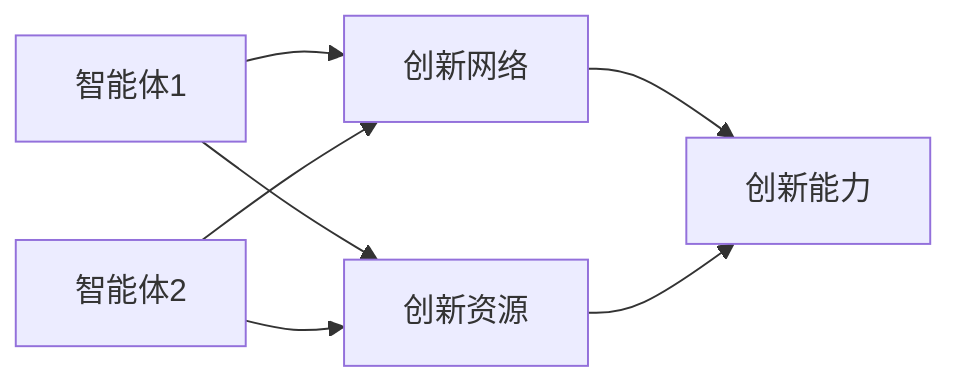
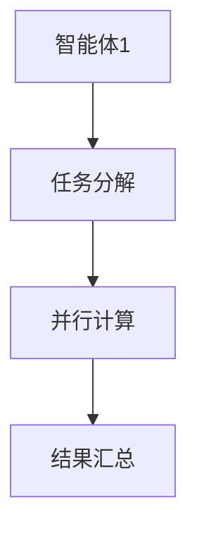
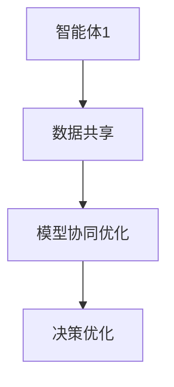
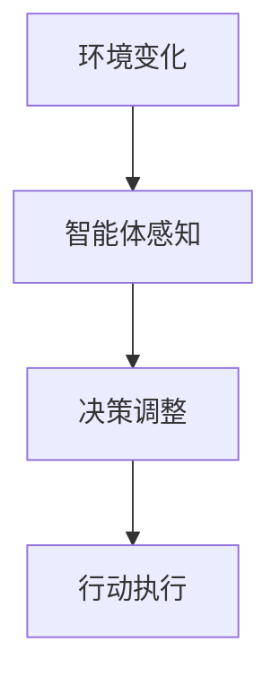
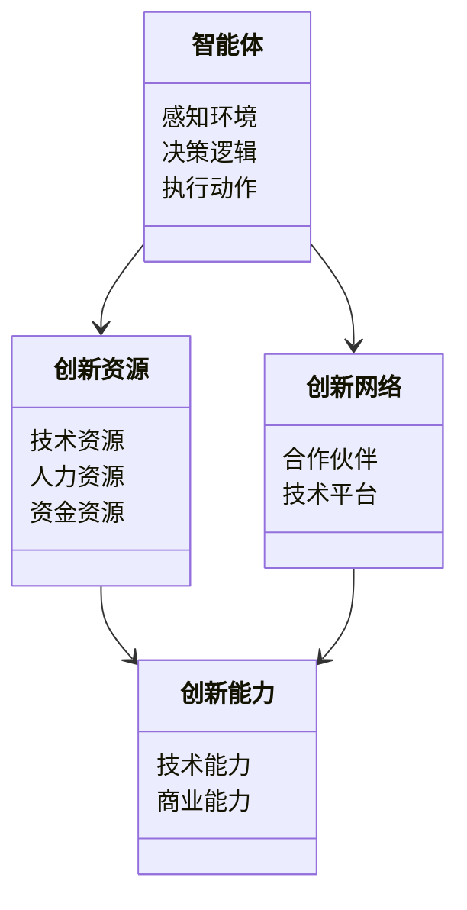
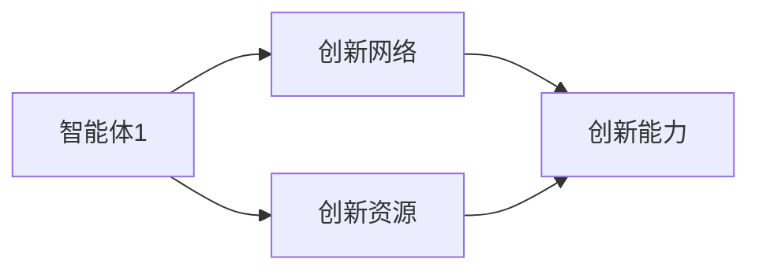
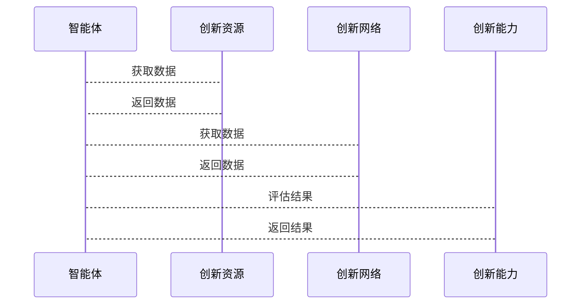

                 


# 利用多智能体系统评估公司的创新生态系统

## 关键词：
多智能体系统, 创新生态系统, 分布式计算, 协同学习, 系统架构, 创新评估

## 摘要：
本文探讨了如何利用多智能体系统（MAS）来评估公司的创新生态系统。通过分析多智能体系统的分布式计算和协同学习能力，结合创新生态系统的构成要素，提出了一种基于MAS的创新生态系统评估方法。文章详细介绍了多智能体系统的核心概念、算法原理、系统架构设计以及实际项目中的应用，为公司创新管理提供了新的思路和解决方案。

---

# 第1章 多智能体系统与创新生态系统概述

## 1.1 多智能体系统的定义与特点

### 1.1.1 多智能体系统的定义
多智能体系统（Multi-Agent System, MAS）是由多个智能体组成的分布式系统，这些智能体能够通过交互和协作完成复杂任务。每个智能体都是独立的实体，具有感知环境、自主决策和学习的能力。

### 1.1.2 多智能体系统的核心特点
- **分布式性**：智能体独立运行，任务分解到各个智能体。
- **协作性**：智能体之间通过通信和协调完成共同目标。
- **动态性**：智能体能够适应环境变化和任务需求。
- **自主性**：智能体具有自主决策能力，无需外部干预。

### 1.1.3 多智能体系统与传统单智能体系统的区别
| 特性       | 多智能体系统                | 单智能体系统                |
|------------|-----------------------------|-----------------------------|
| 系统结构    | 分布式，多个智能体协作       | 集中式，单个智能体执行任务   |
| 任务分解    | 复杂任务分解到多个智能体     | 任务集中在一个智能体完成     |
| 灵活性      | 高，适应环境变化能力强       | 较低，任务固定               |
| 并行性      | 高，多个智能体并行处理任务   | 较低，串行处理任务           |

---

## 1.2 创新生态系统的概念与构成

### 1.2.1 创新生态系统的定义
创新生态系统是指由公司内外部创新资源、合作伙伴、技术平台等构成的动态网络系统，旨在通过协同合作推动公司创新能力的提升。

### 1.2.2 创新生态系统的核心构成要素
- **创新资源**：包括技术、人才、资金等。
- **创新网络**：公司与合作伙伴的关系网络。
- **创新能力**：公司的技术开发和创新能力。

### 1.2.3 创新生态系统与公司创新管理的关系
创新生态系统是公司创新管理的重要工具，通过优化创新资源的分配和合作模式，提升公司的创新能力。

---

## 1.3 多智能体系统在创新生态系统评估中的优势

### 1.3.1 多智能体系统的分布式计算优势
多智能体系统能够将复杂任务分解到多个智能体，通过分布式计算提高效率。

### 1.3.2 多智能体系统的协同学习能力
智能体之间可以通过协同学习优化决策，提升创新评估的准确性。

### 1.3.3 多智能体系统的动态适应性
多智能体系统能够快速适应环境变化，确保创新评估的实时性和准确性。

---

# 第2章 多智能体系统与创新生态系统的核心概念

## 2.1 多智能体系统的组成与功能

### 2.1.1 智能体的定义与分类
- **智能体**：具有感知、决策和行动能力的实体。
- **分类**：分为简单反应型、基于模型反应型、目标驱动型和效用驱动型智能体。

### 2.1.2 智能体之间的交互与协作
- **交互**：通过通信协议进行信息交换。
- **协作**：通过任务分配和协同完成共同目标。

### 2.1.3 智能体的决策机制
- **感知环境**：通过传感器或数据源获取信息。
- **决策逻辑**：基于预设规则或机器学习模型做出决策。
- **行动**：执行决策并反馈结果。

---

## 2.2 创新生态系统的核心要素

### 2.2.1 创新资源的定义与分类
- **创新资源**：包括技术、人才、资金等。
- **分类**：分为内部资源和外部资源。

### 2.2.2 创新网络的构建与优化
- **构建**：通过合作伙伴关系构建创新网络。
- **优化**：通过智能体协同优化网络结构。

### 2.2.3 创新能力的评估与提升
- **评估**：通过多智能体系统评估创新能力。
- **提升**：通过优化资源配置和合作模式提升创新能力。

---

## 2.3 多智能体系统与创新生态系统的关系

### 2.3.1 多智能体系统的分布式架构与创新生态系统的网络结构
- 多智能体系统的分布式架构与创新生态系统的网络结构相似。

### 2.3.2 多智能体系统的协同机制与创新生态系统的合作模式
- 多智能体系统的协同机制可以用于优化创新生态系统的合作模式。

### 2.3.3 多智能体系统的动态适应性与创新生态系统的演进过程
- 多智能体系统的动态适应性可以用于模拟创新生态系统的演进过程。

---

## 2.4 多智能体系统与创新生态系统的核心关系图



---

# 第3章 多智能体系统评估创新生态系统的算法与模型

## 3.1 多智能体系统的算法原理

### 3.1.1 分布式计算与多智能体系统
- **分布式计算**：将任务分解到多个智能体，通过并行计算提高效率。

### 3.1.2 协同学习与多智能体系统
- **协同学习**：智能体通过协作优化决策模型。

### 3.1.3 动态适应性与多智能体系统
- **动态适应性**：智能体能够根据环境变化调整决策策略。

---

## 3.2 多智能体系统评估创新生态系统的算法实现

### 3.2.1 分布式计算算法


### 3.2.2 协同学习算法


### 3.2.3 动态适应性算法


---

## 3.3 多智能体系统评估创新生态系统的数学模型

### 3.3.1 创新能力评估模型
$$创新能力 = \sum_{i=1}^{n} w_i \cdot x_i$$
其中，$w_i$ 是权重，$x_i$ 是创新资源的指标。

### 3.3.2 创新网络优化模型
$$\text{优化目标} = \min \sum_{i=1}^{m} c_i \cdot x_i$$
其中，$c_i$ 是成本，$x_i$ 是创新网络的连接变量。

---

# 第4章 系统分析与架构设计方案

## 4.1 问题场景介绍
创新生态系统评估需要考虑公司内外部资源、合作伙伴关系以及创新能力等多个方面。

## 4.2 系统功能设计

### 4.2.1 领域模型设计


### 4.2.2 系统架构设计


### 4.2.3 系统接口设计
- **输入接口**：接收创新资源和合作伙伴数据。
- **输出接口**：输出创新能力评估结果。

### 4.2.4 系统交互设计


---

# 第5章 项目实战

## 5.1 环境安装
- **工具安装**：安装Python、Mermaid、Jupyter Notebook等工具。
- **依赖库安装**：安装numpy、pandas、matplotlib等库。

## 5.2 核心代码实现

### 5.2.1 智能体类实现
```python
class Agent:
    def __init__(self, id):
        self.id = id
        self.data = {}

    def感知环境(self, environment):
        self.data = environment

    def 决策逻辑(self):
        # 示例决策逻辑
        return "优化创新资源分配"

    def 执行动作(self, action):
        print(f"智能体{self.id}执行动作：{action}")
```

### 5.2.2 创新资源评估函数
```python
def 评估创新能力(创新资源, 创新网络):
    return 创新资源 * 创新网络
```

## 5.3 案例分析与代码解读
```python
# 示例代码
agent1 = Agent(1)
agent1.感知环境({"技术资源": 10, "人力资源": 20})
action = agent1.决策逻辑()
agent1.执行动作(action)
```

---

# 第6章 总结与展望

## 6.1 总结
本文详细介绍了多智能体系统在创新生态系统评估中的应用，通过理论分析和实际案例展示了其优势和实现方法。

## 6.2 最佳实践 tips
- **数据质量**：确保创新资源和合作伙伴数据的准确性。
- **智能体协作**：优化智能体之间的协作机制。
- **动态适应**：定期更新智能体的决策模型。

## 6.3 未来展望
未来的研究可以进一步探索多智能体系统在创新生态系统中的应用，如结合区块链技术实现更安全的协作。

---

# 附录

## 附录A 多智能体系统相关工具
- **工具列表**：包括Python、Mermaid、Jupyter Notebook等。

## 附录B 代码示例
```python
# 示例代码
class Agent:
    def __init__(self, id):
        self.id = id
        self.data = {}

    def 感知环境(self, environment):
        self.data = environment

    def 决策逻辑(self):
        return "优化创新资源分配"

    def 执行动作(self, action):
        print(f"智能体{self.id}执行动作：{action}")
```

---

通过以上内容，我们可以看到多智能体系统在创新生态系统评估中的巨大潜力。希望本文能为相关领域的研究和实践提供有价值的参考。

