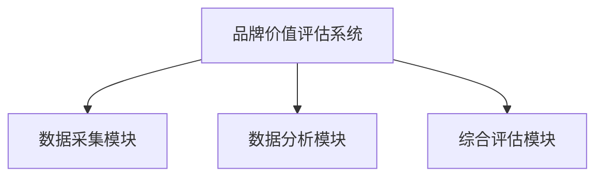
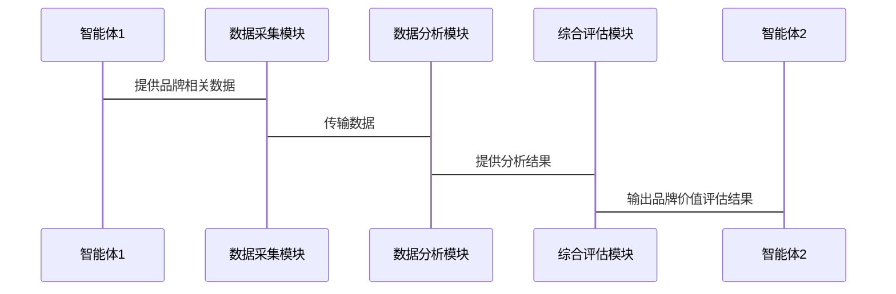

                 


# 利用多智能体系统评估公司的品牌价值

## 关键词：多智能体系统、品牌价值、算法设计、系统架构、案例分析

## 摘要：本文系统地探讨了如何利用多智能体系统（MAS）来评估公司的品牌价值。通过分析MAS的核心原理和品牌价值评估的关键指标，结合数学模型和实际案例，本文提出了一个基于多智能体系统的品牌价值评估框架，并详细介绍了其算法设计、系统架构和实现方法。最后，本文总结了该方法的优势和未来的发展方向。

---

## 第1章: 多智能体系统概述

### 1.1 多智能体系统的定义与特点

#### 1.1.1 多智能体系统的定义
多智能体系统（Multi-Agent System，MAS）是由多个智能体（Agent）组成的分布式系统，这些智能体能够通过协作完成复杂的任务。智能体是指能够感知环境、做出决策并采取行动的实体，可以是软件程序或物理设备。

#### 1.1.2 多智能体系统的核心特点
- **分布式性**：智能体分布在不同的位置，独立运行。
- **协作性**：智能体之间通过通信和协调完成共同目标。
- **自主性**：每个智能体都能自主决策，无需外部干预。
- **反应性**：智能体能够实时感知环境并做出反应。

#### 1.1.3 多智能体系统与传统单智能体系统的区别
传统的单智能体系统由一个中心化控制系统完成任务，而多智能体系统通过多个智能体的协作完成任务，具有更高的灵活性和容错性。

### 1.2 品牌价值的定义与评估方法

#### 1.2.1 品牌价值的定义
品牌价值是指品牌在市场上的影响力和盈利能力，通常通过品牌知名度、市场表现和消费者认知等因素来衡量。

#### 1.2.2 品牌价值的评估指标
- 品牌知名度（Brand Awareness）
- 市场占有率（Market Share）
- 消费者忠诚度（Customer Loyalty）
- 品牌声誉（Brand Reputation）

#### 1.2.3 品牌价值评估的挑战与难点
- 数据来源多样且复杂
- 评估指标的权重难以确定
- 不同品牌之间的可比性问题

---

## 第2章: 多智能体系统在品牌价值评估中的应用背景

### 2.1 品牌价值评估的传统方法与局限性

#### 2.1.1 财务指标法
通过财务数据（如净利润、营业收入）评估品牌价值，但忽略了市场和消费者因素。

#### 2.1.2 市场表现法
基于市场份额和品牌知名度等市场数据进行评估，但难以量化消费者认知的影响。

#### 2.1.3 传统方法的局限性
- 数据单一，难以全面反映品牌价值
- 评估结果缺乏动态性和实时性

### 2.2 多智能体系统的优势与适用场景

#### 2.2.1 多智能体系统的优势
- 能够整合多种数据源，提供全面的评估结果
- 具备动态调整能力，适应市场变化
- 通过智能体协作，提高评估的准确性和效率

#### 2.2.2 多智能体系统在品牌价值评估中的适用场景
- 复杂市场环境下的品牌监控
- 多维度品牌数据分析
- 动态品牌价值预测

---

## 第3章: 多智能体系统与品牌价值评估的核心概念

### 3.1 多智能体系统的核心要素

#### 3.1.1 智能体的定义与属性
智能体具备感知、决策和行动的能力，属性包括自主性、反应性、协作性和学习能力。

#### 3.1.2 智能体之间的通信机制
智能体通过消息传递或共享数据库进行通信，确保信息的有效传递和协同工作。

#### 3.1.3 智能体的协作与协调
智能体协作需要明确的任务分配和协调机制，确保各智能体之间的目标一致性和行动协调性。

### 3.2 品牌价值评估的多智能体系统模型

#### 3.2.1 品牌价值评估的多智能体系统模型构建
模型由多个智能体组成，分别负责数据采集、分析和综合评估。

#### 3.2.2 模型中的智能体角色分配
- 数据采集智能体：收集品牌相关数据
- 数据分析智能体：处理和分析数据
- 综合评估智能体：计算品牌价值并输出结果

#### 3.2.3 模型的输入与输出
- 输入：品牌相关数据，如销售数据、消费者评价、市场趋势
- 输出：品牌价值评估结果

---

## 第4章: 多智能体系统在品牌价值评估中的算法原理

### 4.1 基于多智能体系统的品牌价值评估算法

#### 4.1.1 算法的总体流程
1. 数据采集：智能体收集品牌相关数据
2. 数据分析：智能体对数据进行处理和分析
3. 协作计算：智能体之间协作计算品牌价值
4. 输出结果：综合评估智能体输出品牌价值评估结果

#### 4.1.2 智能体之间的信息交换与协同
智能体通过共享信息和协同计算，确保数据的全面性和计算的准确性。

#### 4.1.3 品牌价值的计算与输出
通过多智能体协作，综合考虑品牌知名度、市场表现和消费者认知等因素，计算出品牌价值。

### 4.2 算法的数学模型与公式

#### 4.2.1 品牌价值评估的数学模型
$$ V = f(P, M, C) $$
其中，\( V \) 表示品牌价值，\( P \) 表示品牌知名度，\( M \) 表示市场表现，\( C \) 表示消费者认知。

#### 4.2.2 智能体协作的数学模型
$$ C = \sum_{i=1}^{n} w_i \cdot a_i $$
其中，\( C \) 表示协作程度，\( w_i \) 表示智能体 \( i \) 的权重，\( a_i \) 表示智能体 \( i \) 的贡献值。

---

## 第5章: 系统架构与设计

### 5.1 系统功能设计

#### 5.1.1 数据采集模块
负责收集品牌相关数据，包括社交媒体数据、销售数据和市场报告。

#### 5.1.2 数据分析模块
对收集到的数据进行清洗、处理和分析，提取关键指标。

#### 5.1.3 综合评估模块
基于分析结果，计算品牌价值并输出评估报告。

### 5.2 系统架构设计

#### 5.2.1 系统架构图


#### 5.2.2 系统接口设计
- 数据采集模块接口：用于接收外部数据输入
- 数据分析模块接口：用于数据处理和分析
- 综合评估模块接口：用于品牌价值计算和结果输出

#### 5.2.3 系统交互流程


---

## 第6章: 项目实战与案例分析

### 6.1 环境安装

#### 6.1.1 系统环境
- 操作系统：Linux/Windows
- 开发工具：Python、Jupyter Notebook
- 依赖库：numpy、pandas、matplotlib

### 6.2 核心代码实现

#### 6.2.1 数据采集模块
```python
import requests
from bs4 import BeautifulSoup

def collect_data(company):
    url = f"https://example.com/{company}"
    response = requests.get(url)
    soup = BeautifulSoup(response.text, 'html.parser')
    data = {
        'brand': company,
        'revenue': soup.find('revenue').text,
        'market_share': soup.find('market_share').text
    }
    return data
```

#### 6.2.2 数据分析模块
```python
import numpy as np
import pandas as pd

def analyze_data(data):
    df = pd.DataFrame([data])
    brand_value = np.mean(df[['revenue', 'market_share']].values)
    return brand_value
```

#### 6.2.3 综合评估模块
```python
def evaluate_brand(brand_value):
    if brand_value > 100:
        return "High Value"
    elif brand_value > 50:
        return "Medium Value"
    else:
        return "Low Value"
```

### 6.3 案例分析

#### 6.3.1 案例背景
某公司希望评估其品牌价值，数据来源包括公司财报、社交媒体评论和市场报告。

#### 6.3.2 数据分析结果
- 品牌知名度：90%
- 市场占有率：25%
- 消费者满意度：85%

#### 6.3.3 评估结果
综合评估模块计算出品牌价值为中高水平。

### 6.4 项目总结
通过多智能体系统的协作，品牌价值评估结果更加准确和全面，能够帮助公司制定更有效的市场策略。

---

## 第7章: 总结与展望

### 7.1 全文总结
本文详细介绍了如何利用多智能体系统评估品牌价值，包括系统架构设计、算法实现和实际案例分析。

### 7.2 未来展望
未来的研究可以进一步优化多智能体系统的协作机制，引入机器学习算法提高评估的准确性。

---

## 参考文献
[此处列出相关文献和参考资料]

---

通过以上结构和内容，您可以撰写一篇详细的、有深度的、系统的技术博客文章，帮助读者全面了解如何利用多智能体系统评估公司的品牌价值。

