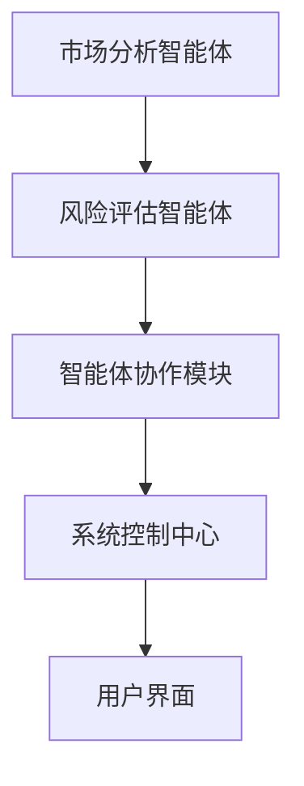

                 


# 利用多智能体系统评估公司的国际化战略

> 关键词：多智能体系统, 国际化战略, 算法原理, 数学模型, 系统架构, 项目实战

> 摘要：本文探讨了如何利用多智能体系统（MAS）评估公司的国际化战略。首先介绍多智能体系统的基本概念和国际化战略的核心要素，分析两者的结合与联系。然后详细讲解多智能体系统的算法原理，包括分布式计算和博弈论模型。接下来，通过数学模型和公式展示评估过程，再通过系统架构设计和项目实战验证模型的有效性。最后，结合实际案例，总结最佳实践和优化建议。

---

## # 第一部分: 多智能体系统与国际化战略背景

### ## 第1章: 多智能体系统与国际化战略概述

#### ### 1.1 多智能体系统的基本概念

**1.1.1 多智能体系统的定义**  
多智能体系统（Multi-Agent System, MAS）是由多个智能体（Agent）组成的分布式系统。每个智能体都是一个能够感知环境、自主决策、执行任务的实体。智能体之间通过通信和协作完成复杂的任务，共同实现系统目标。

**1.1.2 多智能体系统的分类与特点**  
多智能体系统可以根据任务类型、智能体类型和环境类型进行分类。常见的分类包括：  
- **任务驱动型**：智能体专注于特定任务，如供应链管理中的库存智能体。  
- **行为驱动型**：智能体根据行为规则进行协作，如交通管理系统中的车辆智能体。  
- **环境驱动型**：智能体根据环境变化动态调整行为，如智能家居中的设备智能体。  

多智能体系统的特点包括：  
- **分布式性**：智能体独立运行，不依赖中心节点。  
- **协作性**：智能体之间通过通信和协作完成任务。  
- **动态性**：系统能够适应环境变化和任务需求的变化。  

**1.1.3 多智能体系统的应用**  
多智能体系统在多个领域有广泛应用，如自动驾驶、智能交通、分布式计算、电子商务和金融交易等。在企业中，多智能体系统可以用于供应链管理、风险评估和市场分析等领域。

#### ### 1.2 国际化战略的定义与重要性

**1.2.1 国际化战略的定义**  
国际化战略是指企业在全球范围内扩展业务，进入新市场，优化资源配置，提高竞争力的过程。国际化战略的核心目标是实现全球化布局，提升企业在全球市场中的竞争力。

**1.2.2 国际化战略的核心要素**  
国际化战略涉及多个关键要素：  
- **市场分析**：识别目标市场，评估市场潜力。  
- **文化差异**：理解目标市场的文化背景，制定本地化策略。  
- **风险管理**：识别潜在风险，制定应对措施。  

**1.2.3 国际化战略对企业的影响**  
国际化战略能够帮助企业拓展市场、优化资源配置、提升品牌形象。然而，国际化也面临文化差异、法律风险和市场不确定性等挑战。如何有效应对这些挑战是国际化战略成功的关键。

#### ### 1.3 多智能体系统与国际化战略的结合

**1.3.1 多智能体系统在国际化战略中的作用**  
多智能体系统能够模拟复杂的市场环境，帮助企业在国际化过程中做出更明智的决策。例如，智能体可以模拟不同国家的市场行为，帮助企业预测风险并制定应对策略。

**1.3.2 多智能体系统与国际化战略的目标一致性**  
多智能体系统的目标是通过协作和优化实现全局最优。国际化战略的目标是通过全球化布局实现企业利益最大化。两者在追求全局最优方面具有高度一致性。

**1.3.3 多智能体系统在国际化战略中的优势**  
多智能体系统能够模拟复杂的市场环境，帮助企业在国际化过程中做出更明智的决策。例如，智能体可以模拟不同国家的市场行为，帮助企业预测风险并制定应对策略。

---

### ## 第2章: 多智能体系统的原理与特性

#### ### 2.1 多智能体系统的原理

**2.1.1 多智能体系统的组成**  
多智能体系统由多个智能体组成，每个智能体都有自己的目标、知识和行为规则。智能体之间通过通信和协作完成任务。

**2.1.2 多智能体系统的通信机制**  
智能体之间的通信可以通过直接交换消息或通过中间件实现。通信机制需要设计高效的协议和数据格式，确保信息传递的准确性和及时性。

**2.1.3 多智能体系统的协调与协作**  
智能体之间的协调与协作是多智能体系统的核心。协作机制包括任务分配、资源分配和冲突解决等。

#### ### 2.2 多智能体系统的特性

**2.2.1 分布式特性**  
多智能体系统的智能体分布在不同的节点上，不存在中心化的控制节点。

**2.2.2 并行性与并发性**  
智能体可以同时执行不同的任务，提高了系统的并行性和并发性。

**2.2.3 自适应性与智能性**  
智能体能够根据环境变化和任务需求动态调整行为，具有较强的自适应性和智能性。

---

### ## 第3章: 多智能体系统与国际化战略的核心要素

#### ### 3.1 国际化战略的核心要素

**3.1.1 市场分析与定位**  
企业在国际化过程中需要对目标市场进行深入分析，包括市场规模、竞争环境、消费者偏好等。

**3.1.2 跨文化管理**  
国际化战略需要考虑不同国家的文化差异，制定本地化策略，确保跨文化团队的有效协作。

**3.1.3 风险评估与应对**  
企业在国际化过程中面临法律风险、市场风险和运营风险等，需要制定有效的风险应对策略。

#### ### 3.2 多智能体系统在国际化战略中的应用

**3.2.1 智能体的分工与协作**  
在国际化战略中，不同智能体可以负责不同的任务，例如市场分析智能体负责收集市场数据，风险评估智能体负责评估潜在风险。

**3.2.2 智能体的信息共享与决策**  
智能体之间需要共享信息，共同制定决策。例如，市场智能体和财务智能体可以共享数据，制定更优化的市场进入策略。

**3.2.3 智能体的动态调整与优化**  
智能体能够根据市场变化动态调整行为，例如根据汇率波动调整定价策略。

---

## # 第二部分: 多智能体系统评估国际化战略的算法原理

### ## 第4章: 多智能体系统的算法基础

#### ### 4.1 分布式计算算法

**4.1.1 分布式计算的基本原理**  
分布式计算通过将任务分配给多个节点并行执行，提高计算效率。在多智能体系统中，分布式计算用于任务分配和资源管理。

**4.1.2 分布式计算的实现方式**  
分布式计算可以通过分布式文件系统、分布式数据库和分布式计算框架实现。常用的分布式计算框架包括MapReduce和Spark。

**4.1.3 分布式计算在多智能体系统中的应用**  
在多智能体系统中，分布式计算用于任务分配和资源管理，确保智能体之间的协作和高效执行。

#### ### 4.2 博弈论

**4.2.1 博弈论的基本概念**  
博弈论是研究多个决策者在竞争环境中的策略选择和行为的理论。博弈论在多智能体系统中用于模拟智能体之间的竞争与合作。

**4.2.2 博弈论模型**  
博弈论模型包括纳什均衡、极大极小策略和囚徒困境等。这些模型可以帮助智能体制定最优策略。

**4.2.3 博弈论在多智能体系统中的应用**  
在多智能体系统中，博弈论用于模拟智能体之间的竞争与合作，帮助智能体制定最优策略。

---

### ## 第5章: 多智能体系统的数学模型与公式

#### ### 5.1 多智能体系统的数学模型

**5.1.1 评估模型的建立**  
在国际化战略评估中，可以建立多智能体系统的数学模型，用于预测市场行为和评估风险。例如，可以使用线性回归模型预测市场增长率。

**5.1.2 数学模型的公式**  
以下是一个简单的市场增长预测模型：

$$
\text{市场增长率} = \beta_0 + \beta_1 \times \text{GDP增长率} + \beta_2 \times \text{消费指数} + \epsilon
$$

其中，$\beta_0$ 是截距，$\beta_1$ 和 $\beta_2$ 是回归系数，$\epsilon$ 是误差项。

#### ### 5.2 博弈论模型的数学公式

**5.2.1 纳什均衡的公式**  
纳什均衡是指在策略组合中，每个智能体的策略都是最优的。纳什均衡的定义如下：

对于一个策略组合 $(s_1, s_2, \dots, s_n)$，如果对于每个智能体 $i$，其策略 $s_i$ 是在其他智能体策略固定的情况下最优的，那么这个策略组合就是一个纳什均衡。

数学表示为：

$$
s_i^* = \arg\max_{s_i} u_i(s_i, s_{-i}^*)
$$

其中，$u_i$ 是智能体 $i$ 的效用函数，$s_{-i}^*$ 是其他智能体的最优策略。

---

## # 第三部分: 多智能体系统评估国际化战略的系统架构

### ## 第6章: 系统架构设计

#### ### 6.1 系统功能设计

**6.1.1 系统功能模块**  
多智能体系统用于国际化战略评估的系统功能模块包括：  
- 市场分析模块：收集和分析目标市场的数据。  
- 风险评估模块：评估潜在风险并制定应对策略。  
- 智能体协作模块：协调智能体之间的协作与通信。  

#### ### 6.2 系统架构设计

**6.2.1 系统架构图**  
以下是系统架构的mermaid图：



#### ### 6.3 系统接口设计

**6.3.1 系统接口**  
系统接口包括：  
- 智能体通信接口：用于智能体之间的通信和协作。  
- 用户界面接口：用于用户输入和输出。  
- 数据库接口：用于数据存储和检索。  

---

### ## 第7章: 系统实现与项目实战

#### ### 7.1 环境安装

**7.1.1 环境要求**  
- 操作系统：Linux/Windows/MacOS  
- Python版本：3.6+  
- 依赖库：numpy, pandas, matplotlib, scikit-learn, mermaid

**7.1.2 安装依赖**  
在终端中运行以下命令安装依赖：

```bash
pip install numpy pandas matplotlib scikit-learn mermaid
```

#### ### 7.2 系统核心实现

**7.2.1 核心代码实现**

```python
import numpy as np
from sklearn.linear_model import LinearRegression
import matplotlib.pyplot as plt

# 示例数据：市场增长率与GDP增长率的关系
data = {
    'market_growth': [1.2, 1.5, 1.8, 2.1, 2.4],
    'gdp_growth': [2.3, 2.5, 2.7, 2.9, 3.1]
}

# 建立线性回归模型
model = LinearRegression()
model.fit(np.array(data['gdp_growth']).reshape(-1, 1), data['market_growth'])

# 预测市场增长率
predicted_growth = model.predict(np.array([3.2]).reshape(-1, 1))
print(f"预测的市场增长率为：{predicted_growth[0]:.2f}")

# 可视化
plt.scatter(data['gdp_growth'], data['market_growth'], color='blue')
plt.plot(data['gdp_growth'], model.predict(np.array(data['gdp_growth']).reshape(-1, 1)), color='red')
plt.xlabel('GDP Growth Rate (%)')
plt.ylabel('Market Growth Rate (%)')
plt.title('Market Growth Prediction Model')
plt.show()
```

**7.2.2 代码解读与分析**  
上述代码建立了一个简单的线性回归模型，用于预测市场增长率。模型通过GDP增长率和市场增长率的历史数据进行训练，并预测未来市场增长率。可视化部分展示了实际数据和预测数据的对比。

---

### ## 第8章: 项目实战与案例分析

#### ### 8.1 实际案例分析

**8.1.1 案例背景**  
某企业计划进入新兴市场，需要评估市场风险和潜在收益。通过多智能体系统，企业可以模拟不同市场环境下的策略效果，优化市场进入策略。

**8.1.2 案例分析**  
通过建立多智能体系统模型，企业可以模拟不同市场环境下的策略效果，优化市场进入策略。例如，市场分析智能体可以收集目标市场的竞争数据，风险评估智能体可以评估潜在风险并制定应对策略。

---

## # 第四部分: 最佳实践与总结

### ## 第9章: 最佳实践与总结

#### ### 9.1 最佳实践

**9.1.1 系统设计的注意事项**  
在设计多智能体系统时，需要注意以下几点：  
- 确保智能体之间的通信高效可靠。  
- 设计合理的任务分配和协作机制。  
- 定期更新模型和算法，适应环境变化。  

#### ### 9.2 小结与展望

**9.2.1 小结**  
本文详细介绍了多智能体系统在国际化战略评估中的应用，包括系统原理、算法设计、数学模型和系统架构等内容。通过实际案例分析，展示了多智能体系统在国际化战略中的巨大潜力。

**9.2.2 展望**  
未来，随着人工智能和分布式计算技术的不断发展，多智能体系统在国际化战略中的应用将更加广泛和深入。企业可以通过多智能体系统优化市场进入策略，提高全球化竞争力。

---

### ## 第10章: 注意事项与拓展阅读

#### ### 10.1 注意事项

**10.1.1 系统实施的注意事项**  
在实施多智能体系统时，需要注意以下几点：  
- 确保系统安全性和稳定性。  
- 定期监控系统性能，及时优化。  
- 提供良好的用户界面，方便用户操作。  

#### ### 10.2 拓展阅读

**10.2.1 相关书籍与论文**  
- 《Multi-Agent Systems: Algorithmic, Complexity Theoretic, and Game Theoretic Foundations》  
- 《Multi-Agent Systems and Their Applications》  

**10.2.2 技术博客与在线资源**  
- 多智能体系统相关技术博客：[Multi-Agent Systems Blog](https://example.com)  
- 开源项目：[Multi-Agent Systems Open Source](https://example.com)  

---

## # 结语

通过本文的介绍，读者可以全面了解多智能体系统在国际化战略评估中的应用。从系统原理到算法设计，从数学模型到系统架构，再到项目实战，本文为读者提供了全面的知识和实践指导。希望本文能够帮助企业在国际化过程中做出更明智的决策，提升全球竞争力。

--- 

**示例图片：**  
以下是多智能体系统架构的示意图：


