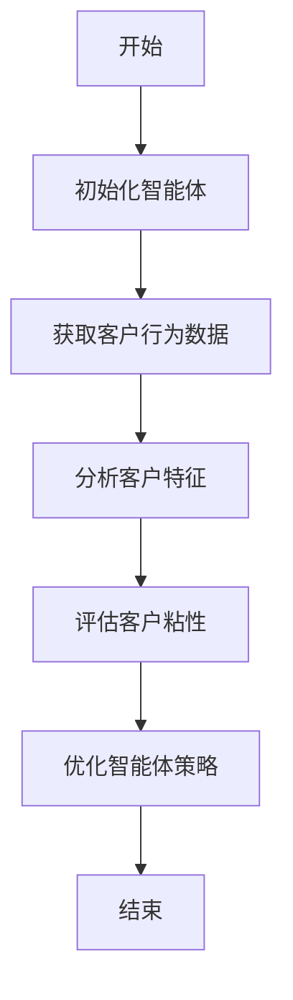

                 


# 利用多智能体系统评估公司的客户粘性

> **关键词**：多智能体系统、客户粘性、协同学习、强化学习、算法原理、系统架构

> **摘要**：本文详细探讨了利用多智能体系统评估公司客户粘性的方法。从问题背景、核心概念到算法原理、系统设计，再到项目实战，系统地分析了多智能体系统在客户粘性评估中的应用。通过ER实体关系图、算法流程图和系统架构图等工具，深入阐述了实现过程中的关键点，为读者提供了从理论到实践的全面指导。

---

# 第一部分：多智能体系统与客户粘性评估背景

## 第1章：多智能体系统与客户粘性概述

### 1.1 多智能体系统的基本概念

#### 1.1.1 多智能体系统的定义与特点
多智能体系统（Multi-Agent System, MAS）是由多个智能体（Agent）组成的分布式系统，这些智能体通过协作或竞争完成特定任务。其特点包括：

- **分布式性**：智能体分布在网络中，每个智能体独立运行。
- **自主性**：每个智能体都有自主决策能力。
- **协同性**：智能体之间通过通信和协作完成复杂任务。
- **反应性**：智能体能够实时感知环境并做出反应。

#### 1.1.2 多智能体系统的核心要素
多智能体系统的核心要素包括：

- **智能体**：具有自主性、反应性和社会性的实体。
- **环境**：智能体所处的外部世界，包括物理环境和任务目标。
- **通信机制**：智能体之间的信息交换方式。
- **协作协议**：智能体之间协同工作的规则。

#### 1.1.3 多智能体系统与传统单智能体系统的区别

| 特性             | 多智能体系统                              | 单智能体系统                              |
|------------------|------------------------------------------|------------------------------------------|
| 系统结构         | 分布式、多个智能体                      | 集中式、单个智能体                      |
| 资源分配         | 智能体之间共享资源                      | 单一智能体独立使用资源                  |
| 任务处理         | 多智能体协同完成复杂任务                | 单智能体独立完成任务                    |
| 故障容错能力     | 高，部分智能体故障不影响整体任务        | 低，单点故障可能导致系统瘫痪              |

### 1.2 客户粘性的定义与评估方法

#### 1.2.1 客户粘性的定义
客户粘性是指客户对企业产品或服务的依赖程度，客户粘性越高，客户更换供应商的可能性越小。客户粘性通常通过客户保留率、客户满意度和客户生命周期价值等指标来衡量。

#### 1.2.2 客户粘性评估的维度
客户粘性评估可以从以下几个维度进行：

1. **客户保留率**：客户在一定时间内继续使用产品或服务的比例。
2. **客户满意度**：客户对产品或服务的满意程度。
3. **客户忠诚度**：客户在面对竞争对手时选择继续使用该产品或服务的程度。
4. **客户生命周期价值**：客户在其生命周期内为公司带来的总收入。

#### 1.2.3 客户粘性评估的挑战与意义
客户粘性评估的挑战主要在于数据的复杂性和动态性。客户的行为受多种因素影响，包括产品性能、市场价格、竞争对手策略等。多智能体系统能够通过实时数据处理和协同学习，有效应对这些挑战。

### 1.3 多智能体系统在客户粘性评估中的应用前景

#### 1.3.1 多智能体系统的优势
多智能体系统在客户粘性评估中的优势体现在以下几个方面：

- **分布式计算能力**：多智能体系统能够处理大规模数据，适合实时分析。
- **自主决策能力**：智能体可以根据实时数据做出决策，提高评估效率。
- **协作能力**：多个智能体可以协同工作，覆盖不同维度的客户行为分析。

#### 1.3.2 多智能体系统在客户粘性评估中的应用场景
多智能体系统可以应用于以下场景：

1. **实时客户行为分析**：通过智能体实时监控客户行为，评估客户粘性。
2. **预测客户流失风险**：通过协同学习，预测客户可能的流失行为。
3. **个性化服务推荐**：根据客户粘性，推荐个性化服务策略。

#### 1.3.3 多智能体系统在客户粘性评估中的挑战
多智能体系统在客户粘性评估中也面临一些挑战，例如：

- **智能体之间的通信开销**：过多的通信可能导致系统性能下降。
- **协同学习的复杂性**：多个智能体协同学习需要复杂的算法支持。
- **数据隐私问题**：客户数据的安全性和隐私性需要得到保障。

### 1.4 本章小结
本章从多智能体系统的定义、核心要素以及在客户粘性评估中的应用前景进行了概述。通过对比多智能体系统和传统单智能体系统，明确了多智能体系统的优势和应用场景。同时，也指出了在实际应用中可能遇到的挑战。

---

## 第2章：多智能体系统与客户粘性评估的核心概念与联系

### 2.1 多智能体系统的原理与模型

#### 2.1.1 多智能体系统的原理
多智能体系统的核心原理在于智能体之间的协作与通信。智能体通过感知环境、自主决策和与其它智能体协作，完成特定任务。多智能体系统的运行过程可以分为以下几个步骤：

1. **感知环境**：智能体通过传感器或数据接口获取环境信息。
2. **自主决策**：智能体基于获取的信息做出决策。
3. **通信协作**：智能体之间通过通信机制交换信息，协同完成任务。
4. **反馈与学习**：智能体根据任务结果进行反馈和学习，优化后续决策。

#### 2.1.2 多智能体系统的常见模型
多智能体系统中常见的模型包括：

1. **基于规则的模型**：通过预定义的规则进行决策。
2. **基于状态的模型**：基于当前状态和历史信息进行决策。
3. **基于强化学习的模型**：通过奖励机制优化决策策略。

#### 2.1.3 多智能体系统与客户粘性评估的关系
多智能体系统在客户粘性评估中的应用，主要是通过多个智能体协同工作，实时分析客户的多种行为数据，从而评估客户的粘性。智能体之间的协作可以提高评估的准确性和效率。

### 2.2 客户粘性评估的数学模型

#### 2.2.1 客户粘性评估的基本模型
客户粘性评估的基本模型可以表示为：

$$
\text{客户粘性} = f(\text{客户行为}, \text{客户特征}, \text{环境因素})
$$

其中，$f$ 是一个函数，用于将客户行为、客户特征和环境因素转化为客户粘性指标。

#### 2.2.2 客户粘性评估的改进模型
为了提高评估的准确性，可以引入多智能体系统，通过多个智能体协同学习，优化客户粘性评估模型：

$$
\text{客户粘性} = f_1(\text{客户行为}, \text{智能体1决策}) + f_2(\text{客户特征}, \text{智能体2决策}) + \ldots + f_n(\text{环境因素}, \text{智能体n决策})
$$

#### 2.2.3 多智能体系统在客户粘性评估中的数学模型
多智能体系统在客户粘性评估中的数学模型可以表示为：

$$
\text{客户粘性} = \sum_{i=1}^{n} w_i \cdot f_i(x_i)
$$

其中，$w_i$ 是智能体 $i$ 的权重，$x_i$ 是智能体 $i$ 的输入数据，$f_i$ 是智能体 $i$ 的评估函数。

### 2.3 多智能体系统与客户粘性评估的ER实体关系图

```mermaid
erDiagram
    customer(CUSTOMER_ID, NAME, EMAIL, PHONE) {
        customer --> interaction_log : "产生"
        customer --> feature : "具有"
    }
    interaction_log(LOG_ID, CUSTOMER_ID, TIMESTAMP, ACTION, DETAILS) {
        interaction_log --> customer : "属于"
    }
    feature(FEATURE_ID, NAME, DESCRIPTION) {
        customer --> feature : "具有"
    }
    customer {
        +CUSTOMER_ID : integer
        +NAME : string
        +EMAIL : string
        +PHONE : string
    }
    interaction_log {
        +LOG_ID : integer
        +CUSTOMER_ID : integer
        +TIMESTAMP : datetime
        +ACTION : string
        +DETAILS : string
    }
    feature {
        +FEATURE_ID : integer
        +NAME : string
        +DESCRIPTION : string
    }
```

---

## 第3章：多智能体系统与客户粘性评估的算法原理

### 3.1 多智能体协同学习算法

#### 3.1.1 协同学习的基本原理
协同学习是一种通过多个学习者协作完成任务的学习方法。多智能体协同学习的核心在于智能体之间的信息共享和策略协同。

#### 3.1.2 多智能体协同学习的实现方法
多智能体协同学习的实现方法包括：

1. **基于规则的协同学习**：通过预定义的规则进行协同。
2. **基于强化学习的协同学习**：通过奖励机制优化协同策略。
3. **基于博弈论的协同学习**：通过博弈论模型优化智能体之间的协作。

#### 3.1.3 多智能体协同学习的数学模型
多智能体协同学习的数学模型可以表示为：

$$
\max_{\theta_i} \sum_{i=1}^{n} r_i(\theta_i, \theta_{-i})
$$

其中，$\theta_i$ 是智能体 $i$ 的策略参数，$\theta_{-i}$ 是其他智能体的策略参数，$r_i$ 是智能体 $i$ 的奖励函数。

### 3.2 基于强化学习的客户粘性评估算法

#### 3.2.1 强化学习的基本原理
强化学习是一种通过智能体与环境互动来学习策略的方法。智能体通过试错的方式优化决策策略，以最大化累计奖励。

#### 3.2.2 基于强化学习的客户粘性评估模型
基于强化学习的客户粘性评估模型包括以下几个步骤：

1. **状态空间定义**：定义客户行为的状态，例如客户访问频率、购买间隔等。
2. **动作空间定义**：定义智能体可以执行的动作，例如推荐产品、发送优惠券等。
3. **奖励函数设计**：设计奖励函数，根据智能体的动作和状态变化给予奖励或惩罚。

#### 3.2.3 强化学习算法的数学公式
强化学习算法的数学公式可以表示为：

$$
Q(s, a) = Q(s, a) + \alpha [r + \gamma \max_a Q(s', a) - Q(s, a)]
$$

其中，$Q(s, a)$ 是状态 $s$ 下动作 $a$ 的价值函数，$\alpha$ 是学习率，$r$ 是奖励，$\gamma$ 是折扣因子，$s'$ 是下一状态。

### 3.3 多智能体系统与客户粘性评估的算法流程图



---

## 第4章：多智能体系统与客户粘性评估的系统分析与架构设计

### 4.1 系统功能设计

#### 4.1.1 系统功能模块划分
多智能体系统与客户粘性评估的系统功能模块包括：

1. **数据采集模块**：采集客户的互动数据，例如点击、购买等。
2. **智能体协作模块**：多个智能体协同工作，分析客户行为。
3. **评估模块**：根据分析结果评估客户的粘性。
4. **优化模块**：根据评估结果优化智能体策略。

#### 4.1.2 系统功能模块的交互流程
系统功能模块的交互流程如下：

1. 数据采集模块采集客户行为数据。
2. 智能体协作模块分析数据，评估客户粘性。
3. 优化模块根据评估结果优化智能体策略。
4. 重复上述过程，持续优化。

#### 4.1.3 系统功能模块的实现方式
系统功能模块的实现方式包括：

- 数据采集模块：通过API接口采集客户行为数据。
- 智能体协作模块：通过消息队列实现智能体之间的通信。
- 评估模块：通过机器学习算法实现客户粘性评估。
- 优化模块：通过强化学习算法优化智能体策略。

### 4.2 系统架构设计

#### 4.2.1 系统架构的分层设计
多智能体系统与客户粘性评估的系统架构可以分为以下几层：

1. **数据层**：存储客户行为数据和特征数据。
2. **智能体层**：多个智能体协同工作，分析数据。
3. **评估层**：评估客户粘性，生成评估结果。
4. **优化层**：优化智能体策略，提升评估准确性。

#### 4.2.2 系统架构的模块划分
系统架构的模块划分包括：

- 数据采集模块：负责采集客户行为数据。
- 数据处理模块：负责处理和预处理数据。
- 智能体协作模块：负责智能体之间的通信和协作。
- 评估模块：负责客户粘性评估。
- 优化模块：负责智能体策略优化。

#### 4.2.3 系统架构的交互流程
系统架构的交互流程如下：

1. 数据采集模块采集客户行为数据。
2. 数据处理模块对数据进行预处理。
3. 智能体协作模块分析数据，评估客户粘性。
4. 优化模块根据评估结果优化智能体策略。
5. 重复上述过程，持续优化。

---

## 第5章：多智能体系统与客户粘性评估的项目实战

### 5.1 项目介绍

#### 5.1.1 项目目标
本项目的目标是利用多智能体系统评估公司的客户粘性，通过实时分析客户行为数据，预测客户流失风险，优化客户保留策略。

#### 5.1.2 项目需求
项目需求包括：

1. 实时采集客户行为数据。
2. 多智能体协同分析数据，评估客户粘性。
3. 预测客户流失风险，优化客户保留策略。

#### 5.1.3 项目实现方案
项目实现方案包括：

1. 数据采集模块：通过API接口采集客户行为数据。
2. 数据处理模块：对数据进行预处理和特征提取。
3. 智能体协作模块：通过消息队列实现智能体之间的通信。
4. 评估模块：通过机器学习算法实现客户粘性评估。
5. 优化模块：通过强化学习算法优化智能体策略。

### 5.2 项目核心实现源代码

#### 5.2.1 数据采集模块

```python
import requests

def collect_data():
    response = requests.get('https://api.example.com/interactions')
    return response.json()
```

#### 5.2.2 数据处理模块

```python
import pandas as pd

def preprocess_data(data):
    df = pd.DataFrame(data)
    df['timestamp'] = pd.to_datetime(df['timestamp'])
    return df
```

#### 5.2.3 智能体协作模块

```python
import zmq

def agent_communication(message):
    context = zmq.Context()
    socket = context.socket(zmq.PUBLISHER)
    socket.bind('tcp://*:5555')
    socket.send_pyobj(message)
    return socket.recv_pyobj()
```

#### 5.2.4 评估模块

```python
def evaluate_customer(data):
    # 使用机器学习算法进行客户粘性评估
    pass
```

#### 5.2.5 优化模块

```python
def optimize_agents(data):
    # 使用强化学习算法优化智能体策略
    pass
```

### 5.3 实际案例分析

#### 5.3.1 案例背景
某电子商务公司希望通过多智能体系统评估客户粘性，优化客户保留策略。

#### 5.3.2 数据分析
通过数据采集和处理模块，获取客户行为数据，包括客户的访问频率、购买记录等。

#### 5.3.3 系统实现
通过智能体协作模块，分析客户行为数据，评估客户的粘性。

#### 5.3.4 优化策略
通过优化模块，优化智能体策略，提升客户粘性评估的准确性。

### 5.4 项目总结

#### 5.4.1 项目成果
通过本项目，实现了多智能体系统在客户粘性评估中的应用，提高了客户粘性评估的准确性和效率。

#### 5.4.2 项目经验总结
在项目实施过程中，需要注意智能体之间的通信开销和协同学习的复杂性。同时，数据隐私问题也需要得到重视。

#### 5.4.3 项目未来展望
未来可以进一步优化智能体协作算法，引入更复杂的强化学习模型，提升客户粘性评估的准确性。

---

## 第6章：最佳实践、小结、注意事项、拓展阅读

### 6.1 最佳实践

1. **数据预处理**：在进行客户粘性评估之前，需要对数据进行预处理，确保数据的准确性和完整性。
2. **智能体协作优化**：通过优化智能体之间的通信和协作，提高系统的效率。
3. **模型优化**：通过不断优化智能体的决策策略，提升客户粘性评估的准确性。

### 6.2 小结
本章从项目实战的角度，详细介绍了多智能体系统在客户粘性评估中的实现过程。通过实际案例分析，验证了多智能体系统的有效性和实用性。

### 6.3 注意事项

1. **数据隐私**：在处理客户数据时，需要注意数据的隐私性和安全性。
2. **系统性能**：多智能体系统的通信开销可能会影响系统性能，需要进行优化。
3. **算法选择**：根据具体场景选择合适的算法，避免盲目使用复杂的算法。

### 6.4 拓展阅读
1. **强化学习**：深入学习强化学习的基本原理和应用。
2. **多智能体系统**：研究多智能体系统的最新研究进展和应用案例。
3. **客户粘性分析**：探索客户粘性分析的其他方法和应用场景。

---

## 第7章：总结与展望

### 7.1 总结
本文详细探讨了利用多智能体系统评估公司客户粘性的方法，从理论到实践，系统地分析了多智能体系统在客户粘性评估中的应用。通过ER实体关系图、算法流程图和系统架构图等工具，深入阐述了实现过程中的关键点。

### 7.2 未来展望
未来，随着人工智能技术的不断发展，多智能体系统在客户粘性评估中的应用将更加广泛和深入。可以通过引入更复杂的强化学习模型和优化算法，进一步提升客户粘性评估的准确性和效率。

---

# 结语

通过本文的介绍，读者可以全面了解多智能体系统在客户粘性评估中的应用，掌握从理论到实践的实现过程。希望本文能够为相关领域的研究和实践提供有价值的参考和指导。

