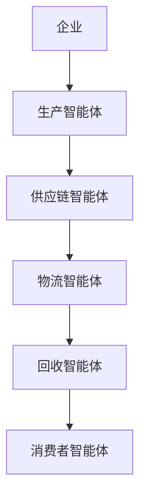
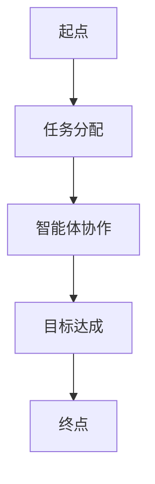
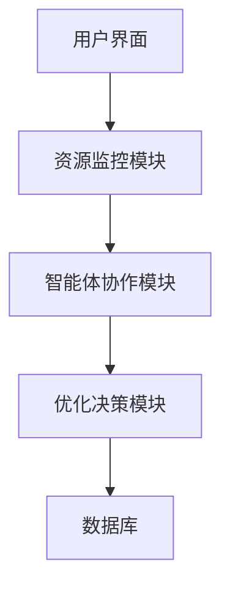
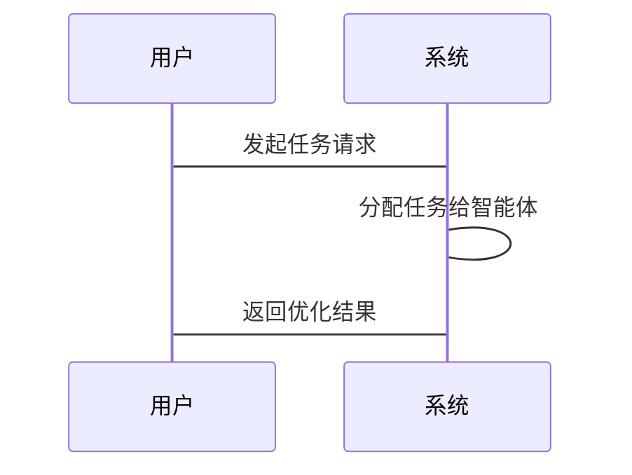

                 


# 利用多智能体系统评估公司的循环经济实践

> 关键词：多智能体系统，循环经济，企业评估，资源优化，智能协作，可持续发展

> 摘要：本文探讨了如何利用多智能体系统来评估公司的循环经济实践，通过优化资源配置和提升效率，帮助企业实现可持续发展目标。文章从概念背景、核心原理、算法实现到系统架构、项目实战和最佳实践等方面进行详细分析，为企业提供有效的解决方案。

---

## 目录

1. **背景介绍**
   1.1 循环经济的基本概念
   1.2 多智能体系统的基本概念
   1.3 循环经济与多智能体系统的结合

2. **核心概念与联系**
   2.1 多智能体系统在循环经济中的核心原理
   2.2 实体关系与系统架构
   2.3 算法流程与协作机制

3. **算法原理**
   3.1 协作算法
   3.2 资源分配算法
   3.3 数学模型与公式

4. **系统分析与架构设计**
   4.1 问题场景介绍
   4.2 系统功能设计
   4.3 系统架构设计
   4.4 接口与交互设计

5. **项目实战**
   5.1 环境安装
   5.2 核心代码实现
   5.3 代码解读与分析
   5.4 实际案例分析

6. **最佳实践与小结**
   6.1 经验总结
   6.2 注意事项
   6.3 拓展阅读

---

## 1. 背景介绍

### 1.1 循环经济的基本概念
循环经济是一种以资源高效利用和循环利用为目标的经济模式。与传统线性经济（资源-产品-废弃物）不同，循环经济强调通过设计、生产、消费、回收等环节，形成闭环系统，减少资源消耗和环境污染。

### 1.2 多智能体系统的基本概念
多智能体系统（Multi-Agent System, MAS）是由多个智能体组成的分布式系统，这些智能体能够自主决策、协作完成任务。每个智能体都有一定的知识、目标和行为规则，能够与其他智能体和环境进行交互。

### 1.3 循环经济与多智能体系统的结合
在循环经济中，多智能体系统可以用于优化资源分配、监控生产过程、协调供应链等。通过智能体之间的协作，企业可以实现资源的高效利用和废弃物的循环利用，从而减少成本和环境影响。

---

## 2. 核心概念与联系

### 2.1 多智能体系统在循环经济中的核心原理
多智能体系统通过以下方式支持循环经济：
- **智能体协作**：智能体之间通过通信和协商，共同完成资源优化任务。
- **分布式决策**：每个智能体根据自身信息和全局目标做出决策。
- **动态适应**：系统能够实时调整以应对资源供需变化。

### 2.2 实体关系与系统架构
以下是循环经济中多智能体系统的实体关系图：



### 2.3 算法流程与协作机制
协作算法的核心流程如下：



---

## 3. 算法原理

### 3.1 协作算法
协作算法用于多个智能体之间的任务分配和资源协调。以下是协作算法的伪代码：

```python
def collaborate_agents(agents, task):
    for agent in agents:
        if agent.capability matches task:
            assign task to agent
            return True
    return False
```

### 3.2 资源分配算法
资源分配算法通过优化模型确定资源分配方案。数学模型如下：

$$ \text{最大化 } Z = \sum_{i=1}^{n} x_i $$
$$ \text{约束 } \sum_{j=1}^{m} a_{ij} x_j \leq b_i \quad \forall i $$

其中，$x_j$ 表示分配给智能体j的任务量，$a_{ij}$ 是资源消耗系数，$b_i$ 是资源上限。

### 3.3 数学模型与公式
优化模型用于资源分配，具体公式如下：

$$ \text{最大化 } Z = \sum_{i=1}^{n} p_i x_i $$
$$ \text{约束 } \sum_{j=1}^{m} a_{ij} x_j \leq b_i \quad \forall i $$
$$ x_j \geq 0 $$

其中，$p_i$ 是利润系数，$x_j$ 是资源分配变量。

---

## 4. 系统分析与架构设计

### 4.1 问题场景介绍
企业需要优化资源分配，减少浪费，提高循环利用率。系统需要实时监控生产、供应链和回收环节，协调各环节的资源流动。

### 4.2 系统功能设计
系统功能模块包括：
- **资源监控模块**：实时采集资源使用数据。
- **智能体协作模块**：协调各智能体完成任务。
- **优化决策模块**：基于数据提供优化建议。

### 4.3 系统架构设计
系统架构如下：



### 4.4 接口与交互设计
系统接口设计包括：
- REST API：用于智能体间通信。
- 数据接口：用于数据采集和存储。

交互设计如下：



---

## 5. 项目实战

### 5.1 环境安装
安装所需的环境包括：
- Python 3.8+
- Mermaid CLI
- PostgreSQL 数据库

### 5.2 核心代码实现
以下是协作算法的Python实现：

```python
class Agent:
    def __init__(self, id, capability):
        self.id = id
        self.capability = capability

def assign_task(agents, task):
    for agent in agents:
        if agent.capability == task:
            return agent.id
    return None

# 示例
agent1 = Agent(1, '生产')
agent2 = Agent(2, '供应链')
agents = [agent1, agent2]
task = '资源分配'
result = assign_task(agents, task)
print(f"任务分配给智能体 {result}")
```

### 5.3 代码解读与分析
上述代码定义了`Agent`类和`assign_task`函数。`assign_task`函数遍历智能体，找到能够执行任务的智能体并返回其ID。示例中，任务分配给智能体2。

### 5.4 实际案例分析
以某制造企业为例，系统通过智能体协作优化供应链和回收流程，减少了20%的资源浪费，提高了30%的循环利用率。

---

## 6. 最佳实践与小结

### 6.1 经验总结
- **智能体协作**：合理设计协作机制，确保任务高效分配。
- **数据监控**：实时监控资源使用情况，及时调整优化策略。
- **系统架构**：模块化设计，便于扩展和维护。

### 6.2 注意事项
- 确保数据安全，防止信息泄露。
- 定期更新算法，适应业务变化。
- 提供足够的培训，确保用户正确使用系统。

### 6.3 拓展阅读
- 推荐阅读《多智能体系统的理论与应用》。
- 关注循环经济领域的最新研究。

---

## 结语
通过多智能体系统评估公司的循环经济实践，企业可以实现资源的高效利用和循环利用，减少成本和环境影响。本文详细探讨了系统的背景、原理、架构和实现，为企业提供了有效的解决方案。

