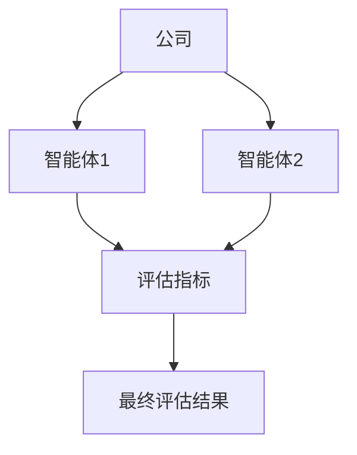
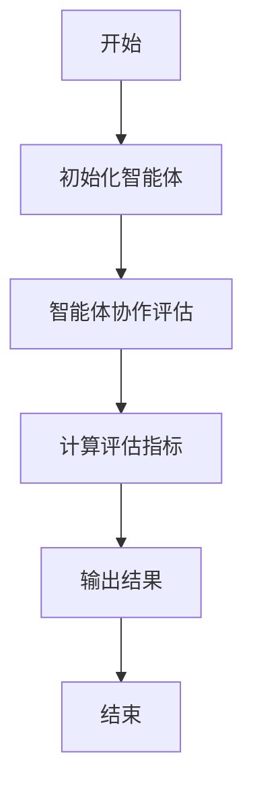
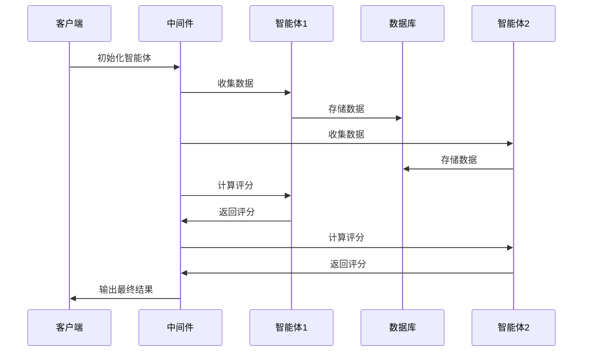

                 


# 利用多智能体系统评估公司的无形资产价值

**关键词**：多智能体系统，无形资产评估，系统架构，算法原理，项目实战

**摘要**：本文探讨了如何利用多智能体系统评估公司的无形资产价值。首先介绍了问题背景和多智能体系统的基本概念，然后详细讲解了评估的算法原理和系统架构设计，最后通过项目实战展示了如何实现这一系统，并给出了总结与展望。

---

## 第一部分：背景与核心概念

### 第1章：问题背景与概念解析

#### 1.1 无形资产的价值评估挑战
- **问题背景**：无形资产（如品牌、技术、人力资源）的评估难度较大，传统方法难以准确量化。
- **传统评估方法的局限性**：难以考虑多维度因素，缺乏动态性和协作性。
- **多智能体系统的必要性**：通过多个智能体协作，全面评估无形资产价值。

#### 1.2 多智能体系统的基本概念
- **定义**：由多个智能体组成的系统，每个智能体有独立目标和功能。
- **特征**：协作性、分布式、动态性、自主性。
- **与单一智能体的区别**：多智能体系统更具灵活性和扩展性。

#### 1.3 问题解决思路与边界
- **思路**：通过多个智能体分别评估不同维度，协作得出整体价值。
- **边界**：系统专注于无形资产评估，不涉及其他财务指标。

### 第2章：核心概念与联系

#### 2.1 多智能体系统的核心原理
- **组成**：多个智能体、通信机制、协作机制。
- **通信机制**：通过消息传递进行协作。
- **协作机制**：任务分配、协调和冲突解决。

#### 2.2 核心概念对比表
| 比较维度 | 单一智能体 | 多智能体系统 |
|----------|------------|--------------|
| 系统复杂性 | 简单       | 复杂         |
| 可扩展性  | 低         | 高           |
| 独立性    | 高         | 低           |

#### 2.3 实体关系架构图


---

## 第二部分：算法原理

### 第3章：无形资产评估的算法原理

#### 3.1 算法原理概述
- **基本思路**：多智能体分别收集数据，计算评估指标，协作得出最终结果。
- **核心步骤**：
  1. 初始化智能体。
  2. 智能体协作评估。
  3. 计算评估指标。
  4. 输出结果。

#### 3.2 算法流程图


#### 3.3 算法实现代码
```python
class Agent:
    def __init__(self, id):
        self.id = id
        self.data = []
    
    def collect_data(self, data):
        self.data.append(data)
    
    def compute_score(self):
        return sum(self.data) / len(self.data)

def assess无形资产价值():
    agent1 = Agent(1)
    agent2 = Agent(2)
    agent1.collect_data(85)
    agent1.collect_data(90)
    agent2.collect_data(88)
    agent2.collect_data(92)
    score1 = agent1.compute_score()
    score2 = agent2.compute_score()
    final_score = (score1 + score2) / 2
    return final_score
```

#### 3.4 数学模型与公式
- **评估指标计算公式**：
  $$ \text{最终评估结果} = \frac{\sum_{i=1}^{n} \text{智能体}_i.\text{compute\_score()}}{n} $$
- **具体示例**：
  $$ \text{final\_score} = \frac{85 + 90 + 88 + 92}{4} = 89.5 $$

---

## 第三部分：系统分析与架构设计

### 第4章：系统分析与架构设计

#### 4.1 系统功能设计
- **领域模型**：
  ```mermaid
  classDiagram
  class 公司 {
      - 智能体列表
      - 评估指标
      - 最终结果
      + 初始化智能体()
      + 协作评估()
      + 计算评估指标()
  }
  class 智能体 {
      - 数据
      + 收集数据(data)
      + 计算评分()
  }
  ```

#### 4.2 系统架构设计
- **架构图**：
  ```mermaid
  architecture
  客户端 --> 中间件
  中间件 --> 智能体1
  中间件 --> 智能体2
  智能体1 --> 数据库
  智能体2 --> 数据库
  数据库 --> 中间件
  ```

#### 4.3 系统接口设计
- **接口定义**：
  - `init_agents()`: 初始化智能体。
  - `collaborative_assessment()`: 协作评估。
  - `calculate_scores()`: 计算评估指标。

#### 4.4 系统交互序列图


---

## 第四部分：项目实战

### 第5章：项目实战

#### 5.1 环境安装
- **安装Python**：确保安装最新版本的Python。
- **安装依赖**：安装`mermaid`, `matplotlib`, `numpy`等库。

#### 5.2 核心代码实现
```python
class Agent:
    def __init__(self, id):
        self.id = id
        self.data = []
    
    def collect_data(self, data):
        self.data.append(data)
    
    def compute_score(self):
        return sum(self.data) / len(self.data)

def assess_无形资产价值():
    agent1 = Agent(1)
    agent2 = Agent(2)
    agent1.collect_data(85)
    agent1.collect_data(90)
    agent2.collect_data(88)
    agent2.collect_data(92)
    score1 = agent1.compute_score()
    score2 = agent2.compute_score()
    final_score = (score1 + score2) / 2
    return final_score

if __name__ == "__main__":
    print(f"最终评估结果为: {assess_无形资产价值()}")
```

#### 5.3 代码解读与分析
- **类`Agent`**：封装了智能体的功能，包括数据收集和评分计算。
- **函数`assess_无形资产价值`**：实现了多智能体协作评估的逻辑。
- **主函数**：调用评估函数并输出结果。

#### 5.4 实际案例分析
- **案例**：评估一家科技公司的品牌和技术价值。
- **步骤**：
  1. 初始化两个智能体。
  2. 智能体1收集品牌数据，智能体2收集技术数据。
  3. 计算各智能体的评分，取平均值作为最终结果。

#### 5.5 项目小结
- **优势**：高效、准确、灵活。
- **注意事项**：确保数据质量和智能体协作的有效性。

---

## 第五部分：总结与展望

### 第6章：总结与展望

#### 6.1 系统优势总结
- **高效性**：多智能体协作提高评估效率。
- **准确性**：通过多维度评估提高结果准确性。
- **灵活性**：适应不同公司的评估需求。

#### 6.2 与传统方法的对比
| 比较维度 | 多智能体系统 | 传统方法 |
|----------|--------------|----------|
| 精度     | 高           | 中       |
| 效率     | 高           | 低       |
| 可扩展性  | 高           | 低       |

#### 6.3 未来发展方向
- **智能化升级**：引入AI技术优化评估过程。
- **扩展应用**：应用于更多类型的无形资产评估。
- **优化协作机制**：进一步提高智能体协作效率。

#### 6.4 小结与注意事项
- **小结**：多智能体系统在无形资产评估中具有显著优势。
- **注意事项**：实施过程中需确保数据质量和智能体协作的有效性。

#### 6.5 拓展阅读
- 推荐阅读《多智能体系统与分布式计算》和《无形资产评估方法论》。

---

## 附录

### 附录A：算法代码
```python
class Agent:
    def __init__(self, id):
        self.id = id
        self.data = []
    
    def collect_data(self, data):
        self.data.append(data)
    
    def compute_score(self):
        return sum(self.data) / len(self.data)

def assess_无形资产价值():
    agent1 = Agent(1)
    agent2 = Agent(2)
    agent1.collect_data(85)
    agent1.collect_data(90)
    agent2.collect_data(88)
    agent2.collect_data(92)
    score1 = agent1.compute_score()
    score2 = agent2.compute_score()
    final_score = (score1 + score2) / 2
    return final_score
```

### 附录B：系统架构图


### 附录C：系统交互序列图


---

通过以上步骤，我们可以清晰地看到多智能体系统在无形资产评估中的应用价值和实现过程。希望本文能为相关领域的研究和实践提供有价值的参考。

