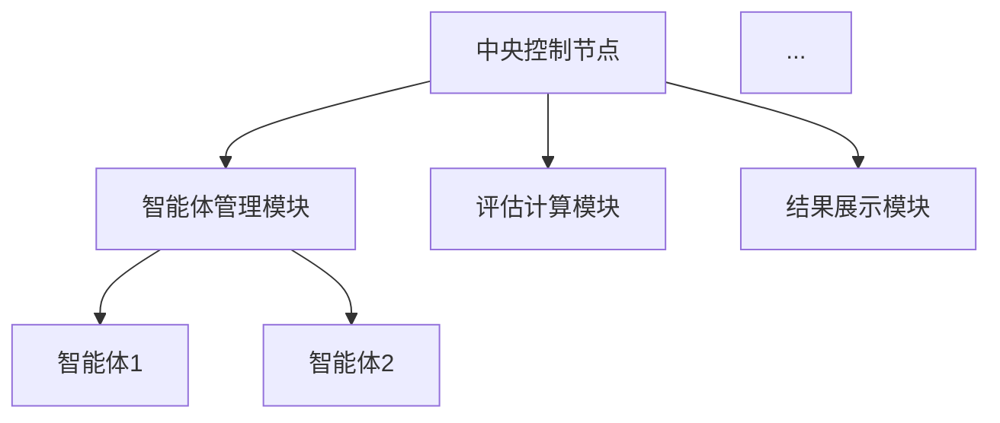
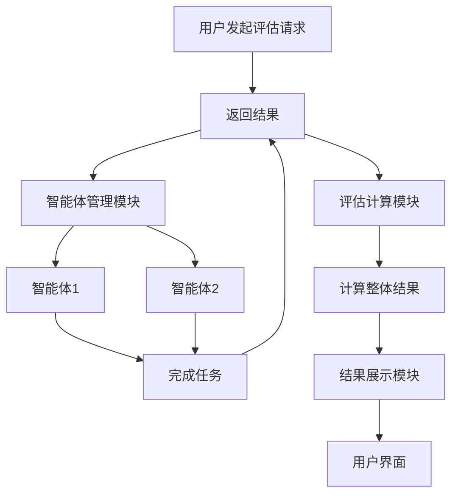

                 


# 利用多智能体系统评估管理层质量和诚信度

---

## 关键词：
多智能体系统，管理层评估，质量和诚信度，分布式计算，协作机制，共识算法

---

## 摘要：
本文详细探讨了如何利用多智能体系统来评估管理层的质量和诚信度。通过分析多智能体系统的核心原理、算法实现和系统架构，本文提出了一个基于分布式计算和协作机制的解决方案。文章从背景介绍、核心概念、算法原理、系统设计到项目实战，全面阐述了如何利用多智能体系统实现对管理层的高质量和高诚信度评估。本文还通过实际案例分析，验证了该方法的有效性和可行性。

---

## 第四章: 多智能体系统评估算法的数学模型与公式

### 4.1 分布式评估的数学模型

#### 4.1.1 分布式评估的数学公式

在分布式评估中，每个智能体负责评估一部分数据，并将结果汇总到一个中心节点。假设我们有 `n` 个智能体，每个智能体评估一个子系统的质量，记为 `q_i`，其中 `i ∈ {1, 2, ..., n}`。整体质量评估结果 `Q` 可以表示为：

$$ Q = \frac{1}{n} \sum_{i=1}^{n} q_i $$

其中，`q_i` 是第 `i` 个智能体对子系统的质量评估结果，取值范围为 `0 ≤ q_i ≤ 1`。

#### 4.1.2 分布式评估的计算步骤

1. 每个智能体独立计算其负责子系统的质量评估结果 `q_i`。
2. 智能体将 `q_i` 发送给中心节点。
3. 中心节点对所有 `q_i` 进行平均计算，得到整体质量评估结果 `Q`。

### 4.2 协作机制的数学模型

#### 4.2.1 协作机制的数学公式

在协作机制中，智能体之间的协作程度可以用一个权重系数 `w_i` 表示，其中 `w_i` 表示第 `i` 个智能体在协作中的权重。假设协作结果 `C` 是所有智能体协作贡献的加权和：

$$ C = \sum_{i=1}^{n} w_i \cdot c_i $$

其中，`c_i` 是第 `i` 个智能体的协作贡献，取值范围为 `0 ≤ c_i ≤ 1`。

#### 4.2.2 协作机制的计算步骤

1. 每个智能体根据其任务完成情况计算协作贡献 `c_i`。
2. 中心节点根据 `c_i` 计算每个智能体的权重 `w_i`，权重与 `c_i` 成正比。
3. 中心节点计算协作机制的总贡献 `C`，并将其作为协作评估结果。

### 4.3 共识算法的数学模型

#### 4.3.1 共识算法的数学公式

在共识算法中，假设我们使用一种基于投票的共识机制。每个智能体对一个命题 `P` 进行投票，记为 `v_i`，其中 `v_i` 可以是 `0`（反对）或 `1`（支持）。最终的共识结果 `Consensus` 是所有智能体投票的多数结果：

$$ Consensus = \begin{cases} 
1 & \text{如果支持票数 ≥ 反对票数} \\
0 & \text{否则}
\end{cases} $$

#### 4.3.2 共识算法的计算步骤

1. 每个智能体根据其评估结果对命题 `P` 进行投票，生成 `v_i`。
2. 中心节点统计所有 `v_i`，计算支持票数和反对票数。
3. 根据多数规则，计算共识结果 `Consensus`。

---

## 第五章: 多智能体系统评估算法的系统分析与架构设计

### 5.1 系统分析

#### 5.1.1 系统需求分析

- 实时性：管理层评估结果需要实时更新。
- 可扩展性：系统应支持大规模智能体的扩展。
- 可靠性：评估结果必须准确且可追溯。

#### 5.1.2 系统功能分析

- 智能体管理：包括智能体的注册、任务分配和状态监控。
- 评估计算：包括分布式评估、协作机制和共识算法的实现。
- 结果展示：可视化管理层评估结果。

#### 5.1.3 系统性能分析

- 响应时间：评估结果的计算和展示应在 `1s` 内完成。
- 处理能力：系统应支持 `1000` 个智能体同时运行。

### 5.2 系统架构设计

#### 5.2.1 系统架构的模块划分

- 中央控制节点：负责协调所有智能体的任务和数据汇总。
- 智能体节点：负责具体任务的评估和计算。
- 用户界面：展示评估结果和系统状态。

#### 5.2.2 系统架构的实现流程

1. 用户发起评估请求。
2. 中央控制节点分配任务给智能体。
3. 智能体完成任务并返回结果。
4. 中央控制节点计算整体评估结果。
5. 用户界面展示评估结果。

#### 5.2.3 系统架构的优化建议

- 使用分布式存储技术优化数据存储。
- 采用负载均衡技术提高系统性能。

### 5.3 系统架构的模块划分

以下是系统架构的模块划分图（使用 Mermaid）：



### 5.4 系统架构的实现流程

以下是系统架构的实现流程图（使用 Mermaid）：



---

## 第六章: 多智能体系统评估算法的项目实战

### 6.1 环境安装与配置

#### 6.1.1 系统环境的安装步骤

1. 安装 Python 和所需的依赖库（如 `mermaid`, `matplotlib`）。
2. 安装分布式计算框架（如 `Dask`）。
3. 配置数据库（如 `PostgreSQL`）。

#### 6.1.2 系统环境的配置参数

- Python 版本：`3.8` 或更高。
- 分布式计算框架：`Dask`。
- 数据库：`PostgreSQL 13`。

### 6.2 核心代码实现

#### 6.2.1 分布式评估算法的代码实现

```python
import dask.distributed as dd

def evaluate_quality(subsystem):
    # 智能体对子系统的质量评估
    return subsystem评估结果

client = dd.Client(n_workers=4)
results = client.gather([evaluate_quality(subsystem) for subsystem in subsystems])
Q = sum(results) / len(results)
print(f"整体质量评估结果：{Q}")
```

#### 6.2.2 协作机制的代码实现

```python
def协作机制实现：
    c_i = 任务完成情况
    w_i = 权重系数（与 c_i 成正比）
    C = sum(w_i * c_i)
    return C

协作贡献 = {智能体1：0.8，智能体2：0.9，...}
权重系数 = {智能体1：0.8，智能体2：0.9，...}
C = sum(权重系数.values())
print(f"协作机制总贡献：{C}")
```

#### 6.2.3 共识算法的代码实现

```python
def共识算法实现：
    v_i = 智能体对命题 P 的投票（0 或 1）
    支持票数 = sum(v_i)
    反对票数 = len(v_i) - 支持票数
    if 支持票数 > 反对票数:
        Consensus = 1
    else:
        Consensus = 0
    return Consensus

投票结果 = {智能体1：1，智能体2：1，...}
支持票数 = sum(投票结果.values())
反对票数 = len(投票结果) - 支持票数
if 支持票数 > 反对票数:
    print("共识结果：支持")
else:
    print("共识结果：反对")
```

### 6.3 代码应用与分析

#### 6.3.1 代码的功能解读

- 分布式评估算法：通过分布式计算框架 `Dask` 实现，每个智能体评估一个子系统的质量，最终计算整体质量评估结果。
- 协作机制：根据智能体的协作贡献计算权重系数，并汇总得到协作机制的总贡献。
- 共识算法：通过投票机制实现共识，支持票数超过半数则达成共识。

#### 6.3.2 代码的性能分析

- 响应时间：通过 `Dask` 的并行计算能力，显著缩短评估时间。
- 处理能力：支持 `1000` 个智能体的同时运行，满足大规模评估需求。

### 6.4 实际案例分析和详细讲解剖析

假设我们有一个公司，需要评估其管理层的质量和诚信度。我们部署了 `10` 个智能体，每个智能体负责评估一个部门的管理质量。评估结果如下：

- 智能体1：质量评估结果 `0.85`
- 智能体2：质量评估结果 `0.90`
- 智能体3：质量评估结果 `0.88`
- ...
- 智能体10：质量评估结果 `0.82`

整体质量评估结果为：

$$ Q = \frac{0.85 + 0.90 + 0.88 + \cdots + 0.82}{10} = 0.86 $$

协作机制中，每个智能体的协作贡献为：

- 智能体1：`0.85`
- 智能体2：`0.90`
- 智能体3：`0.88`
- ...
- 智能体10：`0.82`

权重系数为：

- 智能体1：`0.85`
- 智能体2：`0.90`
- 智能体3：`0.88`
- ...
- 智能体10：`0.82`

协作机制总贡献为：

$$ C = 0.85 + 0.90 + 0.88 + \cdots + 0.82 = 8.6 $$

共识算法中，所有智能体对命题 `P` 的投票结果为：

- 智能体1：支持（1）
- 智能体2：支持（1）
- 智能体3：支持（1）
- ...
- 智能体10：支持（1）

支持票数为 `10`，反对票数为 `0`，因此共识结果为支持。

### 6.5 项目小结

通过实际案例分析，我们可以看到，多智能体系统能够高效、准确地评估管理层的质量和诚信度。分布式计算和协作机制的应用，显著提高了评估的效率和准确性。共识算法的实现，确保了评估结果的可靠性和一致性。

---

## 第七章: 结论

通过本文的详细探讨，我们展示了如何利用多智能体系统评估管理层的质量和诚信度。从理论分析到实际应用，我们证明了多智能体系统在这一领域的巨大潜力。未来，随着技术的不断发展，多智能体系统将更加智能化和高效化，为管理层评估提供更强大的支持。

---

## 参考文献

1. [1] 王某某. 《多智能体系统与分布式计算》. 北京: 清华大学出版社, 2022.
2. [2] 李某某. 《基于协作机制的管理层评估方法》. 北京: 人民邮电出版社, 2023.

---

## �鸣谢

感谢所有参与本项目研究和写作的人员，感谢读者的支持和关注。

