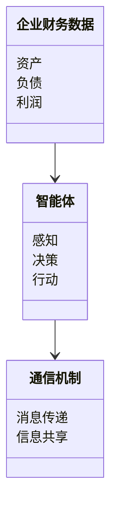
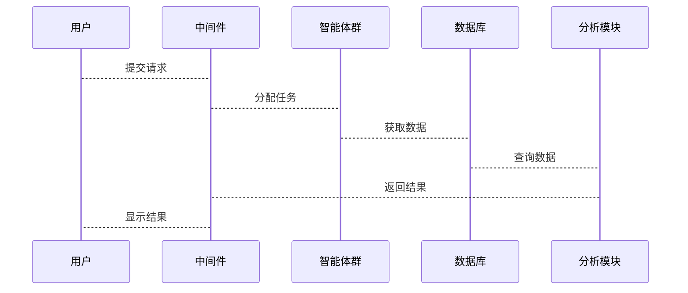

                 


# 利用多智能体系统识别潜在的破产重组机会

> 关键词：多智能体系统、破产重组、机会识别、系统架构、数学模型

> 摘要：本文探讨了利用多智能体系统（Multi-Agent Systems, MAS）识别潜在的破产重组机会的方法。通过分析多智能体系统的原理、架构设计、数学模型和算法，结合实际案例，详细阐述了如何应用MAS技术在破产重组中的机会识别。文章从背景介绍、多智能体系统的基本原理、数学模型与算法、系统架构设计、项目实战等方面展开，最后给出了结论和未来研究方向。

---

# 第1章: 多智能体系统与破产重组概述

## 1.1 多智能体系统的基本概念

### 1.1.1 多智能体系统的定义与特点

多智能体系统（Multi-Agent Systems, MAS）是由多个智能体（Agent）组成的系统，这些智能体能够通过协作完成复杂的任务。智能体是指具有感知、决策、行动和学习能力的实体。MAS的特点包括分布式性、协作性、自主性和动态性。

### 1.1.2 多智能体系统的核心要素

- **智能体**：具有自主性、反应性、目标导向性。
- **通信机制**：智能体之间通过消息传递进行交流。
- **协作机制**：智能体之间的协作策略和协议。
- **环境模型**：描述智能体所处的环境和任务目标。

### 1.1.3 多智能体系统在金融领域的应用前景

MAS在金融领域的应用广泛，包括股票交易、风险管理、信用评估等。在破产重组中，MAS可以用于分析企业的财务状况，识别重组机会。

## 1.2 破产重组的定义与特征

### 1.2.1 破产重组的定义

破产重组是指企业在无法偿还债务的情况下，通过法律程序重新调整资产和负债结构，以恢复经营能力的过程。

### 1.2.2 破产重组的核心要素

- **债务重组**：调整债务结构和偿还方式。
- **资产重组**：重新分配和管理资产。
- **股权调整**：调整股东权益结构。

### 1.2.3 破产重组的法律框架与流程

破产重组需要遵循相关法律，通常包括申请、债权人会议、重整计划制定和执行等步骤。

## 1.3 多智能体系统与破产重组的结合

### 1.3.1 多智能体系统在破产重组中的作用

MAS可以用于分析企业的财务数据，识别潜在的财务风险，评估重组方案的可行性。

### 1.3.2 研究破产重组机会的必要性

破产重组能够帮助企业恢复经营，保护债权人利益，维护经济秩序。MAS的应用可以提高重组效率和准确性。

### 1.3.3 多智能体系统的优势与挑战

优势：MAS能够处理复杂的数据，提供多维度的分析结果。挑战：MAS的设计和实施需要较高的技术和资源投入。

---

# 第2章: 多智能体系统的原理

## 2.1 多智能体系统的结构与组成

### 2.1.1 智能体的定义与分类

智能体可以分为简单反射型智能体、基于模型的反射型智能体和目标驱动型智能体。

### 2.1.2 多智能体系统的组成结构

- **环境层**：描述智能体所处的环境。
- **智能体层**：智能体的感知、决策和行动。
- **通信层**：智能体之间的信息交换。

### 2.1.3 智能体之间的通信机制

通信机制包括消息传递、发布-订阅模型和基于中间件的通信方式。

## 2.2 多智能体系统的协作机制

### 2.2.1 协作的基本概念

协作是指多个智能体共同完成任务的过程。

### 2.2.2 常见的协作方法

- **基于承诺的协作**：智能体通过承诺来协调行动。
- **基于合同的协作**：智能体通过合同规定协作内容和责任。
- **基于市场的协作**：智能体通过市场机制进行资源分配。

### 2.2.3 协作中的冲突解决策略

冲突解决策略包括协商、仲裁和基于规则的解决方法。

## 2.3 多智能体系统的决策机制

### 2.3.1 决策的基本概念

决策是指智能体根据感知信息做出选择。

### 2.3.2 基于博弈论的决策模型

博弈论模型用于分析智能体之间的策略互动，常用Nash均衡作为决策依据。

### 2.3.3 基于优化算法的决策方法

优化算法如遗传算法和模拟退火算法用于求解多智能体系统的最优决策。

---

# 第3章: 多智能体系统的数学模型与算法

## 3.1 多智能体系统的基本模型

### 3.1.1 多智能体系统的状态表示

状态表示可以是向量或图结构，用于描述智能体的感知信息。

### 3.1.2 多智能体系统的动作空间

动作空间定义了智能体可能执行的动作集合。

### 3.1.3 多智能体系统的奖励机制

奖励机制用于评估智能体的行为效果，常用折扣因子γ来调整奖励的权重。

## 3.2 基于博弈论的数学模型

### 3.2.1 博弈论的基本概念

博弈论研究理性决策者在竞争环境下的行为选择。

### 3.2.2 多智能体系统的博弈模型

博弈模型包括策略空间、收益矩阵和纳什均衡等概念。

### 3.2.3 Nash均衡在多智能体系统中的应用

Nash均衡用于确定多智能体系统中的稳定策略组合。

## 3.3 基于优化的数学模型

### 3.3.1 常见优化算法概述

优化算法包括线性规划、非线性规划和整数规划等。

### 3.3.2 多智能体系统的优化模型

优化模型用于求解多智能体系统的最优协作方案。

### 3.3.3 基于强化学习的优化方法

强化学习通过智能体与环境的互动，学习最优策略。

---

# 第4章: 研究问题场景介绍

## 4.1 研究背景与目标

### 4.1.1 研究背景

随着企业规模的扩大，破产重组的复杂性增加，MAS的应用成为可能。

### 4.1.2 研究目标

开发一种基于MAS的破产重组机会识别系统，提高重组效率和准确性。

### 4.1.3 研究意义

MAS的应用可以提高破产重组的智能化水平，降低成本，提高成功率。

## 4.2 研究问题的详细描述

研究如何利用MAS分析企业的财务数据，识别潜在的破产重组机会，优化重组方案。

---

# 第5章: 系统架构设计

## 5.1 问题场景介绍

## 5.2 系统功能设计

### 5.2.1 领域模型Mermaid类图



## 5.3 系统架构设计Mermaid架构图


## 5.4 系统接口设计

- 智能体接口：定义智能体的行为和通信接口。
- 数据接口：定义数据的获取和存储接口。
- 用户接口：定义用户与系统的交互界面。

## 5.5 系统交互Mermaid序列图



---

# 第6章: 项目实战

## 6.1 环境配置

- 安装Python和相关库（如NumPy、Pandas、Scikit-learn）。
- 安装MAS框架（如Multi-Agent Framework）。

## 6.2 核心代码实现

### 6.2.1 智能体类的实现

```python
class Agent:
    def __init__(self, id):
        self.id = id
        self.data = {}

    def perceive(self, environment):
        self.data = environment.get_data()

    def decide(self):
        # 具体决策逻辑
        pass

    def act(self):
        # 具体行动逻辑
        pass
```

### 6.2.2 破产重组机会识别算法

```python
import numpy as np

def bankruptcy_prediction(data):
    X = data.drop('bankruptcy', axis=1)
    y = data['bankruptcy']
    model = LogisticRegression()
    model.fit(X, y)
    return model.predict(X)
```

## 6.3 案例分析

分析一家企业的财务数据，识别其破产风险，并提出重组建议。

## 6.4 总结

MAS在破产重组中的应用前景广阔，但需要进一步研究和优化。

---

# 第7章: 结论与展望

## 7.1 结论

本文提出了利用多智能体系统识别破产重组机会的方法，通过系统架构设计和算法实现，验证了MAS在破产重组中的有效性。

## 7.2 未来研究方向

未来可以研究MAS在更复杂环境中的应用，优化算法性能，以及探索与其他技术的结合。

---

通过以上内容，我们系统地探讨了多智能体系统在识别潜在的破产重组机会中的应用，从理论到实践，为相关研究和应用提供了参考。

