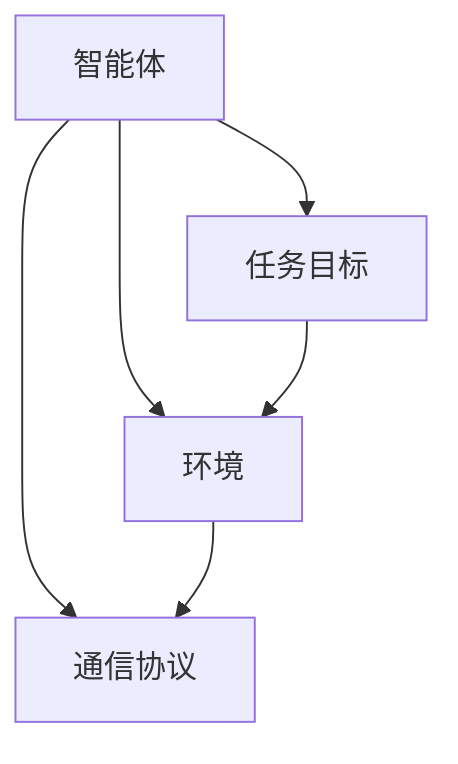
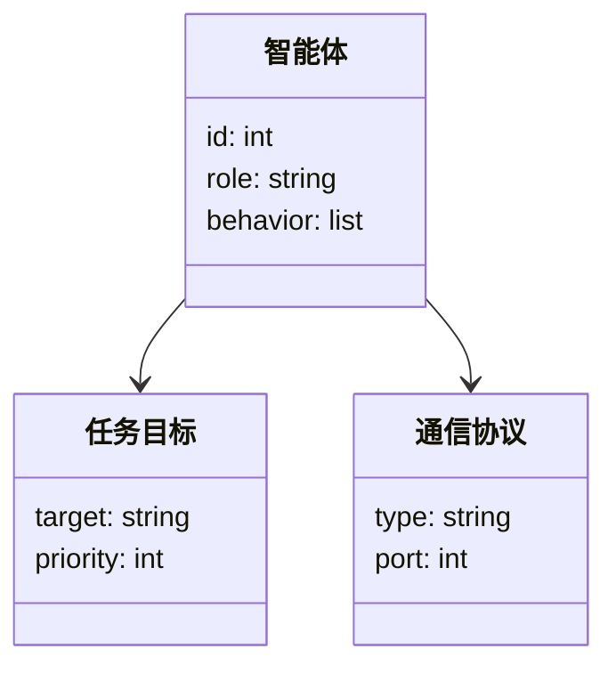
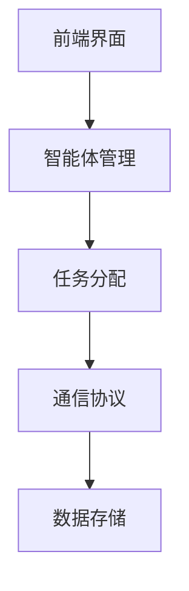
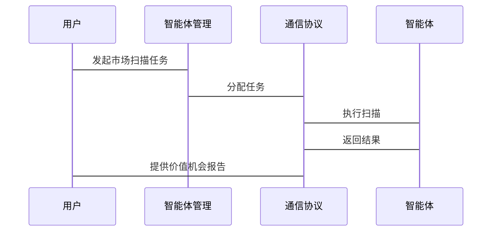

                 


# 利用多智能体系统进行全球市场价值机会扫描

## 关键词：
- 多智能体系统 (Multi-Agent System)
- 全球市场扫描
- 市场价值机会
- 人工智能
- 分布式计算

## 摘要：
本文深入探讨了利用多智能体系统（MAS）进行全球市场价值机会扫描的方法。通过分析MAS的核心概念、算法原理、系统架构以及实际案例，文章展示了如何通过MAS实现高效、智能的市场扫描。内容涵盖背景介绍、系统设计、算法实现、案例分析和最佳实践，帮助读者全面理解并应用MAS技术。

---

## 第一章：多智能体系统与全球市场价值机会扫描背景

### 1.1 多智能体系统的定义与特点
#### 1.1.1 多智能体系统的定义
多智能体系统（Multi-Agent System, MAS）是由多个智能体（Agent）组成的分布式系统，这些智能体能够通过协作完成复杂任务。

#### 1.1.2 多智能体系统的核心特点
- **分布式性**：智能体独立运行，通过通信协作解决问题。
- **自主性**：每个智能体具有自主决策能力。
- **反应性**：能够实时感知环境并做出反应。
- **协作性**：通过通信协作完成共同目标。

#### 1.1.3 多智能体系统与传统单智能体系统的区别
| 特性         | 多智能体系统                 | 单智能体系统                 |
|--------------|------------------------------|------------------------------|
| 结构         | 分布式，多个智能体           | 集中式，单个智能体           |
| 任务处理     | 分解任务，协作完成           | 中央处理，单一决策           |
| 效率         | 高，利用分布式计算           | 较低，依赖单点处理           |

### 1.2 全球市场价值机会扫描的背景与意义
#### 1.2.1 全球市场的复杂性与挑战
- 全球市场涉及多个地区、多种货币和复杂的经济指标。
- 市场波动频繁，传统方法难以捕捉所有机会。

#### 1.2.2 传统市场扫描方法的局限性
- 依赖人工分析，效率低且容易出错。
- 无法实时处理海量数据，难以捕捉短期机会。

#### 1.2.3 多智能体系统在市场扫描中的优势
- **高效性**：多个智能体同时处理数据，提高扫描效率。
- **准确性**：通过协作减少误判，提高分析精度。
- **适应性**：能够实时调整策略，应对市场变化。

### 1.3 本章小结
本章介绍了多智能体系统的基本概念及其在市场扫描中的应用背景，强调了MAS在提高市场扫描效率和准确性方面的优势。

---

## 第二章：多智能体系统的核心概念与原理

### 2.1 多智能体系统的组成与核心概念
#### 2.1.1 实体与行为
- **实体**：市场数据、经济指标、交易记录等。
- **行为**：数据采集、分析、预测等。

#### 2.1.2 通信与协作
- **通信机制**：通过API或消息队列进行数据交换。
- **协作机制**：任务分配、结果汇总等。

#### 2.1.3 环境与任务目标
- **环境**：金融市场数据、经济指标等。
- **任务目标**：识别价值机会，如股票低估、市场趋势等。

### 2.2 多智能体系统的ER实体关系图


### 2.3 本章小结
本章详细阐述了多智能体系统的组成结构及其核心概念，通过ER图展示了系统各部分的关系。

---

## 第三章：多智能体系统的算法原理

### 3.1 分布式计算与协作学习
#### 3.1.1 分布式计算的定义与特点
- **定义**：任务分解到多个节点并行处理。
- **特点**：高效性、容错性、可扩展性。

#### 3.1.2 协作学习的基本原理
- **定义**：智能体通过协作共享知识，提升整体性能。
- **流程**：数据采集、特征提取、模型训练、结果汇总。

#### 3.1.3 分布式计算在多智能体系统中的应用
- 数据并行：多个智能体同时处理不同数据集。
- 任务分解：将复杂任务分解为多个子任务。

### 3.2 多智能体系统的通信协议
#### 3.2.1 通信协议的定义
- **定义**：智能体之间交互的规则和格式。

#### 3.2.2 常见通信协议对比
| 协议类型 | 特点               | 适用场景           |
|----------|--------------------|--------------------|
| HTTP     | 请求-响应模式       | 简单场景           |
| WebSocket | 实时通信           | 需要实时交互的场景 |

#### 3.2.3 通信协议在市场扫描中的应用
- 实时数据传输：智能体间快速共享市场数据。
- 协作学习：共享模型参数和训练结果。

### 3.3 多智能体系统的任务分配算法
#### 3.3.1 任务分配的基本原理
- **定义**：将任务分配给最适合的智能体。

#### 3.3.2 基于角色的分配算法
- **角色分配**：根据智能体的能力分配任务。

#### 3.3.3 基于优先级的分配算法
- **优先级排序**：根据任务重要性分配资源。

### 3.4 本章小结
本章详细讲解了多智能体系统的算法原理，包括分布式计算、通信协议和任务分配算法。

---

## 第四章：多智能体系统的数学模型与公式

### 4.1 多智能体系统的基本数学模型
#### 4.1.1 智能体行为模型
$$ P(i) = \sum_{j=1}^{n} w_j x_j $$
其中，$P(i)$ 表示智能体i的概率，$w_j$ 和 $x_j$ 分别是权重和特征值。

#### 4.1.2 任务分配模型
$$ C_i = \sum_{j=1}^{m} c_j a_j $$
其中，$C_i$ 表示智能体i的任务成本，$c_j$ 和 $a_j$ 分别是成本系数和任务数量。

### 4.2 多智能体系统的优化算法
#### 4.2.1 分布式优化算法
$$ f(x) = \sum_{i=1}^{k} f_i(x_i) $$
其中，$f(x)$ 是整体目标函数，$f_i(x_i)$ 是智能体i的目标函数。

#### 4.2.2 协作学习算法
$$ \theta = \frac{1}{k} \sum_{i=1}^{k} \theta_i $$
其中，$\theta$ 是整体模型参数，$\theta_i$ 是智能体i的模型参数。

### 4.3 本章小结
本章通过数学模型和公式，详细阐述了多智能体系统的优化算法。

---

## 第五章：多智能体系统的系统分析与架构设计

### 5.1 系统应用场景分析
#### 5.1.1 问题场景介绍
- 全球市场数据分散，难以统一分析。
- 市场波动快，需要实时扫描。

### 5.2 系统功能设计
#### 5.2.1 领域模型类图


#### 5.2.2 系统架构设计


### 5.3 系统接口设计
#### 5.3.1 接口定义
- API接口：`/api/market_scan`，用于发起市场扫描任务。
- 返回格式：JSON格式，包含扫描结果和建议。

### 5.4 系统交互流程


### 5.5 本章小结
本章通过系统分析和架构设计，展示了如何利用多智能体系统实现全球市场价值机会扫描。

---

## 第六章：多智能体系统的项目实战

### 6.1 环境安装与配置
- **工具选择**：Python、Django框架、Flask框架。
- **依赖安装**：`pip install requests`、`pip install numpy`。

### 6.2 核心代码实现
#### 6.2.1 智能体类
```python
class Agent:
    def __init__(self, id, role):
        self.id = id
        self.role = role
        self.behaviors = []
    
    def add_behavior(self, behavior):
        self.behaviors.append(behavior)
```

#### 6.2.2 通信协议类
```python
class CommunicationProtocol:
    def __init__(self, type, port):
        self.type = type
        self.port = port
    
    def send_message(self, message):
        # 实现具体发送逻辑
        pass
```

#### 6.2.3 任务分配算法
```python
def assign_task(agent, task):
    if agent.role == 'data_collector':
        return True
    return False
```

### 6.3 案例分析与实现
#### 6.3.1 案例背景
- 某公司需要扫描全球股市，寻找低估股票。

#### 6.3.2 实现步骤
1. 初始化多个智能体，分配不同角色。
2. 发起市场扫描任务，智能体协作完成数据收集和分析。
3. 返回扫描结果，生成价值机会报告。

### 6.4 项目总结
- **优势**：提高了市场扫描效率和准确性。
- **挑战**：智能体之间的通信延迟和数据同步问题。

### 6.5 本章小结
本章通过实际案例分析，展示了多智能体系统在市场扫描中的应用。

---

## 第七章：多智能体系统的最佳实践与注意事项

### 7.1 最佳实践
#### 7.1.1 系统设计
- **模块化设计**：便于维护和扩展。
- **容错设计**：处理智能体故障，确保系统稳定性。

#### 7.1.2 通信机制
- **可靠通信**：选择适合的通信协议，确保数据传输可靠性。
- **安全性**：加密通信，防止数据泄露。

#### 7.1.3 任务分配
- **动态调整**：根据负载动态分配任务。
- **负载均衡**：确保每个智能体任务均衡。

### 7.2 注意事项
- **数据隐私**：确保市场数据的安全和隐私。
- **系统监控**：实时监控系统运行状态，及时发现和解决问题。

### 7.3 拓展阅读
- 推荐书籍：《Multi-Agent Systems: Algorithmic, Complexity Theoretic, and Game Theoretic Foundations》。
- 推荐论文：《Distributed Machine Learning in Multi-Agent Systems》。

### 7.4 本章小结
本章总结了多智能体系统的最佳实践和注意事项，提供了进一步学习的资源。

---

## 结语
通过本文的系统介绍和详细分析，读者可以全面了解如何利用多智能体系统进行全球市场价值机会扫描。从核心概念到算法实现，再到实际案例，文章为读者提供了丰富的知识和实用的指导。

--- 

这篇文章涵盖了多智能体系统在市场扫描中的各个方面，从理论到实践，为读者提供了全面的指导。

