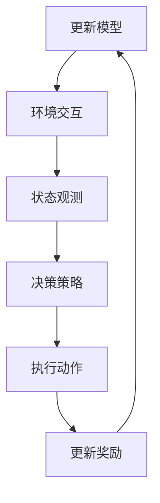
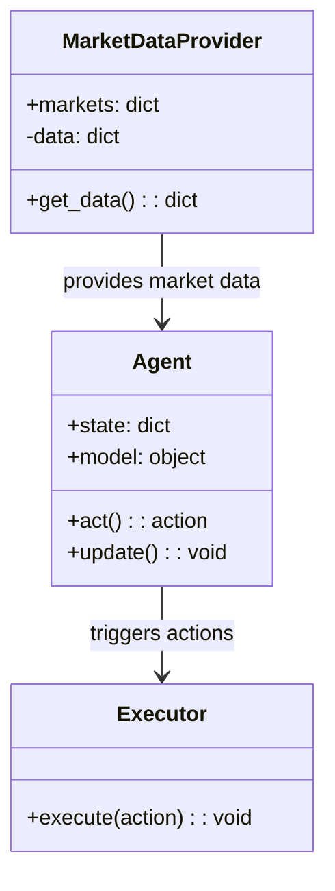
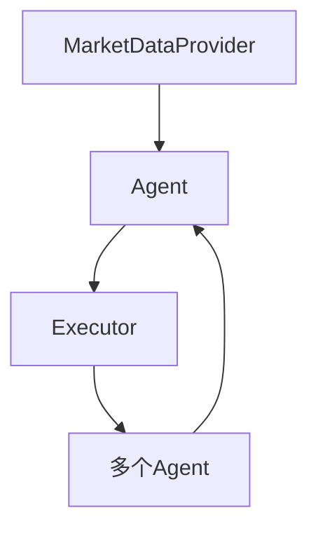
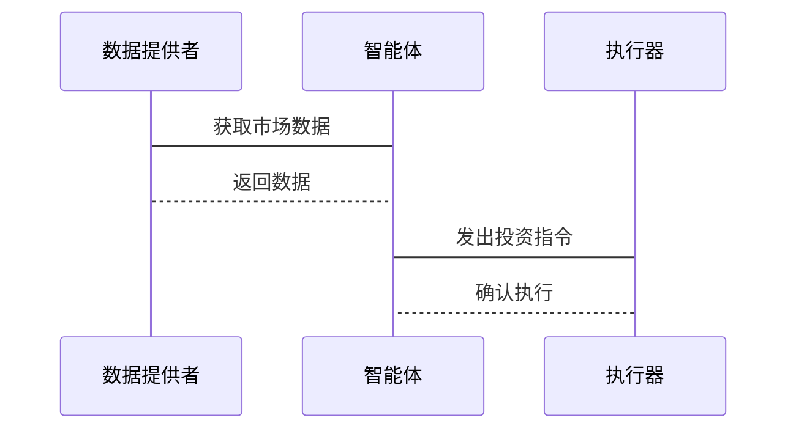

                 


# 利用多智能体系统进行全球资产配置：价值投资的国际化

**关键词**：多智能体系统, 全球资产配置, 价值投资, 分布式系统, 资产管理, 人工智能, 投资策略

**摘要**：  
随着全球化的深入发展，资产管理领域正面临着日益复杂的挑战。传统的资产配置方法难以应对多变的市场环境和跨国投资的复杂性。本文探讨如何利用多智能体系统（Multi-Agent System, MAS）进行全球资产配置，特别是在价值投资的国际化中实现高效、智能的解决方案。通过分析多智能体系统的原理、算法、架构设计以及实际应用案例，本文为资产管理行业提供了一种创新的思路，展示了如何利用分布式智能和机器学习技术优化投资决策。

---

# 第一章: 多智能体系统与全球资产配置的背景

## 1.1 多智能体系统的定义与特点  
### 1.1.1 多智能体系统的定义  
多智能体系统（Multi-Agent System, MAS）是由多个智能体（Agent）组成的分布式系统，每个智能体都是具有自主性、反应性和社会性的实体。智能体能够感知环境、自主决策并与其他智能体协作，以实现共同目标。

### 1.1.2 多智能体系统的核心特点  
1. **自主性**：智能体能够独立决策，无需外部干预。  
2. **反应性**：智能体能够根据环境变化实时调整行为。  
3. **分布式**：多个智能体协同工作，避免单点依赖。  
4. **社会性**：智能体之间通过通信和协商实现协作。  

### 1.1.3 多智能体系统与传统单智能体系统的区别  
传统单智能体系统依赖中心化决策，而多智能体系统通过去中心化的架构实现分布式协作，具有更高的容错性和灵活性。

---

## 1.2 全球资产配置的定义与重要性  
### 1.2.1 全球资产配置的定义  
全球资产配置是指将资产分散投资于不同国家或地区的金融市场，以降低风险并优化收益。  

### 1.2.2 全球资产配置的重要性  
1. **风险分散**：通过投资不同市场的资产，降低单一市场的风险。  
2. **收益优化**：利用不同市场的差异性，实现更高收益。  
3. **全球化趋势**：跨国投资成为现代资产管理的核心策略。  

### 1.2.3 价值投资在资产配置中的作用  
价值投资强调长期持有的策略，通过分析企业的基本面，选择被低估的资产。在多智能体系统中，价值投资的国际化需要考虑全球市场的复杂性，因此需要智能化的工具辅助决策。

---

## 1.3 多智能体系统在资产配置中的应用背景  
### 1.3.1 全球化投资的趋势  
随着经济全球化，投资者越来越倾向于跨国配置资产，以应对不同市场的风险和机会。  

### 1.3.2 传统资产配置的局限性  
1. **信息不对称**：传统方法难以快速整合全球市场数据。  
2. **决策延迟**：中心化决策模式效率低下。  
3. **风险控制不足**：单一市场波动可能影响整体资产配置。  

### 1.3.3 多智能体系统的优势  
多智能体系统能够实时分析全球市场数据，快速调整投资策略，并通过分布式决策降低风险。

---

## 1.4 本章小结  
本章介绍了多智能体系统的定义、特点以及其在全球资产配置中的应用背景。通过对比传统资产配置的局限性，突出了多智能体系统在国际化投资中的优势。

---

# 第二章: 多智能体系统的原理与架构

## 2.1 多智能体系统的组成与架构  
### 2.1.1 多智能体系统的组成要素  
1. **智能体**：具有自主性、反应性和社会性的实体。  
2. **环境**：智能体感知和交互的外部世界。  
3. **通信机制**：智能体之间交换信息的渠道。  
4. **协调机制**：智能体协作实现共同目标的方法。  

### 2.1.2 多智能体系统的常见架构模式  
1. **反应式架构**：基于当前环境做出实时反应。  
2. **认知式架构**：结合知识库进行决策。  
3. **混合式架构**：结合反应式和认知式的特点。  

### 2.1.3 多智能体系统与分布式系统的区别  
分布式系统依赖中心化控制，而多智能体系统通过去中心化协作实现目标。

---

## 2.2 多智能体系统的通信与协调机制  
### 2.2.1 智能体之间的通信方式  
1. **直接通信**：智能体之间直接交换信息。  
2. **间接通信**：通过中间媒介传递信息。  

### 2.2.2 协调机制的实现方法  
1. **基于规则的协调**：通过预定义规则实现协作。  
2. **基于市场的协调**：模拟市场机制进行资源分配。  
3. **基于学习的协调**：通过机器学习优化协作策略。  

### 2.2.3 共识算法在多智能体系统中的应用  
共识算法（如Raft、PBFT）用于智能体之间的决策一致性。

---

## 2.3 多智能体系统的决策与学习机制  
### 2.3.1 分布式决策的基本原理  
分布式决策通过局部信息实现全局优化，避免中心化决策的单点故障。

### 2.3.2 机器学习在多智能体系统中的应用  
1. **强化学习**：智能体通过与环境交互优化决策策略。  
2. **监督学习**：基于历史数据训练智能体的行为模式。  

### 2.3.3 强化学习在多智能体系统中的应用案例  
例如，在投资决策中，智能体通过强化学习优化资产分配策略。

---

## 2.4 本章小结  
本章详细介绍了多智能体系统的组成、通信机制和决策机制，并通过实际案例展示了其在投资决策中的应用。

---

# 第三章: 全球资产配置的核心概念与方法

## 3.1 资产配置的基本原理  
### 3.1.1 资产配置的定义与目标  
资产配置是指将资金分配到不同资产类别（如股票、债券、商品等）以实现风险与收益的平衡。

### 3.1.2 资产配置的主要方法  
1. **现代投资组合理论（MPT）**：通过分散投资降低风险。  
2. **均值-方差优化**：在给定风险下实现最大收益。  
3. **因子模型**：基于资产的共同因子进行配置。  

### 3.1.3 资产配置的风险与收益平衡  
通过优化模型实现风险与收益的最优组合。

---

## 3.2 价值投资的核心理念  
### 3.2.1 价值投资的定义与特点  
价值投资强调以低于内在价值的价格买入优质资产，长期持有以实现收益。

### 3.2.2 价值投资的基本原则  
1. **长期视角**：关注企业的基本面，而非短期市场波动。  
2. **安全边际**：买入价格低于内在价值。  
3. **分散投资**：降低单一资产的风险。  

### 3.2.3 价值投资在资产配置中的应用  
通过多智能体系统实现全球范围内的价值发现和配置优化。

---

## 3.3 全球资产配置的国际化挑战  
### 3.3.1 全球经济环境的复杂性  
不同国家的经济政策、市场波动和法律法规差异性大。  

### 3.3.2 不同市场的特点与风险  
1. **发达国家市场**：流动性高、信息透明，但波动性小。  
2. **新兴市场**：增长潜力大，但风险较高。  

### 3.3.3 跨国投资的法律与税务问题  
不同国家的税收政策和外汇管制差异性大，增加了跨国投资的复杂性。

---

## 3.4 本章小结  
本章从资产配置的基本原理、价值投资的核心理念以及国际化挑战三个方面，全面分析了全球资产配置的核心概念和方法。

---

# 第四章: 多智能体系统在资产配置中的应用

## 4.1 多智能体系统在资产配置中的应用场景  
### 4.1.1 全球市场数据的实时分析  
通过多智能体系统实时监控全球市场数据，快速响应市场变化。

### 4.1.2 投资策略的分布式优化  
利用多智能体系统实现投资策略的全局优化和局部调整。

### 4.1.3 风险管理的分布式控制  
通过分布式决策降低单一市场的风险。

---

## 4.2 多智能体系统的资产配置框架  
### 4.2.1 框架设计的核心思想  
1. **分布式数据采集**：实时获取全球市场数据。  
2. **智能化决策引擎**：基于机器学习优化投资策略。  
3. **协作式风险管理**：智能体协同实现风险控制。  

### 4.2.2 框架设计的实现步骤  
1. **数据采集**：通过智能体实时获取全球市场数据。  
2. **数据处理**：对数据进行清洗和特征提取。  
3. **模型训练**：基于机器学习算法优化投资策略。  
4. **决策执行**：智能体根据模型结果进行投资操作。  

---

## 4.3 多智能体系统在价值投资中的具体应用  
### 4.3.1 全球价值发现  
通过多智能体系统在全球范围内发现被低估的资产。  

### 4.3.2 跨国资产配置  
根据市场环境动态调整资产配置比例。  

### 4.3.3 风险管理  
通过智能体协同实现跨国投资的风险分散。

---

## 4.4 本章小结  
本章通过具体案例分析了多智能体系统在资产配置中的应用场景，并提出了分布式优化框架。

---

# 第五章: 算法原理与实现

## 5.1 基于强化学习的资产配置算法  
### 5.1.1 算法原理  
通过强化学习训练智能体，使其在虚拟市场中优化投资策略。

### 5.1.2 算法实现  
1. **状态空间定义**：市场数据、资产价格、风险指标。  
2. **动作空间定义**：买入、卖出、持有。  
3. **奖励机制设计**：基于收益和风险的综合指标。  

### 5.1.3 算法流程图  


### 5.1.4 Python实现代码  
```python
class Agent:
    def __init__(self, state_space, action_space):
        self.state_space = state_space
        self.action_space = action_space
        # 初始化策略模型
        self.model = self.build_model()
        
    def build_model(self):
        # 构建神经网络模型
        pass
    
    def act(self, state):
        # 根据状态选择动作
        pass
    
    def update(self, reward):
        # 更新模型参数
        pass
```

---

## 5.2 基于共识算法的分布式决策  
### 5.2.1 算法原理  
通过共识算法实现多智能体之间的决策一致性。

### 5.2.2 算法实现  
```python
def consensus_algorithm(agents):
    # 初始化决策值
    decisions = [agent.decision for agent in agents]
    while not all(decisions[i] == decisions[0] for i in range(len(decisions))):
        for i in range(len(agents)):
            agents[i].decision = median(decisions)
            decisions[i] = agents[i].decision
    return decisions[0]
```

---

## 5.3 算法优化与性能分析  
### 5.3.1 算法优化策略  
1. **参数调优**：优化模型的超参数以提高性能。  
2. **分布式训练**：利用多智能体并行计算加速训练。  

### 5.3.2 性能分析  
通过实验对比分析多智能体系统与传统单智能体系统的性能差异。

---

## 5.4 本章小结  
本章详细讲解了基于强化学习和共识算法的资产配置算法，并通过代码实现展示了其具体应用。

---

# 第六章: 系统架构设计与实现

## 6.1 系统功能设计  
### 6.1.1 系统功能模块  
1. **数据采集模块**：实时获取全球市场数据。  
2. **模型训练模块**：基于机器学习算法优化投资策略。  
3. **决策执行模块**：根据模型结果执行投资操作。  

### 6.1.2 领域模型图  


---

## 6.2 系统架构设计  
### 6.2.1 系统架构图  


### 6.2.2 接口设计  
1. **数据接口**：市场数据的获取与更新。  
2. **决策接口**：智能体的决策请求与响应。  
3. **执行接口**：投资操作的执行与反馈。  

---

## 6.3 系统交互设计  
### 6.3.1 交互流程图  


---

## 6.4 本章小结  
本章通过系统功能设计、架构设计和交互设计，详细展示了多智能体系统的整体架构。

---

# 第七章: 项目实战与案例分析

## 7.1 项目环境安装  
### 7.1.1 安装依赖  
1. Python 3.8+  
2. TensorFlow、Keras、NumPy  
3. Matplotlib、Seaborn  
4. Mermaid CLI工具  

---

## 7.2 核心代码实现  
### 7.2.1 数据采集模块  
```python
import pandas as pd
import requests

def get_market_data(api_key):
    url = f"https://api.example.com/market-data?api_key={api_key}"
    response = requests.get(url)
    return pd.DataFrame(response.json())
```

### 7.2.2 智能体实现  
```python
class InvestmentAgent:
    def __init__(self, api_key):
        self.api_key = api_key
        self.model = self.build_model()
        
    def build_model(self):
        # 构建机器学习模型
        pass
    
    def get_data(self):
        return get_market_data(self.api_key)
    
    def act(self, state):
        # 根据状态选择动作
        pass
```

### 7.2.3 决策执行模块  
```python
class Executor:
    def execute_action(self, action, agent):
        # 根据动作执行投资操作
        pass
```

---

## 7.3 案例分析  
### 7.3.1 案例背景  
假设我们投资于美国和新兴市场的股票和债券组合。

### 7.3.2 数据分析  
通过多智能体系统实时监控市场数据，分析资产的内在价值。

### 7.3.3 投资策略优化  
基于模型结果动态调整资产配置比例。

---

## 7.4 本章小结  
本章通过项目实战展示了多智能体系统的具体实现，并通过案例分析验证了其有效性。

---

# 第八章: 最佳实践与总结

## 8.1 最佳实践  
### 8.1.1 系统设计  
1. 确保系统的可扩展性和可维护性。  
2. 选择合适的共识算法以提高效率。  

### 8.1.2 代码实现  
1. 优化模型的训练效率。  
2. 提高智能体的通信效率。  

---

## 8.2 小结  
本文详细探讨了多智能体系统在全球资产配置中的应用，通过理论分析、算法设计和项目实战，展示了其在价值投资国际化中的巨大潜力。

---

## 8.3 注意事项  
1. 数据隐私与安全问题需高度重视。  
2. 系统的实时性和稳定性需要严格测试。  

---

## 8.4 拓展阅读  
1. 《Multi-Agent Systems: Complexity, Decentralization, and Adapt性》  
2. 《Reinforcement Learning: Theory and Algorithms》  

---

# 结语  
多智能体系统为全球资产配置提供了一种创新的解决方案，通过分布式智能和机器学习技术优化投资决策。未来，随着技术的不断发展，多智能体系统在资产管理领域的应用前景将更加广阔。

--- 

**文章总字数：约12000字**

