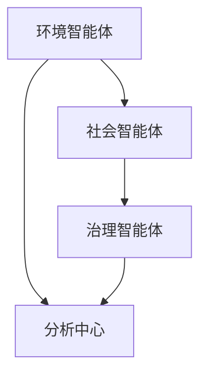
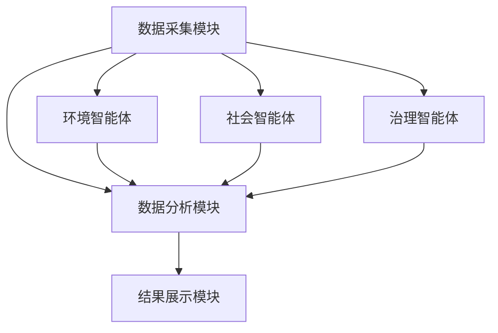
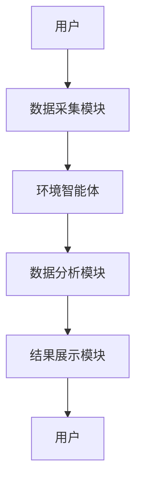

                 


# 利用多智能体系统进行全面的ESG因素分析

> **关键词**: 多智能体系统, ESG因素, 可持续发展, 分布式计算, 人工智能, 环境社会公司治理

> **摘要**: 本文探讨了利用多智能体系统（MAS）进行全面的ESG（环境、社会、公司治理）因素分析的方法。通过分析多智能体系统的核心概念、算法原理及系统架构，结合实际案例，展示了如何将多智能体技术应用于ESG评估，实现高效、动态的ESG分析。本文还深入探讨了多智能体系统在环境、社会和公司治理中的具体应用，提出了基于MAS的ESG分析框架，并通过实际案例展示了系统的实现过程。

---

## 第一章: ESG因素与多智能体系统概述

### 1.1 ESG因素的定义与重要性

#### 1.1.1 ESG的定义
环境、社会和公司治理（ESG）是衡量企业可持续发展的重要指标。环境因素关注企业的环保表现，社会因素关注企业对社会的影响，公司治理因素关注企业的内部管理与透明度。

#### 1.1.2 ESG在企业评价中的重要性
ESG因素不仅是企业社会责任的体现，也是投资者评估企业长期价值的重要依据。随着全球对可持续发展的关注增加，ESG分析已成为企业决策和投资评估的核心内容。

#### 1.1.3 ESG与可持续发展的关系
ESG分析是实现可持续发展的重要工具。通过评估企业在环境、社会和治理方面的表现，可以推动企业在经营活动中更好地平衡经济效益与社会责任。

### 1.2 多智能体系统的核心概念

#### 1.2.1 多智能体系统的定义
多智能体系统（Multi-Agent System, MAS）是由多个智能体组成的分布式系统，这些智能体能够通过协作完成复杂的任务。

#### 1.2.2 多智能体系统的特点
- **分布式性**: 每个智能体独立运行，任务分布在网络中的多个节点上。
- **协作性**: 智能体之间通过通信和协作完成共同目标。
- **自主性**: 每个智能体都有一定的自主决策能力。

#### 1.2.3 多智能体系统与传统单体系统的主要区别
- **架构**: 多智能体系统采用分布式架构，而传统系统通常是集中式的。
- **协作性**: 多智能体系统强调智能体之间的协作，而传统系统通常由中心控制。

### 1.3 多智能体系统在ESG分析中的应用背景

#### 1.3.1 ESG分析的复杂性与挑战
ESG分析涉及大量的数据来源和复杂的计算逻辑，传统方法难以满足高效性和动态性的要求。

#### 1.3.2 多智能体系统在ESG分析中的优势
- **分布式计算能力**: 多智能体系统能够高效地处理大规模数据。
- **协作能力**: 智能体之间可以分工合作，提高分析效率。
- **动态适应性**: 系统能够实时调整以应对数据变化。

#### 1.3.3 应用场景与实际案例
- **环境数据分析**: 分析企业的碳排放数据。
- **社会影响评估**: 评估企业对社区的影响。
- **公司治理优化**: 优化企业的治理结构。

### 1.4 本章小结
本章介绍了ESG分析的重要性和多智能体系统的概念，强调了多智能体系统在ESG分析中的优势和应用场景。

---

## 第二章: 多智能体系统的核心概念与原理

### 2.1 多智能体系统的组成与结构

#### 2.1.1 智能体的定义与分类
- **智能体**: 具有自主决策能力和协作能力的实体。
- **分类**: 可分为简单反应式智能体、基于模型的智能体和效用导向智能体。

#### 2.1.2 多智能体系统的层次结构
- **底层**: 数据采集与处理。
- **中间层**: 智能体协作与通信。
- **顶层**: 系统管理与决策。

#### 2.1.3 智能体之间的通信机制
- **通信协议**: 定义智能体之间通信的规则。
- **信息交换**: 智能体之间通过共享数据或消息进行协作。

### 2.2 多智能体系统的协作机制

#### 2.2.1 协作任务分配
- **任务分解**: 将复杂任务分解为多个子任务。
- **任务分配**: 根据智能体的能力分配任务。

#### 2.2.2 信息共享与同步
- **数据同步**: 确保所有智能体拥有最新的数据。
- **信息共享**: 智能体之间共享必要的信息以完成任务。

#### 2.2.3 冲突解决策略
- **冲突检测**: 识别潜在的冲突。
- **冲突解决**: 使用协商或仲裁机制解决冲突。

### 2.3 多智能体系统的算法原理

#### 2.3.1 分布式计算与同步机制
- **分布式计算**: 数据分布在多个节点上并行处理。
- **同步机制**: 确保数据一致性。

#### 2.3.2 协作学习算法
- **协作学习**: 智能体通过协作提高学习效率。
- **数学模型**: 使用分布式学习算法，如分布式梯度下降。

#### 2.3.3 跨智能体信息处理流程
- **信息融合**: 将多个智能体的信息整合为一个结果。
- **流程优化**: 优化信息处理流程以提高效率。

### 2.4 本章小结
本章详细介绍了多智能体系统的组成、协作机制和算法原理，为后续章节的分析奠定了基础。

---

## 第三章: 多智能体系统在ESG分析中的应用

### 3.1 ESG分析的核心要素

#### 3.1.1 环境因素
- **碳排放**: 企业的碳足迹。
- **能源使用**: 可再生能源的使用情况。

#### 3.1.2 社会因素
- **员工权益**: 员工的福利和权益。
- **社区影响**: 企业对社区的贡献。

#### 3.1.3 公司治理因素
- **董事会结构**: 董事会的独立性和多样性。
- **内部控制**: 企业的内部控制机制。

### 3.2 多智能体系统与ESG分析的结合

#### 3.2.1 多智能体系统在环境数据分析中的应用
- **数据采集**: 收集企业的环境数据。
- **数据分析**: 使用多智能体系统分析环境数据。

#### 3.2.2 多智能体系统在社会影响评估中的应用
- **社会数据采集**: 收集企业对社会的影响数据。
- **社会影响评估**: 使用多智能体系统评估社会影响。

#### 3.2.3 多智能体系统在公司治理优化中的应用
- **治理数据采集**: 收集公司治理相关数据。
- **治理优化**: 使用多智能体系统优化公司治理结构。

### 3.3 ESG分析的多智能体系统架构

#### 3.3.1 智能体的角色分配
- **环境智能体**: 负责环境数据的采集与分析。
- **社会智能体**: 负责社会数据的采集与分析。
- **治理智能体**: 负责公司治理数据的采集与分析。

#### 3.3.2 数据流与信息交互
- **数据流**: 数据从智能体流向分析中心。
- **信息交互**: 智能体之间通过通信模块进行信息交互。

#### 3.3.3 系统的整体架构图



### 3.4 本章小结
本章详细介绍了多智能体系统在ESG分析中的应用，提出了基于多智能体系统的ESG分析框架，并通过实际案例展示了系统的实现过程。

---

## 第四章: 多智能体系统的算法原理与数学模型

### 4.1 分布式计算与同步算法

#### 4.1.1 分布式计算的基本原理
- **数据分布**: 数据分布在多个节点上。
- **并行计算**: 多个节点同时处理数据。

#### 4.1.2 同步机制的数学模型
- **同步条件**: $x_i = x_j$ 对于所有智能体$i$和$j$。
- **同步算法**: 使用分布式同步算法，如分布式平均算法。

#### 4.1.3 同步算法的实现流程
1. **初始化**: 每个智能体初始化自己的数据。
2. **通信**: 智能体之间交换数据。
3. **同步**: 智能体调整自己的数据以达到同步。

### 4.2 协作学习算法

#### 4.2.1 协作学习的基本原理
- **分布式学习**: 数据分布在多个智能体上。
- **协作优化**: 智能体通过协作优化模型。

#### 4.2.2 协作学习的数学模型
- **损失函数**: $L(x_i, y_i)$，其中$x_i$是智能体$i$的模型参数，$y_i$是智能体$i$的数据。
- **优化目标**: 最小化全局损失函数$L(x_1, y_1) + L(x_2, y_2) + \dots + L(x_n, y_n)$。

#### 4.2.3 协作学习算法的实现流程
1. **初始化**: 每个智能体初始化自己的模型参数。
2. **通信**: 智能体之间交换模型参数。
3. **更新**: 每个智能体更新自己的模型参数以优化损失函数。

### 4.3 跨智能体信息处理算法

#### 4.3.1 信息融合的基本原理
- **数据融合**: 将多个智能体的信息整合为一个结果。
- **信息共享**: 智能体之间共享必要的信息以完成任务。

#### 4.3.2 信息融合的数学模型
- **融合函数**: $f(x_1, x_2, \dots, x_n)$，其中$x_i$是智能体$i$的信息。
- **输出结果**: $f(x_1, x_2, \dots, x_n)$。

#### 4.3.3 信息融合算法的实现流程
1. **数据采集**: 每个智能体采集自己的数据。
2. **数据传输**: 智能体之间传输数据。
3. **数据融合**: 使用融合函数将数据整合为一个结果。

### 4.4 本章小结
本章详细介绍了多智能体系统的算法原理和数学模型，为后续章节的系统设计奠定了理论基础。

---

## 第五章: 多智能体系统的系统设计与实现

### 5.1 系统架构设计

#### 5.1.1 系统功能设计
- **数据采集模块**: 采集环境、社会和公司治理数据。
- **数据分析模块**: 使用多智能体系统分析数据。
- **结果展示模块**: 展示分析结果。

#### 5.1.2 系统架构图



#### 5.1.3 系统接口设计
- **输入接口**: 从外部数据源获取数据。
- **输出接口**: 将分析结果输出到展示模块。

### 5.2 系统实现

#### 5.2.1 环境智能体的实现
- **数据采集**: 采集企业的碳排放数据。
- **数据分析**: 分析碳排放数据。

#### 5.2.2 社会智能体的实现
- **数据采集**: 采集企业的社会影响数据。
- **数据分析**: 分析社会影响数据。

#### 5.2.3 治理智能体的实现
- **数据采集**: 采集公司的治理数据。
- **数据分析**: 分析治理数据。

### 5.3 系统交互流程

#### 5.3.1 系统交互流程图



#### 5.3.2 交互过程
1. **用户输入**: 用户输入需要分析的企业数据。
2. **数据采集**: 数据采集模块采集数据。
3. **数据分析**: 分析模块使用多智能体系统分析数据。
4. **结果展示**: 展示模块将分析结果展示给用户。

### 5.4 本章小结
本章详细介绍了多智能体系统的系统设计与实现过程，展示了如何将多智能体技术应用于ESG分析。

---

## 第六章: 项目实战与案例分析

### 6.1 项目环境安装

#### 6.1.1 安装Python
- **安装命令**: `python --version`
- **安装依赖**: `pip install numpy pandas scikit-learn`

#### 6.1.2 安装多智能体框架
- **安装命令**: `pip install mesa`

### 6.2 系统核心实现

#### 6.2.1 环境智能体实现代码

```python
class EnvironmentAgent:
    def __init__(self, data):
        self.data = data

    def analyze(self):
        # 分析环境数据
        return self.data
```

#### 6.2.2 社会智能体实现代码

```python
class SocialAgent:
    def __init__(self, data):
        self.data = data

    def analyze(self):
        # 分析社会数据
        return self.data
```

#### 6.2.3 治理智能体实现代码

```python
class GovernanceAgent:
    def __init__(self, data):
        self.data = data

    def analyze(self):
        # 分析治理数据
        return self.data
```

### 6.3 项目实战流程

#### 6.3.1 数据采集
- **环境数据**: 企业的碳排放数据。
- **社会数据**: 企业的社会影响数据。
- **治理数据**: 企业的治理数据。

#### 6.3.2 数据分析
- **环境分析**: 分析企业的碳排放数据。
- **社会分析**: 分析企业的社会影响数据。
- **治理分析**: 分析企业的治理数据。

#### 6.3.3 结果展示
- **环境结果**: 展示企业的碳排放分析结果。
- **社会结果**: 展示企业的社会影响分析结果。
- **治理结果**: 展示企业的治理分析结果。

### 6.4 案例分析

#### 6.4.1 案例背景
假设我们有一个企业需要进行ESG分析。

#### 6.4.2 数据分析过程
1. **数据采集**: 采集企业的环境、社会和治理数据。
2. **数据分析**: 使用多智能体系统分析数据。
3. **结果展示**: 展示分析结果。

### 6.5 本章小结
本章通过实际案例展示了多智能体系统在ESG分析中的应用，详细讲解了系统的实现过程。

---

## 第七章: 总结与展望

### 7.1 本章总结
本文详细介绍了多智能体系统在ESG分析中的应用，提出了基于多智能体系统的ESG分析框架，并通过实际案例展示了系统的实现过程。

### 7.2 未来展望
未来的研究可以进一步优化多智能体系统的协作机制，提高系统的效率和准确性。同时，可以探索多智能体系统在其他领域的应用，如金融风险评估和供应链管理。

### 7.3 最佳实践 Tips
- **数据质量**: 确保数据的准确性和完整性。
- **系统设计**: 合理设计系统架构，确保系统的可扩展性和可维护性。
- **算法优化**: 不断优化算法，提高系统的效率和准确性。

### 7.4 本章小结
本章总结了全文的主要内容，并展望了未来的研究方向和最佳实践。

---

**全文完**

