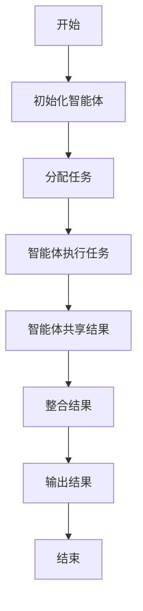
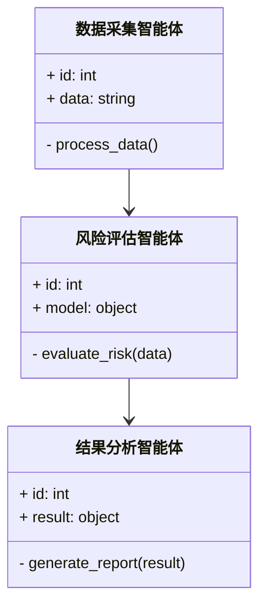
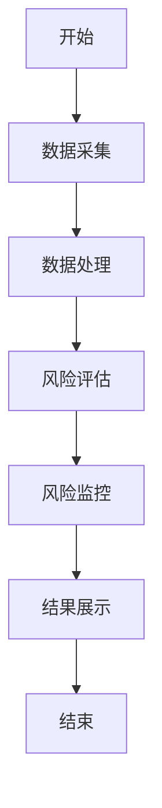
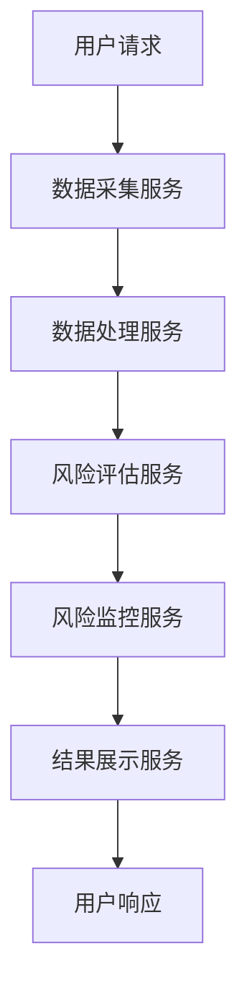
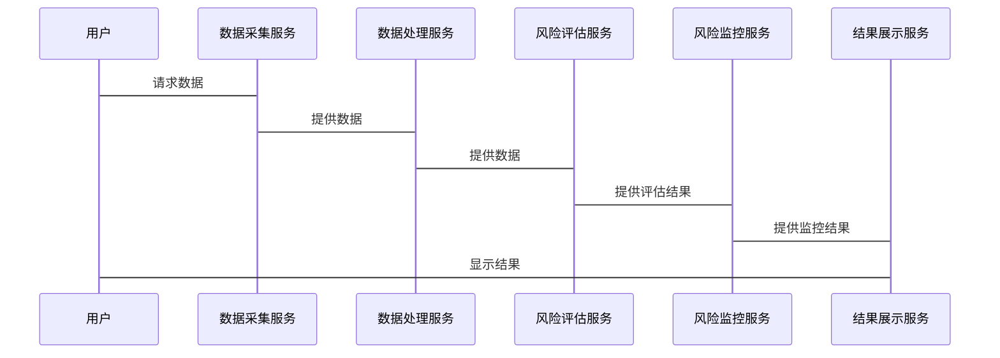

                 


# 利用多智能体系统进行全面的公司信用风险分析

---

## 关键词：多智能体系统, 信用风险分析, 分布式协作, 机器学习, 数据驱动

---

## 摘要：  
本文深入探讨了利用多智能体系统进行全面的公司信用风险分析的方法。通过结合多智能体系统的协作特性与信用风险分析的复杂性需求，提出了一种创新的解决方案。文章从背景、核心概念、算法原理、系统设计到项目实战，详细阐述了多智能体系统在信用风险分析中的应用，并通过实际案例展示了其优势和实现过程。通过本文的分析，读者将能够理解多智能体系统在信用风险分析中的潜力，并掌握相关技术和方法。

---

# 第一部分：背景与挑战

## 第1章：信用风险分析的背景与挑战

### 1.1 信用风险分析的基本概念

#### 1.1.1 信用风险的定义与特征
信用风险是指由于债务人或交易对手无法履行其义务而导致的损失风险。其主要特征包括不确定性、相关性和传染性。

#### 1.1.2 信用风险分析的重要性
信用风险分析是企业风险管理的核心内容，直接关系到企业的财务健康和投资决策。准确的信用风险分析能够帮助企业识别潜在风险，优化资源配置。

#### 1.1.3 传统信用风险分析方法的局限性
传统方法依赖单一模型和集中式计算，难以应对复杂多变的市场环境。其主要局限性包括：
- 数据来源单一，难以捕捉多维度信息。
- 计算效率低下，难以实时处理大规模数据。
- 模型缺乏灵活性，难以适应复杂场景。

### 1.2 多智能体系统的基本概念

#### 1.2.1 多智能体系统的定义
多智能体系统（Multi-Agent System, MAS）是由多个自主智能体组成的分布式系统，这些智能体能够通过协作完成复杂任务。

#### 1.2.2 多智能体系统的特征
- 分布式：智能体独立运行，无中心节点。
- 协作性：智能体之间通过通信和协商完成任务。
- 反应性：智能体能够感知环境并实时响应。

#### 1.2.3 多智能体系统的优点
- 高度可扩展性：能够处理大规模数据和复杂任务。
- 自适应性：智能体能够根据环境变化调整行为。
- 分工协作：智能体可以专注于特定任务，提高整体效率。

### 1.3 多智能体系统在信用风险分析中的应用前景

#### 1.3.1 信用风险分析的复杂性
信用风险分析涉及多个维度，包括财务数据、市场波动、行业趋势等。传统方法难以全面捕捉这些信息。

#### 1.3.2 多智能体系统在信用风险分析中的优势
- 分布式计算能力：能够同时处理多维度数据。
- 高度协作：智能体可以分工合作，提高分析效率。
- 实时响应：能够实时监控市场变化，及时发现风险。

#### 1.3.3 应用多智能体系统的挑战
- 系统设计复杂：需要考虑智能体的通信、协作和协调。
- 数据隐私问题：多智能体系统涉及多方数据，隐私保护是难点。
- 系统稳定性：智能体的独立性和协作性需要平衡。

### 1.4 本章小结
本章介绍了信用风险分析的基本概念、传统方法的局限性以及多智能体系统的特征和优势。多智能体系统在信用风险分析中的应用前景广阔，但也面临一些挑战。

---

# 第二部分：核心概念与联系

## 第2章：多智能体系统与信用风险分析的核心概念

### 2.1 多智能体系统的架构

#### 2.1.1 分层架构
分层架构将系统划分为多个层次，每个层次负责不同的功能。例如：
- 感知层：智能体感知外部环境。
- 计算层：智能体进行数据处理和分析。
- 决策层：智能体制定决策并输出结果。

#### 2.1.2 分布式架构
分布式架构将智能体分布在不同的节点上，通过通信协议进行协作。这种架构适合处理大规模数据和复杂任务。

#### 2.1.3 协作架构
协作架构强调智能体之间的协作，通过协商和合作完成任务。协作架构适用于需要多方协同的信用风险分析场景。

### 2.2 信用风险分析的流程

#### 2.2.1 数据收集与预处理
信用风险分析的第一步是收集和整理数据，包括财务数据、市场数据、行业数据等。数据预处理包括清洗、转换和特征提取。

#### 2.2.2 风险评估与建模
通过建立数学模型对信用风险进行评估。常用模型包括信用评分模型、违约概率模型等。

#### 2.2.3 风险监控与反馈
实时监控风险变化，并根据反馈调整模型和策略。风险监控是信用风险分析的重要环节。

### 2.3 多智能体系统与信用风险分析的结合

#### 2.3.1 多智能体系统的协作机制
智能体之间通过通信和协商完成协作任务。协作机制包括任务分配、信息共享和结果整合。

#### 2.3.2 信用风险分析的多维度特征
信用风险分析涉及多个维度，包括财务状况、市场环境、行业趋势等。多智能体系统能够同时处理这些维度的信息。

#### 2.3.3 多智能体系统在信用风险分析中的角色
智能体可以扮演多种角色，例如数据采集智能体、模型计算智能体、结果分析智能体等。

### 2.4 本章小结
本章介绍了多智能体系统的架构和信用风险分析的流程，并探讨了多智能体系统与信用风险分析的结合。多智能体系统的协作机制和多维度特征使其在信用风险分析中具有独特优势。

---

## 第3章：多智能体系统在信用风险分析中的算法原理

### 3.1 多智能体协同学习算法

#### 3.1.1 分布式协同学习
分布式协同学习是一种基于多智能体的协作学习方法，智能体通过分布式的计算和协作完成任务。例如，分布式协同学习可以用于信用评分模型的训练。

#### 3.1.2 联合学习
联合学习是一种多智能体协同学习方法，智能体通过共享数据和模型参数进行协作。联合学习可以用于信用风险预测模型的优化。

#### 3.1.3 迁移学习
迁移学习是一种通过迁移已有知识到新任务的学习方法。在信用风险分析中，迁移学习可以用于跨行业或跨市场的风险预测。

### 3.2 信用风险分析的数学模型

#### 3.2.1 信用评分模型
信用评分模型用于评估企业的信用状况。常用的模型包括逻辑回归模型和决策树模型。

#### 3.2.2 风险评估模型
风险评估模型用于预测企业的违约概率。常用的模型包括概率模型和统计模型。

#### 3.2.3 风险预测模型
风险预测模型用于预测未来一段时间内的信用风险变化。常用的模型包括时间序列模型和机器学习模型。

### 3.3 多智能体系统的协同算法实现

#### 3.3.1 算法流程图
以下是多智能体协同学习算法的流程图：



#### 3.3.2 算法实现代码
以下是Python代码示例：

```python
class Agent:
    def __init__(self, id):
        self.id = id
        self.data = None
        self.result = None

    def receive_task(self, task):
        self.data = task

    def process_task(self):
        # 数据处理和计算
        self.result = self.model.predict(self.data)

    def send_result(self):
        return self.result

# 初始化智能体
agents = [Agent(i) for i in range(5)]

# 分配任务
tasks = [...]  # 任务列表
for i in range(len(agents)):
    agents[i].receive_task(tasks[i])

# 处理任务
for agent in agents:
    agent.process_task()

# 整合结果
results = [agent.send_result() for agent in agents]
final_result = self.model整合结果(results)
```

#### 3.3.3 算法的数学模型与公式
以下是协同学习算法的数学模型：

$$
y = f(x_1, x_2, ..., x_n)
$$

其中，$y$ 是输出结果，$x_i$ 是输入数据，$f$ 是协同学习算法。

### 3.4 本章小结
本章介绍了多智能体协同学习算法及其在信用风险分析中的应用。通过算法流程图和代码示例，详细讲解了多智能体系统的协同学习过程。

---

## 第4章：系统分析与架构设计方案

### 4.1 信用风险分析的系统场景

#### 4.1.1 问题场景描述
信用风险分析系统需要处理大量的数据，包括企业的财务数据、市场数据和行业数据。系统需要实时监控企业的信用状况，并提供风险评估和预测。

#### 4.1.2 系统目标与需求
系统目标：建立一个基于多智能体的信用风险分析系统，实现对企业信用风险的全面分析和实时监控。

系统需求：
- 数据采集与处理
- 风险评估与预测
- 风险监控与反馈
- 结果展示与报告

#### 4.1.3 系统边界与接口
系统边界：系统与外部数据源、用户界面和其他系统之间的接口。

### 4.2 系统功能设计

#### 4.2.1 领域模型设计
以下是领域模型设计的类图：



#### 4.2.2 功能模块划分
系统功能模块包括：
- 数据采集模块
- 数据处理模块
- 风险评估模块
- 风险监控模块
- 结果展示模块

#### 4.2.3 功能流程设计
以下是功能流程图：



### 4.3 系统架构设计

#### 4.3.1 分层架构设计
系统架构分为数据层、业务层和应用层。

- 数据层：负责数据的存储和管理。
- 业务层：负责业务逻辑的实现。
- 应用层：负责用户界面和功能展示。

#### 4.3.2 微服务架构设计
系统采用微服务架构，每个服务负责特定的功能。

- 数据采集服务
- 数据处理服务
- 风险评估服务
- 风险监控服务
- 结果展示服务

#### 4.3.3 数据流与控制流设计
以下是数据流与控制流设计：



### 4.4 系统接口设计

#### 4.4.1 数据接口
数据接口包括：
- 数据采集接口
- 数据存储接口
- 数据查询接口

#### 4.4.2 服务接口
服务接口包括：
- 风险评估接口
- 风险监控接口
- 结果展示接口

#### 4.4.3 用户接口
用户接口包括：
- 用户登录接口
- 数据输入接口
- 结果查看接口

### 4.5 系统交互设计

#### 4.5.1 序列图
以下是系统交互的序列图：



### 4.6 本章小结
本章详细设计了信用风险分析系统的架构和接口，包括分层架构、微服务架构和系统交互设计。通过系统架构设计，确保了系统的高效性和可扩展性。

---

## 第5章：项目实战

### 5.1 环境安装

#### 5.1.1 安装Python
安装Python 3.x版本，推荐使用Anaconda分布。

#### 5.1.2 安装依赖库
安装以下依赖库：
- `numpy`：用于数值计算。
- `pandas`：用于数据处理。
- `scikit-learn`：用于机器学习。
- `mermaid`：用于绘制图表。

#### 5.1.3 安装步骤
1. 下载并安装Python。
2. 下载并安装Anaconda。
3. 使用pip安装依赖库。

### 5.2 系统核心实现

#### 5.2.1 核心代码实现
以下是核心代码实现：

```python
import numpy as np
import pandas as pd
from sklearn.linear_model import LogisticRegression

class CreditRiskAnalyzer:
    def __init__(self):
        self.agents = []
        self.models = []

    def add_agent(self, agent):
        self.agents.append(agent)

    def train_model(self, data):
        for agent in self.agents:
            agent.receive_task(data)
            agent.process_task()
            result = agent.send_result()
            self.models.append(result)

    def predict_risk(self, new_data):
        results = []
        for agent in self.agents:
            result = agent.send_result()
            results.append(result)
        final_result = self.combine_results(results)
        return final_result

    def combine_results(self, results):
        # 结果整合逻辑
        return np.mean(results)

# 初始化分析器
analyzer = CreditRiskAnalyzer()

# 添加智能体
agent1 = Agent(1)
agent2 = Agent(2)
analyzer.add_agent(agent1)
analyzer.add_agent(agent2)

# 训练模型
data = [...]  # 训练数据
analyzer.train_model(data)

# 预测风险
new_data = [...]  # 新数据
risk = analyzer.predict_risk(new_data)
print(risk)
```

#### 5.2.2 代码解读与分析
- `CreditRiskAnalyzer`类负责管理多个智能体和模型。
- `Agent`类负责接收任务、处理数据和发送结果。
- `train_model`方法用于训练模型。
- `predict_risk`方法用于预测信用风险。

### 5.3 实际案例分析

#### 5.3.1 数据准备
准备企业财务数据、市场数据和行业数据。

#### 5.3.2 模型训练
使用训练数据训练多个模型，每个模型由不同的智能体负责。

#### 5.3.3 风险预测
使用训练好的模型预测新数据的信用风险。

#### 5.3.4 结果分析
分析预测结果，评估模型的准确性和效果。

### 5.4 本章小结
本章通过实际案例展示了多智能体系统在信用风险分析中的应用，详细讲解了环境安装、代码实现和案例分析的过程。

---

## 第六部分：最佳实践与总结

## 第6章：最佳实践与总结

### 6.1 最佳实践

#### 6.1.1 数据质量
确保数据的准确性和完整性，数据预处理是关键。

#### 6.1.2 模型可解释性
选择可解释性强的模型，便于分析和优化。

#### 6.1.3 系统稳定性
确保系统的稳定性和可扩展性，避免单点故障。

### 6.2 小结
多智能体系统在信用风险分析中的应用具有广阔前景，但需要克服一些挑战。通过合理设计和优化，可以显著提升信用风险分析的效率和准确性。

### 6.3 注意事项
- 数据隐私保护
- 系统安全防护
- 智能体协作效率

### 6.4 拓展阅读
- 《Multi-Agent Systems: Complexity and Intelligence》
- 《信用风险分析的理论与方法》

---

## 附录：代码示例

### 附录A：环境安装脚本

```bash
pip install numpy pandas scikit-learn
```

### 附录B：核心代码

```python
# 附录B.1: Agent类
class Agent:
    def __init__(self, id):
        self.id = id
        self.data = None
        self.result = None

    def receive_task(self, task):
        self.data = task

    def process_task(self):
        model = LogisticRegression()
        self.result = model.predict(self.data)

    def send_result(self):
        return self.result

# 附录B.2: CreditRiskAnalyzer类
class CreditRiskAnalyzer:
    def __init__(self):
        self.agents = []

    def add_agent(self, agent):
        self.agents.append(agent)

    def train_model(self, data):
        for agent in self.agents:
            agent.receive_task(data)
            agent.process_task()
            result = agent.send_result()
            # 整合结果
            print(f"Agent {agent.id} result: {result}")

    def predict_risk(self, new_data):
        results = []
        for agent in self.agents:
            result = agent.send_result()
            results.append(result)
        final_result = sum(results) / len(results)
        print(f"Final result: {final_result}")
        return final_result
```

---

## 参考文献

1. 多智能体系统相关文献
2. 信用风险分析相关文献
3. 机器学习与数据科学相关文献

---

**全文完**

