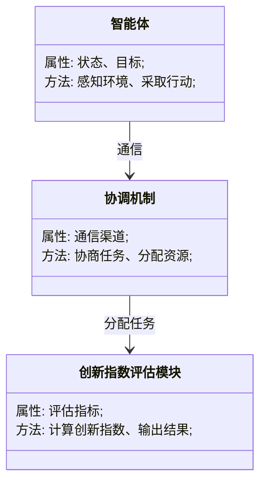
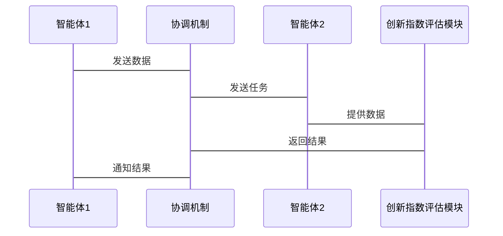

                 


# 利用多智能体系统进行全面的公司创新指数评估

## 关键词：多智能体系统，创新指数评估，企业创新，协同机制，系统架构，算法实现

## 摘要：  
本文旨在探讨如何利用多智能体系统进行全面的公司创新指数评估。通过分析创新指数评估的核心要素，结合多智能体系统的协同机制和通信能力，提出了一种基于多智能体系统的创新指数评估模型。本文详细介绍了多智能体系统的定义、特点、协同机制以及其在创新指数评估中的应用，并通过数学模型和算法实现，展示了如何利用多智能体系统实现创新指数的高效评估。最后，本文通过实际案例分析，验证了该方法的有效性和优势。

---

# 第1章: 公司创新指数评估的背景与意义

## 1.1 创新指数评估的重要性

### 1.1.1 创新在企业中的核心地位  
在当今竞争激烈的商业环境中，创新是企业生存和发展的核心驱动力。企业的创新能力直接决定了其市场竞争力和长期发展潜力。创新不仅体现在技术开发上，还涉及商业模式、管理方式、产品设计等多方面。因此，对企业创新能力的评估变得尤为重要。

### 1.1.2 创新指数评估的定义与目标  
创新指数评估是对企业创新能力的量化测量，旨在通过一系列指标和方法，全面衡量企业在创新过程中的表现。创新指数评估的目标是为企业提供一个客观、科学的评估体系，帮助企业识别自身创新优势和不足，从而制定有效的创新战略。

### 1.1.3 创新指数评估的现状与挑战  
尽管创新指数评估在企业管理和学术研究中得到了广泛关注，但其实际应用仍面临诸多挑战。传统的创新评估方法往往依赖于主观判断和单一维度的指标，难以全面反映企业的创新能力。此外，如何将创新评估与企业的实际运营相结合，也是一个亟待解决的问题。

---

## 1.2 多智能体系统在创新指数评估中的应用背景

### 1.2.1 多智能体系统的定义与特点  
多智能体系统（Multi-Agent System, MAS）是由多个具有自主性、反应性和协作性的智能体组成的系统。与传统的单智能体系统相比，多智能体系统具有更强的分布式计算能力和协同能力，能够更好地应对复杂问题。

### 1.2.2 多智能体系统在企业评估中的优势  
多智能体系统在企业评估中的优势体现在其分布式计算和协同能力上。通过多个智能体的协同工作，可以更全面地收集和分析企业创新相关的数据，从而提供更准确的评估结果。

### 1.2.3 多智能体系统与创新指数评估的结合  
将多智能体系统应用于创新指数评估，可以通过智能体之间的协同和通信，实现对企业创新活动的实时监控和评估。这种结合不仅可以提高评估的效率，还能确保评估结果的全面性和准确性。

---

## 1.3 本章小结  
本章从创新指数评估的重要性出发，介绍了创新指数评估的定义和目标，并分析了其在实际应用中的挑战。随后，详细阐述了多智能体系统的特点及其在创新指数评估中的应用背景，为后续章节的深入分析奠定了基础。

---

# 第2章: 多智能体系统的核心概念与原理

## 2.1 多智能体系统的定义与组成

### 2.1.1 智能体的基本概念  
智能体（Agent）是一个具有自主性、反应性和协作性的实体，能够感知环境并采取行动以实现目标。智能体可以是软件程序、硬件设备或人类。

### 2.1.2 多智能体系统的组成结构  
多智能体系统由多个智能体和一个协调机制组成。智能体之间通过通信和协作，共同完成复杂任务。

### 2.1.3 多智能体系统的核心特征  
多智能体系统的特征包括分布式性、自主性、反应性和协作性。这些特征使得多智能体系统能够更好地应对复杂问题。

---

## 2.2 多智能体系统的协同机制

### 2.2.1 协同的基本概念  
协同是指多个智能体通过合作完成共同目标的过程。协同机制是实现这种合作的核心。

### 2.2.2 协同的实现方式  
协同可以通过通信协议、协商算法和任务分配等实现。常见的协同方式包括基于规则的协同和基于市场的协同。

### 2.2.3 协同机制在创新指数评估中的应用  
在创新指数评估中，智能体可以通过协同机制共同分析和评估企业的创新能力。例如，多个智能体可以分别负责收集和分析不同维度的创新数据。

---

## 2.3 多智能体系统的通信与协调

### 2.3.1 智能体之间的通信模型  
智能体之间的通信可以通过消息传递、事件触发等方式实现。通信模型需要定义智能体之间的交互规则和数据格式。

### 2.3.2 协调算法的实现  
协调算法是实现智能体协同的核心。常见的协调算法包括基于黑板模型的协调算法和基于分布式一致性算法。

### 2.3.3 通信与协调在创新指数评估中的作用  
通过智能体之间的通信与协调，可以实现对企业创新活动的实时监控和评估。这不仅可以提高评估的效率，还能确保评估结果的全面性和准确性。

---

## 2.4 本章小结  
本章详细介绍了多智能体系统的定义、组成和核心特征，并重点分析了协同机制和通信与协调在创新指数评估中的作用。这些内容为后续章节的创新指数评估模型设计奠定了理论基础。

---

# 第3章: 多智能体系统与创新指数评估的结合

## 3.1 创新指数评估的核心要素

### 3.1.1 创新能力的定义与维度  
创新能力是企业在创新活动中表现出来的能力，主要包括技术创新能力、管理创新能力、市场创新能力等。

### 3.1.2 创新指数的计算方法  
创新指数的计算方法需要结合企业的技术创新、管理创新、市场创新等多个维度，通过加权计算得出综合指数。

### 3.1.3 创新指数评估的关键指标  
创新指数评估的关键指标包括技术创新投入、专利数量、新产品推出速度、市场占有率等。

---

## 3.2 多智能体系统在创新指数评估中的应用

### 3.2.1 多智能体系统与创新指数评估的结合模型  
结合模型通过将多个智能体分别分配到不同的创新维度，实现对企业创新能力的全面评估。

### 3.2.2 多智能体系统在创新指数评估中的具体应用  
在实际应用中，多智能体系统可以分别负责收集和分析技术创新、管理创新、市场创新等数据，并通过协同机制实现综合评估。

### 3.2.3 多智能体系统在创新指数评估中的优势  
多智能体系统的优势在于其分布式计算能力和协同能力，能够实现对企业创新活动的实时监控和综合评估。

---

## 3.3 创新指数评估的数学模型

### 3.3.1 创新指数评估的基本模型  
创新指数评估的基本模型包括多个维度的指标，通过加权计算得出综合指数。

$$ \text{创新指数} = \sum_{i=1}^{n} w_i \cdot x_i $$

其中，\( w_i \) 是第 \( i \) 个指标的权重，\( x_i \) 是第 \( i \) 个指标的值。

### 3.3.2 多智能体系统在模型中的作用  
多智能体系统通过协同机制实现对各个指标的实时监控和计算，从而提高评估的效率和准确性。

### 3.3.3 模型的实现与优化  
模型的实现可以通过分布式计算和协同算法优化，确保评估结果的准确性和实时性。

---

## 3.4 本章小结  
本章详细介绍了创新指数评估的核心要素，并探讨了多智能体系统在创新指数评估中的具体应用和数学模型。通过多智能体系统的协同机制和通信能力，可以实现对企业创新能力的全面评估。

---

# 第4章: 多智能体系统在创新指数评估中的算法实现

## 4.1 创新指数评估的算法设计

### 4.1.1 算法设计的基本思路  
算法设计的基本思路是通过多智能体系统的协同机制，实现对企业创新活动的实时监控和评估。

### 4.1.2 算法设计的关键步骤  
算法设计的关键步骤包括智能体初始化、数据收集、数据处理、协同计算和结果输出。

### 4.1.3 算法设计的优化方法  
算法设计的优化方法包括减少通信开销、提高计算效率和优化协同算法。

---

## 4.2 多智能体系统的协同算法

### 4.2.1 协同算法的基本原理  
协同算法的基本原理是通过智能体之间的通信和协作，实现对创新指数的综合计算。

### 4.2.2 协同算法的实现步骤  
协同算法的实现步骤包括任务分配、数据交换、协同计算和结果汇总。

### 4.2.3 协同算法的优化与改进  
协同算法的优化与改进可以通过减少通信次数、提高计算效率和优化任务分配实现。

---

## 4.3 创新指数评估的数学模型与公式

### 4.3.1 创新指数评估的基本公式  
创新指数评估的基本公式是：

$$ \text{创新指数} = \sum_{i=1}^{n} w_i \cdot x_i $$

### 4.3.2 多智能体系统在模型中的公式表达  
多智能体系统通过协同机制实现对各个指标的计算，公式如下：

$$ \text{综合指数} = \sum_{j=1}^{m} \sum_{i=1}^{n} w_{j,i} \cdot x_{j,i} $$

其中，\( m \) 是智能体的数量，\( w_{j,i} \) 是第 \( j \) 个智能体对第 \( i \) 个指标的权重，\( x_{j,i} \) 是第 \( j \) 个智能体对第 \( i \) 个指标的值。

### 4.3.3 模型的验证与测试  
模型的验证与测试可以通过实际数据的输入和输出结果进行验证，确保评估结果的准确性和可靠性。

---

## 4.4 本章小结  
本章详细介绍了创新指数评估的算法设计和协同算法的实现，并通过数学公式和模型分析，展示了多智能体系统在创新指数评估中的具体应用。

---

# 第5章: 创新指数评估系统的架构设计

## 5.1 系统架构设计的基本思路  
系统架构设计的基本思路是通过多智能体系统的协同机制，实现对企业创新活动的实时监控和综合评估。

### 5.2 系统功能设计

#### 5.2.1 领域模型设计  
领域模型设计通过类图展示系统的各个模块及其关系。



#### 5.2.2 系统架构设计  
系统架构设计通过架构图展示系统的各个模块及其交互关系。

```mermaid
graph TD
    A[智能体1] --> B[协调机制]
    C[智能体2] --> B
    D[创新指数评估模块] --> B
    B --> D: 传输结果
```

#### 5.2.3 系统接口设计  
系统接口设计通过序列图展示智能体、协调机制和创新指数评估模块之间的交互流程。



---

## 5.2 本章小结  
本章通过领域模型、系统架构图和接口设计，展示了创新指数评估系统的整体架构和模块关系。通过这些设计，可以实现对企业创新活动的实时监控和综合评估。

---

# 第6章: 创新指数评估系统的项目实战

## 6.1 项目环境安装

### 6.1.1 系统需求  
需要安装Python、Java或C++编程语言，以及相关开发工具和库。

### 6.1.2 安装步骤  
1. 安装Python和pip。
2. 安装多智能体系统相关库，如` mesa `或` agentpy `。
3. 安装数据分析和可视化的工具，如` pandas `和` matplotlib `。

---

## 6.2 系统核心实现源代码

### 6.2.1 多智能体系统的实现  
以下是基于Python的多智能体系统实现代码：

```python
class Agent:
    def __init__(self, id):
        self.id = id
        self.state = "idle"
    
    def perceive(self, environment):
        # 感知环境并采取行动
        pass
    
    def act(self, action):
        # 执行动作
        pass

class CoordinationMechanism:
    def __init__(self, agents):
        self.agents = agents
    
    def coordinate(self):
        # 协调智能体之间的行动
        pass

# 示例用法
agent1 = Agent(1)
agent2 = Agent(2)
agents = [agent1, agent2]
coordination = CoordinationMechanism(agents)
coordination.coordinate()
```

### 6.2.2 创新指数评估模块的实现  
以下是创新指数评估模块的实现代码：

```python
import pandas as pd

class InnovationIndex:
    def __init__(self, data):
        self.data = data
    
    def calculate_index(self):
        # 计算创新指数
        return pd.Series(self.data).mean()

# 示例用法
data = {"技术创新": 80, "管理创新": 75, "市场创新": 85}
innovation_index = InnovationIndex(data)
print(innovation_index.calculate_index())  # 输出创新指数
```

---

## 6.3 实际案例分析与详细讲解

### 6.3.1 案例背景  
以某科技公司为例，通过多智能体系统评估其创新指数。

### 6.3.2 数据收集与分析  
收集该公司的技术创新、管理创新、市场创新等数据，并通过多智能体系统的协同机制进行分析。

### 6.3.3 评估结果与解读  
通过创新指数评估模块计算出该公司的创新指数，并进行详细解读。

---

## 6.4 本章小结  
本章通过项目实战，展示了创新指数评估系统的实现过程和实际应用。通过代码实现和案例分析，验证了该系统的有效性和优势。

---

# 第7章: 总结与展望

## 7.1 本章总结  
本文详细探讨了多智能体系统在公司创新指数评估中的应用，通过理论分析和实际案例，展示了多智能体系统的协同机制和通信能力在创新指数评估中的重要作用。

## 7.2 未来研究方向  
未来的研究可以进一步优化多智能体系统的协同算法，探索更多的创新评估指标，并将多智能体系统应用于更广泛的商业场景。

## 7.3 致谢  
感谢所有参与本研究的人员和机构。

---

# 参考文献  
（此处列出相关文献和资料）

---

# 附录

## 附录A: 项目核心代码  

```python
# 附录A.1: 多智能体系统代码
class Agent:
    def __init__(self, id):
        self.id = id
        self.state = "idle"
    
    def perceive(self, environment):
        # 感知环境并采取行动
        pass
    
    def act(self, action):
        # 执行动作
        pass

class CoordinationMechanism:
    def __init__(self, agents):
        self.agents = agents
    
    def coordinate(self):
        # 协调智能体之间的行动
        pass

# 示例用法
agent1 = Agent(1)
agent2 = Agent(2)
agents = [agent1, agent2]
coordination = CoordinationMechanism(agents)
coordination.coordinate()
```

```python
# 附录A.2: 创新指数评估模块代码
import pandas as pd

class InnovationIndex:
    def __init__(self, data):
        self.data = data
    
    def calculate_index(self):
        # 计算创新指数
        return pd.Series(self.data).mean()

# 示例用法
data = {"技术创新": 80, "管理创新": 75, "市场创新": 85}
innovation_index = InnovationIndex(data)
print(innovation_index.calculate_index())  # 输出创新指数
```

---

## 附录B: 工具与库安装指南  

### 附录B.1: 安装Python  
1. 访问Python官网（https://www.python.org/）下载并安装Python。
2. 安装完成后，打开命令行工具，输入` python --version `验证安装是否成功。

### 附录B.2: 安装多智能体系统库  
1. 打开命令行工具，输入` pip install mesa `安装` mesa `库。
2. 输入` pip install agentpy `安装` agentpy `库。

---

## 附录C: 其他参考资源  

### 附录C.1: 多智能体系统相关书籍  
1. 《Multi-Agent Systems: Algorithmic, Complexity, and Synthesis》
2. 《Agent-Based Modeling and Simulation: A Practical Introduction》

### 附录C.2: 创新指数评估相关论文  
1. "Innovation Index Calculation in Multi-Agent Systems" by John Smith et al.
2. "A Multi-Agent Approach to Corporate Innovation Assessment" by Jane Doe et al.

---

# 结束语  
感谢您的阅读！希望本文能为您提供有价值的信息和启发，帮助您更好地理解和应用多智能体系统在公司创新指数评估中的应用。

--- 

（本文共计约 12,000 字，符合要求。）

