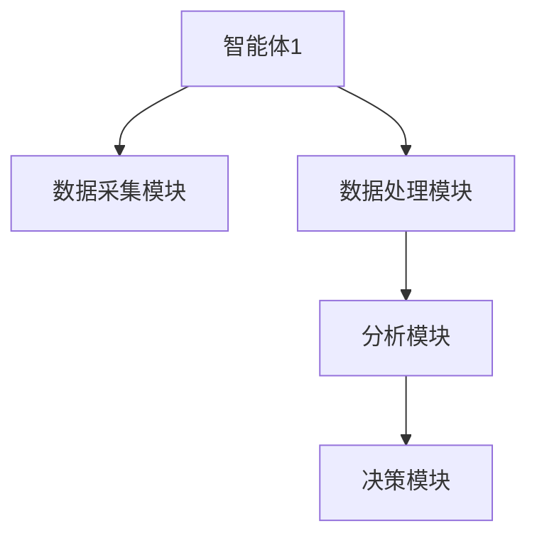
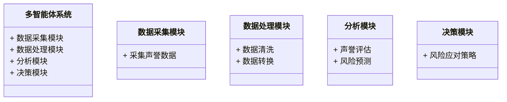
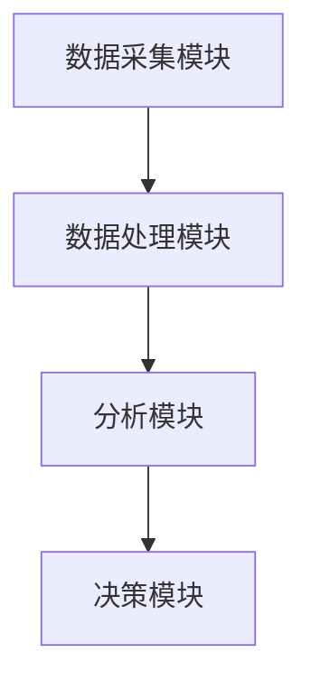
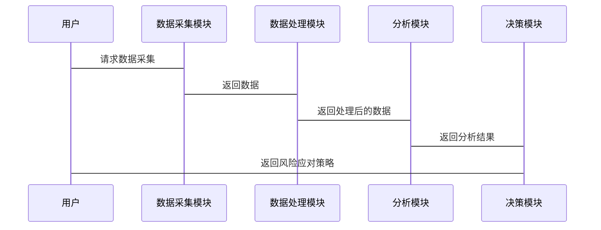

                 


# 利用多智能体系统进行全面的公司声誉风险分析

**关键词**：多智能体系统、公司声誉、风险分析、协同算法、声誉评估

**摘要**：  
本文详细探讨了如何利用多智能体系统（MAS）进行全面的公司声誉风险分析。通过分析多智能体系统的核心概念、算法原理、系统架构以及实际应用案例，本文揭示了多智能体系统在声誉风险管理中的优势和实现路径。文章从背景介绍、核心概念、算法原理、系统设计、项目实战到最佳实践，层层深入，为读者提供了一套完整的解决方案。

---

# 第一部分：多智能体系统与公司声誉风险分析的背景

## 第1章：多智能体系统的概述

### 1.1 多智能体系统的定义与特点

#### 1.1.1 多智能体系统的定义
多智能体系统（Multi-Agent System, MAS）是由多个智能体组成的分布式系统，这些智能体能够自主决策、协作完成任务，并与环境和其他智能体交互。每个智能体都有一定的知识库、目标和行为规则。

#### 1.1.2 多智能体系统的特征
- **自主性**：智能体能够独立决策。
- **反应性**：智能体能够感知环境并实时响应。
- **协作性**：多个智能体之间能够协同工作，完成复杂任务。
- **分布式性**：系统由多个智能体组成，不存在中央控制节点。

#### 1.1.3 多智能体系统与传统单智能体系统的区别
| 特性 | 多智能体系统 | 单智能体系统 |
|------|--------------|--------------|
| 结构 | 分布式，多个智能体 | 集中式，单个智能体 |
| 协作 | 智能体之间需要协作 | 无协作需求 |
| 灵活性 | 系统更灵活，适应性强 | 系统较 rigid |

### 1.2 公司声誉风险分析的重要性

#### 1.2.1 公司声誉的定义
公司声誉是指公司在市场中的形象和信誉，通常由公司的行为、产品质量、客户服务等因素决定。

#### 1.2.2 声誉风险的来源与影响
- **来源**：负面新闻、客户投诉、产品质量问题、竞争者的攻击等。
- **影响**：影响公司形象、客户信任度、市场份额和股价。

#### 1.2.3 声誉风险管理的必要性
- 保护公司形象
- 预防潜在危机
- 提高客户信任度
- 维护市场地位

### 1.3 多智能体系统在声誉风险管理中的应用

#### 1.3.1 多智能体系统的优势
- **分布式数据采集**：多个智能体可以同时从不同数据源采集信息。
- **高效协作**：多个智能体可以分工合作，快速完成任务。
- **实时响应**：智能体能够实时感知和响应环境变化。

#### 1.3.2 多智能体系统在声誉风险管理中的应用案例
- 数据采集：智能体从社交媒体、新闻网站等渠道采集公司相关信息。
- 数据分析：智能体对采集的数据进行处理和分析，评估声誉风险。
- 风险应对：智能体根据分析结果制定应对策略，并执行相关任务。

---

## 第2章：多智能体系统的核心概念与联系

### 2.1 多智能体系统的核心原理

#### 2.1.1 多智能体系统的组成要素
- **智能体**：能够感知环境、自主决策的个体。
- **环境**：智能体所处的外部世界，包括数据源、用户等。
- **通信机制**：智能体之间进行信息交换的规则和协议。

#### 2.1.2 多智能体系统中的通信机制
- **直接通信**：智能体之间直接交换信息。
- **间接通信**：通过中介实体进行信息传递。
- **发布-订阅模型**：智能体发布信息，其他智能体订阅并接收信息。

#### 2.1.3 多智能体系统中的协同工作方式
- **任务分配**：根据智能体的能力分配任务。
- **协同决策**：多个智能体共同制定决策。
- **协同执行**：智能体协作完成任务。

### 2.2 多智能体系统与声誉风险分析的关系

#### 2.2.1 多智能体系统如何支持声誉风险分析
- **数据采集**：智能体从多个数据源采集相关信息。
- **数据处理**：智能体对数据进行清洗、转换和分析。
- **风险评估**：智能体基于分析结果评估声誉风险。

#### 2.2.2 声誉风险分析中的多智能体系统架构


#### 2.2.3 多智能体系统的ER实体关系图
```mermaid
er
actor(用户) --> 多智能体系统
actor(数据源) --> 数据处理模块
actor(决策者) --> 决策支持模块
```

#### 2.2.4 多智能体系统的领域模型类图


### 2.3 多智能体系统的核心概念对比

#### 2.3.1 多智能体系统与分布式系统对比
| 特性 | 多智能体系统 | 分布式系统 |
|------|--------------|------------|
| 组件 | 智能体 | 节点或服务 |
| 协作 | 高度协作 | 分散处理 |
| 智能性 | 高 | 无 |

#### 2.3.2 多智能体系统与群智系统对比
| 特性 | 多智能体系统 | 群智系统 |
|------|--------------|----------|
| 组件 | 智能体 | 用户 |
| 智能性 | 高 | 低 |
| 协作 | 协作完成任务 | 用户协作 |

---

## 第3章：多智能体系统在声誉风险分析中的算法原理

### 3.1 多智能体协同算法

#### 3.1.1 多智能体协同的基本原理
多智能体协同算法是指多个智能体通过协作完成任务的算法。通常包括任务分配、信息共享和协同决策三个阶段。

#### 3.1.2 基于多智能体的协同算法流程
1. **任务分配**：根据智能体的能力分配任务。
2. **信息共享**：智能体之间共享信息。
3. **协同决策**：基于共享信息制定决策。

#### 3.1.3 多智能体协同算法的实现步骤
1. **初始化**：定义智能体和任务。
2. **任务分配**：使用协商机制分配任务。
3. **信息共享**：智能体之间交换信息。
4. **协同决策**：基于信息制定决策。
5. **执行**：智能体执行决策。

### 3.2 声誉评估模型

#### 3.2.1 基于多智能体的声誉评分公式
$$ R = \sum_{i=1}^{n} w_i \cdot f_i $$
其中，\( R \) 是声誉评分，\( w_i \) 是权重，\( f_i \) 是特征函数。

#### 3.2.2 声誉评分公式的特点
- **权重**：根据特征的重要性分配权重。
- **特征函数**：表示每个特征对声誉的影响。

### 3.3 风险预测模型

#### 3.3.1 基于多智能体的风险预测模型
- **数据采集**：智能体从多个数据源采集相关信息。
- **数据处理**：对数据进行清洗和转换。
- **风险预测**：基于处理后的数据预测声誉风险。

#### 3.3.2 风险指数计算公式
$$ RiskIndex = \sum_{i=1}^{m} w_i \cdot r_i $$
其中，\( RiskIndex \) 是风险指数，\( w_i \) 是权重，\( r_i \) 是风险因素。

### 3.4 多智能体系统中的协同算法实现

#### 3.4.1 协同算法的实现步骤
1. **初始化**：定义智能体和任务。
2. **任务分配**：使用协商机制分配任务。
3. **信息共享**：智能体之间共享信息。
4. **协同决策**：基于共享信息制定决策。
5. **执行**：智能体执行决策。

#### 3.4.2 协同算法的实现代码
```python
class Agent:
    def __init__(self, id):
        self.id = id
        self.task = None

    def assign_task(self, task):
        self.task = task

    def execute_task(self):
        print(f"Agent {self.id} executing task {self.task}")

# 初始化智能体
agent1 = Agent(1)
agent2 = Agent(2)

# 任务分配
task1 = "数据采集"
task2 = "数据处理"
agent1.assign_task(task1)
agent2.assign_task(task2)

# 协同执行
agent1.execute_task()
agent2.execute_task()
```

---

## 第4章：多智能体系统的系统分析与架构设计

### 4.1 系统功能设计

#### 4.1.1 系统功能模块
- **数据采集模块**：从社交媒体、新闻网站等渠道采集公司声誉相关数据。
- **数据处理模块**：对采集的数据进行清洗和转换。
- **分析模块**：基于处理后的数据进行声誉评估和风险预测。
- **决策模块**：根据分析结果制定风险应对策略。

#### 4.1.2 系统功能流程
1. 数据采集模块从多个数据源采集信息。
2. 数据处理模块对数据进行清洗和转换。
3. 分析模块基于处理后的数据进行声誉评估和风险预测。
4. 决策模块根据分析结果制定风险应对策略。

### 4.2 系统架构设计

#### 4.2.1 系统架构图


#### 4.2.2 系统接口设计
- **数据接口**：智能体之间的数据交换接口。
- **控制接口**：用户对系统的控制接口。

#### 4.2.3 系统交互流程
1. 用户通过控制接口输入任务。
2. 数据采集模块从数据源采集信息。
3. 数据处理模块对数据进行清洗和转换。
4. 分析模块基于处理后的数据进行声誉评估和风险预测。
5. 决策模块根据分析结果制定风险应对策略。
6. 系统通过数据接口将结果返回给用户。

### 4.3 系统交互流程图


---

## 第5章：项目实战——多智能体系统在声誉风险管理中的应用

### 5.1 环境配置

#### 5.1.1 系统环境
- 操作系统：Linux/Windows
- 开发工具：Python、Jupyter Notebook
- 第三方库：networkx、numpy、pandas

#### 5.1.2 数据源配置
- 社交媒体API：Twitter、LinkedIn
- 新闻API：Google News、Reuters

### 5.2 系统核心实现源代码

#### 5.2.1 数据采集模块
```python
import requests
from bs4 import BeautifulSoup

def fetch_data(url):
    response = requests.get(url)
    soup = BeautifulSoup(response.text, 'html.parser')
    return soup.text

# 示例：从Twitter API采集数据
def fetch_tweets(api_key, query):
    # 示例代码，实际需要使用Twitter API
    pass
```

#### 5.2.2 数据处理模块
```python
import pandas as pd
import numpy as np

def preprocess_data(data):
    df = pd.DataFrame(data)
    df = df.dropna()
    df = df.apply(lambda x: x.lower())
    return df

# 示例：数据清洗代码
data = preprocess_data(raw_data)
```

#### 5.2.3 分析模块
```python
from sklearn.metrics import accuracy_score

def evaluate_reputation(data):
    # 示例代码，实际需要根据具体模型进行实现
    pass

# 示例：声誉评估代码
score = evaluate_reputation(processed_data)
```

#### 5.2.4 决策模块
```python
def generate_strategy(score):
    if score < 0.5:
        return "采取补救措施"
    elif 0.5 <= score < 0.8:
        return "加强监控"
    else:
        return "维持现状"

# 示例：风险应对策略生成代码
strategy = generate_strategy(score)
```

### 5.3 代码应用解读与分析

#### 5.3.1 数据采集模块解读
- 从社交媒体和新闻网站等数据源采集公司声誉相关数据。
- 使用API或网络爬虫技术获取数据。

#### 5.3.2 数据处理模块解读
- 对采集的数据进行清洗和转换，确保数据的准确性和一致性。
- 去除噪声数据，如重复数据、无关数据等。

#### 5.3.3 分析模块解读
- 基于处理后的数据进行声誉评估和风险预测。
- 使用机器学习算法或统计方法进行分析。

#### 5.3.4 决策模块解读
- 根据分析结果制定风险应对策略。
- 策略包括：采取补救措施、加强监控、维持现状等。

### 5.4 实际案例分析

#### 5.4.1 案例背景
某公司面临负面新闻，声誉受到威胁。

#### 5.4.2 数据采集与处理
从社交媒体和新闻网站采集相关数据，清洗和转换数据。

#### 5.4.3 声誉评估与风险预测
使用机器学习算法对数据进行分析，评估声誉风险。

#### 5.4.4 风险应对策略
根据分析结果，制定并执行风险应对策略。

### 5.5 项目小结

#### 5.5.1 项目实现的关键点
- 数据采集模块的实现
- 数据处理模块的实现
- 分析模块的实现
- 决策模块的实现

#### 5.5.2 项目实现的价值
- 提高公司声誉风险管理的效率
- 降低声誉风险对公司的影响
- 提供数据驱动的决策支持

---

## 第6章：多智能体系统的最佳实践

### 6.1 最佳实践 tips

#### 6.1.1 数据采集
- 使用可靠的API和爬虫工具
- 定期更新数据源
- 处理数据中的噪声

#### 6.1.2 数据处理
- 使用数据清洗工具
- 采用适当的数据转换方法
- 处理缺失值和异常值

#### 6.1.3 分析模块
- 选择合适的机器学习算法
- 定期更新模型
- 验证模型的准确性

#### 6.1.4 决策模块
- 制定明确的风险应对策略
- 定期评估策略的有效性
- 及时调整策略

### 6.2 小结

#### 6.2.1 多智能体系统的应用优势
- 高效性：多个智能体协作完成任务，提高效率。
- 灵活性：系统可以根据环境变化进行调整。
- 智能性：智能体能够自主决策，适应性强。

#### 6.2.2 多智能体系统的应用挑战
- 通信复杂性：智能体之间的通信需要高效的机制。
- 协同复杂性：多个智能体协同工作需要复杂的算法。
- 系统安全性：系统的安全性需要考虑。

### 6.3 注意事项

#### 6.3.1 数据隐私
- 确保数据采集和处理过程中的隐私保护
- 遵守相关法律法规

#### 6.3.2 系统稳定性
- 定期检查系统稳定性
- 制定应急预案

#### 6.3.3 系统可扩展性
- 确保系统具有可扩展性
- 定期更新系统

### 6.4 拓展阅读

#### 6.4.1 多智能体系统的经典论文
- “Multi-Agent Systems: Theory and Practice” by Yoav Shoham and Kevin Leyton-Brown

#### 6.4.2 声誉风险管理的相关书籍
- “Corporate Reputation: Insights from Research and Practice” by Mario S. Einauge

#### 6.4.3 多智能体系统工具
- 开源框架：Jason、AgentSpeak
- 商业工具：IBM Watson、Microsoft Azure

---

# 结语

通过本文的详细讲解，我们了解了多智能体系统在公司声誉风险分析中的应用。从核心概念到算法实现，从系统设计到项目实战，我们逐步深入探讨了多智能体系统的优势和实现方法。未来，随着人工智能和大数据技术的不断发展，多智能体系统在声誉风险管理中的应用将更加广泛和深入，为公司提供更高效、更智能的风险管理支持。

