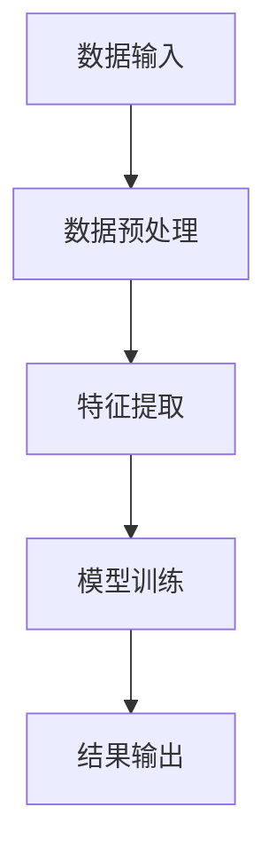
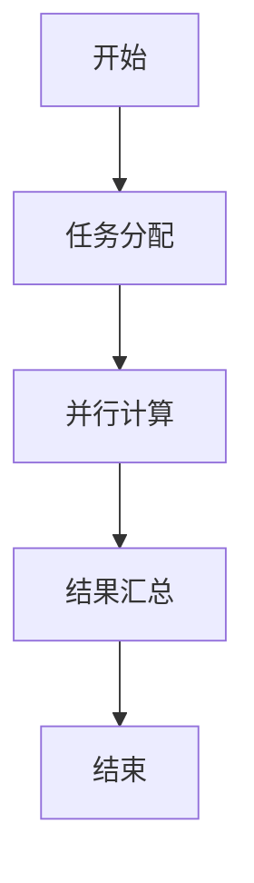
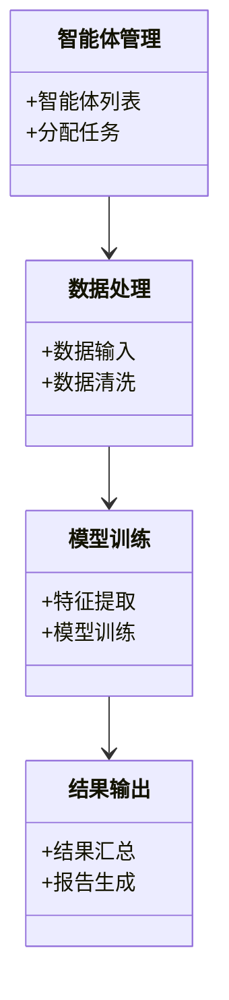
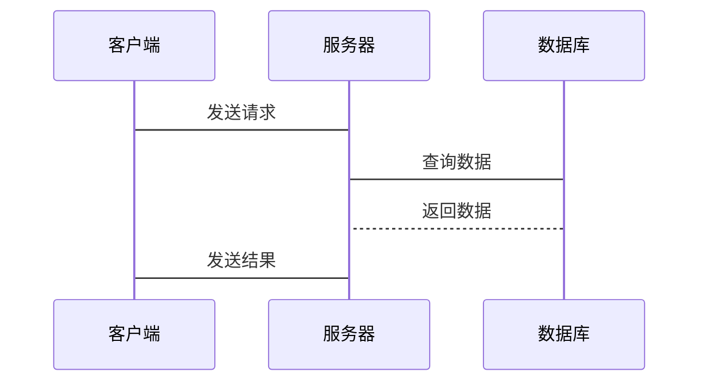

                 


# 利用多智能体系统进行全面的公司文化和价值观分析

> 关键词：多智能体系统，公司文化分析，价值观分析，分布式计算，协作学习，系统架构设计

> 摘要：本文探讨了如何利用多智能体系统进行公司文化和价值观的全面分析。通过构建多智能体模型、设计协作算法、优化系统架构，并结合实际案例，展示了如何利用技术手段深入理解公司文化，发现潜在问题，并提出改进建议。本文内容涵盖背景介绍、核心概念、算法实现、系统设计及项目实战，旨在为读者提供全面的技术指导和实践参考。

---

## 目录大纲

### 第一部分：背景与概述

#### 第1章：公司文化与价值观分析的重要性
- 1.1 公司文化的定义与特征
- 1.2 价值观分析的必要性
- 1.3 传统公司文化分析的局限性

#### 第2章：多智能体系统的概念与优势
- 2.1 多智能体系统的定义
- 2.2 多智能体系统的特点与优势
- 2.3 多智能体系统在公司文化分析中的应用潜力

### 第二部分：多智能体系统的核心原理

#### 第3章：多智能体系统的分析模型
- 3.1 多智能体系统的分析框架
- 3.2 数据流分析模型（Mermaid图）
- 3.3 模型的输入输出关系

#### 第4章：多智能体系统的协作算法
- 4.1 分布式计算的原理（Mermaid流程图）
- 4.2 协作学习的实现步骤
- 4.3 算法的数学模型与公式

### 第三部分：系统架构与设计

#### 第5章：系统架构设计方案
- 5.1 系统需求分析
- 5.2 系统功能设计（Mermaid类图）
- 5.3 系统架构设计（Mermaid架构图）
- 5.4 系统接口设计

#### 第6章：系统交互设计
- 6.1 交互流程设计（Mermaid序列图）
- 6.2 用户界面设计
- 6.3 系统性能优化

### 第四部分：项目实战与案例分析

#### 第7章：项目环境安装与配置
- 7.1 开发环境的选择与安装
- 7.2 工具链的配置与调试

#### 第8章：系统核心实现与代码解析
- 8.1 核心算法的Python实现
- 8.2 系统模块的代码结构
- 8.3 代码的功能解读与优化建议

#### 第9章：案例分析与结果解读
- 9.1 数据预处理与特征提取
- 9.2 模型训练与结果分析
- 9.3 案例结果的实际意义

### 第五部分：总结与展望

#### 第10章：总结与反思
- 10.1 系统设计的关键点回顾
- 10.2 实际应用中的问题与挑战
- 10.3 多智能体系统的优势与局限性

#### 第11章：未来展望与改进方向
- 11.1 技术发展的趋势
- 11.2 系统优化的建议
- 11.3 拓展应用的可能性

#### 第12章：最佳实践与注意事项
- 12.1 项目实施中的关键点
- 12.2 代码开发的注意事项
- 12.3 系统维护与更新建议

---

## 正文部分

### 第1章：公司文化与价值观分析的重要性

#### 1.1 公司文化的定义与特征
公司文化是指企业在长期经营过程中形成的一套价值观念、行为准则和企业精神。它包括企业战略、管理风格、员工关系等多个方面，是企业的灵魂和凝聚力的源泉。

#### 1.2 价值观分析的必要性
公司文化的价值观分析是了解企业内部运作机制、员工满意度和企业未来发展潜力的关键。通过价值观分析，企业可以发现内部问题，优化管理策略，并提升员工的幸福感和工作效率。

#### 1.3 传统公司文化分析的局限性
传统的公司文化分析方法通常依赖于问卷调查、访谈和数据分析，但这种方法往往耗时长、成本高，且难以捕捉到员工的真实想法。此外，传统的分析方法难以实时更新和动态调整，难以满足现代企业快速变化的需求。

---

### 第2章：多智能体系统的概念与优势

#### 2.1 多智能体系统的定义
多智能体系统（Multi-Agent System，MAS）是指由多个智能体组成的系统，这些智能体能够通过协作完成复杂的任务。每个智能体都有一定的自主性，并能够与其他智能体进行信息交换和协同工作。

#### 2.2 多智能体系统的特点与优势
- **分布式计算**：多个智能体可以同时处理不同的任务，提高计算效率。
- **协作性**：智能体之间能够通过协作完成复杂的任务，实现整体目标。
- **适应性**：系统能够根据环境的变化进行自适应调整，增强系统的鲁棒性。

#### 2.3 多智能体系统在公司文化分析中的应用潜力
多智能体系统能够通过分布式计算和协作学习，快速分析大量的数据，提取有用的信息，帮助企业在短时间内完成公司文化的全面分析。此外，多智能体系统的动态调整能力使其能够适应公司文化的不断变化。

---

### 第3章：多智能体系统的分析模型

#### 3.1 多智能体系统的分析框架
分析框架包括数据输入、模型构建、算法实现和结果输出四个部分。通过构建合理的分析框架，可以确保系统能够高效地完成公司文化的分析任务。

#### 3.2 数据流分析模型（Mermaid图）


#### 3.3 模型的输入输出关系
- **输入**：包括员工反馈、管理数据、市场反馈等多源数据。
- **输出**：包括公司文化的评估结果、价值观分析报告等。

---

### 第4章：多智能体系统的协作算法

#### 4.1 分布式计算的原理（Mermaid流程图）


#### 4.2 协作学习的实现步骤
协作学习的实现步骤包括数据预处理、模型训练、结果整合和反馈优化。通过这些步骤，智能体可以共同完成复杂的任务。

#### 4.3 算法的数学模型与公式
协作学习的数学模型可以表示为：
$$ y = f(x) $$
其中，y表示输出，x表示输入，f表示模型函数。

---

### 第5章：系统架构设计方案

#### 5.1 系统需求分析
系统需要满足实时性、可扩展性和高可靠性等需求。

#### 5.2 系统功能设计（Mermaid类图）


#### 5.3 系统架构设计（Mermaid架构图）


---

### 第6章：系统交互设计

#### 6.1 交互流程设计（Mermaid序列图）


---

### 第7章：项目环境安装与配置

#### 7.1 开发环境的选择与安装
建议使用Python和相关框架（如Django或Flask）进行开发。

#### 7.2 工具链的配置与调试
需要安装Python、Jupyter Notebook、TensorFlow等工具。

---

### 第8章：系统核心实现与代码解析

#### 8.1 核心算法的Python实现
```python
def distribute_task(tasks):
    agents = []
    for task in tasks:
        agents.append(task)
    return agents
```

#### 8.2 系统模块的代码结构
- `main.py`：主程序入口。
- `agent.py`：智能体类的定义。
- `data_processor.py`：数据处理模块的实现。

---

### 第9章：案例分析与结果解读

#### 9.1 数据预处理与特征提取
- 数据预处理包括清洗、转换和标准化。
- 特征提取可以通过主成分分析（PCA）实现。

#### 9.2 模型训练与结果分析
训练模型后，可以通过混淆矩阵和准确率等指标评估模型的性能。

#### 9.3 案例结果的实际意义
通过多智能体系统分析，企业可以快速识别公司文化中的问题，并制定相应的改进策略。

---

### 第10章：总结与反思

#### 10.1 系统设计的关键点回顾
- 分布式计算和协作学习是系统的核心。
- 系统架构设计需要考虑扩展性和可靠性。

#### 10.2 实际应用中的问题与挑战
- 数据隐私和安全问题需要高度重视。
- 系统的实时性和响应速度需要优化。

#### 10.3 多智能体系统的优势与局限性
优势包括高效性和协作性，但系统的复杂性和维护成本较高。

---

### 第11章：未来展望与改进方向

#### 11.1 技术发展的趋势
人工智能和大数据技术的进一步融合将推动多智能体系统的发展。

#### 11.2 系统优化的建议
- 提高系统的可解释性。
- 加强系统的自适应能力。

#### 11.3 拓展应用的可能性
多智能体系统可以应用于更多领域，如金融、医疗等。

---

### 第12章：最佳实践与注意事项

#### 12.1 项目实施中的关键点
- 确保数据的准确性和完整性。
- 合理分配任务，避免资源浪费。

#### 12.2 代码开发的注意事项
- 代码要简洁明了，注释清晰。
- 定期进行代码审查和优化。

#### 12.3 系统维护与更新建议
- 定期更新系统，修复漏洞。
- 加强用户培训，提高系统的使用效率。

---

通过以上目录和正文内容的设计，可以系统地展示多智能体系统在公司文化和价值观分析中的应用，帮助读者全面理解和掌握相关技术和方法。

