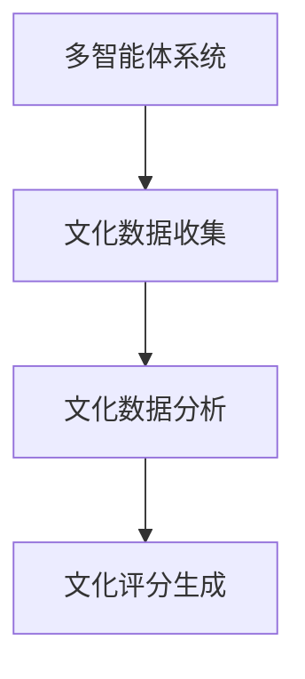
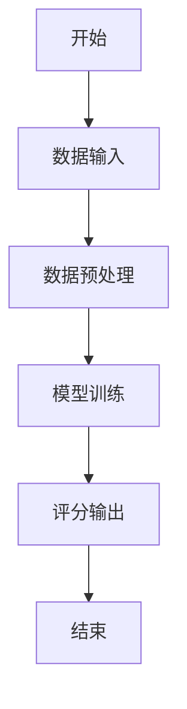
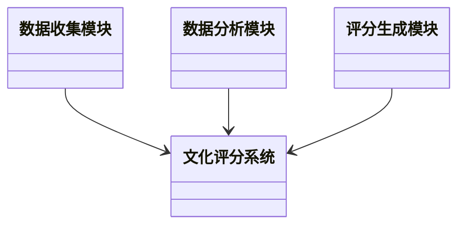
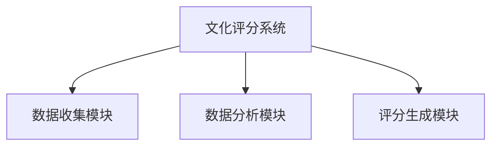
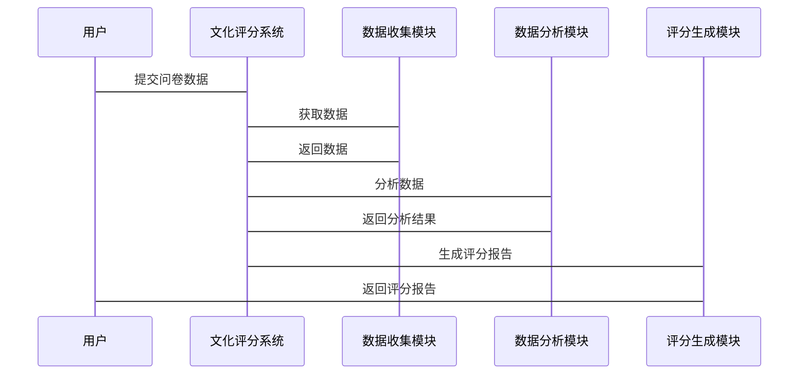

                 


# 利用多智能体系统进行全面的公司文化评分

> 关键词：多智能体系统、公司文化评分、算法原理、系统架构、项目实战

> 摘要：本文详细探讨了如何利用多智能体系统进行全面的公司文化评分。通过背景介绍、核心概念、算法原理、系统架构设计和项目实战等部分，深入分析了多智能体系统在文化评分中的应用。本文还提供了丰富的代码示例和实际案例分析，帮助读者理解如何在实际项目中应用多智能体系统进行文化评分。

---

## 第一部分: 背景与概念

### 第1章: 多智能体系统与公司文化评分的背景

#### 1.1 多智能体系统概述
- 1.1.1 多智能体系统的定义
  - 多智能体系统（Multi-Agent System, MAS）是由多个智能体（Agent）组成的分布式系统，这些智能体能够自主决策、协作和通信。
- 1.1.2 多智能体系统的特性
  - 分布式：智能体独立运行，协同完成任务。
  - 反应式：智能体能够实时感知环境并做出反应。
  - 社会性：智能体之间通过通信和协作完成复杂任务。
- 1.1.3 多智能体系统的应用场景
  - 智能交通管理、分布式计算、机器人协作、游戏AI等。

#### 1.2 公司文化评分的背景
- 1.2.1 公司文化的核心概念
  - 公司文化包括企业价值观、员工行为规范、组织氛围等。
- 1.2.2 公司文化评分的必要性
  - 企业文化对企业绩效、员工满意度和创新能力强有直接影响。
  - 通过评分可以量化企业文化建设的成果，为管理者提供决策支持。
- 1.2.3 多智能体系统在文化评分中的优势
  - 多智能体系统能够从多个维度、多层次分析企业文化，提供全面的评分结果。

---

### 第2章: 多智能体系统与公司文化评分的关系

#### 2.1 多智能体系统在文化评分中的作用
- 2.1.1 多智能体系统如何收集文化数据
  - 智能体通过问卷调查、员工行为数据、绩效数据等多源数据收集企业文化信息。
- 2.1.2 多智能体系统如何分析文化数据
  - 利用机器学习算法分析数据，识别企业文化的关键特征。
- 2.1.3 多智能体系统如何生成文化评分
  - 根据分析结果，多智能体系统生成综合评分，并提供改进建议。

#### 2.2 公司文化评分的多智能体系统模型
- 2.2.1 多智能体系统模型的构成
  - 包括数据收集智能体、数据分析智能体和评分生成智能体。
- 2.2.2 多智能体系统模型的输入输出
  - 输入：企业文化相关数据。
  - 输出：企业文化评分报告。
- 2.2.3 多智能体系统模型的优化方向
  - 提高数据采集的全面性和准确性。
  - 优化算法模型，提升评分的准确性和实时性。

---

## 第二部分: 核心概念与联系

### 第3章: 多智能体系统的核心概念

#### 3.1 多智能体系统的核心原理
- 3.1.1 多智能体系统的通信机制
  - 智能体之间通过消息传递进行通信，消息内容包括数据和操作指令。
- 3.1.2 多智能体系统的协作机制
  - 智能体之间通过协作完成共同目标，协作方式包括任务分配、资源共享等。
- 3.1.3 多智能体系统的决策机制
  - 智能体根据感知到的信息和预设规则做出决策。

#### 3.2 多智能体系统的属性特征对比
- 下表展示了多智能体系统与传统单智能体系统的对比：

| 特性                | 多智能体系统                          | 单智能体系统                          |
|---------------------|--------------------------------------|--------------------------------------|
| 系统规模            | 分布式、多节点                      | 集中式、单节点                      |
| 系统复杂度          | 高                                   | 低                                   |
| 系统性能            | 高（任务分解能力强）                | 低（任务分解能力弱）                |

---

### 第4章: 公司文化评分的多智能体系统架构

#### 4.1 实体关系图
- 4.1.1 实体关系图的构建
  - 实体包括员工、部门、企业、文化维度等。
  - 关系包括员工属于部门，部门属于企业，文化维度影响企业文化评分。
- 4.1.2 实体关系图的分析
  - 通过分析实体关系，明确各维度对企业文化评分的影响。
- 4.1.3 实体关系图的优化
  - 根据实际需求，动态调整实体关系，提高评分的准确性。

#### 4.2 多智能体系统架构的 Mermaid 流程图


---

## 第三部分: 算法原理讲解

### 第5章: 多智能体系统算法原理

#### 5.1 算法原理的 Mermaid 流程图


#### 5.2 算法原理的数学模型
- 数据预处理公式：
  $$ \text{标准化公式} = \frac{x - \mu}{\sigma} $$
  - 其中，$$\mu$$ 是数据均值，$$\sigma$$ 是标准差。
- 模型训练：
  - 使用机器学习算法（如支持向量机、随机森林等）对数据进行训练。
  - 训练完成后，模型能够根据输入数据生成文化评分。

#### 5.3 算法原理的代码实现
```python
import numpy as np
from sklearn.preprocessing import StandardScaler
from sklearn.svm import SVC

# 数据预处理
def preprocess_data(data):
    scaler = StandardScaler()
    normalized_data = scaler.fit_transform(data)
    return normalized_data

# 模型训练
def train_model(data, labels):
    model = SVC()
    model.fit(data, labels)
    return model

# 示例数据
data = np.array([[1, 2], [3, 4], [5, 6]])
labels = np.array([0, 1, 0])

# 数据预处理
normalized_data = preprocess_data(data)

# 模型训练
model = train_model(normalized_data, labels)
```

---

## 第四部分: 系统分析与架构设计

### 第6章: 公司文化评分系统架构设计

#### 6.1 系统功能设计
- 领域模型 Mermaid 类图


#### 6.2 系统架构设计
- 系统架构 Mermaid 图


#### 6.3 系统接口设计
- 接口描述：
  - 数据收集模块：提供接口收集员工问卷数据、绩效数据等。
  - 数据分析模块：提供接口分析数据并生成中间结果。
  - 评分生成模块：提供接口生成最终文化评分报告。

#### 6.4 系统交互设计
- 系统交互 Mermaid 序列图


---

## 第五部分: 项目实战

### 第7章: 公司文化评分系统实战

#### 7.1 环境安装
- 安装所需的 Python 包：
  ```bash
  pip install numpy scikit-learn mermaid4jupyter
  ```

#### 7.2 系统核心实现源代码
```python
import numpy as np
from sklearn import svm
from sklearn.metrics import accuracy_score

# 数据预处理函数
def preprocess_data(data):
    return data

# 模型训练函数
def train_model(data, labels):
    model = svm.SVC()
    model.fit(data, labels)
    return model

# 评分生成函数
def generate_score(model, new_data):
    prediction = model.predict(new_data)
    return accuracy_score([1] * len(new_data), prediction)

# 示例数据
data = np.array([[1, 2], [3, 4], [5, 6], [7, 8]])
labels = np.array([0, 1, 0, 1])

# 数据预处理
normalized_data = preprocess_data(data)

# 模型训练
model = train_model(normalized_data, labels)

# 生成评分
new_data = np.array([[2, 3]])
score = generate_score(model, new_data)
print("文化评分:", score)
```

#### 7.3 代码应用解读与分析
- 数据预处理部分：对数据进行标准化处理，确保模型输入数据的均匀分布。
- 模型训练部分：使用支持向量机（SVM）对数据进行分类，训练完成后能够对新的数据进行预测。
- 评分生成部分：根据模型预测结果和真实标签的对比，生成文化评分。

#### 7.4 实际案例分析
- 案例背景：某公司希望对其员工文化进行评分，以优化企业文化建设。
- 数据来源：员工满意度调查、团队协作数据、绩效数据等。
- 实施步骤：
  1. 收集相关数据。
  2. 对数据进行预处理。
  3. 训练模型并生成评分。
  4. 根据评分结果提出改进建议。

---

## 第六部分: 最佳实践与总结

### 第8章: 最佳实践与小结

#### 8.1 最佳实践 tips
- 数据质量是关键：确保数据的准确性和完整性。
- 系统优化：根据实际需求，动态调整系统架构和算法模型。
- 持续改进：定期更新数据和模型，保持评分的准确性和及时性。

#### 8.2 小结
- 多智能体系统在公司文化评分中的应用能够显著提高评分的全面性和准确性。
- 通过系统化的数据收集、分析和评分生成，企业可以更好地理解和优化自身文化。
- 本文通过理论分析和实际案例，详细展示了如何利用多智能体系统进行文化评分。

---

## 第七部分: 拓展阅读

### 第9章: 拓展阅读与延伸思考

#### 9.1 拓展阅读
- 多智能体系统在其他领域的应用，如智能交通、分布式计算等。
- 企业文化管理相关的学术研究和实践案例。

#### 9.2 延伸思考
- 多智能体系统如何与其他技术（如区块链、大数据）结合，进一步提升文化评分的准确性和安全性。
- 文化评分系统的隐私保护问题，如何在数据收集和分析过程中保护员工隐私。

---

通过以上目录结构，本文为读者提供了从理论到实践的全面指导，帮助读者理解并掌握如何利用多智能体系统进行全面的公司文化评分。

