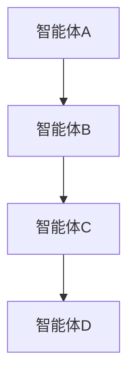

                 


# 利用多智能体系统进行全面的公司文化适应性分析

> 关键词：多智能体系统，公司文化，文化适应性分析，机器学习，组织行为学

> 摘要：本文将详细探讨如何利用多智能体系统进行公司文化适应性分析。通过分析多智能体系统的原理、算法、架构设计以及实际应用案例，我们将展示如何利用人工智能技术来提升公司文化适应性分析的效率和准确性。本文将从背景介绍、核心概念、算法原理、系统架构设计、项目实战到最佳实践，逐步展开，为读者提供一个全面而深入的分析。

---

## 第一部分: 公司文化适应性分析的背景与问题

### 第1章: 背景介绍

#### 1.1 问题背景

##### 1.1.1 公司文化的重要性
公司文化是企业成功的关键因素之一。它不仅影响员工的行为和态度，还影响企业的战略决策和长期发展。一个良好的公司文化可以提升员工的凝聚力、创造力和工作效率，而不良的文化则可能导致员工流失、效率低下甚至企业失败。

##### 1.1.2 传统公司文化分析的局限性
传统的公司文化分析方法通常依赖于问卷调查、访谈和观察等手段，这种方法耗时长、成本高，且主观性较强。此外，传统方法难以实时捕捉员工行为和文化动态变化，难以提供及时的反馈和优化建议。

##### 1.1.3 多智能体系统的优势
多智能体系统（Multi-Agent System, MAS）是一种由多个智能体组成的分布式系统，每个智能体都有一定的自主性和决策能力。利用MAS进行公司文化适应性分析，可以实时采集和分析员工行为数据，快速识别文化问题，并提供个性化的优化建议。

#### 1.2 问题描述

##### 1.2.1 公司文化适应性的定义
公司文化适应性是指员工在公司文化中的适应程度，包括对公司的价值观、目标和行为规范的认同和遵循程度。

##### 1.2.2 多智能体系统在文化适应性分析中的应用范围
多智能体系统可以应用于公司文化适应性分析的多个方面，包括文化特征识别、员工行为建模、文化冲突检测和文化优化建议等。

##### 1.2.3 问题解决的必要性
随着企业规模的扩大和员工构成的多样化，公司文化适应性分析的需求日益增加。传统的分析方法已经无法满足企业对高效、实时和个性化文化分析的需求，因此引入多智能体系统是必要的。

#### 1.3 问题解决

##### 1.3.1 多智能体系统的解决方案
通过构建一个多智能体系统，每个智能体代表一个员工或一个文化维度，智能体之间通过交互和协同完成文化适应性分析的任务。

##### 1.3.2 解决方案的可行性分析
多智能体系统具有分布式、自主性和协作性的特点，非常适合用于复杂的公司文化适应性分析任务。

##### 1.3.3 解决方案的创新点
结合人工智能和组织行为学，多智能体系统能够实时分析员工行为数据，提供动态的文化适应性反馈和优化建议。

#### 1.4 边界与外延

##### 1.4.1 多智能体系统的边界
多智能体系统仅用于公司文化适应性分析，不涉及企业的其他管理功能，如财务管理和市场营销。

##### 1.4.2 公司文化适应性分析的外延
公司文化适应性分析可以扩展到企业内部的其他方面，如团队协作、领导风格和企业文化传播等。

##### 1.4.3 相关概念的对比
| 概念 | 定义 | 应用范围 |
|------|------|----------|
| 多智能体系统 | 由多个智能体组成的分布式系统 | 公司文化适应性分析、动态优化 |
| 公司文化适应性分析 | 分析员工对公司文化的适应程度 | 员工行为分析、文化优化 |

#### 1.5 核心要素组成

##### 1.5.1 公司文化的核心要素
公司文化的核心要素包括价值观、目标、行为规范和企业精神等。

##### 1.5.2 多智能体系统的核心要素
多智能体系统的核心要素包括智能体、环境、交互协议和协同机制等。

##### 1.5.3 两者的结合方式
通过将公司的文化要素映射到多智能体系统的智能体上，实现对公司文化的动态分析和优化。

---

### 第2章: 核心概念与联系

#### 2.1 多智能体系统的基本原理

##### 2.1.1 智能体的定义与分类
智能体是一种能够感知环境、做出决策并采取行动的实体。根据智能体的智能水平，可以将智能体分为反应式智能体和认知式智能体。

##### 2.1.2 多智能体系统的协同机制
多智能体系统通过智能体之间的通信和协作完成任务。常见的协同机制包括基于规则的协同和基于博弈论的协同。

##### 2.1.3 多智能体系统的优缺点
| 优点 | 缺点 |
|------|------|
| 分布式、自主性强 | 协调复杂，易出现冲突 |

#### 2.2 公司文化适应性分析的原理

##### 2.2.1 文化适应性的定义与测量
文化适应性是指员工在公司文化中的适应程度，可以通过员工的行为数据和态度数据进行测量。

##### 2.2.2 多智能体系统在文化适应性分析中的作用
多智能体系统可以通过实时分析员工行为数据，识别文化适应性问题，并提供优化建议。

##### 2.2.3 文化适应性分析的数学模型
文化适应性指数可以通过以下公式计算：
$$
C = \frac{\sum_{i=1}^{n} w_i \cdot s_i}{\sum_{i=1}^{n} w_i}
$$
其中，\( C \) 表示文化适应性指数，\( w_i \) 表示第 \( i \) 个文化维度的权重，\( s_i \) 表示第 \( i \) 个文化维度的适应性评分。

#### 2.3 核心概念对比

##### 2.3.1 多智能体系统与传统分析方法的对比
| 对比维度 | 多智能体系统 | 传统分析方法 |
|----------|--------------|----------------|
| 数据采集 | 实时、自动化 | 人工、周期性 |
| 分析效率 | 高效 | 较低 |
| 可扩展性 | 高 | 低 |

##### 2.3.2 不同多智能体系统在文化适应性分析中的应用对比
| 智能体类型 | 应用场景 |
|------------|------------|
| 反应式智能体 | 实时行为分析 |
| 认知式智能体 | 文化优化建议 |

##### 2.3.3 文化适应性分析的核心要素对比
| 要素 | 多智能体系统 | 传统方法 |
|------|--------------|------------|
| 数据来源 | 行为数据 | 问卷调查 |
| 分析深度 | 深入 | 浅层 |

#### 2.4 ER实体关系图

##### 2.4.1 实体定义
- 员工：包括员工ID、姓名、部门等属性。
- 文化维度：包括价值观、目标、行为规范等属性。
- 智能体：包括智能体ID、类型、功能等属性。

##### 2.4.2 实体之间的关系
- 员工与文化维度：员工的文化适应性评分。
- 文化维度与智能体：智能体负责分析某个文化维度。

##### 2.4.3 实体关系图的构建
```mermaid
erd
  Employee {
    ID
    Name
    Department
    Culture_Adaptability_Score
  }
  Culture_Dimension {
    ID
    Name
    Weight
  }
  Agent {
    ID
    Type
    Function
  }
  Employee --> Culture_Dimension: Cultural Adaptability Score
  Culture_Dimension --> Agent: Assigned Agent
```

---

### 第3章: 算法原理讲解

#### 3.1 多智能体协同算法

##### 3.1.1 基于规则的协同算法
基于规则的协同算法通过预定义的规则来实现智能体之间的协同。例如，如果智能体A检测到某个文化维度的问题，智能体B将提供优化建议。

##### 3.1.2 基于学习的协同算法
基于学习的协同算法通过机器学习算法（如强化学习）来优化智能体的协同策略。

##### 3.1.3 基于博弈论的协同算法
基于博弈论的协同算法通过模拟博弈过程来实现智能体之间的最优协同。

#### 3.2 多智能体系

##### 3.2.1 算法流程图


##### 3.2.2 代码实现
```python
class Agent:
    def __init__(self, id, type):
        self.id = id
        self.type = type
        self.rules = {}

    def execute(self):
        pass

# 示例代码
agent1 = Agent(1, "reactive")
agent1.execute()
```

#### 3.3 文化适应性分析的数学模型

##### 3.3.1 文化适应性指数的计算
$$
C = \frac{\sum_{i=1}^{n} w_i \cdot s_i}{\sum_{i=1}^{n} w_i}
$$

##### 3.3.2 示例分析
假设某公司有三个文化维度，权重分别为0.4、0.3、0.3，对应的适应性评分分别为0.8、0.6、0.7，则文化适应性指数为：
$$
C = \frac{0.4 \times 0.8 + 0.3 \times 0.6 + 0.3 \times 0.7}{0.4 + 0.3 + 0.3} = \frac{0.32 + 0.18 + 0.21}{1} = 0.71
$$

---

## 总结

通过以上分析，我们可以看到，利用多智能体系统进行公司文化适应性分析具有重要的意义和广阔的前景。多智能体系统不仅可以提高分析的效率和准确性，还能实时捕捉员工行为和文化动态变化，为企业的文化优化提供有力支持。未来，随着人工智能技术的不断发展，多智能体系统在公司文化适应性分析中的应用将更加广泛和深入。

--- 

本文的版权归作者所有，转载请注明出处。

