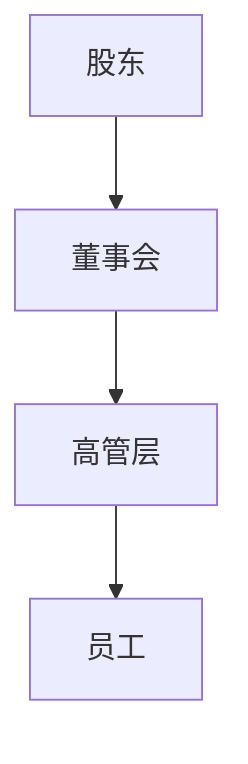
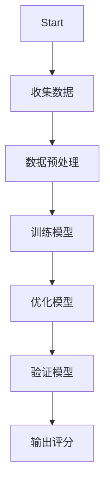
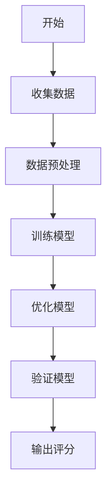
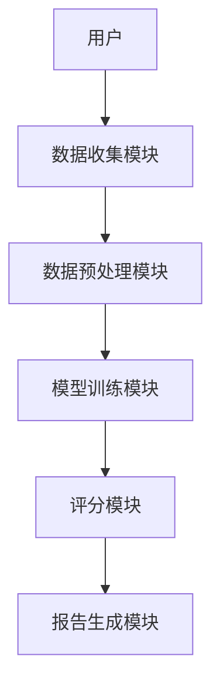

                 


# 利用多智能体系统进行全面的公司治理评分

## 关键词：多智能体系统、公司治理、评分模型、算法原理、系统架构

## 摘要：本文探讨了如何利用多智能体系统对公司的治理进行评分。通过分析多智能体系统的核心概念，构建评分模型，设计系统架构，并提供实际案例，详细讲解了多智能体系统在公司治理评分中的应用，为读者提供了全面的技术指导。

---

# 第一部分: 多智能体系统与公司治理评分的背景介绍

## 第1章: 多智能体系统概述

### 1.1 多智能体系统的定义与特点

#### 1.1.1 多智能体系统的定义

多智能体系统（Multi-Agent System, MAS）是由多个智能体组成的分布式系统，这些智能体能够通过协作完成复杂的任务。每个智能体都有自己的目标、知识和行为方式，能够感知环境并做出决策。

#### 1.1.2 多智能体系统的核心特点

- **自主性**：每个智能体都是独立的，能够自主决策。
- **反应性**：智能体能够实时感知环境并做出反应。
- **协作性**：多个智能体通过协作完成共同目标。
- **分布式性**：智能体分布在网络中，通过通信进行协作。

#### 1.1.3 多智能体系统与传统单体系统的区别

| 特性            | 多智能体系统          | 传统单体系统        |
|-----------------|----------------------|--------------------|
| 结构            | 分布式               | 集中式             |
| 智能体数量      | 多个                 | 单个               |
| 通信方式        | 高                  | 低或无             |
| 协作能力        | 强                  | 弱或无             |

### 1.2 公司治理评分的背景与意义

#### 1.2.1 公司治理的基本概念

公司治理是指通过董事会和管理层对公司进行有效管理，确保公司长期发展和股东利益最大化。它包括股东关系管理、高管决策支持、风险评估等多个方面。

#### 1.2.2 公司治理评分的重要性

公司治理评分能够帮助企业识别管理中的问题，优化决策流程，提升企业竞争力。通过评分，投资者可以更全面地了解公司的管理状况，做出更明智的投资决策。

#### 1.2.3 多智能体系统在公司治理中的应用潜力

多智能体系统能够模拟公司内部各个角色的行为，分析其相互作用，为公司治理评分提供数据支持。例如，智能体可以模拟股东、董事会和高管之间的互动，评估他们的决策对公司治理的影响。

---

## 第2章: 多智能体系统与公司治理评分的结合

### 2.1 多智能体系统在公司治理中的应用场景

#### 2.1.1 股东关系管理

通过多智能体系统，可以模拟股东之间的互动，分析他们的决策对公司治理的影响。例如，股东可以通过智能体表达他们的意见和需求，系统能够根据这些信息优化公司治理策略。

#### 2.1.2 高管决策支持

高管可以通过多智能体系统获取实时数据和分析结果，辅助他们做出更科学的决策。例如，系统可以分析市场趋势和内部数据，为高管提供战略建议。

#### 2.1.3 风险评估与预警

多智能体系统能够实时监控公司内部和外部的风险因素，提供预警机制。例如，当某些风险指标超过阈值时，系统会自动触发警报，提醒相关决策者采取措施。

### 2.2 公司治理评分的多智能体系统模型

#### 2.2.1 模型的基本框架

公司治理评分的多智能体系统模型包括以下几个核心部分：

- **股东智能体**：代表公司股东，负责制定战略目标和监督公司运营。
- **董事会智能体**：负责制定公司政策和监督高管团队。
- **高管智能体**：负责日常管理和执行公司战略。
- **员工智能体**：代表公司员工，反映他们的意见和需求。

#### 2.2.2 模型的核心要素

| 要素           | 描述                     |
|----------------|--------------------------|
| 智能体         | 每个智能体代表一个角色（股东、董事会、高管、员工） |
| 通信机制       | 智能体之间的信息传递方式   |
| 协作规则       | 智能体协作的目标和规则     |
| 评分标准       | 用于评估公司治理的指标     |

#### 2.2.3 模型的输入与输出

- **输入**：公司运营数据、市场环境、股东需求等。
- **输出**：公司治理评分、优化建议、风险预警等。

---

## 第3章: 多智能体系统的核心原理

### 3.1 多智能体系统的通信机制

#### 3.1.1 通信协议

通信协议定义了智能体之间信息传递的规则。例如，智能体可以通过发布-订阅模型进行通信，或者通过点对点的方式直接传递信息。

#### 3.1.2 信息传递方式

信息传递方式包括同步和异步通信。同步通信要求智能体等待接收方的响应，而异步通信则允许智能体在发送信息后继续执行其他任务。

### 3.2 多智能体系统的协作机制

#### 3.2.1 协作规则

协作规则定义了智能体如何共同完成任务。例如，智能体可以按照优先级顺序分配任务，或者通过协商达成一致。

#### 3.2.2 协作协议

协作协议是智能体之间通信和协作的契约。例如，智能体可以使用合同网协议来协调任务分配和结果汇报。

---

## 第4章: 公司治理评分的多智能体系统模型

### 4.1 模型的构建过程

#### 4.1.1 数据收集与处理

数据收集是构建模型的第一步，需要收集公司运营数据、市场环境数据等。然后对数据进行清洗和预处理，确保数据的准确性和完整性。

#### 4.1.2 模型训练与优化

使用机器学习算法对模型进行训练，优化模型参数，提高模型的准确性和预测能力。

#### 4.1.3 模型验证与评估

通过测试数据验证模型的性能，评估模型的准确性和鲁棒性。

### 4.2 模型的实体关系图



### 4.3 模型的流程图



---

## 第5章: 多智能体系统的算法原理

### 5.1 评分模型的数学基础

公司治理评分可以通过回归分析或神经网络等方法进行建模。例如，使用线性回归模型：

$$ y = \beta_0 + \beta_1 x_1 + \beta_2 x_2 + ... + \beta_n x_n + \epsilon $$

其中，$y$ 是评分，$x_i$ 是各个影响因素，$\beta_i$ 是回归系数，$\epsilon$ 是误差项。

### 5.2 算法的实现步骤



### 5.3 算法的代码实现

```python
import numpy as np
from sklearn.linear_model import LinearRegression

# 数据准备
X = np.array([[x1], [x2], ..., [xn]])
y = np.array([y1, y2, ..., yn])

# 模型训练
model = LinearRegression()
model.fit(X, y)

# 模型预测
new_X = np.array([[new_x1], [new_x2], ..., [new_xn]])
prediction = model.predict(new_X)
print(prediction)
```

---

## 第6章: 系统分析与架构设计方案

### 6.1 系统功能设计

公司治理评分系统需要具备以下功能：

- 数据收集与处理
- 模型训练与优化
- 评分输出与报告

### 6.2 系统架构设计



### 6.3 系统交互设计

```mermaid
graph TD
    用户 --> 数据收集模块
    数据收集模块 --> 数据预处理模块
    数据预处理模块 --> 模型训练模块
    模型训练模块 --> 评分模块
    评分模块 --> 报告生成模块
    用户 <-- 报告生成模块
```

---

## 第7章: 项目实战

### 7.1 环境安装

安装必要的库：

```bash
pip install numpy pandas scikit-learn
```

### 7.2 系统核心实现

实现数据收集和处理：

```python
import pandas as pd

# 数据收集
data = pd.read_csv('data.csv')

# 数据预处理
data_clean = data.dropna()
```

### 7.3 代码实现与分析

训练模型并进行预测：

```python
from sklearn.linear_model import LinearRegression

# 训练模型
model = LinearRegression()
model.fit(X_train, y_train)

# 预测
y_pred = model.predict(X_test)
print('预测评分:', y_pred)
```

### 7.4 案例分析与结果解读

通过对实际数据的分析，展示模型的评分结果，并解释评分背后的原因。

### 7.5 项目小结

总结项目实施过程中的经验和教训，提出改进建议。

---

## 第8章: 总结与展望

### 8.1 小结

本文详细介绍了多智能体系统在公司治理评分中的应用，包括系统设计、算法实现和项目实战。

### 8.2 注意事项

在实际应用中，需要注意数据质量和模型的可解释性，确保评分结果的准确性和可靠性。

### 8.3 拓展阅读

建议读者进一步阅读相关领域的书籍和论文，深入理解多智能体系统和公司治理评分的结合。

---

通过以上步骤，我们系统地分析了多智能体系统在公司治理评分中的应用，从理论到实践，为读者提供了全面的技术指导。

