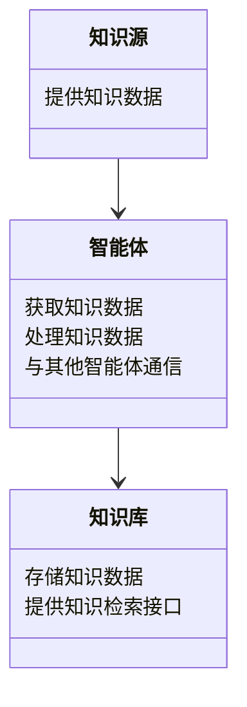
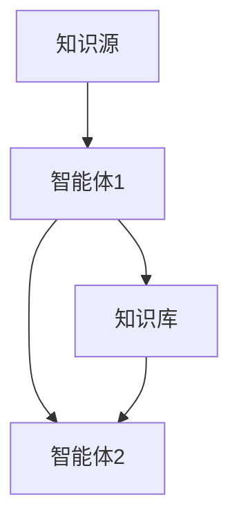
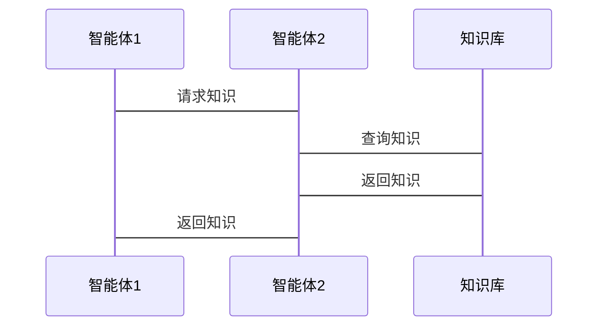

                 


# 利用多智能体系统进行全面的公司知识管理能力分析

## 关键词：
- 多智能体系统
- 知识管理
- 系统分析
- 算法原理
- 项目实战

## 摘要：
随着企业规模的不断扩大和信息的快速增长，传统的知识管理模式已经难以满足现代企业的需求。多智能体系统作为一种新兴的技术手段，能够通过分布式计算、协作学习和自适应推理等特性，为企业提供更加高效、智能的知识管理解决方案。本文将从多智能体系统的背景与核心概念出发，深入分析其在知识管理中的应用原理，并通过实际案例展示如何利用多智能体系统进行知识管理能力分析。文章还将结合算法原理和系统架构设计，为企业提供一套完整的知识管理能力分析方案。

---

# 第一部分: 多智能体系统与知识管理概述

## 第1章: 多智能体系统概述

### 1.1 多智能体系统的基本概念

#### 1.1.1 多智能体系统的定义
多智能体系统（Multi-Agent System，MAS）是由多个智能体（Agent）组成的分布式系统，这些智能体通过协作完成特定任务。每个智能体都具有自主性、反应性和社会性等特性，能够独立决策并与其他智能体进行交互。

#### 1.1.2 多智能体系统的特征
- **自主性**：智能体能够独立决策，无需外部干预。
- **反应性**：智能体能够感知环境并实时响应。
- **协作性**：多个智能体通过协作完成复杂任务。
- **分布性**：智能体分布在不同的节点或位置，通过通信完成任务。

#### 1.1.3 多智能体系统与传统知识管理的区别
传统知识管理依赖于人工整理和存储，而多智能体系统能够通过自动化的方式获取、分析和共享知识，具有更高的效率和灵活性。

### 1.2 知识管理能力分析的背景

#### 1.2.1 知识管理的重要性
知识是企业的核心资产，有效的知识管理能够提升企业的竞争力和创新能力。

#### 1.2.2 知识管理能力分析的必要性
随着企业规模的扩大，知识的分散和重复存储问题日益严重，需要通过系统化的方法进行知识管理能力分析。

#### 1.2.3 知识管理能力分析的边界与外延
知识管理能力分析的边界包括知识的获取、存储、共享和应用，而外延则涉及知识的创新和价值挖掘。

---

## 第2章: 多智能体系统在知识管理中的应用

### 2.1 多智能体系统的知识管理能力

#### 2.1.1 知识的获取与整合
多智能体系统能够通过分布式传感器或数据接口获取知识，并通过协作机制进行整合。

#### 2.1.2 知识的存储与检索
智能体能够将获取的知识存储在分布式数据库中，并通过语义检索技术快速定位所需知识。

#### 2.1.3 知识的共享与协作
多个智能体可以通过通信协议进行知识共享，并通过协作算法实现知识的共同利用。

### 2.2 多智能体系统的知识管理优势

#### 2.2.1 分布式知识处理
多智能体系统能够通过分布式计算实现知识的并行处理，提高效率。

#### 2.2.2 自适应性与灵活性
智能体能够根据环境变化动态调整知识管理策略，具有较强的适应性。

#### 2.2.3 高效的知识利用
通过智能体的协作，知识可以被快速检索和应用，提升企业的决策效率。

---

## 第3章: 多智能体系统的知识管理模型

### 3.1 知识管理模型的构建

#### 3.1.1 知识管理模型的组成要素
- **知识源**：知识的来源，如文档、数据库等。
- **智能体**：负责知识处理的主体。
- **通信机制**：智能体之间的交互方式。
- **知识库**：存储知识的载体。

#### 3.1.2 知识管理模型的构建方法
通过分析企业的知识需求，设计智能体的功能和通信协议，构建完整的知识管理模型。

### 3.2 多智能体系统的知识管理流程

#### 3.2.1 知识获取与预处理
智能体通过传感器或接口获取知识，并进行初步的清洗和整理。

#### 3.2.2 知识表示与推理
通过知识图谱和逻辑推理，智能体能够理解和关联知识。

#### 3.2.3 知识共享与应用
智能体通过通信机制共享知识，并将其应用于企业的实际业务中。

---

# 第二部分: 多智能体系统的算法与数学模型

## 第4章: 多智能体系统的算法原理

### 4.1 分布式计算与通信

#### 4.1.1 分布式计算的基本原理
分布式计算通过将任务分解到多个节点上并行处理，提高计算效率。

#### 4.1.2 通信协议的设计与实现
智能体之间的通信需要设计高效的协议，确保信息的准确传递。

### 4.2 协作与协调算法

#### 4.2.1 协作机制的实现
通过协商和分配任务，智能体能够协作完成复杂任务。

#### 4.2.2 协调算法的优化
优化协调算法能够减少冲突，提高协作效率。

---

## 第5章: 多智能体系统的数学模型

### 5.1 知识表示的数学模型

#### 5.1.1 知识图谱的构建
知识图谱可以通过图论中的节点和边来表示知识的关系。

#### 5.1.2 知识表示的向量空间模型
通过向量空间模型，可以将知识表示为高维向量，便于计算和分析。

### 5.2 知识推理的数学模型

#### 5.2.1 基于逻辑推理的模型
通过逻辑推理规则，智能体能够进行知识的推理和验证。

#### 5.2.2 基于概率推理的模型
通过概率论，智能体能够处理不确定性知识，并进行概率推理。

---

# 第三部分: 系统分析与架构设计

## 第6章: 系统分析与需求分析

### 6.1 问题场景介绍

#### 6.1.1 知识管理中的问题与挑战
知识分散、利用率低、难以创新等问题亟待解决。

#### 6.1.2 多智能体系统解决的方案
通过多智能体系统的协作和分布式处理，能够有效解决知识管理中的问题。

### 6.2 系统功能需求

#### 6.2.1 知识获取与处理功能
智能体能够从多种来源获取知识，并进行清洗和整理。

#### 6.2.2 知识存储与检索功能
知识可以通过分布式数据库存储，并支持语义检索。

#### 6.2.3 知识共享与协作功能
智能体之间能够通过通信机制共享知识，并进行协作处理。

---

## 第7章: 系统架构设计

### 7.1 领域模型设计

#### 7.1.1 领域模型的类图


### 7.2 系统架构设计

#### 7.2.1 系统架构图


### 7.3 系统接口设计

#### 7.3.1 系统接口设计
智能体之间的通信接口需要定义明确的协议和数据格式。

### 7.4 系统交互设计

#### 7.4.1 系统交互序列图


---

## 第8章: 项目实战

### 8.1 环境安装

#### 8.1.1 环境配置
安装必要的开发工具和依赖库，如Python、Jupyter Notebook等。

### 8.2 系统核心实现源代码

#### 8.2.1 智能体通信模块
```python
class Agent:
    def __init__(self, name):
        self.name = name
        self.communication_channel = CommunicationChannel()
    
    def send_message(self, message, recipient):
        self.communication_channel.send(message, recipient)
    
    def receive_message(self):
        return self.communication_channel.receive()
```

#### 8.2.2 知识获取与处理模块
```python
class KnowledgeAgent(Agent):
    def __init__(self, name):
        super().__init__(name)
        self.knowledge = []
    
    def get_knowledge(self, source):
        # 从知识源获取知识
        self.knowledge = source.get_knowledge()
        return self.knowledge
```

### 8.3 代码应用解读与分析

#### 8.3.1 代码解读
上述代码定义了智能体的基本结构和通信模块，实现了知识的获取和处理功能。

### 8.4 实际案例分析

#### 8.4.1 案例分析
通过一个简单的知识共享案例，展示多智能体系统的实际应用。

### 8.5 项目小结

#### 8.5.1 项目总结
通过实际案例，验证了多智能体系统在知识管理中的有效性。

---

## 第9章: 最佳实践与小结

### 9.1 最佳实践 tips

#### 9.1.1 系统设计建议
在设计多智能体系统时，需要注重通信协议的设计和智能体的协作机制。

### 9.2 小结

#### 9.2.1 系统总结
多智能体系统通过协作和分布式处理，能够有效提升企业的知识管理能力。

### 9.3 注意事项

#### 9.3.1 应用注意事项
在实际应用中，需要考虑系统的扩展性和可维护性。

### 9.4 拓展阅读

#### 9.4.1 拓展学习
建议读者进一步学习多智能体系统的高级算法和应用案例。

---

通过以上内容，我们详细分析了多智能体系统在公司知识管理中的应用，并通过实际案例展示了系统的实现和应用。希望本文能够为企业提供一套完整的知识管理能力分析方案，帮助企业提升知识管理能力，实现更高效的业务运作。

